# NVM IP 單元與技術全景

研究版本：2026-09-10

先看具名嵌入式 IP：力旺 NeoBit、NeoFuse、NeoEE、NeoMTP，YMC 閱讀路徑的 CHI／BBHH 模型，以及 MRAM／ReRAM IP 範例。沿同一儲存區追蹤初始狀態、施加刺激、載子或自旋過程與感測結果。獨立式元件與通用物理家族作為背景參考。

## 儲存物理

電荷、導電結構、磁化、離子分布、晶相與極化決定物理機制。傳統獨立式 EEPROM 與嵌入式 MTP IP 分題閱讀；MTP IP 再區分 foundry 雙層多晶矽 EEPROM 與第三方單層多晶矽路徑。NOR／NAND 則描述陣列組織。

## 商用成熟度

量產、完成驗證、研究展示與開發規畫，綁定具名公司、節點、版本及應用。找到一種量產 MRAM，不能讓所有 SOT-MRAM 都取得同一成熟度。

## 系統角色

SCM 是填補記憶體與儲存落差的用途視角，並非另一種位元單元。用途、存取語意、斷電持久性與供應現況，必須分開說明。

## 具名 IP 單元與操作主線

### NeoBit：浮動閘極 OTP 單元

力旺 eMemory

從串聯的選擇器與 p 型浮動閘極儲存電晶體，看電子注入如何改變讀取電流；再區分正常 OTP 操作與紫外線清除的物理可能性。

NeoBit — 單元結構

串聯 pMOS 選擇器與 pMOS 浮動閘極單元。歷史剖面：p 型基板內的 n 井、p+ 源／共用區／汲極、獨立選擇閘極與 p+ 浮動閘極；FG 不接導線，也沒有堆疊控制閘極。 介電質隔離 FG。歷史 p+ 模型另說明注入電子與自由電洞復合，留下局部負離子電荷；圖中 Q− 表示儲存狀態，不全是自由電子。

- e− / h+ · 藍色為電子、紅色為電洞；箭頭表示載子方向。
- I · 綠色箭頭為傳統電流；它與電子方向相反、與電洞方向相同。
- Bias · 圖示只給操作角色；不提供可直接使用的端點電壓或脈衝規格。
- Scale · 幾何與介電質厚度為閱讀而放大；不是製程佈局。
- FG / Q− · FG 不接直流端；Q− 採歷史 p+ 專利的儲存電荷符號，包含局部負離子電荷。
- UV* · 官方 2021 簡介曾列紫外光抹除；正常 OTP 不提供電性抹除，UV 是否可用須核對實施與封裝。

- [ip-neobit：NeoBit 官方技術原理](https://www.ememory.com.tw/en-US/Products/OTP/NeoBit)
- [ip-neobit-pat：NeoBit 歷史保留電荷專利](https://patents.google.com/patent/US6914825B2/en)
- [ip-neobit-link：NeoBit 與保留電荷專利的官方連結](https://www.ememory.com.tw/en-US/News/News?guid=19081915004414)
- [ip-neobit-uv：NeoBit 紫外光抹除的公開界線](https://www.ememory.com.tw/Content/Upload/files/Product%20Brief/07_NeoBit%C2%AE%E2%80%93%20Most%20Widely%20Used%20OTP%20Solution_20210330.pdf)

#### NeoBit — 寫入

載子：加速電洞產生電子／電洞對；部分熱電子穿過氧化層進入 FG。

熱電洞誘發電子注入

**1. 初始狀態**

狀態: 初始：FG 儲存負電荷較少，p 通道未進入寫入後的導通狀態。

刺激: 維持儲存狀態；尚未施加本次刺激。

初始：FG 儲存負電荷較少，p 通道未進入寫入後的導通狀態。

**2. 施加條件**

狀態: 刺激：選通 pMOS，在通道建立橫向高場；FG 經電容耦合改變電位。

刺激: 刺激：選通 pMOS，在通道建立橫向高場；FG 經電容耦合改變電位。

刺激：選通 pMOS，在通道建立橫向高場；FG 經電容耦合改變電位。

**3. 載子移動**

狀態: 載子：加速電洞產生電子／電洞對；部分熱電子穿過氧化層進入 FG。

刺激: 維持本次操作條件，觀察載子或感測路徑。

載子：加速電洞產生電子／電洞對；部分熱電子穿過氧化層進入 FG。

**4. 保持結果**

狀態: 保持：脈衝移除後保留 Q−；p 通道在指定讀取條件下較易導通。

刺激: 完成本次操作後回到保持條件。

保持：脈衝移除後保留 Q−；p 通道在指定讀取條件下較易導通。

- e− / h+ · 藍色為電子、紅色為電洞；箭頭表示載子方向。
- I · 綠色箭頭為傳統電流；它與電子方向相反、與電洞方向相同。
- Bias · 圖示只給操作角色；不提供可直接使用的端點電壓或脈衝規格。
- Scale · 幾何與介電質厚度為閱讀而放大；不是製程佈局。
- FG / Q− · FG 不接直流端；Q− 採歷史 p+ 專利的儲存電荷符號，包含局部負離子電荷。
- UV* · 官方 2021 簡介曾列紫外光抹除；正常 OTP 不提供電性抹除，UV 是否可用須核對實施與封裝。

不畫介電質擊穿、永久導電絲、nMOS CHE；不補數值電壓或所有現行型號的 p+ 摻雜保證。 SL、SG/WL、BL、NW；FG 為浮動節點。SG 與 FG 不相連；BL 的電容耦合不能畫成直流導線。

- [ip-neobit：NeoBit 官方技術原理](https://www.ememory.com.tw/en-US/Products/OTP/NeoBit)
- [ip-neobit-pat：NeoBit 歷史保留電荷專利](https://patents.google.com/patent/US6914825B2/en)
- [ip-neobit-link：NeoBit 與保留電荷專利的官方連結](https://www.ememory.com.tw/en-US/News/News?guid=19081915004414)
- [ip-neobit-uv：NeoBit 紫外光抹除的公開界線](https://www.ememory.com.tw/Content/Upload/files/Product%20Brief/07_NeoBit%C2%AE%E2%80%93%20Most%20Widely%20Used%20OTP%20Solution_20210330.pdf)

#### NeoBit — 抹除操作界線

正常 OTP 介面沒有電性抹除操作；不能據此聲稱物理上永不可清除。2021 年官方簡介明列 UV erase，是否能照光取決於實施與封裝。

正常 OTP 操作界線

**1. 寫入後狀態**

狀態: 寫入後：FG 保留 Q−。

刺激: 維持儲存狀態；尚未施加本次刺激。

寫入後：FG 保留 Q−。

**2. 正常操作界線**

狀態: 操作界線：正常 OTP 不提供電性抹除路徑。

刺激: 操作界線：正常 OTP 不提供電性抹除路徑。

操作界線：正常 OTP 不提供電性抹除路徑。

**3. 歷史 UV 界線**

狀態: 歷史例外：官方曾列 UV erase；不代表本封裝可用。

刺激: 沒有一般電性抹除刺激；此格說明使用界線。

歷史例外：官方曾列 UV erase；不代表本封裝可用。

- e− / h+ · 藍色為電子、紅色為電洞；箭頭表示載子方向。
- I · 綠色箭頭為傳統電流；它與電子方向相反、與電洞方向相同。
- Bias · 圖示只給操作角色；不提供可直接使用的端點電壓或脈衝規格。
- Scale · 幾何與介電質厚度為閱讀而放大；不是製程佈局。
- FG / Q− · FG 不接直流端；Q− 採歷史 p+ 專利的儲存電荷符號，包含局部負離子電荷。
- UV* · 官方 2021 簡介曾列紫外光抹除；正常 OTP 不提供電性抹除，UV 是否可用須核對實施與封裝。

不畫介電質擊穿、永久導電絲、nMOS CHE；不補數值電壓或所有現行型號的 p+ 摻雜保證。 SL、SG/WL、BL、NW；FG 為浮動節點。SG 與 FG 不相連；BL 的電容耦合不能畫成直流導線。

- [ip-neobit：NeoBit 官方技術原理](https://www.ememory.com.tw/en-US/Products/OTP/NeoBit)
- [ip-neobit-pat：NeoBit 歷史保留電荷專利](https://patents.google.com/patent/US6914825B2/en)
- [ip-neobit-link：NeoBit 與保留電荷專利的官方連結](https://www.ememory.com.tw/en-US/News/News?guid=19081915004414)
- [ip-neobit-uv：NeoBit 紫外光抹除的公開界線](https://www.ememory.com.tw/Content/Upload/files/Product%20Brief/07_NeoBit%C2%AE%E2%80%93%20Most%20Widely%20Used%20OTP%20Solution_20210330.pdf)

#### NeoBit — 讀取

感測輸出電流並保留儲存狀態；邏輯編碼由巨集定義。

通道電流感測

**1. 保持狀態**

狀態: 保持：讀取前 FG 電荷狀態不變。

刺激: 維持儲存狀態；尚未施加本次刺激。

保持：讀取前 FG 電荷狀態不變。

**2. 選擇單元**

狀態: 刺激：選通單元並施加低場讀取條件。

刺激: 刺激：選通單元並施加低場讀取條件。

刺激：選通單元並施加低場讀取條件。

**3. 感測路徑**

狀態: 路徑：電洞沿 p 通道流動；不把 FG 電荷拉進位元線。

刺激: 維持本次操作條件，觀察載子或感測路徑。

路徑：電洞沿 p 通道流動；不把 FG 電荷拉進位元線。

**4. 比較結果**

狀態: 結果：感測通道電流；資料 0/1 對應由巨集定義。

刺激: 完成本次操作後回到保持條件。

結果：感測通道電流；資料 0/1 對應由巨集定義。

- e− / h+ · 藍色為電子、紅色為電洞；箭頭表示載子方向。
- I · 綠色箭頭為傳統電流；它與電子方向相反、與電洞方向相同。
- Bias · 圖示只給操作角色；不提供可直接使用的端點電壓或脈衝規格。
- Scale · 幾何與介電質厚度為閱讀而放大；不是製程佈局。
- FG / Q− · FG 不接直流端；Q− 採歷史 p+ 專利的儲存電荷符號，包含局部負離子電荷。
- UV* · 官方 2021 簡介曾列紫外光抹除；正常 OTP 不提供電性抹除，UV 是否可用須核對實施與封裝。

不畫介電質擊穿、永久導電絲、nMOS CHE；不補數值電壓或所有現行型號的 p+ 摻雜保證。 SL、SG/WL、BL、NW；FG 為浮動節點。SG 與 FG 不相連；BL 的電容耦合不能畫成直流導線。

- [ip-neobit：NeoBit 官方技術原理](https://www.ememory.com.tw/en-US/Products/OTP/NeoBit)
- [ip-neobit-pat：NeoBit 歷史保留電荷專利](https://patents.google.com/patent/US6914825B2/en)
- [ip-neobit-link：NeoBit 與保留電荷專利的官方連結](https://www.ememory.com.tw/en-US/News/News?guid=19081915004414)
- [ip-neobit-uv：NeoBit 紫外光抹除的公開界線](https://www.ememory.com.tw/Content/Upload/files/Product%20Brief/07_NeoBit%C2%AE%E2%80%93%20Most%20Widely%20Used%20OTP%20Solution_20210330.pdf)

#### IP 單元取捨

浮動閘極 OTP 的資料在儲存電荷中。選擇器控制哪個單元可讀寫，寫入則把儲存通道推到另一個可感測狀態。正常介面不提供電抹除，與介電層不可逆改變是不同的 OTP 設計路徑。

### NeoFuse：介電層型 Antifuse OTP 單元

力旺 eMemory

從 n 型單元的閘極介電層出發，追蹤高場造成的缺陷、有效穿隧距離變化，以及讀取時可辨識的閘極電流。

NeoFuse — 單元結構

儲存核心是 nFET 閘極介電質，讀取閘極電流。公開 3T 說明增加調節電晶體；主圖可用選擇／調節／反熔絲三功能，並標示連線為概念。 寫入後介電質缺陷狀態保留；資料不是 FG 內的電子數。

- e− / h+ · 藍色為電子、紅色為電洞；箭頭表示載子方向。
- I · 綠色箭頭為傳統電流；它與電子方向相反、與電洞方向相同。
- Bias · 圖示只給操作角色；不提供可直接使用的端點電壓或脈衝規格。
- Scale · 幾何與介電質厚度為閱讀而放大；不是製程佈局。
- DT / 3T · DT 是缺陷增加後有效障壁縮短的直接穿隧模型；SEL／REG 是公開功能，相關專利不等同現行 NeoFuse 接線。

- [ip-neofuse：NeoFuse 官方技術原理](https://www.ememory.com.tw/en-US/Products/OTP/NeoFuse)
- [ip-neofuse-dt：NeoFuse 的量子穿隧機制](https://www.chipestimate.com/Quantum-Tunneling-Mechanism-in-NeoFuse/eMemory/Technical-Article/2021/01/19)
- [ip-neofuse-3t：NeoFuse 具名三電晶體架構](https://www.ememory.com.tw/en-US/News/2024-12-09/Powering-the-NVM-and-Embedded-Chip-Security-Technologies)
- [ip-neofuse-pat：三電晶體反熔絲相關專利](https://patents.google.com/patent/US20250024668A1/en)

#### NeoFuse — 寫入

載子：缺陷生成，有效穿隧距離縮短；電子穿越介電質。

高場缺陷生成與穿隧增強

**1. 初始狀態**

狀態: 初始：閘極介電質缺陷少、閘極電流低。

刺激: 維持儲存狀態；尚未施加本次刺激。

初始：閘極介電質缺陷少、閘極電流低。

**2. 施加條件**

狀態: 刺激：選擇／調節路徑施加介電質高場。

刺激: 刺激：選擇／調節路徑施加介電質高場。

刺激：選擇／調節路徑施加介電質高場。

**3. 載子移動**

狀態: 載子：缺陷生成，有效穿隧距離縮短；電子穿越介電質。

刺激: 維持本次操作條件，觀察載子或感測路徑。

載子：缺陷生成，有效穿隧距離縮短；電子穿越介電質。

**4. 保持結果**

狀態: 保持：移除刺激後缺陷狀態保留。

刺激: 完成本次操作後回到保持條件。

保持：移除刺激後缺陷狀態保留。

- e− / h+ · 藍色為電子、紅色為電洞；箭頭表示載子方向。
- I · 綠色箭頭為傳統電流；它與電子方向相反、與電洞方向相同。
- Bias · 圖示只給操作角色；不提供可直接使用的端點電壓或脈衝規格。
- Scale · 幾何與介電質厚度為閱讀而放大；不是製程佈局。
- DT / 3T · DT 是缺陷增加後有效障壁縮短的直接穿隧模型；SEL／REG 是公開功能，相關專利不等同現行 NeoFuse 接線。

不畫粗金屬短路或 FG 儲存；未證明現行先進製程是高介電常數層或介面層哪一層先損傷。 反熔絲閘極 AF、下方矽區 Si、選擇與調節控制、BL；AF 與 Si 間的儲存介電質不同於選擇器氧化層。

- [ip-neofuse：NeoFuse 官方技術原理](https://www.ememory.com.tw/en-US/Products/OTP/NeoFuse)
- [ip-neofuse-dt：NeoFuse 的量子穿隧機制](https://www.chipestimate.com/Quantum-Tunneling-Mechanism-in-NeoFuse/eMemory/Technical-Article/2021/01/19)
- [ip-neofuse-3t：NeoFuse 具名三電晶體架構](https://www.ememory.com.tw/en-US/News/2024-12-09/Powering-the-NVM-and-Embedded-Chip-Security-Technologies)
- [ip-neofuse-pat：三電晶體反熔絲相關專利](https://patents.google.com/patent/US20250024668A1/en)

#### NeoFuse — 抹除操作界線

正常操作沒有修復介電質缺陷的抹除步驟；降低偏壓不會回復原始低缺陷狀態。

正常 OTP 操作界線

**1. 寫入後狀態**

狀態: 寫入後：缺陷狀態已改變。

刺激: 維持儲存狀態；尚未施加本次刺激。

寫入後：缺陷狀態已改變。

**2. 正常操作界線**

狀態: 操作界線：一般偏壓不能修復介電質。

刺激: 操作界線：一般偏壓不能修復介電質。

操作界線：一般偏壓不能修復介電質。

**3. 持續保持**

狀態: 結果：正常使用維持 OTP 狀態。

刺激: 沒有一般電性抹除刺激；此格說明使用界線。

結果：正常使用維持 OTP 狀態。

- e− / h+ · 藍色為電子、紅色為電洞；箭頭表示載子方向。
- I · 綠色箭頭為傳統電流；它與電子方向相反、與電洞方向相同。
- Bias · 圖示只給操作角色；不提供可直接使用的端點電壓或脈衝規格。
- Scale · 幾何與介電質厚度為閱讀而放大；不是製程佈局。
- DT / 3T · DT 是缺陷增加後有效障壁縮短的直接穿隧模型；SEL／REG 是公開功能，相關專利不等同現行 NeoFuse 接線。

不畫粗金屬短路或 FG 儲存；未證明現行先進製程是高介電常數層或介面層哪一層先損傷。 反熔絲閘極 AF、下方矽區 Si、選擇與調節控制、BL；AF 與 Si 間的儲存介電質不同於選擇器氧化層。

- [ip-neofuse：NeoFuse 官方技術原理](https://www.ememory.com.tw/en-US/Products/OTP/NeoFuse)
- [ip-neofuse-dt：NeoFuse 的量子穿隧機制](https://www.chipestimate.com/Quantum-Tunneling-Mechanism-in-NeoFuse/eMemory/Technical-Article/2021/01/19)
- [ip-neofuse-3t：NeoFuse 具名三電晶體架構](https://www.ememory.com.tw/en-US/News/2024-12-09/Powering-the-NVM-and-Embedded-Chip-Security-Technologies)
- [ip-neofuse-pat：三電晶體反熔絲相關專利](https://patents.google.com/patent/US20250024668A1/en)

#### NeoFuse — 讀取

感測輸出電流並保留儲存狀態；邏輯編碼由巨集定義。

閘極電流感測

**1. 保持狀態**

狀態: 比較：原始與寫入後的缺陷密度不同。

刺激: 維持儲存狀態；尚未施加本次刺激。

比較：原始與寫入後的缺陷密度不同。

**2. 選擇單元**

狀態: 刺激：施加低於寫入應力的感測條件。

刺激: 刺激：施加低於寫入應力的感測條件。

刺激：施加低於寫入應力的感測條件。

**3. 感測路徑**

狀態: 路徑：讀取閘極電流；Si→AF 電子與傳統電流反向。

刺激: 維持本次操作條件，觀察載子或感測路徑。

路徑：讀取閘極電流；Si→AF 電子與傳統電流反向。

**4. 比較結果**

狀態: 結果：比較參考電流，保留介電質狀態。

刺激: 完成本次操作後回到保持條件。

結果：比較參考電流，保留介電質狀態。

- e− / h+ · 藍色為電子、紅色為電洞；箭頭表示載子方向。
- I · 綠色箭頭為傳統電流；它與電子方向相反、與電洞方向相同。
- Bias · 圖示只給操作角色；不提供可直接使用的端點電壓或脈衝規格。
- Scale · 幾何與介電質厚度為閱讀而放大；不是製程佈局。
- DT / 3T · DT 是缺陷增加後有效障壁縮短的直接穿隧模型；SEL／REG 是公開功能，相關專利不等同現行 NeoFuse 接線。

不畫粗金屬短路或 FG 儲存；未證明現行先進製程是高介電常數層或介面層哪一層先損傷。 反熔絲閘極 AF、下方矽區 Si、選擇與調節控制、BL；AF 與 Si 間的儲存介電質不同於選擇器氧化層。

- [ip-neofuse：NeoFuse 官方技術原理](https://www.ememory.com.tw/en-US/Products/OTP/NeoFuse)
- [ip-neofuse-dt：NeoFuse 的量子穿隧機制](https://www.chipestimate.com/Quantum-Tunneling-Mechanism-in-NeoFuse/eMemory/Technical-Article/2021/01/19)
- [ip-neofuse-3t：NeoFuse 具名三電晶體架構](https://www.ememory.com.tw/en-US/News/2024-12-09/Powering-the-NVM-and-Embedded-Chip-Security-Technologies)
- [ip-neofuse-pat：三電晶體反熔絲相關專利](https://patents.google.com/patent/US20250024668A1/en)

#### IP 單元取捨

這個單元的重點是介電層導電特性如何改變，不能只用理想短路代替超薄介電層中的物理。選擇與調節電晶體服務陣列操作；儲存區的缺陷與穿隧路徑決定寫入後的讀取差異。

### NeoEE：FN／FN 單層多晶矽 MTP

力旺 eMemory

沿控制耦合區、浮動節點與穿隧區，分別追蹤 FN 如何將電子存入與移出，再由讀取電晶體感測儲存狀態。

NeoEE — 單元結構

單層多晶矽 FG、電容耦合 MOS 結構與選擇器。控制耦合與穿隧是功能角色，可能由多個 MOS 區域實現；公開資料不足以固定數量或 p/n 配置。 移除高場後，隔離 FG 保存電荷並改變讀取通道的臨界條件。

- e− / h+ · 藍色為電子、紅色為電洞；箭頭表示載子方向。
- I · 綠色箭頭為傳統電流；它與電子方向相反、與電洞方向相同。
- Bias · 圖示只給操作角色；不提供可直接使用的端點電壓或脈衝規格。
- Scale · 幾何與介電質厚度為閱讀而放大；不是製程佈局。
- FG / Q− · FG 是隔離的浮動閘極；藍色負號標示儲存電子。
- C / T / S / R · 分別是耦合、穿隧、選擇與讀取功能；不是官方接腳或固定元件數。T 概括各操作的 MOS 穿隧區，不宣稱是同一實體接點。電子多寡與 ON／OFF 對應未指定。

- [ip-neoee：NeoEE 官方技術原理](https://www.ememory.com.tw/en-US/Products/MTP/NeoEE)
- [ip-neoee-history：NeoEE 概念單元的歷史原圖](https://www.chipestimate.com/Value-Propositions-that-NeoEETM-Technology-can-Delivery/eMemory/Technical-Article/2010/10/19)

#### NeoEE — 寫入

載子：電子由 MOS 穿隧區以 FN 方式進入 FG。

FN

**1. 初始狀態**

狀態: 初始：FG 處於較少電子的示意狀態。

刺激: 維持儲存狀態；尚未施加本次刺激。

初始：FG 處於較少電子的示意狀態。

**2. 施加條件**

狀態: 刺激：耦合及穿隧端建立所需氧化層電場。

刺激: 刺激：耦合及穿隧端建立所需氧化層電場。

刺激：耦合及穿隧端建立所需氧化層電場。

**3. 載子移動**

狀態: 載子：電子由 MOS 穿隧區以 FN 方式進入 FG。

刺激: 維持本次操作條件，觀察載子或感測路徑。

載子：電子由 MOS 穿隧區以 FN 方式進入 FG。

**4. 保持結果**

狀態: 保持：電場解除，FG 電荷增加並保留。

刺激: 完成本次操作後回到保持條件。

保持：電場解除，FG 電荷增加並保留。

- e− / h+ · 藍色為電子、紅色為電洞；箭頭表示載子方向。
- I · 綠色箭頭為傳統電流；它與電子方向相反、與電洞方向相同。
- Bias · 圖示只給操作角色；不提供可直接使用的端點電壓或脈衝規格。
- Scale · 幾何與介電質厚度為閱讀而放大；不是製程佈局。
- FG / Q− · FG 是隔離的浮動閘極；藍色負號標示儲存電子。
- C / T / S / R · 分別是耦合、穿隧、選擇與讀取功能；不是官方接腳或固定元件數。T 概括各操作的 MOS 穿隧區，不宣稱是同一實體接點。電子多寡與 ON／OFF 對應未指定。

不將 2010 年 CHE/FN 分支混入；不把 C、T 都畫成固定兩顆實體電容；不指定電子多必為 ON。 耦合端 C、穿隧端 T、讀取通道 R、選擇端 S 是示意功能名稱，並非官方接腳。共享 FG 不接外部電源。

- [ip-neoee：NeoEE 官方技術原理](https://www.ememory.com.tw/en-US/Products/MTP/NeoEE)
- [ip-neoee-history：NeoEE 概念單元的歷史原圖](https://www.chipestimate.com/Value-Propositions-that-NeoEETM-Technology-can-Delivery/eMemory/Technical-Article/2010/10/19)

#### NeoEE — 抹除

具備反向 FN 電荷移出路徑，因而可電性更新；循環壽命仍由介電質與巨集條件限制。

FN

**1. 寫入後狀態**

狀態: 初始：FG 保留已寫入電荷。

刺激: 維持儲存狀態；尚未施加本次刺激。

初始：FG 保留已寫入電荷。

**2. 切換端點條件**

狀態: 刺激：切換端點條件，建立移出電荷所需電場。

刺激: 刺激：切換端點條件，建立移出電荷所需電場。

刺激：切換端點條件，建立移出電荷所需電場。

**3. 移出電子**

狀態: 載子：電子由 FG 經 FN 穿隧移至 MOS 接收區。

刺激: 維持本次操作條件，觀察載子或感測路徑。

載子：電子由 FG 經 FN 穿隧移至 MOS 接收區。

**4. 可再次寫入**

狀態: 結果：FG 電荷減少，可再次寫入。

刺激: 完成本次操作後回到保持條件。

結果：FG 電荷減少，可再次寫入。

- e− / h+ · 藍色為電子、紅色為電洞；箭頭表示載子方向。
- I · 綠色箭頭為傳統電流；它與電子方向相反、與電洞方向相同。
- Bias · 圖示只給操作角色；不提供可直接使用的端點電壓或脈衝規格。
- Scale · 幾何與介電質厚度為閱讀而放大；不是製程佈局。
- FG / Q− · FG 是隔離的浮動閘極；藍色負號標示儲存電子。
- C / T / S / R · 分別是耦合、穿隧、選擇與讀取功能；不是官方接腳或固定元件數。T 概括各操作的 MOS 穿隧區，不宣稱是同一實體接點。電子多寡與 ON／OFF 對應未指定。

不將 2010 年 CHE/FN 分支混入；不把 C、T 都畫成固定兩顆實體電容；不指定電子多必為 ON。 耦合端 C、穿隧端 T、讀取通道 R、選擇端 S 是示意功能名稱，並非官方接腳。共享 FG 不接外部電源。

- [ip-neoee：NeoEE 官方技術原理](https://www.ememory.com.tw/en-US/Products/MTP/NeoEE)
- [ip-neoee-history：NeoEE 概念單元的歷史原圖](https://www.chipestimate.com/Value-Propositions-that-NeoEETM-Technology-can-Delivery/eMemory/Technical-Article/2010/10/19)

#### NeoEE — 讀取

感測輸出電流並保留儲存狀態；邏輯編碼由巨集定義。

通道電流感測

**1. 保持狀態**

狀態: 保持：兩種 FG 電荷狀態形成不同臨界條件。

刺激: 維持儲存狀態；尚未施加本次刺激。

保持：兩種 FG 電荷狀態形成不同臨界條件。

**2. 選擇單元**

狀態: 刺激：選擇器開啟讀取通道。

刺激: 刺激：選擇器開啟讀取通道。

刺激：選擇器開啟讀取通道。

**3. 感測路徑**

狀態: 路徑：感測通道導電差異，不產生 FN 電荷搬移。

刺激: 維持本次操作條件，觀察載子或感測路徑。

路徑：感測通道導電差異，不產生 FN 電荷搬移。

**4. 比較結果**

狀態: 結果：比較參考值，保持 FG 電荷。

刺激: 完成本次操作後回到保持條件。

結果：比較參考值，保持 FG 電荷。

- e− / h+ · 藍色為電子、紅色為電洞；箭頭表示載子方向。
- I · 綠色箭頭為傳統電流；它與電子方向相反、與電洞方向相同。
- Bias · 圖示只給操作角色；不提供可直接使用的端點電壓或脈衝規格。
- Scale · 幾何與介電質厚度為閱讀而放大；不是製程佈局。
- FG / Q− · FG 是隔離的浮動閘極；藍色負號標示儲存電子。
- C / T / S / R · 分別是耦合、穿隧、選擇與讀取功能；不是官方接腳或固定元件數。T 概括各操作的 MOS 穿隧區，不宣稱是同一實體接點。電子多寡與 ON／OFF 對應未指定。

不將 2010 年 CHE/FN 分支混入；不把 C、T 都畫成固定兩顆實體電容；不指定電子多必為 ON。 耦合端 C、穿隧端 T、讀取通道 R、選擇端 S 是示意功能名稱，並非官方接腳。共享 FG 不接外部電源。

- [ip-neoee：NeoEE 官方技術原理](https://www.ememory.com.tw/en-US/Products/MTP/NeoEE)
- [ip-neoee-history：NeoEE 概念單元的歷史原圖](https://www.chipestimate.com/Value-Propositions-that-NeoEETM-Technology-can-Delivery/eMemory/Technical-Article/2010/10/19)

#### IP 單元取捨

FN／FN 的兩個方向使用穿隧機制，但電場方向、選擇條件與施壓區域仍須分開辨識。單層多晶矽描述層數；控制耦合、穿隧區與讀取元件如何分工，才解釋這款 IP 的更新路徑。

### NeoMTP：CHI／FN 單層多晶矽 MTP

力旺 eMemory

比較 p 型浮動閘極單元的熱載子寫入，以及電子經 FN 移向專用抹除閘極的反向路徑。兩種操作在同一儲存節點上完成。

NeoMTP — 單元結構

類似 NeoBit 的單層多晶矽 p 型 FG-MOSFET，另有抹除閘極 EG。EG 與 FG 以介電質隔離，不能畫成導線短接。 FG 電荷受介電質隔離；EG 僅在抹除條件下提供 FN 出口。

- e− / h+ · 藍色為電子、紅色為電洞；箭頭表示載子方向。
- I · 綠色箭頭為傳統電流；它與電子方向相反、與電洞方向相同。
- Bias · 圖示只給操作角色；不提供可直接使用的端點電壓或脈衝規格。
- Scale · 幾何與介電質厚度為閱讀而放大；不是製程佈局。
- FG / Q− · FG 是隔離的浮動閘極；藍色負號標示儲存電子。
- EG / SL / SG / BL / NW · EG 是公開抹除功能，其餘為 pMOS 教學端點。EG 的方位與材料不代表現行版圖；箭頭只表達 FG→EG 的 FN 路徑。

- [ip-neomtp：NeoMTP 官方技術原理](https://www.ememory.com.tw/en-US/Products/MTP/NeoMTP)
- [ip-neomtp-pat：pMOS 與邊緣抹除閘極的相關專利](https://patents.google.com/patent/US20030235082A1/en)
- [ip-neobit：NeoBit 官方技術原理](https://www.ememory.com.tw/en-US/Products/OTP/NeoBit)

#### NeoMTP — 寫入

載子：熱電洞誘發熱電子，電子穿過氧化層進 FG。

熱電洞誘發電子注入

**1. 初始狀態**

狀態: 初始：FG 電荷較少，p 通道為抹除後狀態。

刺激: 維持儲存狀態；尚未施加本次刺激。

初始：FG 電荷較少，p 通道為抹除後狀態。

**2. 施加條件**

狀態: 刺激：選通後建立通道橫向高場。

刺激: 刺激：選通後建立通道橫向高場。

刺激：選通後建立通道橫向高場。

**3. 載子移動**

狀態: 載子：熱電洞誘發熱電子，電子穿過氧化層進 FG。

刺激: 維持本次操作條件，觀察載子或感測路徑。

載子：熱電洞誘發熱電子，電子穿過氧化層進 FG。

**4. 保持結果**

狀態: 保持：FG 留下負電荷；p 通道在讀取條件下導通。

刺激: 完成本次操作後回到保持條件。

保持：FG 留下負電荷；p 通道在讀取條件下導通。

- e− / h+ · 藍色為電子、紅色為電洞；箭頭表示載子方向。
- I · 綠色箭頭為傳統電流；它與電子方向相反、與電洞方向相同。
- Bias · 圖示只給操作角色；不提供可直接使用的端點電壓或脈衝規格。
- Scale · 幾何與介電質厚度為閱讀而放大；不是製程佈局。
- FG / Q− · FG 是隔離的浮動閘極；藍色負號標示儲存電子。
- EG / SL / SG / BL / NW · EG 是公開抹除功能，其餘為 pMOS 教學端點。EG 的方位與材料不代表現行版圖；箭頭只表達 FG→EG 的 FN 路徑。

不把電洞箭頭直接畫進 FG；不以 nMOS 傳統 CHE 代替；歷史邊緣 n+ EG 需另標來源。 SL、SG、BL 與井接點沿用 pMOS 概念；EG 是公開抹除端。現行 EG 摻雜、相對方位與電壓未完整公開。這些是教學端點，並非官方接腳表。

- [ip-neomtp：NeoMTP 官方技術原理](https://www.ememory.com.tw/en-US/Products/MTP/NeoMTP)
- [ip-neomtp-pat：pMOS 與邊緣抹除閘極的相關專利](https://patents.google.com/patent/US20030235082A1/en)
- [ip-neobit：NeoBit 官方技術原理](https://www.ememory.com.tw/en-US/Products/OTP/NeoBit)

#### NeoMTP — 抹除

可用 EG 移出電子，並重新注入；不能把 OTP 無電性抹除界線套在本單元。

FN

**1. 寫入後狀態**

狀態: 初始：FG 保有寫入負電荷。

刺激: 維持儲存狀態；尚未施加本次刺激。

初始：FG 保有寫入負電荷。

**2. 切換端點條件**

狀態: 刺激：施加 EG 抹除條件，建立移出電荷的電場。

刺激: 刺激：施加 EG 抹除條件，建立移出電荷的電場。

刺激：施加 EG 抹除條件，建立移出電荷的電場。

**3. 移出電子**

狀態: 載子：電子由 FG 經 FN 穿隧移向 EG。

刺激: 維持本次操作條件，觀察載子或感測路徑。

載子：電子由 FG 經 FN 穿隧移向 EG。

**4. 可再次寫入**

狀態: 結果：FG 電子減少，p 通道在指定讀取條件下關閉。

刺激: 完成本次操作後回到保持條件。

結果：FG 電子減少，p 通道在指定讀取條件下關閉。

- e− / h+ · 藍色為電子、紅色為電洞；箭頭表示載子方向。
- I · 綠色箭頭為傳統電流；它與電子方向相反、與電洞方向相同。
- Bias · 圖示只給操作角色；不提供可直接使用的端點電壓或脈衝規格。
- Scale · 幾何與介電質厚度為閱讀而放大；不是製程佈局。
- FG / Q− · FG 是隔離的浮動閘極；藍色負號標示儲存電子。
- EG / SL / SG / BL / NW · EG 是公開抹除功能，其餘為 pMOS 教學端點。EG 的方位與材料不代表現行版圖；箭頭只表達 FG→EG 的 FN 路徑。

不把電洞箭頭直接畫進 FG；不以 nMOS 傳統 CHE 代替；歷史邊緣 n+ EG 需另標來源。 SL、SG、BL 與井接點沿用 pMOS 概念；EG 是公開抹除端。現行 EG 摻雜、相對方位與電壓未完整公開。這些是教學端點，並非官方接腳表。

- [ip-neomtp：NeoMTP 官方技術原理](https://www.ememory.com.tw/en-US/Products/MTP/NeoMTP)
- [ip-neomtp-pat：pMOS 與邊緣抹除閘極的相關專利](https://patents.google.com/patent/US20030235082A1/en)
- [ip-neobit：NeoBit 官方技術原理](https://www.ememory.com.tw/en-US/Products/OTP/NeoBit)

#### NeoMTP — 讀取

感測輸出電流並保留儲存狀態；邏輯編碼由巨集定義。

通道電流感測

**1. 保持狀態**

狀態: 保持：讀取前維持 FG 儲存狀態；電荷多寡影響 p 通道。

刺激: 維持儲存狀態；尚未施加本次刺激。

保持：讀取前維持 FG 儲存狀態；電荷多寡影響 p 通道。

**2. 選擇單元**

狀態: 刺激：選通並施加讀取條件，EG 不執行抹除。

刺激: 刺激：選通並施加讀取條件，EG 不執行抹除。

刺激：選通並施加讀取條件，EG 不執行抹除。

**3. 感測路徑**

狀態: 路徑：電洞沿 p 通道移動，FG 無淨電荷搬移。

刺激: 維持本次操作條件，觀察載子或感測路徑。

路徑：電洞沿 p 通道移動，FG 無淨電荷搬移。

**4. 比較結果**

狀態: 結果：比較通道電流，保留儲存狀態。

刺激: 完成本次操作後回到保持條件。

結果：比較通道電流，保留儲存狀態。

- e− / h+ · 藍色為電子、紅色為電洞；箭頭表示載子方向。
- I · 綠色箭頭為傳統電流；它與電子方向相反、與電洞方向相同。
- Bias · 圖示只給操作角色；不提供可直接使用的端點電壓或脈衝規格。
- Scale · 幾何與介電質厚度為閱讀而放大；不是製程佈局。
- FG / Q− · FG 是隔離的浮動閘極；藍色負號標示儲存電子。
- EG / SL / SG / BL / NW · EG 是公開抹除功能，其餘為 pMOS 教學端點。EG 的方位與材料不代表現行版圖；箭頭只表達 FG→EG 的 FN 路徑。

不把電洞箭頭直接畫進 FG；不以 nMOS 傳統 CHE 代替；歷史邊緣 n+ EG 需另標來源。 SL、SG、BL 與井接點沿用 pMOS 概念；EG 是公開抹除端。現行 EG 摻雜、相對方位與電壓未完整公開。這些是教學端點，並非官方接腳表。

- [ip-neomtp：NeoMTP 官方技術原理](https://www.ememory.com.tw/en-US/Products/MTP/NeoMTP)
- [ip-neomtp-pat：pMOS 與邊緣抹除閘極的相關專利](https://patents.google.com/patent/US20030235082A1/en)
- [ip-neobit：NeoBit 官方技術原理](https://www.ememory.com.tw/en-US/Products/OTP/NeoBit)

#### IP 單元取捨

本課程以 CHI／FN 表示操作組合；原廠將寫入描述為通道熱電洞誘發熱電子注入，標示 CHEI。抹除閘極提供另一個電子出口，因此不能把這個單元與沒有電抹除操作的 NeoBit，或 FN／FN 的 NeoEE 混成同一電路。

### YMC MTP：CHI／BBHH 操作模型

億而得 YMC

以同一個等效 1T1C 浮動節點，追蹤 CHI 寫入電子與 BBHH 注入電洞的差異，並由 nMOS 臨界電壓與通道電流判讀資料。

YMC ymtp：CHI／BBHH 1T1C 操作模型

一個 nMOS 與一個功能耦合電容共享 FG。官方資料支持 ymtp 與 1T1C 技術家族；此原創等效圖不主張現行產品的接面、井結構或尺寸。FG 與 CG 沒有直流短路。

- FG / Cc / CG · FG 是無直流接點的浮動閘極；Cc 是功能耦合電容，CG 是其外部控制端。
- N+ / p / B · N+ 是模型源／汲極，p 是 nMOS 的本體，B 為本體端；未指定濃度、井配置或尺寸。
- S / D* · S 是模型源極；D* 是本圖選定的高場端與模型汲極，不是 ymtp 巨集腳位對照。
- e− / h+ · 藍色 e− 與箭頭代表電子，紅色 h+ 與箭頭代表電洞；粒子數與動畫速度不代表物理量。
- I / I_R / Iref · 綠色 I 是傳統電流，方向與電子相反；I_R 為讀取電流，Iref 為判讀參考。
- BBT / BBHH · BBT 是矽內能帶間穿隧；BBHH 是其產生電洞後的熱電洞注入。跨介電層的注入是後一步。
- Vth / QFG · Vth 為等效 nMOS 閾值，QFG 為 FG 電荷；偏壓、讀取窗口與邏輯 0／1 僅由實際產品定義。

- [ymc-product：YMC：ymtp 邏輯製程 MTP IP](https://www.ymc.com.tw/index_en.php)
- [ymc-1t1c：YMC：1T1C 核心技術](https://www.ymc.com.tw/upload/files/6423%E5%84%84%E8%80%8C%E5%BE%97%E4%B8%8A%E5%B8%82%E5%89%8D%E6%A5%AD%E7%B8%BE%E7%99%BC%E8%A1%A8%E6%9C%83_%E7%B0%A1%E5%A0%B10416(%E4%B8%8A).pdf#page=25)
- [physics-bbhh-fg：Wu 等：BBHH 與浮動閘極展示](https://pure.lib.cgu.edu.tw/en/publications/a-nand-type-flash-memory-using-impact-ionization-generated-substr/)

#### CHI 寫入：電子進入浮動閘極

CG 經耦合電容控制通道，電子在模型高場端加速；少數電子跨過介電層，讓儲存狀態轉為較高 Vth、較低讀取電流。

通道熱載子注入；nMOS 模型以電子入 FG

**1. 建立導通通道**

狀態: FG 保有初始電荷。

刺激: CG 透過 Cc 耦合；D* 高於 S。

CG 與 FG 隔著電容介電層；模型的源／汲極間形成電子通道。

**2. 通道電子在高場區加速**

狀態: 電子從 S 沿通道向 D* 移動。

刺激: 源／汲極電位差建立橫向場。

藍色箭頭跟隨電子；綠色箭頭表示反向的傳統電流。只有部分電子取得足夠注入能量。

**3. 高能電子跨介電層入 FG**

狀態: 高場端的部分電子已獲能；注入區局部垂直場 E⊥ 指向矽。

刺激: 通道加速配合局部 E⊥ 向矽，使電子受力朝 FG。

局部垂直場方向是本圖的注入條件，不能只由 D* 與 S 的端點關係推定。電子跨介電層進 FG，使淨負電荷增加；這不是氧化層破裂或 CG 與 FG 的直流導通。

**4. 保留較多負電荷**

狀態: 注入後 FG 儲存較多電子。

刺激: 結束寫入刺激；後續用讀取條件比較。

同一讀取偏壓下，等效 nMOS 的 Vth 較高、I_R 較小；這是電荷狀態的讀出結果。

- FG / Cc / CG · FG 是無直流接點的浮動閘極；Cc 是功能耦合電容，CG 是其外部控制端。
- N+ / p / B · N+ 是模型源／汲極，p 是 nMOS 的本體，B 為本體端；未指定濃度、井配置或尺寸。
- S / D* · S 是模型源極；D* 是本圖選定的高場端與模型汲極，不是 ymtp 巨集腳位對照。
- e− / h+ · 藍色 e− 與箭頭代表電子，紅色 h+ 與箭頭代表電洞；粒子數與動畫速度不代表物理量。
- I / I_R / Iref · 綠色 I 是傳統電流，方向與電子相反；I_R 為讀取電流，Iref 為判讀參考。
- BBT / BBHH · BBT 是矽內能帶間穿隧；BBHH 是其產生電洞後的熱電洞注入。跨介電層的注入是後一步。
- Vth / QFG · Vth 為等效 nMOS 閾值，QFG 為 FG 電荷；偏壓、讀取窗口與邏輯 0／1 僅由實際產品定義。

本組為 YMC ymtp 的 CHI／BBHH 教學操作模型；使用等效 1T1C 與方向示意，不是現行特定版本剖面或偏壓表。BBHH 物理由獨立原始研究支撐；YMC 公開專利的 FN／DAHHI 變體維持各自機制。

- [ymc-product：YMC：ymtp 邏輯製程 MTP IP](https://www.ymc.com.tw/index_en.php)
- [ymc-1t1c：YMC：1T1C 核心技術](https://www.ymc.com.tw/upload/files/6423%E5%84%84%E8%80%8C%E5%BE%97%E4%B8%8A%E5%B8%82%E5%89%8D%E6%A5%AD%E7%B8%BE%E7%99%BC%E8%A1%A8%E6%9C%83_%E7%B0%A1%E5%A0%B10416(%E4%B8%8A).pdf#page=25)
- [ymc-pat-7423903：YMC：單一浮動閘極歷史實施例](https://patents.google.com/patent/US7423903B2/en)
- [ymc-pat-dahhi：YMC：DAHCI 寫入與 DAHHI 抹除變體](https://patents.google.com/patent/US20070158733A1/en)

#### BBHH 抹除：電洞降低 FG 淨負電荷

矽內高場區先產生電子／電洞，再由部分電洞跨介電層進入 FG。將「矽內 BBT」與「入 FG 的熱載子注入」分成兩個物理步驟。

能帶間穿隧產生載子，再以熱電洞注入 FG

**1. 建立高場接面**

狀態: FG 保有寫入後的淨負電荷。

刺激: D* 相對 B 為正；FG 相對 D* 較低。注入另需局部 E⊥ 向 FG。

端點關係描述模型接面條件，不能單獨保證注入區垂直場。局部 E⊥ 向 FG 是另列條件；D* 不是現行 ymtp 端點規格。

**2. 矽內能帶間穿隧產生電洞**

狀態: 高場區形成可發生 BBT 的能帶彎曲。

刺激: 價帶電子穿隧至導帶，留下電洞。

電子由高場接面收集，電洞往通道／本體側移動；本格的穿隧發生在矽內，不是穿越 FG 氧化層。

**3. 熱電洞進入 FG**

狀態: 部分電洞已獲能；注入區局部 E⊥ 指向 FG。

刺激: 橫向加速配合局部 E⊥ 向 FG，電洞受力與電場同向。

在此局部場條件下，少數紅色電洞跨介電層進 FG，降低儲存淨負電荷。矽內 BBT 產生電洞與其後的跨介電層注入各自需要適當條件；未借用 FN 電子移出或 DAHHI 雪崩機制。

**4. 恢復較低的閾值狀態**

狀態: FG 的淨負電荷較少。

刺激: 結束抹除刺激，回到讀取條件。

相同讀偏壓下 Vth 較低、I_R 較大。此方向示意不保證完全中性、固定終點或自收斂抹除。

- FG / Cc / CG · FG 是無直流接點的浮動閘極；Cc 是功能耦合電容，CG 是其外部控制端。
- N+ / p / B · N+ 是模型源／汲極，p 是 nMOS 的本體，B 為本體端；未指定濃度、井配置或尺寸。
- S / D* · S 是模型源極；D* 是本圖選定的高場端與模型汲極，不是 ymtp 巨集腳位對照。
- e− / h+ · 藍色 e− 與箭頭代表電子，紅色 h+ 與箭頭代表電洞；粒子數與動畫速度不代表物理量。
- I / I_R / Iref · 綠色 I 是傳統電流，方向與電子相反；I_R 為讀取電流，Iref 為判讀參考。
- BBT / BBHH · BBT 是矽內能帶間穿隧；BBHH 是其產生電洞後的熱電洞注入。跨介電層的注入是後一步。
- Vth / QFG · Vth 為等效 nMOS 閾值，QFG 為 FG 電荷；偏壓、讀取窗口與邏輯 0／1 僅由實際產品定義。

本組為 YMC ymtp 的 CHI／BBHH 教學操作模型；使用等效 1T1C 與方向示意，不是現行特定版本剖面或偏壓表。BBHH 物理由獨立原始研究支撐；YMC 公開專利的 FN／DAHHI 變體維持各自機制。

- [ymc-product：YMC：ymtp 邏輯製程 MTP IP](https://www.ymc.com.tw/index_en.php)
- [ymc-1t1c：YMC：1T1C 核心技術](https://www.ymc.com.tw/upload/files/6423%E5%84%84%E8%80%8C%E5%BE%97%E4%B8%8A%E5%B8%82%E5%89%8D%E6%A5%AD%E7%B8%BE%E7%99%BC%E8%A1%A8%E6%9C%83_%E7%B0%A1%E5%A0%B10416(%E4%B8%8A).pdf#page=25)
- [physics-bbhh-fg：Wu 等：BBHH 與浮動閘極展示](https://pure.lib.cgu.edu.tw/en/publications/a-nand-type-flash-memory-using-impact-ionization-generated-substr/)
- [physics-btbt-carriers：Chu、Wu：BTBT 熱載子路徑](https://ir.lib.nycu.edu.tw/bitstream/11536/30685/1/000085620800010.pdf)
- [physics-fg-hole-erase：IEEE：浮動閘極熱電洞抹除觀察](https://ieeexplore.ieee.org/document/748914/)

#### 讀取：將 FG 電荷轉成電流差

固定對照替代初態 A／B；各格不是連續改寫。相同讀取條件下，A 的負電荷較多、Vth 較高、電流較小；B 則相反，讀取保留各自電荷。

nMOS 閾值調變與參考電流判讀

**1. 施加相同讀取條件**

狀態: A／B 是分別已建立的兩種替代初態。

刺激: CG 耦合控制電位；S/D* 提供相同感測條件。

四格固定顯示兩態對照；沒有 A→B 寫入或抹除，也沒有載子跨介電層。

**2. 替代初態 A：低讀取電流**

狀態: A 在讀取前已有較多負電荷與較高 Vth。

刺激: 對 A 施加與 B 相同的讀取偏壓；保持 A 電荷。

這是 A 的獨立讀取例。較高 Vth 使 I_R 較小，讀取不產生更多 FG 電子。

**3. 替代初態 B：高讀取電流**

狀態: B 在讀取前已有較少負電荷與較低 Vth。

刺激: 對 B 施加與 A 相同的讀取偏壓；保持 B 電荷。

這是 B 的替代例，未由上一格 A 轉換而來。較低 Vth 使 I_R 較大；綠箭頭表示傳統電流。

**4. 用 Iref 判斷既有狀態**

狀態: A／B 的既有電荷各自保留，形成不同讀取電流。

刺激: 感測電路比較 I_R 與參考 Iref，不更新 FG。

Iref 與兩種狀態需有可辨識間距；圖中對照與前格固定相同。實際窗口受製程、溫度與使用歷程影響，0／1 編碼及規格由產品定義。

- FG / Cc / CG · FG 是無直流接點的浮動閘極；Cc 是功能耦合電容，CG 是其外部控制端。
- N+ / p / B · N+ 是模型源／汲極，p 是 nMOS 的本體，B 為本體端；未指定濃度、井配置或尺寸。
- S / D* · S 是模型源極；D* 是本圖選定的高場端與模型汲極，不是 ymtp 巨集腳位對照。
- e− / h+ · 藍色 e− 與箭頭代表電子，紅色 h+ 與箭頭代表電洞；粒子數與動畫速度不代表物理量。
- I / I_R / Iref · 綠色 I 是傳統電流，方向與電子相反；I_R 為讀取電流，Iref 為判讀參考。
- BBT / BBHH · BBT 是矽內能帶間穿隧；BBHH 是其產生電洞後的熱電洞注入。跨介電層的注入是後一步。
- Vth / QFG · Vth 為等效 nMOS 閾值，QFG 為 FG 電荷；偏壓、讀取窗口與邏輯 0／1 僅由實際產品定義。

本組為 YMC ymtp 的 CHI／BBHH 教學操作模型；使用等效 1T1C 與方向示意，不是現行特定版本剖面或偏壓表。BBHH 物理由獨立原始研究支撐；YMC 公開專利的 FN／DAHHI 變體維持各自機制。

- [ymc-product：YMC：ymtp 邏輯製程 MTP IP](https://www.ymc.com.tw/index_en.php)
- [ymc-1t1c：YMC：1T1C 核心技術](https://www.ymc.com.tw/upload/files/6423%E5%84%84%E8%80%8C%E5%BE%97%E4%B8%8A%E5%B8%82%E5%89%8D%E6%A5%AD%E7%B8%BE%E7%99%BC%E8%A1%A8%E6%9C%83_%E7%B0%A1%E5%A0%B10416(%E4%B8%8A).pdf#page=25)
- [ymc-pat-dahhi：YMC：DAHCI 寫入與 DAHHI 抹除變體](https://patents.google.com/patent/US20070158733A1/en)
- [physics-bbhh-fg：Wu 等：BBHH 與浮動閘極展示](https://pure.lib.cgu.edu.tw/en/publications/a-nand-type-flash-memory-using-impact-ionization-generated-substr/)

#### IP 單元取捨

這是本課程指定的 CHI／BBHH 機制模型。公開 YMC 資料支持其邏輯製程 MTP IP 定位；本圖的 BBHH 物理另由公開原始研究支持，未指定為現行 ymtp 某版本的完整剖面。FN、汲極雪崩熱電洞與能帶間熱電洞是不同路徑，不能只因受讓人相同就互換。

### Numem：嵌入式 STT-MRAM IP 單元

Numem

從晶圓廠標準 STT-MRAM 單元與嵌入式 IP 的關係，辨認磁性接面、存取電晶體、位元線、源極線及感測路徑。

Numem MRAM IP：STT 教材重建

以 FL／穿隧障壁／RL 畫出 STT 功能；A、B 是教材端點。WL／BL／SL 依 Numem 2019 年架構，未指定實際層對線映射。

- FL / RL · 自由層／參考層；箭頭是磁矩，不是粒子流
- Ic / e− · 橘色實線為傳統電流；藍色虛線電子流方向相反
- A / B; BL* / SL* · A/B 定義教材接面座標；星號表示未宣稱實際層對陣列線映射
- WL; P / AP · 字元線選取；平行低阻／反平行高阻
- τSTT · 自旋轉移力矩；中間箭頭只是翻轉過程示意

- [ip-numem-current：Numem：MRAM IP 公開定位](https://www.numem.com/)
- [ip-numem-2019：Numem：第一代 22nm 嵌入式 MRAM 原始發表](https://files.futurememorystorage.com/proceedings/2019/08-05-Monday/20190805_MRAMDD_EmbeddedMRAM_Hendrickson.pdf)
- [ip-stt-physics：Everspin：STT 家族物理說明](https://www.everspin.com/stt-mram-technology)

#### Numem MRAM IP：STT 教材重建 — 寫入

以自旋轉移力矩寫入自由層磁態。

MTJ 自由層磁化保存資訊

**1. 原始 AP 磁態**

狀態: AP

刺激: WL 關閉；驅動為零

WL 關閉，單元保存 AP。此序列的目標是寫入 P。

**2. 選取並施加反向自旋驅動**

狀態: 切換中

刺激: WL 開啟；MTJ 雙向驅動

WL 開啟，教材方向 A/B 的驅動穿過 MTJ；電子流與傳統電流相反，層對實際 BL／SL 的映射需由 PDK 確認。

**3. 自由層切換至 P**

狀態: P

刺激: WL 開啟；MTJ 雙向驅動

磁化切換至 P；中間角度不表示量測軌跡或確定性切換時間。

**4. 撤去驅動，保留 P**

狀態: P

刺激: WL 關閉；驅動為零

關閉 WL 並撤去偏壓，磁態保留；反向資料由另一寫入方向覆寫，沒有浮動閘抹除步驟。

- FL / RL · 自由層／參考層；箭頭是磁矩，不是粒子流
- Ic / e− · 橘色實線為傳統電流；藍色虛線電子流方向相反
- A / B; BL* / SL* · A/B 定義教材接面座標；星號表示未宣稱實際層對陣列線映射
- WL; P / AP · 字元線選取；平行低阻／反平行高阻
- τSTT · 自旋轉移力矩；中間箭頭只是翻轉過程示意

這是 Numem 公開 IP 架構的教學重建。材料、厚度、上下層序、寫入端點極性及邏輯編碼未由現行來源公開；方向 A/B 僅表示校準後的兩種反向驅動。2019 年定電流感測不是全系列規格。

- [ip-numem-current：Numem：MRAM IP 公開定位](https://www.numem.com/)
- [ip-numem-2019：Numem：第一代 22nm 嵌入式 MRAM 原始發表](https://files.futurememorystorage.com/proceedings/2019/08-05-Monday/20190805_MRAMDD_EmbeddedMRAM_Hendrickson.pdf)
- [ip-stt-physics：Everspin：STT 家族物理說明](https://www.everspin.com/stt-mram-technology)

#### Numem MRAM IP：STT 教材重建 — 反向覆寫

以另一方向的 MTJ 驅動覆寫磁態。

MTJ 自由層磁化保存資訊

**1. 原始 P 磁態**

狀態: P

刺激: WL 關閉；驅動為零

WL 關閉，單元保存 P。此序列的目標是反向覆寫 AP。

**2. 選取並施加反向自旋驅動**

狀態: 切換中

刺激: WL 開啟；MTJ 雙向驅動

WL 開啟，教材方向 A/B 的驅動穿過 MTJ；電子流與傳統電流相反，層對實際 BL／SL 的映射需由 PDK 確認。

**3. 自由層切換至 AP**

狀態: AP

刺激: WL 開啟；MTJ 雙向驅動

磁化切換至 AP；中間角度不表示量測軌跡或確定性切換時間。

**4. 撤去驅動，保留 AP**

狀態: AP

刺激: WL 關閉；驅動為零

關閉 WL 並撤去偏壓，磁態保留；反向資料由另一寫入方向覆寫，沒有浮動閘抹除步驟。

- FL / RL · 自由層／參考層；箭頭是磁矩，不是粒子流
- Ic / e− · 橘色實線為傳統電流；藍色虛線電子流方向相反
- A / B; BL* / SL* · A/B 定義教材接面座標；星號表示未宣稱實際層對陣列線映射
- WL; P / AP · 字元線選取；平行低阻／反平行高阻
- τSTT · 自旋轉移力矩；中間箭頭只是翻轉過程示意

這是 Numem 公開 IP 架構的教學重建。材料、厚度、上下層序、寫入端點極性及邏輯編碼未由現行來源公開；方向 A/B 僅表示校準後的兩種反向驅動。2019 年定電流感測不是全系列規格。

- [ip-numem-current：Numem：MRAM IP 公開定位](https://www.numem.com/)
- [ip-numem-2019：Numem：第一代 22nm 嵌入式 MRAM 原始發表](https://files.futurememorystorage.com/proceedings/2019/08-05-Monday/20190805_MRAMDD_EmbeddedMRAM_Hendrickson.pdf)
- [ip-stt-physics：Everspin：STT 家族物理說明](https://www.everspin.com/stt-mram-technology)

#### Numem MRAM IP：STT 教材重建 — 讀取

選取同一單元，以小感測刺激讀出已保留的電阻態，再鎖存與隔離。

MTJ 自由層磁化保存資訊

**1. 選取前：P 磁態已保留**

狀態: P 保持不變

刺激: WL 關閉；讀取刺激為零

同一個單元從既有 P 狀態開始，WL 關閉；讀取不先翻轉磁矩。

**2. 定電流產生感測電壓**

狀態: P 保持不變

刺激: WL 開啟；小讀取刺激

依 2019 年架構施加小感測電流，量得含存取路徑的電壓；同電流下 P 電壓低於 AP。

**3. 鎖存後撤去讀取刺激**

狀態: P 保持不變

刺激: WL 關閉；讀取刺激為零

感測器鎖存後關閉 WL；畫中的自由層與參考層仍為 P，沒有讀後還原週期。

- FL / RL · 自由層／參考層；箭頭是磁矩，不是粒子流
- Ic / e− · 橘色實線為傳統電流；藍色虛線電子流方向相反
- A / B; BL* / SL* · A/B 定義教材接面座標；星號表示未宣稱實際層對陣列線映射
- WL; P / AP · 字元線選取；平行低阻／反平行高阻
- τSTT · 自旋轉移力矩；中間箭頭只是翻轉過程示意

這是 Numem 公開 IP 架構的教學重建。材料、厚度、上下層序、寫入端點極性及邏輯編碼未由現行來源公開；方向 A/B 僅表示校準後的兩種反向驅動。2019 年定電流感測不是全系列規格。

- [ip-numem-current：Numem：MRAM IP 公開定位](https://www.numem.com/)
- [ip-numem-2019：Numem：第一代 22nm 嵌入式 MRAM 原始發表](https://files.futurememorystorage.com/proceedings/2019/08-05-Monday/20190805_MRAMDD_EmbeddedMRAM_Hendrickson.pdf)
- [ip-stt-physics：Everspin：STT 家族物理說明](https://www.everspin.com/stt-mram-technology)

#### IP 單元取捨

Numem 的 IP 可利用晶圓廠標準 STT 單元，並在版圖、電路與記憶體架構上整合。先理解接面的兩個磁化狀態與選擇／感測，再看巨集提供的存取行為；不把控制架構的改善當成另一種儲存物理。

### GLOBALFOUNDRIES：22FDX 嵌入式 MRAM 單元

GLOBALFOUNDRIES

用 22FDX 公開研究單元理解 1T1MTJ、自由層與參考層，以及由該來源定義的雙向電流切換。

GF 22FDX eMRAM：公開研究單元

2024 年原始研究採用 CoFeB 自由層、穿隧障壁、由 SAF 固定的 CoFeB 參考層與選擇電晶體。層在圖中的上下位置是示意座標。

- FL / RL · 自由層／參考層；箭頭是磁矩，不是粒子流
- Ic / e− · 橘色實線為傳統電流；藍色虛線電子流方向相反
- A / B; BL* / SL* · A/B 定義教材接面座標；星號表示未宣稱實際層對陣列線映射
- WL; P / AP · 字元線選取；平行低阻／反平行高阻
- τSTT · 自旋轉移力矩；中間箭頭只是翻轉過程示意

- [ip-gf-platform：GF：22FDX 嵌入式 MRAM 平台](https://investors.gf.com/news-releases/news-release-details/globalfoundries-delivers-industrys-first-production-ready-emram)
- [ip-gf-cell-2024：GF 共同作者研究：22FDX STT-MRAM 單元](https://pmc.ncbi.nlm.nih.gov/articles/PMC11409953/)

#### GF 22FDX eMRAM：公開研究單元 — 寫入

以自旋轉移力矩寫入自由層磁態。

1T1MTJ 的 P／AP 磁態與電阻

**1. 原始 AP 磁態**

狀態: AP

刺激: WL 關閉；驅動為零

WL 關閉，單元保存 AP。此序列的目標是寫入 P。

**2. 選取並施加反向自旋驅動**

狀態: 切換中

刺激: WL 開啟；MTJ 雙向驅動

WL 開啟，RL→FL 的傳統電流施加 STT，電子方向相反。

**3. 自由層切換至 P**

狀態: P

刺激: WL 開啟；MTJ 雙向驅動

磁化切換至 P；中間角度不表示量測軌跡或確定性切換時間。

**4. 撤去驅動，保留 P**

狀態: P

刺激: WL 關閉；驅動為零

關閉 WL 並撤去偏壓，磁態保留；反向資料由另一寫入方向覆寫，沒有浮動閘抹除步驟。

- FL / RL · 自由層／參考層；箭頭是磁矩，不是粒子流
- Ic / e− · 橘色實線為傳統電流；藍色虛線電子流方向相反
- A / B; BL* / SL* · A/B 定義教材接面座標；星號表示未宣稱實際層對陣列線映射
- WL; P / AP · 字元線選取；平行低阻／反平行高阻
- τSTT · 自旋轉移力矩；中間箭頭只是翻轉過程示意

極性遵循這篇研究：正向 Ic 由 RL 流向 FL，寫入 P；反向寫入 AP。未把此符號或配方推廣到所有 MRAM。BL／SL 的層對端點映射及數值依正式 PDK；圖不給未公開障壁材料或精確厚度。

- [ip-gf-platform：GF：22FDX 嵌入式 MRAM 平台](https://investors.gf.com/news-releases/news-release-details/globalfoundries-delivers-industrys-first-production-ready-emram)
- [ip-gf-cell-2024：GF 共同作者研究：22FDX STT-MRAM 單元](https://pmc.ncbi.nlm.nih.gov/articles/PMC11409953/)

#### GF 22FDX eMRAM：公開研究單元 — 反向覆寫

以另一方向的 MTJ 驅動覆寫磁態。

1T1MTJ 的 P／AP 磁態與電阻

**1. 原始 P 磁態**

狀態: P

刺激: WL 關閉；驅動為零

WL 關閉，單元保存 P。此序列的目標是反向覆寫 AP。

**2. 選取並施加反向自旋驅動**

狀態: 切換中

刺激: WL 開啟；MTJ 雙向驅動

WL 開啟，FL→RL 的傳統電流施加 STT，電子方向相反。

**3. 自由層切換至 AP**

狀態: AP

刺激: WL 開啟；MTJ 雙向驅動

磁化切換至 AP；中間角度不表示量測軌跡或確定性切換時間。

**4. 撤去驅動，保留 AP**

狀態: AP

刺激: WL 關閉；驅動為零

關閉 WL 並撤去偏壓，磁態保留；反向資料由另一寫入方向覆寫，沒有浮動閘抹除步驟。

- FL / RL · 自由層／參考層；箭頭是磁矩，不是粒子流
- Ic / e− · 橘色實線為傳統電流；藍色虛線電子流方向相反
- A / B; BL* / SL* · A/B 定義教材接面座標；星號表示未宣稱實際層對陣列線映射
- WL; P / AP · 字元線選取；平行低阻／反平行高阻
- τSTT · 自旋轉移力矩；中間箭頭只是翻轉過程示意

極性遵循這篇研究：正向 Ic 由 RL 流向 FL，寫入 P；反向寫入 AP。未把此符號或配方推廣到所有 MRAM。BL／SL 的層對端點映射及數值依正式 PDK；圖不給未公開障壁材料或精確厚度。

- [ip-gf-platform：GF：22FDX 嵌入式 MRAM 平台](https://investors.gf.com/news-releases/news-release-details/globalfoundries-delivers-industrys-first-production-ready-emram)
- [ip-gf-cell-2024：GF 共同作者研究：22FDX STT-MRAM 單元](https://pmc.ncbi.nlm.nih.gov/articles/PMC11409953/)

#### GF 22FDX eMRAM：公開研究單元 — 讀取

選取同一單元，以小感測刺激讀出已保留的電阻態，再鎖存與隔離。

1T1MTJ 的 P／AP 磁態與電阻

**1. 選取前：P 磁態已保留**

狀態: P 保持不變

刺激: WL 關閉；讀取刺激為零

同一個單元從既有 P 狀態開始，WL 關閉；讀取不先翻轉磁矩。

**2. 低偏壓產生感測電流**

狀態: P 保持不變

刺激: WL 開啟；小讀取刺激

WL 開啟，低讀取偏壓沿 MTJ 與選擇元件形成電流；同偏壓下 P 電流高於 AP。

**3. 鎖存後撤去讀取刺激**

狀態: P 保持不變

刺激: WL 關閉；讀取刺激為零

感測器鎖存後關閉 WL；畫中的自由層與參考層仍為 P，沒有讀後還原週期。

- FL / RL · 自由層／參考層；箭頭是磁矩，不是粒子流
- Ic / e− · 橘色實線為傳統電流；藍色虛線電子流方向相反
- A / B; BL* / SL* · A/B 定義教材接面座標；星號表示未宣稱實際層對陣列線映射
- WL; P / AP · 字元線選取；平行低阻／反平行高阻
- τSTT · 自旋轉移力矩；中間箭頭只是翻轉過程示意

極性遵循這篇研究：正向 Ic 由 RL 流向 FL，寫入 P；反向寫入 AP。未把此符號或配方推廣到所有 MRAM。BL／SL 的層對端點映射及數值依正式 PDK；圖不給未公開障壁材料或精確厚度。

- [ip-gf-platform：GF：22FDX 嵌入式 MRAM 平台](https://investors.gf.com/news-releases/news-release-details/globalfoundries-delivers-industrys-first-production-ready-emram)
- [ip-gf-cell-2024：GF 共同作者研究：22FDX STT-MRAM 單元](https://pmc.ncbi.nlm.nih.gov/articles/PMC11409953/)

#### IP 單元取捨

晶圓廠嵌入式巨集把磁性接面與邏輯製程、存取電晶體和可靠度條件連在一起。本圖沿用指定公開研究的材料與極性慣例，便於逐格核對；這些細節不自動代表所有 22FDX 現行記憶體版本。

### Weebit Nano：氧化矽 ReRAM IP 單元

Weebit Nano

以公開的氧化矽研究結構，追蹤氧交換、缺陷路徑與存取電晶體限流，理解嵌入式 ReRAM 的 SET、RESET 與讀取。

Weebit ReRAM IP：CEA 研究單元

採用原廠共同發表的 CEA 130nm 1T1R：Ti 上電極、SiOx 切換層、TiN 下電極。選擇電晶體提供選取與限流。

- Ti / SiOx / TiN · 上電極／切換氧化物／下電極；僅限公開 CEA 範例
- O²− / VO · 藍色實心圓為氧離子；橘色空心圓為氧空缺，沒有金屬銀
- TE / BE; WL · 上／下電極及選擇閘極；TE 偏壓以 BE 為基準
- Ic / e− · 傳統電流與電子流方向相反；不是氧離子移動方向

- [ip-weebit-product：Weebit：嵌入式 ReRAM IP](https://www.weebit-nano.com/products/embedded-reram-ip/)
- [ip-weebit-bitcell：Weebit：ReRAM 位元單元](https://www.weebit-nano.com/technology/reram-bitcell/)
- [ip-weebit-cell-2021：Weebit／CEA-Leti／Silvaco：氧化物 ReRAM 原始模型](https://www.weebit-nano.com/wp-content/uploads/2021/05/Weebit-nano_Silvaco_ReRAM-TCAD_Oxide-Based-Model_IMW_OxRAM_2021_published-on-IEEE_V3-1.pdf)

#### Weebit ReRAM IP：CEA 研究單元 — SET 寫入

正 TE 偏壓重建導電路徑，形成低阻。

氧離子交換與氧空缺導電路徑

**1. 初始高阻間隙**

狀態: HRS

刺激: WL 關閉；TE 偏壓為零

從成形後的 HRS 開始，BE 側有局部間隙；不是每次重新成形。

**2. 氧離子移向 Ti 界面**

狀態: 切換中

刺激: WL 開啟；TE 正偏壓

TE 相對 BE 為正，O²− 朝 Ti 移動並參與界面交換；選擇電晶體限制電流。

**3. 氧空缺路徑恢復導通**

狀態: LRS

刺激: WL 開啟；TE 正偏壓

缺氧位置的導電路徑接通，電流上升並受限流約束。

**4. 撤去偏壓，保留低阻**

狀態: LRS

刺激: WL 關閉；TE 偏壓為零

撤去偏壓與 WL 後，路徑保留為 LRS。

- Ti / SiOx / TiN · 上電極／切換氧化物／下電極；僅限公開 CEA 範例
- O²− / VO · 藍色實心圓為氧離子；橘色空心圓為氧空缺，沒有金屬銀
- TE / BE; WL · 上／下電極及選擇閘極；TE 偏壓以 BE 為基準
- Ic / e− · 傳統電流與電子流方向相反；不是氧離子移動方向

此為 Weebit／CEA-Leti／Silvaco 公開研究模型，不是所有代工節點的產品配方。SET：正 TE，O²− 朝 Ti；RESET：負 TE，氧回入 SiOx，在靠近 BE 的路徑處復合。成形只作初始條件，不列為每次寫入。

- [ip-weebit-product：Weebit：嵌入式 ReRAM IP](https://www.weebit-nano.com/products/embedded-reram-ip/)
- [ip-weebit-bitcell：Weebit：ReRAM 位元單元](https://www.weebit-nano.com/technology/reram-bitcell/)
- [ip-weebit-cell-2021：Weebit／CEA-Leti／Silvaco：氧化物 ReRAM 原始模型](https://www.weebit-nano.com/wp-content/uploads/2021/05/Weebit-nano_Silvaco_ReRAM-TCAD_Oxide-Based-Model_IMW_OxRAM_2021_published-on-IEEE_V3-1.pdf)

#### Weebit ReRAM IP：CEA 研究單元 — 反向 RESET

反向 TE 偏壓使導電路徑中斷，形成高阻。

氧離子交換與氧空缺導電路徑

**1. 原氧空缺路徑導通**

狀態: LRS

刺激: WL 關閉；TE 偏壓為零

氧空缺導電路徑已形成；這次操作把 LRS 改為 HRS。

**2. 反向偏壓使氧回入**

狀態: 切換中

刺激: WL 開啟；TE 負偏壓

TE 相對 BE 為負，Ti 界面的氧返回 SiOx；藍色箭頭是氧離子移動。

**3. 靠近下端的路徑中斷**

狀態: HRS

刺激: WL 開啟；TE 負偏壓

氧與空缺復合，在靠近 BE 的關鍵位置打開間隙；RESET 不代表整層完全恢復原始材料。

**4. 撤去偏壓，保留高阻**

狀態: HRS

刺激: WL 關閉；TE 偏壓為零

撤壓後保留 HRS；空缺與界面氧仍可存在。

- Ti / SiOx / TiN · 上電極／切換氧化物／下電極；僅限公開 CEA 範例
- O²− / VO · 藍色實心圓為氧離子；橘色空心圓為氧空缺，沒有金屬銀
- TE / BE; WL · 上／下電極及選擇閘極；TE 偏壓以 BE 為基準
- Ic / e− · 傳統電流與電子流方向相反；不是氧離子移動方向

此為 Weebit／CEA-Leti／Silvaco 公開研究模型，不是所有代工節點的產品配方。SET：正 TE，O²− 朝 Ti；RESET：負 TE，氧回入 SiOx，在靠近 BE 的路徑處復合。成形只作初始條件，不列為每次寫入。

- [ip-weebit-product：Weebit：嵌入式 ReRAM IP](https://www.weebit-nano.com/products/embedded-reram-ip/)
- [ip-weebit-bitcell：Weebit：ReRAM 位元單元](https://www.weebit-nano.com/technology/reram-bitcell/)
- [ip-weebit-cell-2021：Weebit／CEA-Leti／Silvaco：氧化物 ReRAM 原始模型](https://www.weebit-nano.com/wp-content/uploads/2021/05/Weebit-nano_Silvaco_ReRAM-TCAD_Oxide-Based-Model_IMW_OxRAM_2021_published-on-IEEE_V3-1.pdf)

#### Weebit ReRAM IP：CEA 研究單元 — 讀取

選取同一單元，以小感測刺激讀出已保留的電阻態，再鎖存與隔離。

氧離子交換與氧空缺導電路徑

**1. 選取前：低阻結構已保留**

狀態: LRS 結構保持

刺激: WL 關閉；TE 偏壓為零

同一單元從已保留的 LRS 開始，選擇閘極關閉。HRS 可沿相同程序讀取。

**2. 小偏壓感測導電路徑**

狀態: LRS 結構保持

刺激: WL 開啟；TE 小正偏壓

小偏壓感測氧空缺路徑；同偏壓下 ILRS > IHRS，未以讀取脈衝重排氧離子。

**3. 鎖存後隔離單元**

狀態: LRS 結構保持

刺激: WL 關閉；TE 偏壓為零

鎖存後撤去偏壓，原導電路徑保留；實際讀取擾動限制仍由供應商條件決定。

- Ti / SiOx / TiN · 上電極／切換氧化物／下電極；僅限公開 CEA 範例
- O²− / VO · 藍色實心圓為氧離子；橘色空心圓為氧空缺，沒有金屬銀
- TE / BE; WL · 上／下電極及選擇閘極；TE 偏壓以 BE 為基準
- Ic / e− · 傳統電流與電子流方向相反；不是氧離子移動方向

此為 Weebit／CEA-Leti／Silvaco 公開研究模型，不是所有代工節點的產品配方。SET：正 TE，O²− 朝 Ti；RESET：負 TE，氧回入 SiOx，在靠近 BE 的路徑處復合。成形只作初始條件，不列為每次寫入。

- [ip-weebit-product：Weebit：嵌入式 ReRAM IP](https://www.weebit-nano.com/products/embedded-reram-ip/)
- [ip-weebit-bitcell：Weebit：ReRAM 位元單元](https://www.weebit-nano.com/technology/reram-bitcell/)
- [ip-weebit-cell-2021：Weebit／CEA-Leti／Silvaco：氧化物 ReRAM 原始模型](https://www.weebit-nano.com/wp-content/uploads/2021/05/Weebit-nano_Silvaco_ReRAM-TCAD_Oxide-Based-Model_IMW_OxRAM_2021_published-on-IEEE_V3-1.pdf)

#### IP 單元取捨

在這個具名研究例中，儲存介質、氧交換電極與存取電晶體共同影響切換。限流與讀取刺激是 cell 操作的一部分，不能只看兩個電阻數值；材料與配方仍限定在引用的公開實作。

### Crossbar：金屬路徑 ReRAM 嵌入式單元

Crossbar

以 Crossbar 公開專利與歷史嵌入式宏資料，理解金屬粒子路徑延伸、回縮與低刺激感測。

Crossbar ReRAM IP：歷史專利單元

選取 US20120007035A1 的 Ag／非晶矽／p+ 多晶矽實施例；外接選擇電晶體表達原廠公開的嵌入式 1T1R 整合。

- Ag / a-Si / p+ poly-Si · 銀上電極／非晶矽／選定的下端緩衝與接點實施例
- Ag · 紫色實心區與圓點表示金屬區與粒子；不指定粒子電荷態
- TE / BE; WL · 上／下電極與選擇閘極；1T1R 整合是原廠另一公開來源
- Ic / e− · 傳統電流與電子方向相反；電子可在相鄰粒子間穿隧

- [ip-crossbar-macro：Crossbar：高效能 ReRAM IP 產品簡介](https://www.crossbar-inc.com/assets/white-papers/High-Performance-Memory-Product-Brief.pdf)
- [ip-crossbar-2015：Crossbar：嵌入式 1T1R 與金屬路徑原始發表](https://www.crossbar-inc.com/assets/resources/presentations/FMS2015-Slides-Versatile-ReRAM-Technology-and-Applications.pdf)
- [ip-crossbar-cell-2012：Crossbar：公開專利申請 US20120007035A1](https://patents.google.com/patent/US20120007035A1/en)

#### Crossbar ReRAM IP：歷史專利單元 — SET 寫入

正 TE 偏壓重建導電路徑，形成低阻。

上端金屬區延伸／回縮，改變粒子間穿隧路徑

**1. 成形後的高阻初態**

狀態: HRS

刺激: WL 關閉；TE 偏壓為零

成形已在上端建立金屬區；HRS 初態的細粒子路徑尚未有效延伸到下端。

**2. 正偏壓使粒子路徑延伸**

狀態: 切換中

刺激: WL 開啟；TE 正偏壓

正 TE 偏壓使路徑由上端金屬區向 BE 延伸；此圖依該專利，沒有改畫成通用的陰極向上成核。

**3. 粒子間穿隧路徑增強**

狀態: LRS

刺激: WL 開啟；TE 正偏壓

相鄰金屬粒子距離縮短，穿隧導電增強；圖中的圓點不是已證實的完整實心銀橋。

**4. 撤去偏壓，保留低阻**

狀態: LRS

刺激: WL 關閉；TE 偏壓為零

關閉選擇閘極並撤壓，保留低阻路徑。

- Ag / a-Si / p+ poly-Si · 銀上電極／非晶矽／選定的下端緩衝與接點實施例
- Ag · 紫色實心區與圓點表示金屬區與粒子；不指定粒子電荷態
- TE / BE; WL · 上／下電極與選擇閘極；1T1R 整合是原廠另一公開來源
- Ic / e− · 傳統電流與電子方向相反；電子可在相鄰粒子間穿隧

這是歷史嵌入式 IP 的公開專利實施例，不證明現售宏配方或 2026 年可新授權節點。專利以金屬粒子與粒子間穿隧描述路徑；未把路徑等同完整實心銀橋，也未指定一般 ECM 的陰極起始成核。

- [ip-crossbar-macro：Crossbar：高效能 ReRAM IP 產品簡介](https://www.crossbar-inc.com/assets/white-papers/High-Performance-Memory-Product-Brief.pdf)
- [ip-crossbar-2015：Crossbar：嵌入式 1T1R 與金屬路徑原始發表](https://www.crossbar-inc.com/assets/resources/presentations/FMS2015-Slides-Versatile-ReRAM-Technology-and-Applications.pdf)
- [ip-crossbar-cell-2012：Crossbar：公開專利申請 US20120007035A1](https://patents.google.com/patent/US20120007035A1/en)

#### Crossbar ReRAM IP：歷史專利單元 — 反向 RESET

反向 TE 偏壓使導電路徑中斷，形成高阻。

上端金屬區延伸／回縮，改變粒子間穿隧路徑

**1. 原粒子路徑為低阻**

狀態: LRS

刺激: WL 關閉；TE 偏壓為零

從既有的低阻粒子路徑開始；上端金屬區與細路徑分開表示。

**2. 反向偏壓驅動路徑回縮**

狀態: 切換中

刺激: WL 開啟；TE 負偏壓

TE 負偏壓使細粒子路徑向上端金屬區回縮或變得不連續；未指定每個粒子的電荷態。

**3. 粒子路徑形成較大間隙**

狀態: HRS

刺激: WL 開啟；TE 負偏壓

靠近下端的有效間距增加，穿隧電流減少；上端殘留金屬區未消失。

**4. 撤去偏壓，保留高阻**

狀態: HRS

刺激: WL 關閉；TE 偏壓為零

撤去偏壓後保留 HRS。這是反向 RESET，不是先做區塊抹除再寫入。

- Ag / a-Si / p+ poly-Si · 銀上電極／非晶矽／選定的下端緩衝與接點實施例
- Ag · 紫色實心區與圓點表示金屬區與粒子；不指定粒子電荷態
- TE / BE; WL · 上／下電極與選擇閘極；1T1R 整合是原廠另一公開來源
- Ic / e− · 傳統電流與電子方向相反；電子可在相鄰粒子間穿隧

這是歷史嵌入式 IP 的公開專利實施例，不證明現售宏配方或 2026 年可新授權節點。專利以金屬粒子與粒子間穿隧描述路徑；未把路徑等同完整實心銀橋，也未指定一般 ECM 的陰極起始成核。

- [ip-crossbar-macro：Crossbar：高效能 ReRAM IP 產品簡介](https://www.crossbar-inc.com/assets/white-papers/High-Performance-Memory-Product-Brief.pdf)
- [ip-crossbar-2015：Crossbar：嵌入式 1T1R 與金屬路徑原始發表](https://www.crossbar-inc.com/assets/resources/presentations/FMS2015-Slides-Versatile-ReRAM-Technology-and-Applications.pdf)
- [ip-crossbar-cell-2012：Crossbar：公開專利申請 US20120007035A1](https://patents.google.com/patent/US20120007035A1/en)

#### Crossbar ReRAM IP：歷史專利單元 — 讀取

選取同一單元，以小感測刺激讀出已保留的電阻態，再鎖存與隔離。

上端金屬區延伸／回縮，改變粒子間穿隧路徑

**1. 選取前：低阻結構已保留**

狀態: LRS 結構保持

刺激: WL 關閉；TE 偏壓為零

同一單元從已保留的 LRS 開始，選擇閘極關閉。HRS 可沿相同程序讀取。

**2. 小偏壓感測導電路徑**

狀態: LRS 結構保持

刺激: WL 開啟；TE 小正偏壓

小偏壓感測金屬粒子路徑；同偏壓下 ILRS > IHRS，電流可經粒子間穿隧。

**3. 鎖存後隔離單元**

狀態: LRS 結構保持

刺激: WL 關閉；TE 偏壓為零

鎖存後撤去偏壓，原導電路徑保留；實際讀取擾動限制仍由供應商條件決定。

- Ag / a-Si / p+ poly-Si · 銀上電極／非晶矽／選定的下端緩衝與接點實施例
- Ag · 紫色實心區與圓點表示金屬區與粒子；不指定粒子電荷態
- TE / BE; WL · 上／下電極與選擇閘極；1T1R 整合是原廠另一公開來源
- Ic / e− · 傳統電流與電子方向相反；電子可在相鄰粒子間穿隧

這是歷史嵌入式 IP 的公開專利實施例，不證明現售宏配方或 2026 年可新授權節點。專利以金屬粒子與粒子間穿隧描述路徑；未把路徑等同完整實心銀橋，也未指定一般 ECM 的陰極起始成核。

- [ip-crossbar-macro：Crossbar：高效能 ReRAM IP 產品簡介](https://www.crossbar-inc.com/assets/white-papers/High-Performance-Memory-Product-Brief.pdf)
- [ip-crossbar-2015：Crossbar：嵌入式 1T1R 與金屬路徑原始發表](https://www.crossbar-inc.com/assets/resources/presentations/FMS2015-Slides-Versatile-ReRAM-Technology-and-Applications.pdf)
- [ip-crossbar-cell-2012：Crossbar：公開專利申請 US20120007035A1](https://patents.google.com/patent/US20120007035A1/en)

#### IP 單元取捨

此圖採具名專利的金屬／非晶矽路徑模型，不能直接套用所有 ECM 的成核方向或理想連續銀橋。嵌入式宏的公開證據與本次引用的歷史單元實施例分別標明，供理解 cell 運作。

## eFuse：以永久導通變化記住一個位元

eFuse 適合把少量設定永久留在晶片上，例如校調碼、修復位址與識別資料。OTP 的一次是每個物理位置只允許一個不可逆方向的有效轉換；多個位置可分批寫入。巨集收到多次程式化命令，並不表示同一熔絲已具備可逆抹寫能力。

成熟度：具名實作。IBM 於 2007 年技術回顧中列出 180 nm 至 45 nm eFUSE 的演進及記憶體備援、晶片識別與類比校調應用，可確認此機制已有具名製程實作。本文另外以 IBM 與台積電兩件專利解釋多晶矽／矽化物及金屬導孔結構。

本次歷史摘要未逐一列產品型號及出貨量，故不填造具名量產產品；也不由一件專利推定現行台積電任一節點均可直接使用同一熔絲巨集。採用時仍要取得指定製程與 IP 版本資格。

### 儲存與結構

位元存在導電路徑的電阻差異中。未程式化熔絲通常保持低電阻；受控電流使指定區域發生材料遷移或斷開，形成較高電阻。邏輯 0／1 由感測與編碼定義，不能把高電阻天然指定為某個位元，也不能假定寫後一定是理想開路。

多晶矽／矽化物型以兩端接點連接窄熔絲線段，金屬導孔型則把易變化區域放在互連層與導孔附近。等效電路是狀態可永久改變的電阻，串接選擇或程式化電晶體，再接讀取感測器。線段尺寸、散熱路徑、導孔落點與周邊驅動器必須一起畫出，不能只畫一條斷線。

### 操作

#### 程式化：讓電流集中於可控區域

操作前：導體尚有連續低阻路徑；選擇電晶體未啟動寫入，讀取偏壓不足以引發預定的永久材料變化。

刺激：開啟受選驅動器，施加經元件與脈衝寬度共同校準的程式化電流；非受選路徑維持隔離。此處不設定跨製程通用電壓或電流。

操作後：窄化位置或導孔鄰近區形成高阻路徑；寫後以感測驗證確認電阻已跨過判讀界限，仍須容納殘留導通與時間漂移。

載子沿導體通過，局部電流密度與焦耳熱提高材料遷移速率。US7417300B2 以窄化形狀控制電流聚集並處理材料回流；US8847350B2 利用導孔接觸位置塑造電流集中。教學重點是永久材料重排與最終電阻分布，而不是把所有機制都描述成金屬爆裂。

#### 抹除：正常操作中不存在反向恢復

操作前：程式化後的導體已出現材料耗損、孔洞或導通路徑改變；這是結構狀態，並非可隨閘極偏壓移回的儲存電荷。

刺激：沒有經規格定義、可重建原始低阻路徑的正常電抹除脈衝。額外強電流可能造成新損傷，不能當作 RESET 操作。

操作後：原位置仍視為已使用。若應用需修改邏輯資料，必須由設計預留的新位置、版本編碼或其他可更新記憶體承接。

更換資料編碼或啟用備援位置可以改變系統讀出的資訊，但沒有恢復原熔絲的材料。可用更新次數取決於預留位置與協定，不等於單一位元的寫抹耐久。測試流程也須預留可消耗的測試單元，避免把不可逆寫入當成可反覆復原的功能測試。

#### 讀取：量測電阻而不再次程式化

操作前：受選熔絲處於低阻或寫後高阻分布之一；感測器具有參考電流、參考電阻或電壓判讀界限。

刺激：以遠低於程式化應力的讀取條件建立電流路徑；選擇器接通指定熔絲，感測電流大小或節點充放電速度。

操作後：低阻路徑較容易導通，高阻路徑較難導通；感測器輸出編碼後的位元，正常讀取不需要改變儲存狀態。

真正要保證的是高、低阻兩個分布在溫度、製程與使用時間改變後仍可分開。寫後電阻不是無限大，未寫電阻也不是零；選擇電晶體及配線的串聯電阻會改變感測結果。因此讀值應與參考路徑共同分析，不能只用顯微圖中的斷口判斷可讀可靠度。

### 選擇與變異

單元通常透過電晶體選擇寫入與讀取路徑。程式化驅動器須承受脈衝電流，配線與電源也不能因壓降讓遠端單元寫入不足；未選單元則需免於共用線上的額外應力。由此可見熔絲線段很小，並不保證包含驅動、感測與配線的整個巨集也很小。

熔絲寬度、矽化物或金屬厚度、導孔重疊及熱環境會改變局部電流密度；程式化脈衝再把這些差異轉成寫後電阻分布。應分別量測未寫、寫後、熱處理後與讀取壽命後的分布，檢查材料回流、殘留路徑及參考感測漂移，不能只報平均寫入成功率。

### 優勢與代價

- 物理狀態永久保留，適合不需回復的校調、識別與修復設定。
- 可在合適的多晶矽／矽化物或金屬互連結構中實作，選型可配合可用製程。
- 讀取可轉成電阻或電流比較，能與上電載入設定的邏輯整合。
- 同一物理位置不可正常抹除，現場更新需預留位置及資料有效性編碼。
- 程式化電流、供電壓降與選擇電晶體面積可能主導整個巨集成本。
- 必須控制寫後電阻及長期漂移；不能把永久性直接等同安全防護或無限保持。

### 四層天花板

- 單元：物理限制來自可重複達成的材料變化視窗：應力太小形成重疊的電阻分布，太大可能傷及鄰近結構。局部幾何改善須以跨製程角落及老化後的感測餘裕證明，沒有對所有材料成立的固定最小線寬或程式化電流。
- 陣列：大陣列需要更多解碼、程式化驅動與感測資源。單顆電阻可以縮小，但線路壓降、受選隔離、參考匹配及測試備援不會同步消失；有效密度應用可交付的可靠位元數除以完整巨集面積計算。
- 製程：熔絲材料與接點須同時符合原製程的熱預算、互連可靠度及版圖規則。刻意引發的局部遷移不能延伸成一般配線的失效；導孔位置及鄰近結構是製程整合的一部分，不能僅靠邏輯模擬簽核。
- 系統：系統限制是剩餘可程式化位置、不可逆誤寫代價及供電脈衝能力。若必須進行大量資料更新，新增編碼及備援會逐步消耗容量；永久記錄也仍需規劃存取權限、故障處理與更新交易的完整性。

### 適用與誤用

適合寫入次數少、資料生命週期可事先界定的晶片識別、類比校調、製造修復與永久選項。選用前先確認最晚寫入時點、是否要現場追加、每個欄位的位元預留量，以及平台能否提供指定程式化脈衝和寫後驗證。

不宜直接承擔頻繁改寫的計數器、日誌或可任意回復的使用者設定。若要求低成本的大容量更新儲存，必須比較完整巨集與管理成本；不能因為名稱含 Fuse，就把電源保護用可復歸電子熔絲 IC 當成這類記憶單元。

### 專利導讀

- [US7417300B2](https://patents.google.com/patent/US7417300B2/en)：多晶矽／矽化物熔絲的程式化位置及材料回流可能使電阻不夠高或不穩定。設計需把電流密度集中到預定位置，同時控制程式化後剩餘路徑，才能讓感測器可靠區分兩個狀態。。在熔絲本體設置局部窄化，改變電流聚集與材料遷移條件。閱讀圖 3、4A 時先追蹤電流從接點進入窄化區的位置，再看矽化物遷移、殘留多晶矽與材料回流如何影響寫後電阻。。權利項導讀：權利項 1 以特定熔絲幾何及其結構關係界定組合；應把實際限定逐項映射到圖中。『使用電遷移的 eFuse』只是技術類別，不能代替對窄化形狀、端部與相對位置的權利項閱讀。。限制：這是技術問題與結構教案，沒有完成家族去重、有效性、法律狀態或自由實施分析，也沒有證明某一現行 IBM 產品必採此案。
- [US8847350B2](https://patents.google.com/patent/US8847350B2/en)：若金屬／導孔中的電流分布無法有效集中，程式化視窗及所需電流會受限制；材料移動亦須避免形成非預期鄰近導通。問題同時包含互連幾何、可程式化區及驅動器能力。。以部分落在熔絲上的導孔和不同方向的互連構成局部電流集中區。圖 1 用來辨認上下金屬與導孔，圖 5A 用來追蹤選擇或程式化電晶體到熔絲的完整電流路徑。。權利項導讀：權利項 1 的核心是互連、熔絲與導孔接觸區的特定配置；閱讀時標出導孔的部分重疊及其對電流路徑的作用。不能把『金屬熔絲』四字當作本案所有具體限定。。限制：不提供通用製程設計規則或量產可靠度；本教材不由專利公告推定特定節點的 IP 可用性、實際授權範圍或侵權關係。

### 檢查理解

某個 OTP 巨集允許十次追加資料，是否表示每顆 eFuse 有十次寫抹耐久？

不表示。追加可能使用十組尚未程式化的位置及版本編碼；每顆熔絲仍只有一次不可逆轉換。應把系統可更新次數、每次消耗容量與單一物理單元的可更新性分別記錄。

### 來源

- [ch-pat-efuse-poly：IBM：局部窄化電熔絲專利 US7417300B2](https://patents.google.com/patent/US7417300B2/en)
- [ch-pat-efuse-via：台積電：金屬導孔熔絲專利 US8847350B2](https://patents.google.com/patent/US8847350B2/en)
- [ch-maturity-ibm-efuse：IBM：eFUSE 從記憶體備援到自主管理晶片的技術回顧](https://research.ibm.com/publications/electrically-programmable-fuse-efuse-from-memory-redundancy-to-autonomic-chips)

## Antifuse：以介電層崩潰建立永久導通

Antifuse 的設計不是讓整個晶片承受失控崩潰，而是使指定儲存介電層先形成可接受的導通，選擇器、周邊和半選單元仍保持功能。永久資料可用於識別、校調、程式碼或金鑰儲存；安全性則另由讀出介面、存取控制與防護設計決定。

成熟度：已量產。新思科技 2018 年收購聲明確認 Kilopass 的 antifuse 1T／2T IP，列有 XPM、Gusto 與 SecretCode，並報告整體累計超過 100 億件出貨。現行 OTP 頁另列先進節點矽驗證及特定車用資格，顯示商用供應延續。

歷史出貨量是整體原廠聲明，不能指派給單一巨集或 3 nm 節點。完成矽驗證不等於量產；N5A／N7A 的車用資格也不能移作全部產品共同資格。

### 儲存與結構

未程式化時，儲存介電層隔開兩個電極，只容許很小的漏電；程式化以高電場形成永久可感測導通路徑。資訊存在崩潰後與崩潰前的導通差異，方向與典型 eFuse 的低阻轉高阻相反。兩者都可提供 OTP，但儲存材料與寫入條件不同。

US6667902B2 的教學例以薄介電層儲存元件串接選擇電晶體；欄線接儲存元件的一端，另一端經受選通道連到源極線，列線控制選擇閘極。等效電路是可從低漏電轉成導通的介電元件，加上控制電流及隔離的 MOS；不能把儲存層直接畫成普通閘極開關。

### 操作

#### 程式化：只讓受選介電層承受崩潰電場

操作前：儲存介電層完整，受選位元的漏電低；同列與同欄其他單元仍須維持未寫狀態。

刺激：US6667902B2 圖 1／8 的早期例：列選擇線 2.5 V、源極線 0 V、受選欄線 7 V。數值僅服務此結構與年代，不作現行產品操作值。

操作後：薄介電層形成可感測導通；寫入驗證比較電流是否達到規定視窗，避免把僅略增漏電的狀態誤判為充分程式化。

受選 MOS 提供通路，使高電位欄線與低電位內部節點之間形成儲存層電場。電荷傳輸在介電層累積缺陷，最後建立導通路徑；電流須受控制以保護選擇器。軟崩潰到較強導通是分布性過程，不能想像成每顆單元都形成相同尺寸、相同電阻的理想金屬線。

#### 抹除：崩潰介電層不在正常操作中修復

操作前：介電層已有永久缺陷及導通通路；這些缺陷已改變材料的絕緣狀態。

刺激：沒有用反向偏壓把原介電層完整重建的正常抹除操作。反覆施加高場可能加重損傷或改變電流，不能當成合格的反向寫入。

操作後：該物理位置維持已程式化狀態。應用若需追加或更正，必須消耗新位置或依賴另一個可更新儲存區。

同樣含有導通路徑的可變電阻記憶體，可能透過受控離子遷移進行 SET／RESET；antifuse OTP 則未提供可逆恢復的產品操作契約。不能只因兩者都能畫出一條導電細絲，就把它們的耐久、操作方向與陣列需求視為相同。

#### 讀取：分辨完整介電層與已導通通路

操作前：未寫單元維持低漏電，已寫單元可通過較大電流；同一選擇器與配線參與實際讀出。

刺激：在上述早期專利例中，列線維持 2.5 V，受選欄線改為 1.5 V，源極線為 0 V；讀取應力低於程式化條件。

操作後：電流由欄線經已形成的介電層通路、受選 MOS 到源極線；感測器比較大小並輸出位元。未寫單元則不形成相同有效電流。

讀出判準是兩種狀態在實際讀取偏壓下的電流分布。選擇器臨界電壓、串聯電阻、介電層漏電與已寫導通差異都會影響餘裕；應以指定溫度與時間驗證，避免把剛寫完的一次大電流當成終身可靠讀出的充分證據。

### 選擇與變異

受選單元需同時取得高欄電位與可建立低端電位的選擇通路。同列未選欄、同欄未選列及完全未選單元所見電場不同，必須逐一建立偏壓表；隔離不只是把列線關閉。高壓級轉換、井隔離與限流共同決定儲存層先崩潰而其他元件不受損。

介電層厚度、局部缺陷、面積與電場分布使崩潰時間和崩潰後電流呈統計分布。研究應同時列脈衝幅度／寬度、電流限制、初始漏電及寫後驗證門檻，並檢查半選應力累積；只比較典型寫入電壓無法評估良率與讀取餘裕。

### 優勢與代價

- 以永久導通提供一次寫入儲存，適合量產後寫入識別與校調資料。
- 已有可在標準邏輯 CMOS 製程提供的具名商用 IP，但仍須按製程版本核對。
- 可用 1T、2T 等不同拓撲取捨容量、面積、選擇能力與操作條件。
- 不可正常抹除；誤寫處理與追加更新必須事先保留容量及編碼。
- 程式化依賴介電層崩潰分布，需要高場周邊、限流與寫後感測驗證。
- 物理不可修改不等於資料不可被讀出，安全用途仍需獨立威脅模型與產品證據。

### 四層天花板

- 單元：可用視窗夾在足以穩定形成導通與避免非預期損傷之間。縮小儲存面積或改變介電層後，崩潰統計和寫後電流未必等比例改善；上限應由完整分布、指定溫度及長期讀取餘裕描述。
- 陣列：密度受選擇器、高壓解碼、半選隔離、配線電壓降及感測器共同限制。單元的理論面積不能取代完整巨集效率；陣列放大時，更多未選漏電與累積程式化應力也須納入失效率預算。
- 製程：標準 CMOS 可用不代表不需要資格驗證。儲存介電層的可控崩潰、選擇器耐壓、厚薄氧化層搭配及可靠度測試需跟隨代工製程版本重新確認；單一節點成功不能直接推出另一節點的可用脈衝。
- 系統：系統瓶頸常是不可逆寫入流程、剩餘空白位元與寫入時供電條件。若提供金鑰或啟動設定，需把寫入權限、讀取隔離、鎖定狀態及故障復原與儲存物理分開驗證，不能以 OTP 名稱替代系統設計。

### 適用與誤用

適合製造後才決定且預期永久保留的參數、晶片 ID、已確定生命週期的程式碼與安全設定。選型先詢問可更新次數、最晚寫入地點、供應電源、資料讀取時序及容量，再核對具名巨集的製程、測試模式與資格。

不適合未規劃備援的任意反覆改寫資料。若系統必須直接覆寫同一地址或復原舊值，應選可電抹除儲存或在上層設計有限追加協定；也不應把高場測試結果等同產品量產良率或防侵入能力。

### 專利導讀

- [US6667902B2](https://patents.google.com/patent/US6667902B2/en)：將超薄介電層崩潰用作可讀記憶體時，須讓受選單元達到足夠導通，同時避免半選誤寫、選擇器受損或崩潰後電流過大。單顆元件能崩潰並不代表可組成可靠陣列。。以半電晶體式儲存元件配合選擇電晶體，透過列線、欄線與源極線偏壓建立儲存層高場。讀取再降低欄線偏壓，從崩潰後導通電流辨識狀態；不同圖例展示可調整的單元與陣列配置。。權利項導讀：把儲存介電層、其電極與選擇通路逐項對回權利項限定，再用圖 1／8 偏壓驗證受選路徑。不要把實施例的 7 V 當成專利的全部核心，也不要省略半選保護後宣稱只需一個可崩潰電容。。限制：本案提供早期機制與偏壓教案；現行 Kilopass／新思科技 1T 或 2T IP 的結構、耐壓、驗證演算法及產品資格需另查，並非由此專利直接確定。

### 檢查理解

為什麼降低未受選列的閘極電壓，仍不足以證明整個 antifuse 陣列不會半選誤寫？

因為同欄、同列與內部浮接節點會形成不同儲存層電場；關閉選擇 MOS 也不等於所有節點都固定於零電位。必須逐類計算偏壓、漏電及累積應力，再以指定脈衝序列驗證。

### 來源

- [ch-pat-antifuse：Kilopass：超薄介電層崩潰單元專利 US6667902B2](https://patents.google.com/patent/US6667902B2/en)
- [ch-maturity-kilopass：新思科技：2018 年收購 Kilopass 與 OTP 出貨聲明](https://news.synopsys.com/2018-01-10-Synopsys-Expands-DesignWare-IP-Portfolio-with-Acquisition-of-Kilopass-Technology)
- [ch-maturity-otp-current：新思科技：現行 antifuse OTP NVM IP 產品頁](https://www.synopsys.com/designware-ip/memories-logic-libraries/non-volatile-memory/otp.html)

## 傳統獨立式 EEPROM：局部穿隧窗口與細粒度更新

本頁聚焦 conventional standalone EEPROM：記憶體陣列、升壓、控制與介面包在獨立元件內，系統透過序列或平行介面存取。Microchip 24LC256 是具名 I²C 序列元件範例；嵌入晶片內部的 foundry EEPROM 巨集與第三方 MTP IP，另在嵌入式 MTP IP 主題比較。

成熟度：量產元件。Microchip 公開提供 24LC256 序列 EEPROM 與完整資料表，包含封裝、I²C 介面、位元組寫入、頁面緩衝與內部高壓產生器。這是獨立式元件的產品證據；本頁的局部窗口圖另由公開專利支持。

產品資料表沒有公開位元單元剖面、多晶矽層數或精確穿隧端點；不能把 US4115914A 當成 24LC256 的實際單元。容量、耐久與保持依指定料號及條件核對。

### 儲存與結構

浮動閘極是被絕緣層包圍的導電小島，沒有直流金屬接點直接連到它。留存電荷改變控制閘極對通道的作用，使 MOS 臨界電壓位移；對典型 n 通道例，增加電子使導通較困難。讀取量測通道，正常操作不必把儲存電子倒出來。

教學剖面包含源極、汲極、通道、局部薄穿隧窗口、浮動閘極、層間介電層與控制閘極；另以選擇功能隔離未受選路徑。US4115914A 用來追蹤局部窗口與電容耦合，並非任何現行序列 EEPROM 的實際拆解圖。

### 操作

#### 寫入：經局部穿隧窗口建立儲存電荷

操作前：浮動閘極位於已知初始電荷區間；控制端與窗口另一側端點決定浮動節點的電位。

刺激：局部窗口教學例在薄介電層兩側建立高場，將電子轉移到浮動閘極；採 n 通道解說時，電子增加使臨界電壓提高。

操作後：電子留在絕緣包圍的浮動閘極，通道導通條件改變。實際元件由內部控制器執行寫入時序，系統再依資料表判斷完成。

FN 穿隧發生在薄介電層的高場區；控制閘極透過電容耦合改變浮動電位，沒有金屬線直接接入浮動閘極。序列元件的位元組或頁面寫入命令是介面層行為，不能直接當成裸單元偏壓。

#### 抹除：反轉窗口電場以移出電子

操作前：浮動閘極保有較多電子，n 通道教學例的臨界電壓偏高。

刺激：在同一具名局部窗口結構中改變端點電位，使窗口電場支持電子離開浮動閘極。

操作後：浮動閘極電子減少，臨界電壓回到抹除區間，可重新寫入。

物理抹除與主機命令分開理解。24LC256 的寫入流程包含元件內部自定時抹寫週期，主機並非另送裸單元抹除偏壓。選擇線、共用端點與頁面組織決定實際受影響範圍，不能由 EEPROM 名稱直接推定。

#### 讀取：感測通道並經元件介面輸出

操作前：儲存電荷對應可區分的臨界電壓範圍，位址解碼已選定資料。

刺激：對儲存通道施加正常低應力讀取偏壓，開啟選擇路徑；元件內的感測與輸出控制回應主機讀取命令。

操作後：感測器分辨通道電流差，資料經序列介面輸出；儲存電子仍留在浮動閘極。

源汲極通道電流是讀取路徑，浮動閘極的電子無須排出。介面時脈、序列傳輸與隨機／循序存取是整顆元件的時序條件，不能與裸單元感測時間混為一談。

### 選擇與變異

局部窗口限制電荷傳輸區域，選擇功能控制哪一條儲存路徑承受寫抹與讀取偏壓。獨立式元件還包含位址解碼、頁面鎖存、升壓與命令控制；比較位元組更新成本時，須連同內部更新粒度與頁面邊界規則一起查核。

浮動閘極電荷量、耦合比、穿隧氧化層厚度和介面缺陷決定臨界電壓及其漂移。循環後陷阱累積會改變寫抹速度與保持；研究應聯合量測循環數、溫度、保持時間及錯誤判準。某產品的典型循環數不能與另一產品的最佳保持時間拼成共同上限。

### 優勢與代價

- 同一位置可電抹除與再寫入，能保存需更新的設定與校正資料。
- 獨立封裝與標準介面方便跨主晶片重用，元件內部負責記憶體高壓控制。
- 位元組與頁面更新可由完整資料表查核，適合建立可追溯的更新流程。
- 外部元件占用封裝、板面與介面資源，序列傳輸增加端到端存取時間。
- 反覆穿隧累積介電層缺陷，耐久與保持須依共同條件評估。
- 介面支援的寫入大小不等於單元物理抹除粒度；掉電一致性仍需系統設計。

### 四層天花板

- 單元：局部薄窗口要同時滿足有效穿隧與長期絕緣；缺陷累積、耦合比及電荷分布決定可重複操作後仍能維持的臨界電壓窗口。
- 陣列：細更新需要選擇、解碼、頁面鎖存與高壓分配。頁面邊界、內部抹寫單位及驗證時序共同限制可用更新速度，不能只比較單一浮動閘極面積。
- 製程：專用記憶體製程需控制穿隧窗口、層間介電層與高壓元件。公開教學剖面說明物理原理；現行料號的膜層數與製程條件仍需原廠資料證明。
- 系統：序列傳輸、內部抹寫忙碌時間、寫入保護與掉電處理決定系統行為。壽命預算應按實際被更新的位置計算，重要設定可用版本、校驗與切換流程維持一致性。

### 適用與誤用

適合主晶片外部的設定、校正、產品識別與適度更新的狀態資料。先確認容量、介面、頁面規則、寫入時間及壽命循環需求，再選定料號與溫度等級。

頻繁高吞吐日誌、大型連續資料或需要極低延遲的工作負載，可能受到介面與抹寫時間限制。若記憶體要整合進同一晶片，應改看嵌入式 MTP IP 的製程整合分支。

### 專利導讀

- [US4115914A](https://patents.google.com/patent/US4115914A/en)：非揮發性電荷需要良好絕緣才能保留，電抹除又需要一條可控制的電子進出路徑。若把整個介電區都做得過薄，保持與製程控制會更困難；若全部過厚，電荷傳輸則受限制。。在浮動閘極與半導體之間設置局部較薄的穿隧窗口，其他區域保留較強隔離。以控制端耦合與窗口兩側電場安排電荷進出；圖 3i 用於看製程形成的剖面，圖 6 用於追蹤操作配置。。權利項導讀：權利項 2、9 對局部薄介電區及記憶結構的限定，可映射成『窗口在哪裡、連到哪個端點、其餘區域如何隔離』三個問題。薄窗口是具體結構限定，不能省略後只留下『能電抹除』的功能敘述。。限制：母案日期不是 EEPROM 發明日期的完整歷史判定，也不是全部權利項的有效優先權結論；本教案不推定任何今日 MTP 採用本案。

### 檢查理解

24LC256 支援頁面寫入，是否代表資料表已證明它的多晶矽層數與局部窗口剖面？

沒有。資料表可證明元件介面、更新規則與額定條件；位元單元剖面要有另外的實施證據。本頁以 US4115914A 解說局部窗口，並不把該專利指定為 24LC256 的實際單元。

### 來源

- [ch-pat-eeprom-window：休斯飛機公司：局部穿隧窗口 EEPROM 專利 US4115914A](https://patents.google.com/patent/US4115914A/en)
- [ch-mtp-standalone-microchip：微晶片科技：24AA256／24LC256／24FC256 獨立式序列 EEPROM 資料表](https://ww1.microchip.com/downloads/aemDocuments/documents/MPD/ProductDocuments/DataSheets/24AA256-24LC256-24FC256-256K-I2C-Serial-EEPROM-DS20001203.pdf)

## 嵌入式 MTP IP：代工雙層與第三方單層多晶矽

MTP IP 在主晶片內提供可重寫非揮發性儲存，選型重點是製程與巨集整合。代工廠雙層多晶矽 EEPROM 可依專用 NVM 選配供應；第三方單層多晶矽方案則有 Synopsys MTP EEPROM、eMemory NeoEE／NeoMTP 等具名公開證據。此分類與獨立封裝 EEPROM 分開，也不把 SONOS Flash 或 Antifuse OTP 混入浮動閘極 MTP。

成熟度：商品 IP。Synopsys 與 eMemory 的現行官方產品頁直接確認單層多晶矽 MTP／EEPROM IP。X-FAB 2003 年 XC06 文件提供代工雙層多晶矽 NVM 的歷史範例。YMC 有邏輯製程 MTP 商品定位及獨立單層多晶矽專利；Floadia ZT 有浮動閘極與 FN 寫抹公開實例。

每一產品族需對應目標製程、巨集版本與資格條件。YMC 專利不直接辨識所有現行 ymtp；本次 Floadia 公開文件未直接確認多晶矽層數。X-FAB 歷史文件不等於現行供應確認。

### 嵌入式 MTP IP 整合路徑

#### 代工廠雙層多晶矽 EEPROM 選配

X-FAB XC06（2003 年歷史範例）

2：NVM 雙層多晶矽堆疊

雙層堆疊可分開形成浮動閘極與控制閘極；XC06 簡介未完整公開 EEPROM 剖面。

採目標代工製程的 EEPROM／NVM 選配；應核對實際光罩組合與記憶體規格。

完整寫抹機制、偏壓與粒度依該 EEPROM 巨集；不能由層數或簡介直接推定。

- [ch-mtp-xfab-xc06：X-FAB：XC06 雙層多晶矽嵌入式 EEPROM 製程歷史簡介](https://www.fbe-asic.com/documents/is-xc06.pdf)

#### 第三方單層多晶矽 MTP IP

Synopsys MTP EEPROM；eMemory NeoEE／NeoMTP

1：具名官方產品已明示

浮動節點以電容耦合控制；控制電容、儲存電晶體及抹除區的具體配置依供應商。

依指定邏輯、類比或 BCD 平臺整合；零新增光罩只適用明示支援的版本。

NeoEE 採 FN 寫抹；NeoMTP 採 p 型儲存元件及抹除閘極；Synopsys 本次來源未揭露載子路徑。

- [ch-mtp-synopsys：新思科技：單層多晶矽浮動閘極 MTP EEPROM IP](https://www.synopsys.com/designware-ip/memories-logic-libraries/non-volatile-memory/mtp-eeprom.html)
- [ch-mtp-ememory-neoee：力旺電子：NeoEE 單層多晶矽嵌入式 EEPROM](https://www.ememory.com.tw/en-US/Products/MTP/NeoEE)
- [ch-mtp-ememory-neomtp：力旺電子：NeoMTP 單層多晶矽 p 型浮動閘極原理](https://www.ememory.com.tw/en-US/Products/MTP/NeoMTP)

#### Synopsys · MTP EEPROM IP

單層多晶矽

浮動閘極

寫入: 本次公開產品頁未揭露

抹除: 本次公開產品頁未揭露

具名標準 CMOS 平臺；零新增光罩；整合高壓周邊

不能把 US5844271A 或其他供應商的載子路徑指定為此產品實作。

- [ch-mtp-synopsys：新思科技：單層多晶矽浮動閘極 MTP EEPROM IP](https://www.synopsys.com/designware-ip/memories-logic-libraries/non-volatile-memory/mtp-eeprom.html)

#### eMemory · NeoEE

單層多晶矽

浮動閘極；MOS 電容耦合與選擇器

寫入: FN 穿隧將電荷存入浮動閘極

抹除: FN 穿隧將電荷移出浮動閘極

具名邏輯製程；零新增光罩；內含高壓及控制

完整端點偏壓與巨集更新單位需查指定版本。

- [ch-mtp-ememory-neoee：力旺電子：NeoEE 單層多晶矽嵌入式 EEPROM](https://www.ememory.com.tw/en-US/Products/MTP/NeoEE)

#### eMemory · NeoMTP

單層多晶矽

p 型浮動閘極 MOSFET；另有抹除閘極

寫入: 通道熱電洞誘發熱電子注入（原廠標示 CHEI）

抹除: 電子由浮動閘極經 FN 移至抹除閘極

具名邏輯／BCD 平臺；零新增光罩版本

不能套用 n 型儲存電晶體或源極抹除圖；端點電壓依巨集規格。

- [ch-mtp-ememory-neomtp：力旺電子：NeoMTP 單層多晶矽 p 型浮動閘極原理](https://www.ememory.com.tw/en-US/Products/MTP/NeoMTP)

### 儲存與結構

本頁聚焦浮動閘極型嵌入式 MTP／EEPROM IP。電荷留在絕緣包圍的導電浮動節點，透過電容耦合改變通道導通條件。n 型與 p 型儲存電晶體的讀取狀態不同；例如 US5844271A 的 n 通道例加電子後較難導通，力旺 NeoMTP 的 p 型例則由原廠說明加電子後導通。

先比較兩條整合分支：代工廠的雙層多晶矽 EEPROM 選配，以及第三方的單層多晶矽 MTP IP。雙層堆疊可把控制閘極與浮動閘極分成不同多晶矽層；單層方案則用電容耦合端與浮動節點達成控制。US5844271A 的埋入式 n 型控制電極只是一種具名教學實作，不能代表全部第三方單元。

### 操作

#### 寫入：依具名單元建立電荷轉移路徑

操作前：浮動節點處於可識別的初始電荷狀態；控制電容、源汲極、井區與選擇器共同決定受選路徑。

刺激：US5844271A 教學例以埋入式控制端耦合、汲極側通道熱電子注入；NeoEE 的公開原理則採 FN 寫入。兩者各有自己的結構與端點，不能把機制箭頭疊到同一張通用圖。

操作後：電子留在浮動節點並改變讀取導通狀態；脈衝、驗證與重試由目標巨集的控制流程管理。

單層多晶矽不指定載子注入方式。NeoMTP 的 p 型單元由熱電洞誘發熱電子注入，與 US5844271A 的 n 通道教學例有別；Floadia ZT 另公開 FN 寫入。使用低電壓核心電源也不代表儲存單元內沒有升壓或高電場。

#### 抹除：依指定出口移出浮動節點電子

操作前：浮動節點保有前次資料對應的電荷，目標巨集已選定允許更新的頁、字或區塊。

刺激：US5844271A 教學例使電子由浮動閘極經 FN 移向源極；NeoMTP 公開原理的出口是額外抹除閘極，NeoEE 則由 MOS 結構提供 FN 路徑。

操作後：浮動節點電荷減少並回到可重新寫入的狀態；實際完成條件由抹除驗證及目標巨集規格決定。

不可用多晶矽層數推定抹除出口、極性或粒度。電容耦合端與穿隧出口可能是不同區域；控制端改變電位不等於金屬線直接抽走浮動閘極電荷。循環造成的介電層缺陷仍會累積。

#### 讀取：在正常偏壓下感測所選通道

操作前：不同儲存電荷對應可分辨的導通區間，陣列選擇與參考條件已建立。

刺激：受選儲存電晶體及選擇器採正常讀取偏壓，以小電流或電壓訊號感測通道，不啟動高場寫抹。

操作後：感測電路輸出資料，儲存電荷仍留在浮動節點。n 型與 p 型單元的導通狀態及邏輯映射由各自電路定義。

巨集讀取結果同時依賴單元、耦合比、選擇器、位元線、參考及 ECC。單一公開剖面只能解釋儲存機制，不能替代巨集時序、輸出協定與可用讀取餘裕。

### 選擇與變異

單層多晶矽把控制需求轉為電容耦合與版圖配置，仍需要選擇器、井隔離及安全的高壓分配。代工 NVM 選配與第三方 IP 都應提供受選、半受選、未受選的操作條件，並說明頁／字／區塊更新與未受選擾動；完整面積須含升壓、控制、感測、ECC 與備援。

浮動節點耦合比、氧化層品質、通道型別、電荷傳輸機制與循環缺陷共同決定分布漂移。FN 與熱載子路徑的能量及應力不同；跨供應商比較應固定容量、溫度、循環數、保持時間與錯誤判準，不能拼接不同巨集的最佳數字。

### 優勢與代價

- 同晶片內保存可更新參數，減少外部記憶體介面與封裝需求。
- 第三方單層多晶矽方案可沿指定邏輯／類比／BCD 製程整合，具名產品提供零新增光罩選項。
- 代工 NVM 選配與第三方 IP 各有整合條件，可按更新生命週期及既有製程資源選擇。
- 單層多晶矽不等於零面積或零驗證成本，耦合電容、隔離與高壓周邊仍占晶片資源。
- 相同 MTP 商品名可能對應不同載子機制、更新粒度與耐久，需以指定巨集核實。
- 代工廠提供 IP 不代表來源一定為雙層多晶矽；第三方授權可出現在代工 IP 目錄，須另查技術來源。

### 四層天花板

- 單元：耦合比、穿隧或熱載子效率與介電層可靠度，限制單元在反覆更新後仍保有多少可讀窗口。n／p 型與不同抹除出口不可合併成一套通用操作上限。
- 陣列：升壓、選擇器、參考、ECC、備援與驗證控制決定巨集總面積及可用吞吐。細更新粒度可能降低陣列效率；共用線與半受選擾動也限制並行寫抹。
- 製程：雙層 NVM 選配與單層邏輯整合對光罩、氧化層、井區、熱預算及模型各有要求。零新增光罩仍須通過目標製程的記憶體可靠度資格；基礎製程的 poly 層數不可代替 NVM 選配堆疊。
- 系統：參數更新頻率、寫抹停頓、電源預算與掉電一致性共同定義可用性。主晶片須遵守巨集的忙碌、鎖定、錯誤處理與測試模式，並按使用壽命配置更新循環預算。

### 適用與誤用

適合需要在同一晶片更新的類比校調、PMIC 設定、感測器參數與裝置組態。先固定 foundry 製程與使用生命週期，再比較代工 EEPROM 選配、第三方 MTP 巨集、面積與資格條件。

不應用 MTP 名稱替代實際物理與巨集資料，也不宜當成可無限更新的 RAM。若使用獨立記憶體元件，應回到傳統 EEPROM 主題；若是 SONOS、嵌入式 Flash 或 Antifuse，則依其儲存機制另行分類。

### 專利導讀

- [US5844271A](https://patents.google.com/patent/US5844271A/en)：減少多晶矽層數後，仍需有效控制浮動閘極、提供寫抹路徑並避免過度抹除引發漏電。控制端移到基板中，並不會讓耦合、選擇與隔離需求自動消失。。以埋入式 n 型區作控制電極，單層多晶矽作浮動閘極，並用厚薄氧化層及分離選擇區塑造通道。特定操作採通道熱電子寫入及電子向源極的 FN 抹除，展示單層多晶矽仍可具有電容控制。。權利項導讀：權利項 1 應沿埋入控制電極、浮動閘極、氧化層厚度關係與分離區逐項閱讀。『單層多晶矽』是製程層數特徵，不能直接替代其完整結構，也不能把所有 logic-only MTP 視為同一權利項組合。。限制：沒有公開證據把新思科技現行 MTP 對應到本案，故本案僅作結構教學；實際商用實施、節點資格與可靠度須獨立取證。

### 檢查理解

已確認兩款第三方 MTP 都是單層多晶矽，能否替兩款畫相同的 n 通道熱電子寫入與源極 FN 抹除？

不能。NeoEE 公開的是 FN 雙向電荷傳輸；NeoMTP 公開的是 p 型浮動閘極、熱電洞誘發熱電子注入與抹除閘極出口。單層多晶矽只確認層數，完整圖還必須對應具名單元、端點與操作條件。

### 來源

- [ch-pat-eeprom-singlepoly：賽普拉斯：埋入式控制閘極單層多晶矽 EEPROM 專利 US5844271A](https://patents.google.com/patent/US5844271A/en)
- [ch-product-mtp：新思科技：類比與混合訊號製程的 MTP EEPROM NVM IP](https://www.synopsys.com/resources/mtp-eeprom-nvm-ip-for-analog-and-mixed-signal-process-nodes-datasheet.html)
- [ch-mtp-synopsys：新思科技：單層多晶矽浮動閘極 MTP EEPROM IP](https://www.synopsys.com/designware-ip/memories-logic-libraries/non-volatile-memory/mtp-eeprom.html)
- [ch-mtp-ememory-neoee：力旺電子：NeoEE 單層多晶矽嵌入式 EEPROM](https://www.ememory.com.tw/en-US/Products/MTP/NeoEE)
- [ch-mtp-ememory-neomtp：力旺電子：NeoMTP 單層多晶矽 p 型浮動閘極原理](https://www.ememory.com.tw/en-US/Products/MTP/NeoMTP)
- [ch-mtp-xfab-xc06：X-FAB：XC06 雙層多晶矽嵌入式 EEPROM 製程歷史簡介](https://www.fbe-asic.com/documents/is-xc06.pdf)
- [ch-mtp-ymc-product：億而得微電子：邏輯製程嵌入式 MTP IP](https://www.ymc.com.tw/index_en.php)
- [ch-mtp-ymc-singlepoly：億而得微電子：單一浮動閘極 NVM 專利 US7423903B2](https://patents.google.com/patent/US7423903B2/en)
- [ch-mtp-floadia-zt：Floadia：LEE Flash ZT 零新增光罩 MTP](https://floadia.com/product/lee-flash-zt/)
- [ch-mtp-floadia-zt-fg：Floadia 與力積電子：LEE Flash ZT 浮動閘極 MTP 公開整合](https://floadia.com/news/422/)

## NOR：從堆疊閘極到分離閘極的程式碼儲存

NOR 常用於需要直接、可預測讀取的程式碼儲存。堆疊閘極把儲存與選擇責任集中在單元的閘極控制；分離閘極加入選擇通道，有助阻斷過度抹除單元的非受選漏電。是否支援原地執行，還取決於介面、控制器及快取時序，不能從 NOR 名稱單獨保證。

成熟度：已量產。微芯科技 SST39SF020A 在本次查核時標示量產中，公開摘要為 2 Mb、4.5–5.5 V 平行快閃。SST 的 SuperFlash 技術手冊另提供分離閘極、源極側注入與閘極間 FN 抹除的具名技術脈絡，可作商用實作與機制教材的對照。

產品介面供電不等於內部單元偏壓；2018 手冊的典型耐久、保持或世代數字不能成為所有 NOR 的共同保證。也不能把 US6232180B1 的通道抹除表套到 SuperFlash。

### 儲存與結構

NOR 描述陣列的連接與存取組織，並不限定唯一儲存材料。本題以浮動閘極 NOR 說明：電荷改變單元臨界電壓，受選單元經位元線與源極路徑被感測。堆疊閘極與分離閘極都可服務 NOR，但選擇通道、寫入效率及抹除控制不同。

堆疊閘極例由控制閘極、閘間介電層、浮動閘極及通道上下排列；分離閘極例把部分通道交給獨立選擇作用控制，與儲存區通道串接。等效圖須把兩段通道與共用位元線畫清楚。NOR 單元可各自接入位元線，與一串多顆串接的 NAND 不同；代價是接點與配線攤提較高。

### 操作

#### 寫入：比較通道熱電子與源極側注入

操作前：單元先處於可程式化的抹除臨界電壓範圍；受選儲存通道及選擇通道需形成正確電位分布。

刺激：堆疊閘極的典型熱電子例利用源汲間橫向場；SuperFlash 則採源極側注入。US6232180B1 另有選擇閘 1.5–2 V、汲極 0 V、源極 9–12 V 的限定實施例。

操作後：電子進入浮動閘極，典型 n 通道儲存區臨界電壓上升。脈衝後應驗證讀取狀態，並保持非受選單元免於程式化擾動。

源極側注入藉選擇區與儲存區交界的電位降，使通道電子獲得能量並被浮動閘極方向的場收集。源極、汲極命名與偏壓須按原圖保留；不同結構的注入位置不可任意互換。較高注入效率也不代表整個巨集完全不需要升壓、限流或驗證。

#### 抹除：電子出口必須跟隨具體結構

操作前：浮動閘極儲有程式化電荷；多顆共用抹除端點的單元通常需要一起安排偏壓。

刺激：SuperFlash 手冊描述浮動閘極到另一閘極的 FN 穿隧；US6232180B1 的通道抹除例則將選擇閘、源汲極浮接，p 型井與深 n 型井升到 10–15 V。

操作後：電子由指定出口離開浮動閘極，臨界電壓降低。分離選擇通道可抑制部分過度抹除造成的非受選導通，但不消除儲存層可靠度需求。

兩個分離閘極實作可以有不同抹除能障與電荷出口，因此不能拼接同一組端點電壓。抹除範圍由共用閘極、井區與陣列控制決定；系統更新某個位元組時，仍須遵守該產品的區塊抹除及資料保留流程，不能把細粒度讀取等同細粒度抹除。

#### 讀取：直接感測受選單元的通道

操作前：不同浮動閘極電荷對應不同導通程度；同一位元線上的非受選單元必須保持隔離。

刺激：對受選字線或選擇閘施加讀取電位，對位元線建立小偏壓。US6232180B1 例採選擇閘 Vcc、汲極 2 V、源極與井區 0 V。

操作後：電流沿受選單元的源汲通道流動，分離閘極例再經選擇通道；感測器依電流區分電荷狀態。

NOR 不需要讓一整串儲存單元全部導通後才讀其中一顆，因此有利隨機讀取。堆疊單元若過度抹除而在未選條件導通，會污染共用位元線；分離選擇功能有助關閉該路徑。實際延遲仍含字線、位元線、感測與外部介面，不能只報單顆單元速度。

### 選擇與變異

NOR 透過字線及位元線選擇單元，未選列漏電會直接影響感測；分離閘極增加可獨立關閉的通道段，改善過度抹除的選擇問題。寫入、抹除與讀取使用不同端點組合，所以每種操作都要重畫受選及未選通路，不能只用讀取電路推斷寫抹安全。

浮動閘極耦合、氧化層厚度與注入位置會改變臨界電壓分布；循環後缺陷和抹除不均再增加分布寬度。分離閘極降低某些陣列漏電風險，但沒有讓儲存區的電荷保持、讀取擾動及寫抹應力消失；比較須固定產品世代、溫度和循環條件。

### 優勢與代價

- 陣列結構有利隨機讀取，適合程式碼及啟動資料。
- 分離閘極提供額外選擇作用，可抑制過度抹除引發的非受選漏電。
- 已有具名量產產品與完整技術脈絡，可依實際介面及更新需求選型。
- 較多單元接點與配線降低相對 NAND 的密度優勢，完整成本須按容量比較。
- 抹除粒度通常大於讀取粒度，更新少量資料也可能涉及區塊搬移與保留。
- 額外閘極、耦合及高壓控制增加製程和周邊成本；分離閘極不是無代價的耐久改善。

### 四層天花板

- 單元：注入效率、穿隧介電層品質和臨界電壓窗口共同限制寫抹速度與壽命。縮小單元可能讓耦合、短通道與電荷數量變得更敏感；不能把某代典型耐久當作 NOR 家族的物理極限。
- 陣列：位元線接點與配線攤提限制密度，長線電容與漏電限制感測速度。分離閘極可改善未選單元隔離，卻仍須保留抹除控制、參考及備援；比較時應列容量、陣列效率與周邊面積。
- 製程：浮動閘極、閘間介電層及注入區的幾何需要專用製程控制。不同分離閘極世代及抹除出口不可視為可互換模組；導入邏輯製程時須核對遮罩增量、熱預算、耐壓元件及資格資料。
- 系統：程式碼讀取效能受介面、控制器、快取及封裝共同影響，原地執行需要完整時序契約。資料更新則受區塊抹除、寫入期間可讀性、掉電處理與循環預算限制，不能只拿最快讀取時間決定方案。

### 適用與誤用

適合啟動程式、需要可預測隨機讀取的韌體與容量適中的常駐程式碼。若選用原地執行，應配合處理器匯流排、控制器、快取與實際最壞存取時間；若韌體需要更新，另驗證雙映像、抹除粒度及掉電時復原行為。

若工作負載以大容量連續資料、低成本每位元為優先，應與 NAND 的管理成本及完整系統效能比較。也不宜把高頻小資料改寫直接映射成 NOR 區塊抹除；需要先估算寫入放大、保留資料搬移與循環消耗。

### 專利導讀

- [US6232180B1](https://patents.google.com/patent/US6232180B1/en)：分離閘極單元需要兼顧高效率寫入、可控制抹除與非受選隔離。本案將源極側注入及通道抹除置於特定井區與閘極結構中，使不同操作可以透過端點分工完成。。程式化時低選擇閘電位配合升高源極，形成源極側注入；抹除時源汲極與選擇閘浮接，升高 p 型井及深 n 型井，將電子經通道側移出。讀取改以 Vcc 選擇閘與低汲極偏壓感測。。權利項導讀：權利項 4、6 與圖 6 操作表要一起讀，核對井區、儲存區和選擇區的組合。應明確標示浮接端點及通道抹除，不能因同為分離閘極就換上 SuperFlash 的閘極間 FN 圖。。限制：所見最早受讓人是世大，彙整欄位顯示台積電不代表原始紀錄不存在。本案是特定操作教案，未提供對 SST39SF020A 或全部分離閘極 NOR 的實施對應。

### 檢查理解

兩種單元都叫分離閘極 NOR，能否共用同一張抹除偏壓表？

不能。SuperFlash 手冊的例子採閘極間 FN 穿隧，US6232180B1 則提供通道抹除實施例。必須先辨認電子出口、井區及浮接端點，再引用各自的偏壓；相同家族名稱不足以證明操作相同。

### 來源

- [ch-pat-nor-splitgate：世大積體電路／台積電：分離閘極快閃專利 US6232180B1](https://patents.google.com/patent/US6232180B1/en)
- [ch-tech-superflash：SST／微芯科技：SuperFlash 技術手冊 DS00001425F](https://ww1.microchip.com/downloads/aemDocuments/documents/sst/product-documents/brochures/00001425F.pdf)
- [ch-maturity-nor-product：微芯科技：SST39SF020A 平行快閃產品頁](https://www.microchip.com/en-us/product/SST39SF020A)
- [ch-tech-nand：鎧俠：NAND 快閃記憶體基本原理](https://www.kioxia.com/en-jp/rd/technology/nand-flash.html)

## SONOS 與 NROM：把電荷留在絕緣捕捉層

SONOS／MONOS 是材料堆疊或閘極材料的描述，NROM 代表利用局部捕捉與讀取方向的實作脈絡；兩者並非可直接互換的商品名稱。英飛凌 SONOS 已有量產平台，所以不能把整個捕捉型家族標成新興；同時也不能把它的 FN 寫抹與可靠度套到所有 NROM。

成熟度：已量產。英飛凌公開列 SONOS eFlash 在 130、65、55、40 與 28 nm 的量產，明確描述 2T 單元及 FN 寫抹。其 MCU 出貨及可授權巨集說明支持成熟平台定位；局部捕捉的 NROM 則在本頁以 Saifun 原始專利作機制研究，另行標示證據範圍。

原廠列示的 25 ns、100,000 次與十年保持尚未完整配對所有節點、容量與溫度，故不組合成單一保證。SONOS 的量產證據不自動延伸成 NROM 的相同規格或現行產品狀態。

### 儲存與結構

電子停留在氮化矽等絕緣材料的捕捉中心，改變通道所見電位與臨界電壓。捕捉層不是導電浮動閘極，電荷可具有位置分布；SONOS 全域寫抹例與 NROM 局部捕捉例因此需要不同的操作與讀取解說，不能只把浮動閘極改塗另一種顏色。

SONOS 名稱依序對應矽、氧化層、氮化層、氧化層與矽；由通道往閘極看，是穿隧氧化層、捕捉氮化層、阻擋氧化層及閘極。英飛凌具名 eFlash 再串接 MOS 選擇器形成 2T。NROM 則強調靠近某端的局部電荷；等效模型需保留沿通道的位置，不能只用一個等電位導體表示。

### 操作

#### 寫入：分辨穿隧捕捉與局部熱電子注入

操作前：捕捉層有已知初始電荷分布；SONOS 全域例控制整段儲存區，局部例還需指定靠近哪一端儲存。

刺激：英飛凌具名 SONOS 採 FN 寫入；Saifun US5768192A 的局部例對閘極與汲極加高偏壓、源極接低電位，形成熱電子注入條件。

操作後：電子停留於捕捉層並提高對應通道區域的障壁。SONOS 以可區分的臨界電壓窗口表達資料；局部例還利用電荷位置影響反向讀取。

穿隧例由通道側電荷跨越薄介電層後被捕捉；熱電子例先在汲極附近取得能量，因此電荷集中在局部區域。絕緣捕捉層不會像導體那樣自動等化所有電位與電荷分布。產品頁未揭露完整膜厚與端點偏壓，故此處只提供已核實的機制層級。

#### 抹除：依捕捉層堆疊與具名機制處理電荷

操作前：氮化層等捕捉材料中存在程式化電荷，通道臨界電壓或局部障壁偏移。

刺激：英飛凌具名 2T SONOS 採 FN 抹除，重新安排穿隧介電層兩側的場以降低儲存淨電荷；NROM 的精確抹除路徑須由對應實作另外查證。

操作後：SONOS 回到可再程式化的抹除窗口；實際殘留電荷、介面缺陷與捕捉中心變化仍可能影響下一輪操作。

捕捉電荷的移出或中和受能障、陷阱深度與端點偏壓控制；上方阻擋層則抑制不希望的閘極側交換。僅知道『使用氮化矽』不足以決定電子或電洞從哪一端進出。本次 Saifun 種子主要支持局部寫入與反向讀取，不用它填造全部 NROM 的抹除動畫。

#### 讀取：SONOS 看窗口，NROM 還要看方向

操作前：SONOS 的儲存電荷改變臨界電壓；NROM 的局部捕捉電荷則改變靠近某端的通道障壁。

刺激：SONOS 2T 例開啟選擇器並施加讀取閘極偏壓。US5768192A 局部例相對寫入交換讀取方向：對閘極及原源極加偏壓，原汲極置於低電位。

操作後：感測源汲通道電流。反向讀取讓原本靠近寫入汲極的局部電荷處於較能控制注入端障壁的位置，提高其對讀值的影響。

讀取電流流經通道，並非把氮化層中的電子全部抽出。全域臨界電壓模型可解釋許多 SONOS 操作；局部單元若忽略電荷位置，卻可能錯判反向讀取為何有效。讀取方向必須以原寫入端點標註，不能在圖中無提示地交換源極與汲極名稱。

### 選擇與變異

英飛凌 2T SONOS 的 MOS 選擇器與捕捉型儲存電晶體串接，分擔隔離及儲存功能；高場寫抹另需考慮共用字線與井區。局部捕捉型陣列還須管理方向、半選及鄰近資料狀態，不能從單顆反向讀取成功直接推定大陣列可可靠保存兩個獨立位元。

捕捉中心密度、能階、介面品質及膜厚影響寫入速度、脫陷與保持；局部電荷還有橫向位置及分布寬度的差異。應分別比較初始、循環後與高溫保持後的窗口。若延伸至雙端儲存，需量測兩端互相影響，而非只計算多了一個可儲存位置。

### 優勢與代價

- 捕捉層是絕緣材料，提供與導電浮動閘極不同的結構與縮放選擇。
- 已有具名 SONOS 嵌入式量產節點與可授權巨集，不能概括為尚未商用。
- 局部電荷位置可參與資訊表達及讀取設計，但增加位元數須另證實可分辨性。
- 陷阱、介面與阻擋層品質共同決定保持和耐久，並非沒有電荷漏失風險。
- 全域穿隧與局部熱電子操作不能共用未加限定的偏壓或可靠度資料。
- 局部捕捉增加位置敏感性及端點相互作用，需更細的模型與量測。

### 四層天花板

- 單元：寫抹速度與保持取決於穿隧能障、捕捉深度和阻擋層；容易注入的電荷也可能較容易逸出。循環生成的缺陷會改變窗口，局部電荷還受短通道與橫向分布影響，因此不存在單憑 SONOS 名稱就可填入的固定耐久上限。
- 陣列：選擇器與共用偏壓決定隔離、粒度及有效密度。局部多位元實作必須維持不同位置狀態的可分辨性，並計入寫入方向、半選與鄰近干擾；單元示意中的兩團電荷不等於可交付的兩個可靠位元。
- 製程：上下氧化層、氮化層及介面需在熱預算內維持適當陷阱與能障；更換金屬閘極或阻擋層又會改變電場分配。嵌入式製程量產資格是特定堆疊、節點與巨集的組合，不可套用到任意捕捉型元件。
- 系統：系統仍須編列寫抹延遲、供電、循環後保持與 ECC 條件。某巨集家族列出快讀取及長保持，不代表最高溫、最大容量與最高已用循環數可同時成立；應取得完整配對條件後再承諾應用壽命。

### 適用與誤用

適合具名製程已提供資格的嵌入式程式碼與參數儲存；選用英飛凌 SONOS 等方案時，應按節點、容量、溫度及讀寫需求取得對應巨集資料。NROM 則適合用來理解局部電荷、反向讀取與多位元位置編碼的原理及代價。

不宜把 SONOS、MONOS、NROM 與 3D NAND 當作同一種可互換單元。若需求涉及雙位元、極高溫保持或特定循環保證，必須找到該實作的完整產品或實測資料；不能用其他捕捉型家族的最佳數字補上空白。

### 專利導讀

- [WO1981000790A1](https://patents.google.com/patent/WO1981000790A1/en)：早期捕捉型記憶體需在可操作的寫抹條件下延長資料保持；電荷若容易往閘極逸出，僅加厚或改變下方介電層未必能同時滿足寫入速度與保持。。在氮化矽捕捉層與矽閘極之間加入阻擋氧化層，下方則保留薄穿隧氧化層。圖 1 可用來分辨電子通過的下方能障與抑制逸出的上方能障，展示堆疊各層的不同職責。。權利項導讀：權利項 1 包含特定堆疊及膜厚關係；例如早期阻擋氧化層 70–100 Å 與下方不超過 15 Å 的限定應標為本案條件。技術閱讀重點是哪些層承擔穿隧、捕捉與阻擋，而非把數值當現代設計規則。。限制：本案不等於現代英飛凌 SONOS 的完整結構與操作規格；亦未提供全部 MONOS、NROM 或 3D NAND 的共同性能。
- [US5768192A](https://patents.google.com/patent/US5768192A/en)：局部捕捉電荷對通道的影響會隨讀取方向改變，若沿不利方向讀取，其對電流的控制可能變弱。需要把注入位置與讀取端點配對，才能利用非對稱電荷分布辨識資料。。高閘極及汲極偏壓使熱電子在汲極附近進入捕捉層；讀取時交換電流方向，使該局部電荷更有效控制通道注入障壁。儲存位置與讀取方向因此成為資料判讀的一部分。。權利項導讀：權利項 1、23 需依序辨認局部捕捉區、程式化方向及反向讀取條件，不能只摘取『氮化矽儲存電荷』。也不能由一處局部電荷直接推出所有雙端、雙位元陣列都已被本案完整描述。。限制：原始公報為 Saifun，後續 Spansion Israel 書目不能取代原始企業記錄。本次用於局部寫入及反向讀取；雙位元抹除、現行產品與量產可靠度仍需另證。

### 檢查理解

把 SONOS 的氮化層畫成一整片連續材料，是否表示其中所有電荷都像金屬浮動閘極一樣可自由等化？

不是。氮化層為絕緣捕捉材料，電荷可停留在不同位置；局部捕捉單元的讀值因此與電荷位置和讀取方向有關。應區分材料是否連續、電荷是否局部，以及整個通道如何感測。

### 來源

- [ch-pat-sonos：NCR：SONOS 阻擋氧化層專利 WO1981000790A1](https://patents.google.com/patent/WO1981000790A1/en)
- [ch-pat-nrom：Saifun：非對稱電荷捕捉專利 US5768192A](https://patents.google.com/patent/US5768192A/en)
- [ch-product-sonos：英飛凌：SONOS 嵌入式快閃 IP 方案](https://www.infineon.com/products/memories/embedded-flash-ip-solutions)

## NAND：從平面串列到垂直堆疊與多階儲存

串接讓多顆單元分攤接點以提升密度，代價是讀取一顆時必須讓同串其他單元提供通路。平面縮小尺寸、3D 增加層數與多階增加每單元位元數是不同密度軸，各有電荷窗口、製程及可靠度代價。頁面寫入與區塊抹除又使控制器成為可用儲存的重要部分。

成熟度：已有商用世代。鎧俠原理解說記錄平面 15 nm 商用化及 BiCS FLASH 的商用代際：48 層在 2015 年、96 層在 2018 年、112 層在 2020 年、162 層在 2022 年。這足以確認 3D NAND 為成熟商用家族，並支持平面縮放與垂直堆疊的歷史比較。

此處刻意使用可核讀的商用歷史，不宣稱是 2026 年最新層數或產品排行。各代層數、每單元位元數、容量與性能須成組引用；新層數的樣品或發表也不能直接當成量產。

### 儲存與結構

NAND 的資料仍可由浮動閘極或介電捕捉層中的電荷改變臨界電壓來保存；NAND 本身指多顆單元串接的陣列組織。每單元存 N 個位元就需區分 2 的 N 次方個狀態，例如 TLC 的八個及 QLC 的十六個；更多位元不是增加同樣寬度的免費窗口。

平面 NAND 將一列記憶電晶體沿基板串接，兩端接串列選擇器、位元線與源極線。3D NAND 則以垂直通道穿過多層字線，在每層交會處形成單元；BiCS 圖示含孔側儲存膜與柱狀通道。等效電路仍是一串受字線控制的電晶體；早期 US7696559B2 柱狀側壁圖不能直接替代所有現代全環繞閘極剖面。

### 操作

#### 寫入：提高受選字線並抑制其他通道

操作前：區塊先處於可程式化狀態，控制器決定頁面資料；同一字線上的位元可能分別需要程式化或保持原狀。

刺激：受選字線加程式化電位，其他字線施加合適通過電位；位元線及選擇器控制各串通道，讓需寫入的單元建立較大穿隧場，抑制單元降低有效場。

操作後：電子由通道側進入浮動閘極或捕捉層，臨界電壓提高到目標狀態。多階資料須用程序控制與讀取驗證維持狀態間距，不能只用一次任意高脈衝。

US7696559B2 的早期例使用受選 Vpgm 與其餘較低通過電位，並配合通道條件抑制非目標寫入。平面與 3D 共通問題是儲存層兩側的有效場，而不是只看字線對地電壓；具體通道升壓、脈衝步進與選擇器時序須按各實作再核對。

#### 抹除：對共用區塊重設電荷窗口

操作前：多個單元處於不同程式化臨界電壓狀態；欲再利用的區塊仍可能包含需要保留的其他頁面。

刺激：依結構提高通道或井區相對字線的電位，形成降低儲存電子的抹除場。US7696559B2 的例子採公共源極線升壓、受選區塊字線 0 V，位元線與選擇相關端點依原例浮接。

操作後：區塊單元回到抹除窗口。仍需有效資料的頁面必須由控制器事先保留到其他位置，不能直接以單一位元寫回來取代區塊抹除。

抹除粒度來自共用井區、通道與字線偏壓控制，和讀取的一個頁面或主機的一個地址不同。平面浮動閘極與現代不同 3D 堆疊可能採不同電荷移除或中和路徑；本教材保留早期實施例邊界，不把某一公共源極偏壓當作所有 NAND 的抹除規格。

#### 讀取：讓未選單元通過，觀察受選門檻

操作前：位元線預充或設置感測條件，串列兩端的選擇器準備形成路徑；受選單元可能處於多個臨界電壓狀態之一。

刺激：受選字線使用判讀電位，未選字線加通過電位，令其在各自儲存狀態下仍可導通。多階讀取需使用相應參考條件判定狀態所在區間。

操作後：受選單元若導通，串列可讓位元線產生可感測電流或放電；若截止，通路受阻。感測結果再由資料映射與必要的 ECC 還原位元。

讀取一顆單元時，其餘儲存單元仍承受通過偏壓，所以『沒有寫入命令』不代表零讀取擾動。串列電阻、字線／位元線負載及臨界電壓分布共同影響讀值；US7696559B2 的受選 0 V 只屬其早期例，多階讀取不能固定使用同一電位辨認全部狀態。

### 選擇與變異

NAND 的選擇有三層：區塊決定共用控制範圍，字線決定串中的位置，位元線與串列選擇器決定哪些串寫入或被感測。半選抑制需管理通道電位及通過應力；未選字線的電位既要使通路可用，又不能累積過大擾動，因此不能只列受選字線數值。

平面縮放使少量電荷漏失及鄰近耦合更敏感；3D 增加孔形、層間製程與通道差異。原始實測研究摘要另指出早期保持損失及保持干擾。多階窗口更窄時，這些分布差異容易轉成錯誤，所以必須連同循環、溫度、保持時間及 ECC 條件一起分析。

### 優勢與代價

- 串接分攤接點，有利高密度與大容量資料儲存。
- 3D 堆疊增加單位平面面積的儲存單元，不只依賴平面尺寸縮小。
- 多階儲存增加每單元位元數，可與垂直堆疊結合，但需支付窗口和管理成本。
- 頁面程式化與區塊抹除使小型更新涉及資料搬移、寫入放大與垃圾回收。
- 更多狀態縮小臨界電壓間距，讀寫程序與錯誤管理的負擔提高。
- 更高層數增加深孔蝕刻、孔形控制與層間差異問題，不自動降低有效成本／位元。

### 四層天花板

- 單元：可用臨界電壓範圍有限，增加位元數就把同一範圍切成更多狀態。電荷漏失、捕捉／脫陷、循環缺陷與干擾會擴大分布；物理限制需以可分辨狀態數及指定保持／循環條件表達，不能單看最小單元面積。
- 陣列：串列長度、選擇器、通過偏壓與字線負載影響讀寫時序及擾動。3D 層間差異與多階分布還需要參考調整、驗證和錯誤更正；有效密度應扣除備援及管理負擔，不能只把層數乘上每單元位元數當成可用容量。
- 製程：3D 的高深寬比記憶孔需兼顧孔形、均勻性、蝕刻時間與後續膜層品質。增加層數亦增加製造時間及成本風險；鎧俠的深孔製程研究說明生產力是重要瓶頸，層數紀錄本身不足以證明成本／位元改善。
- 系統：主機可用效能與壽命取決於 ECC、資料搬移、備援、控制器與工作負載。循環數、溫度及保持時間共同決定可靠度；快取填滿後速度、最壞尾端延遲與寫入放大都需實測，不能只引用 NAND 晶粒峰值傳輸率。

### 適用與誤用

適合 SSD、管理式快閃及需要大容量資料儲存的系統。選型需分辨原始 NAND 與含控制器的產品，並用實際讀寫比例、資料保留時間、工作溫度和寫入量核對壽命；容量、每單元位元數與 ECC 條件必須綁定具名產品。

不宜把原始 NAND 當成可直接逐位元組任意覆寫的記憶體，也不宜用單顆元件或空快取下的速度代表應用效能。若主要需求是小容量、直接隨機讀取或高度可預測延遲，應把控制器與管理成本一起和其他方案比較。

### 專利導讀

- [US7696559B2](https://patents.google.com/patent/US7696559B2/en)：平面單元密度成長受尺寸與接點限制，需要把儲存單元沿垂直方向配置，同時保留可選擇的 NAND 串列、可實施的製程及寫抹讀偏壓。只有堆疊材料而沒有完整電流路徑仍不能構成記憶陣列。。柱狀半導體層的側壁配合堆疊字線與絕緣電荷捕捉層形成垂直單元；選擇器、位元線及公共源極構成串列。圖 7–9 提供公共源極升壓抹除、受選字線程式化及位元線放電讀取的具體例。。權利項導讀：權利項 1 先映射柱狀半導體層、閘極與電荷儲存介電層的空間關係，再與陣列及偏壓圖一起讀。『垂直 NAND』只是家族名稱；本案特定側壁及通道配置不能直接畫成全部現代全環繞閘極通用剖面。。限制：本案是早期垂直研究種子，未補齊平面 NAND、通道升壓及脈衝演算法的完整專利脈絡；也不能單憑本案證明某一當代 BiCS 產品實施全部權利項。

### 檢查理解

把 TLC 改成 QLC 並增加堆疊層數，是否一定能同時提高速度、耐久與降低成本？

不一定。QLC 需分辨十六個狀態，TLC 只需八個；更窄窗口增加驗證與錯誤管理壓力。更多層數另帶來深孔製程及層間差異。必須以具名產品的有效容量、製造與控制器成本、工作負載及可靠度條件共同評估。

### 來源

- [ch-pat-nand-vertical：東芝：柱狀半導體層垂直 NAND 專利 US7696559B2](https://patents.google.com/patent/US7696559B2/en)
- [ch-tech-nand：鎧俠：NAND 快閃記憶體基本原理](https://www.kioxia.com/en-jp/rd/technology/nand-flash.html)
- [ch-tech-multilevel：鎧俠：利用多階單元提高快閃記憶體容量](https://www.kioxia.com/en-jp/rd/technology/multi-level-cell.html)
- [ch-tech-retention：鎧俠：管理式快閃壽命可靠度系列之資料保持](https://americas.kioxia.com/content/dam/kioxia/en-us/business/memory/mlc-nand/asset/KIOXIA_NAND_Flash_Data_Retention_Technical_Brief.pdf)
- [ch-tech-ecc：鎧俠：NAND 錯誤更正碼技術簡介](https://www.kioxia.com/content/dam/kioxia/shared/business/memory/mlc-nand/asset/productbrief/KIOXIA_Understanding_ECC_Tech_Brief.pdf)
- [ch-tech-deepetch：鎧俠：以新型蝕刻氣體改善記憶孔製程生產力](https://www.kioxia.com/en-jp/rd/technology/topics/topics-62.html)
- [ch-paper-3dvariation：Y. Luo 等人：3D NAND 早期保持損失與製程變異研究](https://arxiv.org/abs/1807.05140)
- [ch-paper-readdisturb：Y. Cai 等人：MLC NAND 讀取擾動錯誤研究](https://arxiv.org/abs/1805.03283)
- [ch-maturity-bics：鎧俠：BiCS FLASH 原理與商用代際](https://www.kioxia.com/en-jp/rd/technology/bics-flash.html)

## Toggle MRAM：用磁場時序翻轉磁矩

Toggle MRAM 把「保持資料」與「改變資料」分別交給磁能障壁及精確磁場時序。控制器先判斷原值與新值是否不同，只有需要時才執行翻轉。它沒有 Flash 必備的區塊抹除流程，但多了讀取、比較及翻轉控制；理解這個流程才能正確比較寫入延遲與能量。

成熟度：已量產。Everspin 2025 年度申報明載 Toggle 產品自 2008 年開始量產，128kb–32Mb 容量仍有出貨。這是具名產品系列的商用證據，並非由專利或實驗元件推測成熟度。

不同介面、容量與等級有個別規格；商用歷史不能替代選定型號的資料表與供貨查核。

### 儲存與結構

位元儲存在自由磁層的磁化方向；相對參考層平行或反平行，會讓磁性穿隧接面的電阻不同。磁能障壁使方向在斷電後仍可維持。Toggle 特別指一類利用耦合磁矩旋轉來翻轉資料的寫入方式，並不是所有磁場寫入 MRAM 的通稱。

典型示意剖面由參考磁層、薄穿隧障壁與耦合自由磁層組成，MTJ 連接讀取存取電晶體。兩組相交的寫入導線位於接面附近，以各自的電流產生磁場。讀取電流經接面，寫入激勵則主要經導線；導線占用的面積與間距必須算入位元尺寸。

### 操作

#### 寫入：比較後決定是否翻轉

操作前：MTJ 為平行低阻態，要求寫入相反資料。

刺激：先讀取與比較，再依序啟動兩組寫入導線電流。

操作後：耦合自由磁矩沿設計路徑旋轉，最後形成反平行高阻態。

Toggle 序列執行一次會翻轉原狀態。若目標與原值相同，應跳過翻轉；實際正負邏輯編碼可由產品定義，低阻不必固定代表 0。

#### 回復：再次翻轉至另一狀態

操作前：接面為反平行高阻態，控制器要求原先資料。

刺激：比較資料後，再施加一次合格的 Toggle 寫入時序。

操作後：自由層回到與參考層平行的低阻態。

此處的回復由逐位元重寫完成，不是把整個陣列清空的物理抹除。相同翻轉序列的結果依賴目前狀態，因此先讀判斷不可省略。

#### 讀取：感測 MTJ 電阻

操作前：資料保留在平行或反平行磁態。

刺激：開啟存取電晶體，以較小電壓取得電流並與參考比較。

操作後：感測放大器輸出資料，正常操作下原磁態維持。

讀取必須保有電阻分布間隔，並避免超出可接受的擾動與應力。參考單元、溫度與製程差異會影響讀取餘裕。

### 選擇與變異

讀取通常以字線開啟存取電晶體，再透過位元線接入感測電路。寫入使用兩組導線的時序與交會區域選定目標，未完整選中的單元仍可能受到部分磁場。因此除了邏輯位址，必須檢查半選單元的磁場軌跡及資料保持，而非只驗證目標單元能翻轉。

自由層尺寸、耦合強度、磁異向性及導線電流會改變可安全切換的區域。電路需讓製程與溫度分布落在合格時序窗口內，並利用寫後檢查、冗餘與錯誤修正控制尾端失效。這些差異若被用於 PUF，還要證明重現性，不能把偶發寫錯當成可用指紋。

### 優勢與代價

- 寫入激勵不必以大電流穿過穿隧障壁，有利於降低障壁的寫入應力。
- 具長期商用產品經驗，可逐位元改寫，適合需要頻繁保存小筆資料的系統。
- 正常感測不需要鐵電電容式的讀後恢復，系統操作與介面可保持直接。
- 磁場導線的電流、間距及半選條件限制密度縮放。
- 需要先讀取、比較再決定翻轉，完整寫入流程比單次物理翻轉更長。
- 外部磁場、封裝與溫度條件須依產品驗證，不能視為完全不受磁場影響。

### 四層天花板

- 單元：磁能障壁要足以保存資料，卻又要能被合理電流產生的磁場可靠翻轉。耦合自由層若設計不當，可能出現錯誤旋轉路徑或失去穩定態。
- 陣列：兩組寫入導線的間距、電流分布與半選擾動限制陣列縮放。位元縮小後若導線無法同步縮小，單元面積改善不會等比例轉成有效密度。
- 製程：磁層沉積、耦合層厚度與接面蝕刻影響磁性一致性；熱處理需兼顧磁性、穿隧障壁及 CMOS 互連，封裝回流條件也要個別驗證。
- 系統：寫入前讀取、比較與最壞時序需納入存取時間；斷電原子性、總線傳輸與容量成本決定系統收益，不能只用磁矩翻轉時間替代完整寫入延遲。

### 適用與誤用

適合容量要求可由現有產品滿足、資料更新頻繁，而且需要斷電保留的小型記錄、工業控制與設備狀態保存。選型時應檢查實際容量、介面、工作溫度及磁場條件，讓成熟產品的可取得性與壽命條件一起進入決策。

若目標是最高位元密度、大容量低成本儲存或極小先進節點嵌入式快取，不宜只因 Toggle 已商用便假設它是最佳路線。寫入導線面積、驅動電流與比較操作可能主導成本，應與 STT 及其他介面合適的實作比較。

### 專利導讀

- [US6545906B1](https://patents.google.com/patent/US6545906B1/en)：讓磁場寫入在可控制的切換區域內工作，降低直接寫入對磁場幅度及半選條件的敏感性。。使用反鐵磁耦合自由磁層與依序施加的寫入磁場，使自由磁矩按設計路徑旋轉並翻轉。。權利項導讀：權利項 1 將耦合自由層及寫入方法連在一起；閱讀時應逐一對照層結構、場的順序與狀態改變，不能只摘出「翻轉」一詞。。限制：此案揭露特定 Toggle 設計；不證明全部 Everspin 產品的實際內部結構或現行法律狀態。

### 檢查理解

若資料原本已等於目標值，為什麼不能仍執行一次 Toggle 序列？

因為 Toggle 寫入是翻轉目前狀態；執行一次會把正確資料反轉。控制器須先讀取比較，僅在原值與目標不同時翻轉。

### 來源

- [EMG-SEC：Everspin 2025 年度產品與製造申報](https://www.sec.gov/Archives/edgar/data/1438423/000162828026014733/mram-20251231.htm)
- [EMG-P-TOGGLE：Motorola：Toggle 寫入專利 US6545906B1](https://patents.google.com/patent/US6545906B1/en)

## STT-MRAM：讓自旋電流穿過接面

STT 讓寫入電流集中在被選中的接面，改善磁場導線的縮放限制，因而成為商用獨立及嵌入式 MRAM 的重要路線。但加大電流可以縮短切換時間，同時增加存取電晶體需求與障壁應力；降低電流又會拉長延遲與錯誤率尾端，不能把速度、壽命與密度分別取最佳值拼成一個產品。

成熟度：已量產。Everspin 已出貨 DDR 衍生介面的 STT 產品及 SPI 類產品；2026 年 64Mb 高可靠度 xSPI 另有完成生產認證與可訂購證據。嵌入式實作則須以特定 MCU 或製程文件逐一連結。

介面速度不是接面切換時間；量產容量、車用等級及認證年份不能跨系列合併。

### 儲存與結構

儲存量仍是自由磁層相對參考磁層的方向，讀取依賴磁性穿隧接面的電阻差。與 Toggle 的主要區別在寫入：電流經過磁性堆疊後攜帶自旋角動量，向自由層施加轉矩，使磁態改變。非揮發性由磁能障壁提供，不是把電流持續留在元件內。

典型嵌入式單元為一顆選址電晶體串接一個 MTJ；MTJ 具有參考磁層、薄 MgO 障壁及自由磁層，現代設計常採垂直磁異向性。位元線與源極線施加相反方向的寫入偏壓，字線控制存取電晶體。感測電路也透過同一接面讀取，形成讀寫共用路徑。

### 操作

#### 寫入：以一個方向的自旋轉矩切換

操作前：MTJ 處於平行低阻態，目標為相反資料。

刺激：字線導通，以選定極性的電流穿過 MTJ，維持足夠脈衝時間。

操作後：自由層轉向反平行，感測電阻升高。

切換具有機率分布，脈衝幅度與長度要覆蓋製程、溫度及目標錯誤率。教學中的電流箭頭只表示一種堆疊定義，實際方向須依電極與電流慣例確認。

#### 回復：以相反方向直接重寫

操作前：MTJ 處於反平行高阻態。

刺激：反轉接面寫入電流方向，施加合格脈衝。

操作後：自由層回到平行低阻態。

STT 可直接改寫兩個磁態，不需要先把整個區塊抹除。某些產品的清除指令屬控制器或介面功能，不代表存在 Flash 式物理抹除。

#### 讀取：在讀擾限制內辨識電阻

操作前：接面保有其中一個磁態。

刺激：以遠低於正常寫入需求的小訊號讀取電流，與參考電流比較。

操作後：輸出位元，目標是維持原磁態。

讀取也有自旋轉矩，因此訊號不能無限制加大。設計要同時滿足感測速度、讀取餘裕及長期累積讀擾機率。

### 選擇與變異

1T1MTJ 的存取電晶體負責隔離未選單元並提供寫入電流，字線及位元／源極線共同決定地址與方向。電晶體必須在最差電壓及溫度仍驅動 MTJ，因此其面積可能比磁性元件本體更早成為瓶頸。參考單元、感測放大器及備援列也應計入巨集密度。

MTJ 直徑、障壁厚度、磁異向性與參考層特性會造成阻值及臨界電流分布。切換還有熱擾動帶來的機率尾端，不能只量平均寫入延遲。可用分群脈衝、寫後驗證、ECC、冗餘及讀取參考設計減少錯誤，但它們增加能量、時間及周邊面積。

### 優勢與代價

- 寫入選址可集中在單一接面，較場寫入適合進一步縮放。
- 能逐位元直接重寫，兼具斷電保持與頻繁更新能力。
- 已有獨立晶片與嵌入式平台實作，可用產品文件驗證實際容量與可靠度。
- 讀寫共用穿隧障壁，寫入應力與讀擾需要共同設計。
- 保存能力、寫入速度與電流之間存在物理取捨。
- 容量越大，少數難寫或難讀位元的尾端分布越可能主導良率。

### 四層天花板

- 單元：縮小自由層會降低磁能障壁，可能削弱高溫保存；若提高異向性補回穩定性，又可能增加寫入電流。障壁崩潰壽命及隨機切換尾端同時限制操作窗。
- 陣列：存取電晶體尺寸、位元線壓降及寫入極性的不對稱會影響最差位置的可寫性。大陣列還要處理參考漂移、尾端位元、冗餘及 ECC 的實際面積代價。
- 製程：MTJ 蝕刻再沉積、側壁損傷與障壁均勻性直接影響短路及電阻比；熱預算須保留磁層特性，又兼容互連與封裝回流，不能只證明單元在室溫可切換。
- 系統：完整延遲包含匯流排、巨集存取、可能的寫後驗證及 ECC。上層掉電一致性、快取寫回與更新頻率決定耐久需求；DDR 衍生介面不代表所有 DRAM 行為皆等價。

### 適用與誤用

適合需要斷電保存且更新頻繁的程式碼、設備狀態、資料記錄及部分持久性工作記憶體。若整合至 MCU 或 SoC，須同步確認可用容量、製程選項、寫入延遲、溫度壽命與軟體更新策略，選擇具體巨集而不是只選 MRAM 名稱。

對極高密度、最低每位元成本的長期大容量儲存，或要求任意次數高頻寫入而忽略負載條件的應用，不宜以通用 STT 數字決策。若希望替換快取，還要檢查最差寫入錯誤率、能量與讀擾，不能僅看平均切換速度。

### 專利導讀

- [US5695864A](https://patents.google.com/patent/US5695864A/en)：利用流經磁性結構的電流改變磁矩，建立不依賴外加寫入導線磁場的狀態控制方式。。電流通過含固定與可變磁矩的層狀結構，藉角動量交換對可變磁矩施加轉矩。。權利項導讀：權利項 1 的重點是層的磁矩角色、電流方向及磁矩改變間的關係；不能把現代 MgO 接面材料與所有 1T1MTJ 周邊電路都讀進早期權利項。。限制：屬 STT 原理研究種子；不證明某一晶圓廠或產品採用其具體實施例，亦不構成法律狀態結論。

### 檢查理解

為何 STT-MRAM 的讀取電流不能只為加快感測而一直增加？

讀取也通過 MTJ，會產生自旋轉矩與電性應力。提高電流雖增加訊號，也可能提高讀擾及障壁壓力，必須兼顧感測餘裕與錯誤率。

### 來源

- [EMG-SEC：Everspin 2025 年度產品與製造申報](https://www.sec.gov/Archives/edgar/data/1438423/000162828026014733/mram-20251231.htm)
- [EMG-XSPI：Everspin 64Mb 高可靠度 xSPI 生產認證](https://investor.everspin.com/news-releases/news-release-details/everspin-advances-high-reliability-xspi-mram-portfolio-256mb)
- [EMG-RA8：Renesas RA8M2／RA8D2 嵌入式 MRAM MCU](https://www.renesas.com/en/about/newsroom/renesas-adds-two-new-mcu-groups-blazing-fast-ra8-series-1ghz-performance-and-embedded-mram)
- [EMG-P-STT：IBM：自旋力矩結構專利 US5695864A](https://patents.google.com/patent/US5695864A/en)

## SOT-MRAM：分開讀取與寫入路徑

SOT 試圖用分離的讀寫路徑，同時追求短寫入脈衝與較低障壁應力，因而受到末級快取研究重視。但三端與額外導線會花掉面積，確定性無磁場切換、大陣列良率與製程整合也必須成立。單元的低能量或高循環展示，只完成了其中一部分驗證。

成熟度：研究展示。imec 在 2023–2024 年展示極縮元件與功能陣列；台積電 2025 年報另記錄 IEDM 2025 無外加磁場 Type-C SOT-MRAM。這些是具體元件及陣列研究，尚不足以標成已量產末級快取。

既有 STT-MRAM 的量產與車規資格不能轉移到 SOT；不將本輪未找到商用品寫成全產業不存在。

### 儲存與結構

SOT-MRAM 同樣以 MTJ 的自由層磁化方向保存資料，並以磁阻感測。其新意在於寫入角動量主要由旁側或底部的自旋軌道材料產生，注入自由層，而不是讓主要寫入電流穿過穿隧障壁。因此物理儲存量與 STT 相近，寫入結構及陣列代價卻不同。

典型三端單元在 MTJ 自由層旁配置重金屬或其他高效率 SOT 導線。橫向電流走導線，垂直讀取電流走 MTJ；寫入與讀取需要各自的端點及選址路徑。無外加磁場切換還可能加入不對稱結構、內建磁場或材料工程，不能把最簡單示意圖當成完整可量產堆疊。

### 操作

#### 寫入：橫向電流產生自旋轉矩

操作前：MTJ 自由層處於一個穩定磁態。

刺激：向 SOT 導線送入寫入脈衝，並使用設計要求的對稱破缺條件。

操作後：自旋轉矩使自由層切換至目標磁態。

垂直磁化系統要可靠選定最終方向，通常需額外結構或機制；示意不能默認單靠一條理想導線就能在零外加磁場下確定性寫入。

#### 回復：切換 SOT 寫入方向或序列

操作前：自由層已處於相反磁態。

刺激：依元件設計反轉導線電流或施加另一組合格寫入序列。

操作後：自由層回復先前磁態，MTJ 電阻對應改變。

此為直接改寫，沒有必然的區塊抹除。電流極性與磁態的關係取決於 SOT 材料、堆疊方向及無場切換方法。

#### 讀取：沿獨立 MTJ 支路感測

操作前：資料由 MTJ 磁態保持，SOT 寫入導線無須持續通電。

刺激：選取垂直讀取支路，以低偏壓感測 MTJ 電阻。

操作後：取得資料，正常情況下保持原磁態。

分開路徑可減少主要寫入對障壁的壓力，但讀取本身仍須滿足擾動、漏電、電阻分布與參考電路條件。

### 選擇與變異

選址必須同時管理橫向 SOT 導線與垂直 MTJ 讀取支路，可採不同電晶體及共享導線方案。共享能減少面積，卻會引入未選元件受流、線阻及電流分配問題。評估密度時應畫出所有端點、選址電晶體與導線，不只比較 MTJ 直徑。

SOT 材料轉換效率、導線厚度、磁層尺寸、介面粗糙度及無場切換結構的差異，都會改變所需電流與最終磁態機率。陣列驗證要看最差尾端、熱條件及互擾，而非只展示代表元件。若拿隨機切換做機率運算，保存規格及統計驗證需重新定義。

### 優勢與代價

- 主要寫入電流避開穿隧障壁，有利於降低障壁寫入應力。
- 讀寫路徑可分別最佳化，提供短脈衝及高循環操作的研究空間。
- 與 MTJ 的磁阻讀取相容，可延續部分磁性記憶體感測設計經驗。
- 第三端、寫入導線及選址電路增加面積，可能抵消單元縮小收益。
- 無外加磁場的確定性切換不是所有 SOT 堆疊天然具備。
- 寫入電流密度、熱、導線電阻與製程損傷可能主導巨集表現。

### 四層天花板

- 單元：自旋轉矩效率、磁穩定性及確定性切換需同時成立。降低切換電流的材料也可能帶來高導線電阻；元件脈衝能量必須計入實際阻值與切換成功率。
- 陣列：三端及獨立路徑造成選址面積成本，共享導線又引入互擾與電流分流。大陣列需確認所有位置的可寫性、感測餘裕及錯誤率尾端。
- 製程：SOT 導線與 MTJ 的對準、蝕刻、側壁清潔及介面品質影響轉矩與讀取品質。先進邏輯整合與後續熱處理還可能損壞材料，需驗證完整製程流。
- 系統：末級快取需求包含容量、待機漏電、最差寫入延遲與頻寬，還有 ECC 及一致性成本。單元 fJ 級能量與高循環數不能直接替代完整快取每次存取的能量及壽命。

### 適用與誤用

適合作為高頻更新、短延遲與斷電保留需求兼具的高速記憶體研究，尤其當可接受較複雜選址與材料整合時。研究計畫應同步建立元件、功能陣列及巨集模型，讓分離讀寫的好處能在有效密度和系統能量中被驗證。

若近期產品需要現成標準晶片、完整車規資料或無風險製程替換，不宜只憑 SOT 研究紀錄判定可量產。當面積預算非常緊，或外加磁場與複雜寫入輔助不可接受時，應先確認具體無場方案及陣列選址代價。

### 專利導讀

- [US10930843B2](https://patents.google.com/patent/US10930843B2/en)：在可縮放的陣列中安排 SOT 元件、互連與感測，控制三端結構的整合及面積代價。。利用不同方向的導線與 SOT 元件形成步驟，安排寫入激勵及讀取連接，建立可陣列化的製造方法。。權利項導讀：權利項 1 著重兩方向導線及元件形成關係；應用圖 7 的製程順序核對哪些結構是必要限制，哪些是說明書可選實施例。。限制：本案不是所有 SOT 的一般原理，也不證明特定晶圓廠的量產。說明書面積主張不等同實測密度；未完成同族及法律狀態比對。

### 檢查理解

SOT 把主要寫入電流移出 MTJ，為什麼巨集面積仍可能比 STT 大？

它通常需要第三端、SOT 導線及額外選址路徑。MTJ 本體縮小不等於整個位元及周邊電路同步縮小，必須計算有效巨集密度。

### 來源

- [EMG-SOT23：imec 極縮 SOT-MRAM 元件展示](https://www.imec-int.com/en/press/imecs-extremely-scaled-sot-mram-devices-show-record-low-switching-energy-and-virtually)
- [EMG-SOT24：imec：SOT-MRAM 功能陣列與快取研究](https://www.imec-int.com/en/articles/bringing-sot-mram-technology-closer-last-level-cache-memory-specifications)
- [EMG-P-SOT：Spin Memory 可縮放 SOT 元件製程專利](https://patents.google.com/patent/US10930843B2/en)
- [EMG-TSMC-SOT：台積電 2025 年報：Type-C SOT-MRAM 研究](https://investor.tsmc.com/static/annualReports/2025/english/pdf/2025_tsmc_ar_e_ch5.pdf)

## VCM ReRAM：重排氧離子與導電通道

VCM 的操作重點是控制可逆的局部變化，避免把氧化物推入永久崩潰。SET 常使電阻降低，RESET 使電阻提高；部分堆疊需先以限流形成啟動通道。每次通道重建可能略有不同，因此形成、寫後驗證、循環分布與保存之間的關係，比一條漂亮的典型 I–V 曲線更重要。

成熟度：完成驗證。Weebit／DB HiTek 130nm BCD RRAM 有技術資格完成的公開證據，SkyWater S130 亦有具名 1T1R 可靠性載具。這些支持電阻記憶體整合成熟度，不能僅由產品名稱反推其完整 VCM 材料剖面。

這裡的氧化物 VCM 是有來源支持的教學機制模型；未把台積電等所有商用 RRAM 都指定為相同氧空缺堆疊，技術資格也不等於客戶產品大量出貨。

### 儲存與結構

VCM 以氧化物中的離子分布、局部氧化還原狀態或界面障壁儲存資料，表現為可區分的電阻狀態。典型通道模型用氧離子／氧空缺重分布解釋導通與斷裂，但並非所有元件都只有一根清晰細絲。材料、電極及量測證據才是機制判定依據，遲滯 I–V 本身不足以識別 VCM。

教學剖面採金屬／氧化物／金屬堆疊，可另加儲氧層、障壁或界面調節層。1T1R 以電晶體選址兼限流；1S1R 則以非線性選擇器抑制交叉點未選路徑。通道位於極小區域，周邊仍需脈衝驅動、形成控制、感測參考及驗證電路，不能只用兩端元件面積估計巨集成本。

### 操作

#### SET：建立較低電阻狀態

操作前：元件處於高阻態；若需要，先完成受控形成。

刺激：施加符合堆疊極性的 SET 脈衝，以存取電晶體或驅動電路限制電流。

操作後：局部離子與缺陷重排，形成較易導電的通道或界面，電阻降低。

限流決定通道成長程度，過度 SET 可能使 RESET 困難甚至造成硬崩潰。形成不是每次寫入都必做，也不是所有製程都需要。

#### RESET：恢復較高電阻狀態

操作前：元件處於可讀取的低阻態。

刺激：以設計規定的反向或不同幅度脈衝，促使通道局部氧化或缺陷重新分布。

操作後：導電路徑出現間隙或障壁增加，電阻升高。

RESET 是局部阻態轉換，不是 Flash 式區塊抹除；極性、熱作用與通道形貌依材料而變，不能把一種雙極性操作當全家族通則。

#### 讀取：以低偏壓辨識高低阻

操作前：元件保持高阻或低阻分布中的一個狀態。

刺激：施加足以感測但不應造成離子重排的低讀取偏壓。

操作後：感測電流與參考比較，理想情況下保持原阻態。

讀取偏壓與累積讀取次數可能造成擾動；要檢查高低阻分布的最差重疊、溫度變化、線阻及感測雜訊。

### 選擇與變異

1T1R 由字線控制存取電晶體，位元線及源極線施加脈衝，電晶體也提供電流限制。1S1R 則靠選擇器的強非線性區分全選與半選偏壓。兩者的面積、形成能力及偷漏路徑不同；元件可在探針上切換，不表示它已具備可用的陣列選址窗口。

必須分開元件間變異與同一元件的循環間變異。通道位置、寬度與缺陷分布使 SET／RESET 電壓及阻值漂動；可用多脈衝驗證、差動編碼、ECC 與校正降低影響。類比權重則還要驗證更新線性、對稱性、有效狀態數和讀取噪聲，不能只展示多個阻值。

### 優勢與代價

- 兩端元件結構精簡，具互連層整合與不同選址結構的設計空間。
- 可直接改寫阻態，適合嵌入式程式碼與設定儲存的研究及產品導入。
- 導電度可調提供類比運算與多階狀態研究機會，但須另外證明精度與可靠性。
- 形成與通道成長具有隨機性，驗證演算法可能主導寫入延遲。
- 降低電流可減少能量，卻可能縮小讀取餘裕或削弱通道保存。
- 交叉點陣列需要處理偷漏、線阻、半選擾動及選擇器整合。

### 四層天花板

- 單元：通道必須既能以有限脈衝切換，又能在高溫及低讀取偏壓下長期保持。過粗通道難以回復，過細通道容易鬆弛；缺陷生成還可能累積成永久崩潰。
- 陣列：偷漏電流與線阻會改變目標元件實際偏壓，形成操作也可能超出選擇器窗口。大陣列需要針對位置、半選次數及尾端阻態分布驗證讀寫可靠性。
- 製程：氧含量、電極氧親和力、界面層與沉積均勻性控制可逆切換。互連熱預算及污染規範需同時滿足，材料可在低溫沉積不代表完整製程已取得可靠性資格。
- 系統：寫後驗證、ECC、備援及磨耗管理會增加時間與能量。若用於記憶體內運算，ADC、DAC、線阻補償與模型容錯可能主導系統成本，不能只看元件導電度。

### 適用與誤用

適合具體製程已有設計與資格支援、容量與耐久需求可被巨集規格覆蓋的嵌入式 NVM。研究用途則包括可接受校正與誤差補償的類比權重及小型交叉點運算，前提是把陣列及週邊成本與元件能量一同計算。

若需要每次都精確到相同類比阻值、無驗證的固定短寫入時間，或直接把兩端元件堆成任意大陣列，VCM 的變異與選址條件可能不合適。不要用單顆最佳脈衝或形成成功的照片代替高容量良率及循環後保存資料。

### 專利導讀

- [US8331131B2](https://patents.google.com/patent/US8331131B2/en)：在多層電阻切換元件中控制狀態轉換與中間態，改善單純兩態脈衝難以精確控制的問題。。利用多層結構及特定分段脈衝，改變離子或缺陷分布與障壁，使元件在目標電阻狀態間移動。。權利項導讀：先辨識獨立權利項要求的層結構及操作關係，再以圖 3、5 連結脈衝與物理狀態；不要把說明書特定兩段脈衝當成所有 VCM 的必要操作。。限制：此為特定氧化物切換設計，不是已知商用 RRAM 剖面的代理證據；未完成同族與後續核准範圍比對。

### 檢查理解

看到有遲滯的電流—電壓曲線，為什麼還不能判定元件一定是氧空缺 VCM？

多種離子、界面、熱或電子機制都可能產生電阻遲滯。必須結合材料與電極、極性、時間溫度反應及結構證據，才能合理辨識主要切換機制。

### 來源

- [EMG-VCM08：金屬／氧化物／金屬元件的電阻切換機制](https://www.nature.com/articles/nnano.2008.160)
- [EMG-P-VCM：HP：多層氧化物切換專利 US8331131B2](https://patents.google.com/patent/US8331131B2/en)
- [EMG-DBH：Weebit／DB HiTek 技術資格與產品導入](https://www.weebit-nano.com/news/press-releases/weebit-nano-signs-largest-customer-to-date-technology-qualified-at-db-hitek/)
- [EMG-S130：Weebit SkyWater S130 可靠性驗證](https://www.weebit-nano.com/wp-content/uploads/2025/11/251124.-2025-Annual-General-Meeting-%E2%80%93-Chair-Address-and-CEO-Presentation.pdf)

## ECM／CBRAM：長出並溶解金屬橋

SET 時活性金屬氧化成離子，在電場下穿過介質並還原，逐步建立金屬橋；RESET 則使橋的某處溶解。細橋可降低切換能量，但也容易受熱與表面能影響而不穩定。設計必須把快速形成與長期保持放在同一條件下檢查，而非分別挑選最佳實驗。

成熟度：歷史商用。Adesto 2019 年度申報的 CBRAM 段落明確記錄商業產品已出貨，因此 ECM／CBRAM 不能一律標為尚未商用。這份證據支持歷史產品成熟度，不足以確認所有後續節點或 2026 年原型號供應。

授權、技術移轉及新的晶圓廠開發計畫，不能由歷史出貨一併升格為已量產。

### 儲存與結構

ECM 用活性金屬離子的移動與氧化還原改變導電路徑；導電橋存在時常為低阻態，橋的關鍵位置溶解後成為高阻態。它與氧空缺 VCM 都表現為電阻切換，但離子來源及通道材料不同。CBRAM 是此類導電橋記憶體的常見商業名稱，不能只因同叫 ReRAM 就合併物理模型。

典型剖面包含可供應 Ag 或 Cu 等金屬的活性電極、允許離子遷移的固態介質，以及相對惰性的對電極。選址電晶體或選擇器串接其中，並限制橋形成時的電流。實際堆疊還可能需要擴散阻障與介面控制，以防金屬遷移進入不應被污染的 CMOS 或互連區。

### 操作

#### SET：讓金屬離子形成導電橋

操作前：介質內尚無連通兩電極的穩定導電橋，元件為高阻態。

刺激：使活性電極氧化，施加電場推動金屬離子遷移，並限制形成電流。

操作後：金屬在成核處還原、成長，建立較低電阻的導電路徑。

橋的成長方向與成核位置由材料及動力學決定，不能把示意的單一路徑當成所有真實元件形貌；限流避免橋過粗而難以 RESET。

#### RESET：溶解導電橋的關鍵位置

操作前：金屬橋使兩電極間呈低阻態。

刺激：施加合適反向偏壓，讓局部金屬重新氧化與離子化。

操作後：橋的窄處斷開，導電路徑不再連通，元件回到高阻態。

RESET 不是把全部金屬清除。殘餘金屬或成核點會影響下一次 SET，形成循環歷史與變異；這是可靠性分析的重要來源。

#### 讀取：避免重塑金屬橋的低偏壓感測

操作前：元件處於有橋或斷橋的可辨識電阻狀態。

刺激：施加較低讀取偏壓，以限擾動條件感測電流。

操作後：輸出高低阻判斷，正常情況下金屬橋形貌維持。

金屬離子仍可能受累積偏壓與溫度驅動；要驗證長時間讀取及半選操作是否慢慢改變橋，而非只做一次低壓讀取。

### 選擇與變異

1T1R 可以在選址同時限制 SET 電流；交叉點實作則必須搭配足夠非線性的選擇器或陣列偏壓方案。選擇器耐受的形成與 RESET 脈衝、半選漏電及反向電流都需匹配。活性金屬橋的低阻可能非常低，若驅動未限流，局部過流容易破壞可逆性。

金屬離子的成核位置、橋寬及殘餘金屬分布會產生循環間與元件間差異。短脈衝、限流與寫後驗證可縮小阻值窗口，但增加操作次數與能量。若把這些差異用於 PUF 或隨機運算，要分清可重現的固定特徵與每次重建都改變的通道噪聲。

### 優勢與代價

- 兩端結構與局部金屬化可提供低能量切換的設計機會。
- 阻態可直接重寫，不需 Flash 式區塊抹除。
- 已有 CBRAM 商業出貨歷史，可用具名產品與資料表研究實際取捨。
- 細金屬橋的快速形成與長期穩定性相互牽制。
- 金屬擴散、電極耗損及污染管控增加製程整合難度。
- 橋形貌依循環歷史改變，平均 SET 電壓不能代表尾端可靠性。

### 四層天花板

- 單元：減少形成能量常意味更細的橋，但細橋可能因熱或表面能而斷裂；橋過粗又提高 RESET 能量。金屬耗損、團聚與殘留會逐步改變可逆切換窗口。
- 陣列：低阻橋、偷漏路徑與半選偏壓會使非目標元件承受額外電流。需要匹配選擇器的雙向操作、限流能力與線阻，並測試大量循環後的尾端電阻分布。
- 製程：活性金屬的擴散阻障、介質均勻性與界面成核控制決定良率；CMOS 污染規範與後續熱處理可能比元件形成溫度更嚴格，需驗證完整互連整合流程。
- 系統：寫後驗證、錯誤修正與資料更新策略決定可達壽命。若供應鏈只有歷史產品證據，還要重新核對現行型號、溫度條件與長期供貨，避免把材料潛力當系統可用性。

### 適用與誤用

適合具體產品或製程已支持、需要低能量小筆資料更新的嵌入式用途，也適合研究金屬離子通道的隨機與類比功能。實際選型要同時看循環後保持、讀擾、溫度及供貨，不只比較單次 SET 能量或初始高低阻比。

若應用要求極高溫長期保存卻沒有循環後保持數據，或無法接受活性金屬的製程污染限制，不宜直接採用概念性 ECM 設計。也不能將氧化物 VCM 的成熟度與演算法照搬到金屬橋，因為離子來源及失效路徑不同。

### 專利導讀

- [US5761115A](https://patents.google.com/patent/US5761115A/en)：建立能以電性方法形成及回復的非揮發導電路徑，避免把一次性金屬短接當作可重寫記憶體。。在固態介質中控制金屬枝晶成長，並以相反極性使導電狀態回復。。權利項導讀：權利項 1–2 應分別對照金屬來源、成長路徑及反向回復條件；圖中的水平與垂直配置是不同實施方式，不要合成一個不存在的單元。。限制：早期金屬化單元專利是 ECM 原理入口；不證明每一款 CBRAM 商品採用其特定結構，未處理現行權利狀態。

### 檢查理解

ECM 的金屬橋在 RESET 後，為何仍可能影響下一次寫入？

RESET 常只溶解橋的局部，介質仍留有金屬與成核點。這些殘留會改變下一次金屬成長的路徑與門檻，造成循環歷史及變異。

### 來源

- [EMG-ADESTO：Adesto 2019 年度 CBRAM 商用出貨申報](https://www.sec.gov/Archives/edgar/data/1395848/000155837020002795/iots-20191231x10k.htm)
- [EMG-P-ECM：Axon：可程式化金屬化單元專利 US5761115A](https://patents.google.com/patent/US5761115A/en)

## PCM：用熱歷程控制晶相

RESET 用高峰值短脈衝使局部熔融，再快速冷卻成非晶；SET 則用合適熱歷程讓材料結晶。降低相變體積可減少能量，卻仍需兼顧保持、循環失效及熱串擾。PCM 可以出現在量產 MCU，也能被研究為儲存級記憶體或類比權重；用途不同不會改變其晶相儲存機制。

成熟度：已量產。ST 的 SR6P6C8 產品頁於 2026-09-10 明列量產狀態，產品內容包含 PCM，並列具體訂購碼。這提供嵌入式 PCM 的實際商用例子，避免只用已退場的某一儲存級產品判斷整個技術家族。

同家族其他型號可能仍在設計或工程樣品階段；MCU 中 ePCM 的功能不等於儲存級記憶體介面或容量。

### 儲存與結構

PCM 把資料儲存在相變材料的晶態／非晶態比例與幾何形狀。典型電子式元件中，晶態較低阻、非晶態較高阻；斷電後依材料動力學保存狀態。真正的狀態不只是一個抽象電阻值，還包含相變區的位置、大小、結晶程度與時間演變，這些共同決定讀取與壽命。

常見剖面採小面積底部加熱接觸、相變材料及上電極，或以限制式幾何縮小受熱體積。存取端可以是電晶體，也可以是交叉點陣列中的選擇器。熱隔離、電流集中與互連散熱共同決定脈衝效率；投影式研究另加導電支路，不能當成所有 PCM 的標準結構。

### 操作

#### SET：使非晶區重新結晶

操作前：相變區含較多非晶材料，呈較高電阻。

刺激：施加可維持結晶溫度區間的脈衝，給予晶核成長所需時間。

操作後：導電路徑中的晶態比例增加，電阻降低。

SET 由時間與溫度共同控制；脈衝不是越強越好，若重新熔融且快速冷卻，反而可能回到非晶態。

#### RESET：熔融後快速淬火

操作前：元件具有較低電阻的晶態導電路徑。

刺激：以高峰值短脈衝局部熔融，再快速降低電流以淬火。

操作後：形成阻斷主要路徑的非晶區，電阻升高。

RESET 需要控制峰值、時間與冷卻速度。它是相變元件的狀態改寫，不代表必須先整區抹除才能寫入。

#### 讀取：避免加熱切換的電阻感測

操作前：晶態與非晶態的比例及形狀保存資料。

刺激：用低擾動偏壓讀取電流，必要時搭配狀態相關參考。

操作後：取得資料，正常操作下不改變相變狀態。

非晶態電阻會隨時間與溫度漂移；多階讀取須比二態更精確。特定專利的累積讀法可能具破壞性，不代表普通 PCM 讀取都會破壞資料。

### 選擇與變異

電晶體式單元由字線決定哪些加熱路徑可通電，存取元件要能提供最差條件下的 RESET 電流。交叉點版本另需選擇器，利用非線性隔離半選單元。選擇器啟動、線阻及熱串擾都可能改變相變區的實際熱歷程，不能只把理想電流波形套入所有陣列位置。

材料組成、加熱接觸尺寸、非晶區形狀及局部熱阻造成寫入分布；結構鬆弛又讓電阻隨時間漂移。寫後驗證、差動儲存、漂移補償與 ECC 可降低錯誤。投影式 PCM 用額外支路降低讀取對漂移材料的依賴，但引入分流及界面設計的新取捨。

### 優勢與代價

- 可以直接重寫並在斷電後保存，材料與幾何提供不同速度及能量選擇。
- 控制部分結晶可形成多階或累積狀態，適合研究類比權重與記憶體內運算。
- 已有具名嵌入式產品，可把元件熱物理與真實 MCU 使用條件連接。
- RESET 峰值電流可能迫使存取電晶體放大。
- 快速結晶與高溫長期保持之間有材料動力學取捨。
- 電阻漂移、熱串擾及循環後材料遷移限制多階精度與壽命。

### 四層天花板

- 單元：相變材料既要容易結晶以利快速 SET，又要讓非晶態長期穩定。反覆熔融與結晶可能造成偏析、原子遷移及空洞，逐漸改變電阻和切換所需能量。
- 陣列：RESET 電流、線阻及散熱使不同位置的熱歷程不一致；相鄰元件可能受熱。選擇器與存取電晶體需匹配脈衝，同時維持半選資料與讀取電阻窗口。
- 製程：加熱接觸尺寸、相變材料成分、界面與封裝熱歷程都影響切換體積。限制式與投影式結構各有沉積、蝕刻及材料相容性代價，不能只引用理想熱模擬。
- 系統：寫後驗證、漂移追蹤、ECC 與更新策略增加控制負擔。作為儲存級記憶體時需處理持久性與掉電一致性；作為類比權重時則需納入資料轉換及校正能量。

### 適用與誤用

適合已提供相應 ePCM 平台的程式碼與資料儲存，也適合能容納驗證與校正的多階、累積或類比計算研究。選型需要具體產品或堆疊在工作溫度下的循環後保持與讀取條件，並把熱管理及存取電流算入系統。

若要求無漂移的長期精密類比權重、極低峰值電流或在高溫下無條件長期保持，不宜只憑 PCM 的非揮發性推定適用。也不能把某一 ePCM MCU 的已量產狀態轉成任意大容量 SCM 或交叉點陣列的量產證明。

### 專利導讀

- [US5912839A](https://patents.google.com/patent/US5912839A/en)：在相變材料中建立多階程式化與可控制的累積狀態，而非只使用兩個極端電阻。。施加次臨界或特定累積脈衝，使材料狀態逐步改變，並利用相應判讀方法辨識多階資料。。權利項導讀：分開讀取多階寫入方法及特定累積讀法的權利項；後者可能改變狀態，不可據此宣稱一般低偏壓電阻感測皆具破壞性。。限制：本案不是 ST 商品的內部熱結構證據，也不為所有 PCM 提供相同多階精度、保存或耐久保證。

### 檢查理解

為什麼把 SET 脈衝單純提高到更大峰值，未必得到更低電阻？

更高峰值可能將材料熔融，若隨後快速冷卻就形成非晶高阻區。PCM 的結果取決於完整時間—溫度歷程，而不只是電流大小。

### 來源

- [EMG-STPCM：ST Stellar SR6P6C8 相變記憶體 MCU](https://www.st.com/en/automotive-microcontrollers/sr6p6c8.html)
- [EMG-P-PCM：相變記憶體多階程式化專利](https://patents.google.com/patent/US5912839A/en)
- [EMG-PCMDRIFT：IBM：投影式 PCM 電阻的時間演變](https://research.ibm.com/publications/state-dependence-and-temporal-evolution-of-resistance-in-projected-phase-change-memory)
- [EMG-PCMEND：IBM PCM 循環耐久度與原子遷移](https://research.ibm.com/publications/phase-change-memory-cycling-endurance)
- [EMG-PCMPROJ：IBM 低漂移投影式 PCM 元件](https://research.ibm.com/publications/design-of-projected-phase-change-memory-mushroom-cells-for-low-resistance-drift)

## 電容式 FeRAM：感測極化翻轉的電荷

寫入以電場方向設定極化；讀取施加激勵後，利用是否翻轉產生的電荷差辨識原值。若讀取改變了極化，電路必須恢復原資料。商用 FeRAM 可把此流程包在介面內，讓使用者看到一般讀取命令，但內部的恢復、掉電條件與時序仍是可靠性的一部分。

成熟度：已量產。Infineon EXCELON F-RAM 有具名商用系列與 16Mb CY15B116QI／CY15V116QI 資料表。文件明列介面、工作溫度及不同溫度的保存條件，可以用來討論有條件的產品性能，而不靠單一材料論文推估。

此為電容式商用 F-RAM，不能把其耐久度與保存年限轉移至 HfO₂ FeFET 或 FTJ。

### 儲存與結構

位元由鐵電材料在移除外電場後仍保留的極化方向表示。與 DRAM 依賴暫存自由電荷不同，FeRAM 的核心是可切換剩餘極化；讀取則利用極化翻轉與未翻轉時不同的電荷響應。必須分清材料的保持機制與電路的感測方法，才能理解為何非揮發記憶體仍可能需要讀後恢復。

常見單元為一顆存取電晶體搭配一顆鐵電電容的 1T1C，或以兩顆電晶體與電容做差動的 2T2C。字線控制電晶體，位元線接感測放大器，板極線對鐵電電容施加激勵。電容材料、面積及參考設計決定可感測電荷；傳統商用材料與 HfO₂ 型鐵電電容不可視為同一製程。

### 操作

#### 寫入：用電場設定剩餘極化

操作前：鐵電電容處於一個極化方向，目標是另一個邏輯狀態。

刺激：選取單元，在電容兩端施加超過所需切換條件的電場。

操作後：極化沿目標方向排列；電壓移除後保留剩餘極化。

圖示的正負極化與邏輯 0／1 可自行編碼；真正要驗證的是電壓分配、切換電荷及最差溫度下的寫入成功率。

#### 回復：以反向電場重新極化

操作前：電容保存原先寫入的極化方向。

刺激：在同一電容兩端施加反向寫入電場。

操作後：極化翻轉，形成另一個可保存狀態。

這是直接重寫，通常不需要先進行區塊抹除。產品若提供整片清除指令，其控制行為與單元的極化物理必須分開。

#### 讀取：比較翻轉電荷並恢復資料

操作前：兩個極化方向之一代表原始資料。

刺激：板極線施加讀取激勵，感測位元線上翻轉／未翻轉的電荷差。

操作後：感測得到原值；若原極化被讀取改變，隨後寫回恢復。

破壞性讀取指內部儲存狀態可能被感測操作改變，不代表外部每讀一次就遺失資料。完整讀取流程須包含感測鎖存與恢復時序。

### 選擇與變異

字線選通存取電晶體，把鐵電電容接到位元線；板極線提供激勵，感測放大器與參考單元比較電荷。1T1C 依賴參考精度，2T2C 可以差動感測但增加面積。陣列還需控制未選電容的電壓分配，避免板極共享造成不必要的切換或疲勞。

電容面積、晶粒、鐵電相比例及矯頑場分布會改變翻轉電荷。疲勞降低可切換極化，印記使兩方向切換不對稱，參考漂移則縮小感測餘裕。差動電路、參考設計及時序控制可減少影響，但不能用典型極化曲線替代完整陣列的讀寫與恢復驗證。

### 優勢與代價

- 極化切換提供快速、低能量且可頻繁更新的非揮發儲存方式。
- 商用電容式產品已有明確資料表，適合工業記錄等實際應用。
- 可直接重寫，不需先抹除整個區塊，便於保存小筆狀態。
- 讀取可能需要恢復，內部時序與掉電情境必須納入可靠性設計。
- 電容縮小會降低感測電荷，限制高密度縮放。
- 鐵電材料整合、參考電路及板極線造成製程與陣列成本。

### 四層天花板

- 單元：電容縮小後可切換電荷減少，若提高電場補強訊號，可能增加疲勞與介電應力。保持、印記及極化回翻也隨材料、溫度和循環歷史改變。
- 陣列：位元線寄生電容會稀釋感測訊號，參考單元與板極線分布影響最差讀取餘裕。差動結構提升辨識能力卻增加面積，恢復流程也占用陣列時序。
- 製程：鐵電薄膜的相、電極及退火條件需與 CMOS 整合；傳統氧化物與 HfO₂ 系統的材料窗口不同。不能因某種鐵電材料可沉積就推定陣列製程成熟。
- 系統：讀取恢復、供電跌落及介面完成條件決定資料一致性。資料表的循環數、保存溫度與介面時脈代表不同層級，必須依實際更新負載與環境選型。

### 適用與誤用

適合現有容量與介面足以滿足的頻繁資料記錄、計量、工業控制及設備狀態保存。選型時可直接使用商用資料表的溫度、保持及循環表，並檢查最低供電、寫入完成條件與掉電流程，讓非揮發性轉成可驗證的系統可靠性。

若首要目標是極高密度、最低每位元成本，或要求讀取內部完全不需恢復，不應只因 FeRAM 高循環而忽略結構代價。也不可用商用電容式產品的規格，替尚在研究的 FeFET 或 FTJ 做保證。

### 專利導讀

- [US4873664A](https://patents.google.com/patent/US4873664A/en)：在感測極化時可能改變資料的情況下，安排可恢復原值的非揮發記憶體操作。。利用選址電晶體、板極激勵及感測／恢復電路，讀取極化電荷並將必要資料寫回。。權利項導讀：逐一辨認權利項 1 中的電容、切換元件與三類控制線，再追蹤感測前後電容電壓與極化；不可只因名稱含 RAM 就當作 DRAM 的自由電荷儲存。。限制：歷史電路專利是教學入口，不證明特定 Infineon 商品採用完全相同的內部電路；未做法律狀態或實施自由判斷。

### 檢查理解

FeRAM 已能在斷電後保留資料，為什麼讀取仍可能需要寫回？

非揮發性來自剩餘極化，但某些感測流程會刻意翻轉極化來取得電荷差。感測完成後必須恢復原方向，才能保留讀取前的資料。

### 來源

- [EMG-FRAM：Infineon 16Mb EXCELON F-RAM 資料表](https://www.infineon.com/assets/row/public/documents/10/49/infineon-cy15b116qi-cy15v116qi-16mb-excelon-tm-lp-ferroelectric-ram-f-ram-datasheet-en.pdf)
- [EMG-P-FERAM：Ramtron：自還原鐵電記憶體專利 US4873664A](https://patents.google.com/patent/US4873664A/en)

## FeFET：把極化轉成臨界電壓差

FeFET 把鐵電的保持能力與電晶體電流增益結合，提供非破壞式讀取及密度縮放的研究空間。困難在於寫入電壓要同時跨過鐵電層與介面層，切換極化時也可能生成或充填陷阱。極化穩定、記憶視窗與耐久不是各自獨立最佳化的三項數字。

成熟度：研究展示。本次核讀的 KIOXIA IEDM 2023 對應研究明確展示以介面工程控制捕獲電荷與極化穩定；另有 FeFET PUF 原始論文。這些支持具體元件及電路研究，尚不足以為此堆疊指定商用量產型號。

部分廠商的鐵電記憶體量產新聞可能指電容式結構，不能只由公司或材料名稱推定 FeFET 已量產；本輪未找到不代表全產業不存在。

### 儲存與結構

FeFET 利用閘極堆疊的鐵電極化改變通道靜電位勢，使電晶體具有可區分的高、低臨界電壓。讀取在兩個臨界電壓之間選一個閘極偏壓，感測通道電流。實際記憶視窗也會受到電荷捕獲與釋放影響，所以不能把所有臨界電壓變化都單獨歸因於極化。

典型剖面包含控制閘、鐵電層、介面介電層與半導體通道，源極和汲極形成讀取路徑；MFIS 與加入金屬浮動層的 MFMIS 是不同整合方式。HfO₂ 基鐵電材料的晶相、晶粒及介面層控制極化與電壓分配；示意中的單一電晶體不代表所有陣列都不需額外選址。

### 操作

#### 寫入：設定低臨界電壓狀態

操作前：元件的極化與界面電荷使臨界電壓較高。

刺激：在閘極施加選定方向的寫入脈衝，使鐵電極化切換。

操作後：通道靜電條件改變，在指定讀取閘壓下呈較大電流。

此示意以 n 通道與一種堆疊方向說明；實際高低臨界電壓的極性需依結構確認。脈衝也可能改變陷阱電荷，需分離兩者效應。

#### 回復：設定高臨界電壓狀態

操作前：元件處於低臨界電壓、讀取時較易導通的狀態。

刺激：施加相反方向的閘極脈衝，重新安排極化及相關界面電荷。

操作後：臨界電壓提高，在相同讀取閘壓下電流降低。

常見研究稱兩方向操作為程式化與抹除，但其物理是極化重寫，不等於 Flash 以大量電荷穿隧進出浮動閘極的區塊抹除。

#### 讀取：在兩個臨界電壓之間感測

操作前：高低臨界電壓分布代表兩個資料狀態。

刺激：施加不應切換極化的讀取閘壓及小汲極偏壓。

操作後：感測通道電流；理想情況下原極化保持。

讀取偏壓須避開極化切換及顯著陷阱充放電區域。記憶視窗縮減或分布重疊時，即使典型元件仍有遲滯也可能無法可靠讀取。

### 選擇與變異

陣列用字線提供閘極操作，位元線及源極線感測通道；實際方案可能加入選址電晶體或特殊偏壓，以抑制未選單元的寫入及讀取干擾。寫入電壓會在鐵電層和介面層分配，須畫出半選元件的各端電位，不能因為單元是電晶體就假設自然完全隔離。

小元件只含少數鐵電晶粒，切換可能呈離散台階；晶粒方向、矯頑場、界面厚度及陷阱分布又造成元件間差異。類比權重需要多階窗口與更新控制；PUF 可研究利用循環變異，但必須另測重現性、偏差、環境與重組條件，不能把變異直接等同安全性。

### 優勢與代價

- 以電晶體通道放大極化造成的電性差異，具非破壞式讀取潛力。
- 閘極整合提供單電晶體儲存及進一步縮放的研究空間。
- 可探索多階、類比運算與可重組 PUF，但各用途須定義自己的驗證指標。
- 鐵電與介面層的電壓分配可能迫使寫入提高電壓並增加介電應力。
- 陷阱電荷既可能穩定極化，也可能縮小或漂移記憶視窗。
- 少晶粒切換與元件變異使大陣列尾端及多階精度難以控制。

### 四層天花板

- 單元：極化回翻、去極化場、陷阱生成與氧化層壽命共同限制保持和耐久。為穩定極化加入捕獲電荷可能犧牲初始窗口，必須比較循環與保存後的可讀分布。
- 陣列：寫入偏壓可能擾動半選閘極，臨界電壓尾端及位元線漏電限制讀取餘裕。單元小不代表周邊高壓驅動、參考及冗餘成本也小，多階資料尤其需要精細控制。
- 製程：鐵電相、晶粒、摻雜、退火與介面層厚度需要穩定控制；MFMIS 的浮動金屬與 MFIS 的直接介面各有整合問題，材料專利不能代替完整製程資格。
- 系統：類比計算需校正窗口漂移、更新不對稱及讀取噪聲；數位儲存則需 ECC 與更新策略。PUF 應驗證熵、可靠性與攻擊模型，而非只交付一組漂亮的臨界電壓直方圖。

### 適用與誤用

適合研究高密度嵌入式儲存、電晶體式類比權重與具明確環境驗證的 PUF。若有目標製程，應先建立鐵電與陷阱耦合模型，再用陣列操作驗證最差窗口，讓小元件的潛力可以轉為可用的感測餘裕。

若近期要求成熟標準晶片、全溫度無校正多階精度或直接沿用商用 FeRAM 的高循環規格，FeFET 研究資料不足以支持這些承諾。不要只用遲滯窗口判定非揮發性，也不要以短時間室溫保持替代高溫循環後壽命。

### 專利導讀

- [US10153155B2](https://patents.google.com/patent/US10153155B2/en)：以材料及熱處理控制形成適用於電子元件的 HfO₂ 基鐵電薄膜。。透過分層摻雜與退火調整薄膜結構，使其呈現所需鐵電特性。。權利項導讀：權利項 1 聚焦薄膜形成方法及層結構；說明書可用於電容或電晶體閘極，不表示權利項已涵蓋所有 FeFET 陣列操作。。限制：材料工程入口；不能當成任何商用 FeFET 的完整實作或耐久認證。
- [US11502083B2](https://patents.google.com/patent/US11502083B2/en)：在鐵電電晶體中安排閘極堆疊與介面，處理極化控制及整合條件。。包含基板、隔離、源／汲極，以及緩衝層、浮動電極、鐵電層與控制閘的堆疊。。權利項導讀：權利項 1 的各層不可省略，應對照 MFMIS 與 MFIS 的電壓分配；特定結構效果不能推成全部 FeFET 的普遍規格。。限制：已公開的元件設計，不等於產品量產或完整陣列資格；未完成同族及法律狀態分析。

### 檢查理解

FeFET 的臨界電壓漂移，為什麼不能全部當成極化變弱？

介面與介電層的陷阱捕獲／釋放電荷也會改變臨界電壓，而且會反過來影響極化穩定。需要用時間、偏壓與材料證據分離兩種效應。

### 來源

- [EMG-KIOXIA：KIOXIA：FeFET 陷阱與極化穩定性研究](https://www.kioxia.com/en-jp/rd/technology/topics/topics-67.html)
- [EMG-FEPUF：FeFET 循環變異與電荷域 PUF 原始研究](https://www.nature.com/articles/s41467-024-55380-x)
- [EMG-FMC：FMC 產業新聞與鐵電記憶體分類](https://www.ferroelectric-memory.com/industry-news/)
- [EMG-P-HFO：分層摻雜 HfO₂ 鐵電薄膜專利](https://patents.google.com/patent/US10153155B2/en)
- [EMG-P-FEFET：FeFET 閘極堆疊與元件整合專利](https://patents.google.com/patent/US11502083B2/en)

## FTJ：用極化改變穿隧障壁

FTJ 用較大的脈衝反轉極化，再以較小偏壓感測穿隧電流，追求兩端非破壞式儲存及互連層整合。挑戰是障壁要夠薄才能讀到電流，卻又要保有穩定鐵電性並抑制漏電。漂亮的電阻比不代表足夠的絕對讀取電流，更不代表大陣列已具備可靠的選址窗口。

成熟度：研究展示。本次核讀 2024 年 FTJ 原始論文與台積電 FTJ 結構公開專利，支持具體薄膜與可靠性研究。尚未取得能為此結構指定商用量產型號的資料表與供貨證據，因此保持研究展示標籤。

台積電其他 MRAM／RRAM 的量產狀態不會使 FTJ 自動量產；專利公開、核准與製程產品供應是不同事件。

### 儲存與結構

FTJ 以薄鐵電障壁的極化方向控制穿隧電流，兩種方向對應不同的有效障壁形狀及電阻。此穿隧電阻差常以 TER 描述。它與 FeFET 都利用極化，但沒有依靠半導體通道的臨界電壓放大，因此讀取電流、障壁厚度、電極屏蔽與漏電的取捨成為核心。

典型單元是兩個電極夾住超薄鐵電層，也可能加入介面介電層或採不對稱電極。電晶體或選擇器負責選址，讀取電流直接通過障壁。電極材料、界面屏蔽、鐵電厚度及結晶方式共同決定 TER；剖面必須標出哪些層負責極化、哪些層主要限制電流。

### 操作

#### 寫入：極化形成較低穿隧電阻

操作前：鐵電極化使有效障壁較不利於電子穿隧。

刺激：跨障壁施加足以反轉極化的寫入脈衝。

操作後：極化及界面位勢改變，在指定低讀壓下電流增加。

哪一個極化方向對應低阻取決於電極及介面不對稱；教學不應把上下箭頭與高低阻的關係寫成全家族固定規則。

#### 回復：反轉極化形成較高電阻

操作前：FTJ 在指定讀取偏壓下呈較高電流。

刺激：施加反向寫入脈衝，重新設定鐵電極化。

操作後：有效障壁形狀回復另一配置，穿隧電流降低。

此為極化重寫，通常以 SET／RESET 或程式化／抹除描述；名稱不表示存在 Flash 式整區放電抹除。

#### 讀取：低偏壓比較穿隧電流

操作前：其中一個極化方向與相應障壁形狀保持資料。

刺激：施加低於正常極化切換條件的讀取偏壓。

操作後：感測電流並判定位元，理想情況下維持原極化。

必須同時觀察 TER 與絕對電流；高電阻比若伴隨極小電流，仍可能被感測雜訊、漏電與讀取時間限制。

### 選擇與變異

單顆 FTJ 只有兩端，並不自帶完整陣列隔離。1T1FTJ 以電晶體選取與偏壓，交叉點則需選擇器或足夠非線性的電流特性。半選電壓可能累積影響極化，讀取漏電也會遮蔽小穿隧電流；因此元件 TER 與陣列可讀性必須分開驗證。

薄膜厚度的微小差異即可指數性改變穿隧電流，晶粒、鐵電相與界面陷阱又會影響極化切換及障壁。多階研究需要區分可控制的極化比例與隨機漏電路徑。以差動單元、脈衝驗證及參考校正改善時，也要量化多出的面積與時間。

### 優勢與代價

- 兩端結構與非破壞式電阻讀取具有簡潔整合的研究潛力。
- 可透過電極與介面工程調整障壁，提供與 FeFET 不同的設計自由度。
- 薄膜及多階極化研究可連結互連層儲存與類比權重，但須有完整條件驗證。
- 穿隧電流與極化保持對薄膜厚度有相互牽制的需求。
- 高 TER 不必然伴隨足夠讀取電流，漏電可能破壞實際感測。
- 低溫結晶、介面品質、選擇器及大陣列良率尚需完整整合證據。

### 四層天花板

- 單元：障壁變薄有利於讀取電流，卻可能降低極化穩定或增加漏電；變厚則降低可感測訊號。電極屏蔽、去極化場及陷阱共同影響保存與循環後 TER。
- 陣列：小穿隧電流容易受偷漏與感測雜訊遮蔽，半選脈衝也可能累積改變極化。選擇器啟動窗口、線阻及各單元電流分布決定可用陣列尺寸。
- 製程：超薄層均勻性、鐵電結晶、電極與介面反應極為敏感；降低退火溫度可利於互連整合，但必須證明相、極化與漏電均滿足要求，而非只完成沉積。
- 系統：若讀取電流很小，感測時間、放大器及校正能量可能抵消元件寫入節省。多階權重還需要處理漂移與更新分布，不能只用 TER 或單元循環數比較完整記憶體。

### 適用與誤用

適合研究兩端極化儲存、互連層整合與可容忍校正的類比權重，尤其能共同設計電極、介面及選擇器時。研究目標應同時列出絕對讀取電流、TER、脈衝、面積、保存及循環後分布，才能判斷是否適合進一步擴大陣列。

若需求是短期可供貨的標準晶片、無校正的大容量多階儲存，或只接受極低感測能量而不容許長積分時間，現有研究摘要不足以保證。也不宜由專利中的低溫步驟推定完整後段製程與可靠性已經驗證。

### 專利導讀

- [US20240057343A1](https://patents.google.com/patent/US20240057343A1/en)：在可整合的熱預算下形成具有所需特性的薄鐵電結構，並將其接入記憶體電路。。以催化金屬接觸鐵電材料，配合薄膜與退火步驟調整形成條件；圖示另展示與電晶體連接的實施方式。。權利項導讀：權利項 1 著重材料與催化金屬接觸；權利項 17 著重形成方法。應分開結構、方法與說明書效果，不把所有圖件特徵都讀成每條權利項的必要限制。。限制：此處核讀 A1 公開案；同族紀錄包含 2026-02-10 公告的 US12550335B2，若討論核准範圍需另讀 B2。公開與核准都不等於 FTJ 量產證據。

### 檢查理解

FTJ 的高低阻比很大，為什麼仍可能讀得慢？

比值大不代表絕對電流大。若兩態電流都很小，感測電路需更長時間積分，且更容易受漏電及雜訊影響，必須同時評估 TER 與電流大小。

### 來源

- [EMG-FTJ24：原始研究：原子尺度 BSO 鐵電穿隧接面](https://www.nature.com/articles/s41467-024-44927-7)
- [EMG-P-FTJ：台積電 FTJ 結構與低溫形成公開案](https://patents.google.com/patent/US20240057343A1/en)

## 晶圓代工年度路線圖

### 2020 · GF · MRAM · 22FDX（22nm FD-SOI）

量產：官方已宣告 eMRAM 進入生產。

限制：作為 2022 年以前的量產基準；不是所有後續版本都在 2020 完成。

- [FND-GF-2020-MRAM：GF：22FDX eMRAM 進入生產公告](https://investors.gf.com/news-releases/news-release-details/globalfoundries-delivers-industrys-first-production-ready-emram)

### 2022 · GF · MRAM · 22FDX／22FDX+

待確認：既有 22FDX 生產基準可追至 2020；2022 路線圖出現 MRAM-G2，但本次未證明其獨立資格或量產完成。

限制：不得將圖上的規畫功能全部標成已生產。

- [FND-GF-2020-MRAM：GF：22FDX eMRAM 進入生產公告](https://investors.gf.com/news-releases/news-release-details/globalfoundries-delivers-industrys-first-production-ready-emram)
- [FND-GF-2022-MAP：GF 2022 投資人簡報：平台功能發展圖](https://investors.gf.com/static-files/65f5f1b9-2aea-47a3-8455-10413c6560f4)

### 2022 · 台積電 · MRAM · 16FFC

具生產準備：完成可靠性驗證；一百萬次循環與回流焊能力；具生產準備，Grade 1 當時目標為 2023。

限制：尚不等同當年完成車規或客戶大量出貨。

- [FND-TSMC-2022-AR：台積電 2022 年報：16FFC MRAM、22／28ULL RRAM](https://investor.tsmc.com/static/annualReports/2022/english/ebook/files/basic-html/page97.html)

### 2022 · 台積電 · RRAM · 22ULL／28ULL

量產：數個客戶完成產品驗證並開始量產。

限制：特定平台與客戶產品；不表示所有容量皆完成車規。

- [FND-TSMC-2022-AR：台積電 2022 年報：16FFC MRAM、22／28ULL RRAM](https://investor.tsmc.com/static/annualReports/2022/english/ebook/files/basic-html/page97.html)

### 2023 · GF · MRAM · 22FDX／22FDX+；12LP 另列

待確認：平台圖持續顯示 MRAM 發展；12LP 有共同開發依據，沒有據此確認當年嵌入式 MRAM 大量生產。

限制：獨立 STT-MRAM 產品代工與 GF 嵌入式巨集供應必須分開。

- [FND-GF-2023-MAP：GF 2023 投資人簡報：平台與功能](https://investors.gf.com/static-files/9aecbb31-1a7a-43a5-b1ed-d5e0d4380cee)
- [FND-EVERSPIN-12LP：Everspin／GF 12LP MRAM 共同開發契約修訂](https://www.sec.gov/Archives/edgar/data/1438423/000155837021002369/mram-20201231xex10d11d4.htm)

### 2023 · 台積電 · MRAM · 16FFC（當年製程服務章版本）

完成驗證：年報記錄通過 AEC-Q100 Grade 1 可靠性資格；原先 2022 的目標獲得後續完成證據。

限制：同年度研發章另描述消費級版本與下一代縮小位元；缺少精確巨集版本對照。

- [FND-TSMC-2023-AR：台積電 2023 年報第五章：製程服務與新興記憶體](https://investor.tsmc.com/static/annualReports/2023/english/pdf/2023_tsmc_ar_e_ch5.pdf)
- [FND-TSMC-2024-BUS：台積電 2024 年報：車用技術服務](https://investor.tsmc.com/static/annualReports/2024/english/ebook/files/basic-html/page21.html)

### 2023 · 台積電 · MRAM · 22nm；16nm 研發版本

量產：研發章明確記錄 22nm 消費級 MRAM 已量產，16nm 消費級技術資格完成，下一代較小位元持續開發。

限制：此段 22nm 量產陳述不作首次量產年份的唯一證據；16nm 各版本不混為一談。

- [FND-TSMC-2023-AR：台積電 2023 年報第五章：製程服務與新興記憶體](https://investor.tsmc.com/static/annualReports/2023/english/pdf/2023_tsmc_ar_e_ch5.pdf)

### 2023 · 台積電 · RRAM · 40／28／22nm；12nm

量產：40／28／22nm 已量產，12nm 與下一代仍在開發；22／28ULL 為第二年量產。

限制：12nm 基礎邏輯平台量產不等於嵌入式 RRAM 量產。

- [FND-TSMC-2023-AR：台積電 2023 年報第五章：製程服務與新興記憶體](https://investor.tsmc.com/static/annualReports/2023/english/pdf/2023_tsmc_ar_e_ch5.pdf)

### 2024 · GF · MRAM · 12LP+ AutoPro150（FinFET）

宣布：官方文章公開 eMRAM 部署方向與車用 MCU 用途。

限制：沒有可核對的個別巨集驗證／量產完成時間；不可套用 22FDX 的 MRAM 數值。

- [FND-GF-2024-AUTO：GF：車用平台創新與 12LP+ AutoPro150](https://gf.com/news-and-events/blog/driving-automotive-innovation-on-the-semiconductor-superhighway/)

### 2024 · 台積電 · MRAM · 更小、更省能的 16nm 位元；12／5nm

研發中：縮小位元的 16nm 車用資格目標為 2025；12nm、5nm 節點開始開發。

限制：較早 16FFC Grade 1 於 2023 完成仍成立；不能把新版本目標誤稱整個節點延誤。

- [FND-TSMC-2024-AR：台積電 2024 年報：縮小位元的新興記憶體](https://investor.tsmc.com/static/annualReports/2024/english/ebook/files/basic-html/page104.html)

### 2024 · 台積電 · RRAM · 12nm；6nm

完成驗證：年報研發章稱完成 12nm 消費級技術資格，6nm 進入開發。

限制：2025 年報又記錄供生產的消費級資格；兩條原文應並存，不自行指定唯一首次資格日。

- [FND-TSMC-2024-AR：台積電 2024 年報：縮小位元的新興記憶體](https://investor.tsmc.com/static/annualReports/2024/english/ebook/files/basic-html/page104.html)

### 2025 · GF · MRAM · 12LP+／22FDX

宣布：車用文章把兩平台 MRAM 列為支援 MCU 的技術。

限制：應用主張不能取代 12LP+ 巨集量產及品質文件。

- [FND-GF-2025-MCU：GF：車用 MCU 與軟體定義車輛](https://gf.com/news-and-events/blog/inside-a-cars-digital-brain-mcus-the-engine-powering-sdv-innovation/)

### 2025 · GF · RRAM · 22FDX+ OxRAM

設計套件可用：技術高峰會宣布可供原型設計，初步巨集設計套件已可用；量產目標為 2026。

限制：與 2020 Dialog CBRAM 的機制及版本不同；不當作舊計畫完成的證明。

- [FND-GF-2025-RRAM：GF 2025 技術高峰會：22FDX+ RRAM 原型設計供應](https://gf.com/news-and-events/news/globalfoundries-announces-availability-of-22fdx-rram-technology-for-wireless-connectivity-and-ai-applications/)

### 2025 · 台積電 · MRAM · 第二代 16MRAM

完成驗證：通過車用 Grade 1；年報列一百萬次循環後晶片失效率低於 1 ppm。

限制：限定第二代；不改寫較早 16FFC 於 2023 完成的紀錄。

- [FND-TSMC-2025-AR：台積電 2025 年報：第二代 MRAM 與第三代 RRAM](https://investor.tsmc.com/static/annualReports/2025/english/pdf/2025_tsmc_ar_e_ch5.pdf)
- [FND-TSMC-2025-20F：台積電 2025 年度 Form 20-F](https://www.sec.gov/Archives/edgar/data/1046179/000162828026025362/tsm-20251231.htm)
- [FND-TSMC-CURRENT-LOGIC：台積電現行 16／12nm 技術頁](https://www.tsmc.com/english/dedicatedFoundry/technology/logic/l_16_12nm)

### 2025 · 台積電 · RRAM · N12e；22RRAM／22ULL

完成驗證：N12e 通過供生產的消費級資格；22RRAM 完成十萬次循環資格；22ULL RRAM 通過車用 Grade 1。

限制：三個資格範圍分開；不能把十萬次循環與全部車規條件自動合成同一巨集承諾。

- [FND-TSMC-2025-AR：台積電 2025 年報：第二代 MRAM 與第三代 RRAM](https://investor.tsmc.com/static/annualReports/2025/english/pdf/2025_tsmc_ar_e_ch5.pdf)
- [FND-TSMC-2025-20F：台積電 2025 年度 Form 20-F](https://www.sec.gov/Archives/edgar/data/1046179/000162828026025362/tsm-20251231.htm)
- [FND-TSMC-CURRENT-LOGIC：台積電現行 16／12nm 技術頁](https://www.tsmc.com/english/dedicatedFoundry/technology/logic/l_16_12nm)

### 2026 · GF · MRAM · FDX+ AutoPro150

設計套件可用：3 月公開 Grade 1 ready、PDK 可用及指定性能；德勒斯登量產目標為 2026 下半年。

限制：截至 9 月 10 日本研究未取得新版本量產完成公告；不能因已進入下半年就標成量產。

- [FND-GF-2026-AUTO：GF：FDX+ AutoPro150 eMRAM 可供原型設計](https://gf.com/news-and-events/news/globalfoundries-announces-availability-of-autopro-150-emram-technology-on-enhanced-fdx-platform-for-advanced-automotive-applications/)
- [FND-GF-CURRENT-FDX：GF 現行 FDX 平台與嵌入式記憶體頁](https://gf.com/technologies/cmos/fdx-fd-soi/)

### 2026 · GF · RRAM · 22FDX+ OxRAM

量產目標：沿用 2025 公告的 2026 量產目標；現行 FDX 頁持續介紹 RRAM。

限制：本次未取得明確完成公告；產品頁列出功能不等於完成時間證據。

- [FND-GF-2025-RRAM：GF 2025 技術高峰會：22FDX+ RRAM 原型設計供應](https://gf.com/news-and-events/news/globalfoundries-announces-availability-of-22fdx-rram-technology-for-wireless-connectivity-and-ai-applications/)
- [FND-GF-CURRENT-FDX：GF 現行 FDX 平台與嵌入式記憶體頁](https://gf.com/technologies/cmos/fdx-fd-soi/)

### 2026 · 台積電 · MRAM · 22／16nm；12nm 車用；5nm 高速

量產：查核日官方產品正文列 22／16nm 已完成車規並生產，12nm 車用與 5nm 高寫速版本開發中。

限制：動態現況，不把 2026 當各平台首次量產年；未公布全部性能條件。

- [FND-TSMC-CURRENT-NVM：台積電現行嵌入式非揮發性記憶體頁](https://www.tsmc.com/english/dedicatedFoundry/technology/specialty/eflash)

### 2026 · 台積電 · RRAM · 40／28／22／12nm；6nm

量產：查核日官方正文列 40／28／22／12nm 大量生產，6nm 開發中。

限制：未查到公開一手完成證據前，不能自行加入 12nm 車規完成日或 6nm 量產日。

- [FND-TSMC-CURRENT-NVM：台積電現行嵌入式非揮發性記憶體頁](https://www.tsmc.com/english/dedicatedFoundry/technology/specialty/eflash)

## 比較案例

### Infineon CY15B104QSN，4 Mb EXCELON Ultra F-RAM

完整產品

最高 108 MHz SDR 或 54 MHz DDR；耐久性 10¹⁴ 次讀寫；資料保持力：85°C 為 10 年、75°C 為 38 年、65°C 為 151 年

條件：規格書 002-18293 Rev. *N，2024-07-25，表 63。；耐久性表列工作溫度範圍內的規格；保持年數必須和各自溫度成對引用。；MHz 是介面時脈，不能反推完整指令只需一個週期。

先比測試條件，再比數字。「151 年」若拿掉 65°C，就會改變規格的原意。

- [CMP-FRAM-DS：Infineon CY15B104QSN／CY15V104QSN 規格書](https://www.infineon.com/dgdl/Infineon-CY15B104QSN_CY15V104QSN_4Mb_EXCELON_Ultra_Ferroelectric_RAM_F-RAM_Serial_quad_SPI_512K_8_108_MHz_industrial-DataSheet-v15_00-EN.pdf?fileId=8ac78c8c7d0d8da4017d0ee59c446d71)
- [CMP-FRAM-PRODUCT：Infineon CY15B104QSN-108SXI 產品狀態](https://www.infineon.com/part/CY15B104QSN-108SXI)

### Everspin MR25H40，4 Mb SPI MRAM

完整產品

SPI 最高 40 MHz；供電 3.0–3.6 V；資料保持超過 20 年；供應商規格列不設讀寫次數上限

條件：MR2xH40 規格書版本 12.6，2020-08；本例使用 MR25H40 的 40 MHz，不套用 MR20H40 的 50 MHz。；產品有不同溫度等級與料號，設計時須選擇對應版本。；不設次數上限是產品規格描述；不是磁性材料與介電層在任何條件下永不老化。

同一家族內也要辨認寫入機制；Toggle 的規格不能用來代表 STT 或 SOT。

- [CMP-MRAM-DS：Everspin MR20H40／MR25H40 規格書](https://www.everspin.com/sites/default/files/EST00459_MR2xH40_Datasheet_Rev12.6_08092020.pdf)
- [CMP-MRAM-PRODUCT：Everspin MR25H40 產品及料號清單](https://www.everspin.com/products/series/mr25h40)

### RAMXEED MB85AS8MT，8 Mb SPI ReRAM

完整產品

SPI 最高 10 MHz；85°C 下耐久性 10⁶ 次／4 位元組；85°C 下資料保持力 10 年；寫入週期 tWC：典型 5,000 µs，最大 10,000 µs

條件：規格書 DS501-00060-2v2-E，p17 的 tWC 條件為資料全部翻轉。；一次最多先接收 256 位元組至資料暫存器；CS 上升後開始內部非揮發性寫入。；內部寫入期間需透過狀態暫存器的 WIP 確認完成；10 MHz 不是非揮發性寫入速度。；耐久與保持條件見 p20；每 4 位元組的粒度不能省略。

研究單元可能以 ns 脈衝切換，商用品的總寫入流程卻可能以 ms 計；兩者描述的是不同層級。

- [CMP-RERAM-DS：RAMXEED MB85AS8MT 規格書](https://www.ramxeed.com/assets/images/products/datasheet/ReRAM/MB85AS8MT-DS2v2-E.pdf)
- [CMP-RERAM-PRODUCT：RAMXEED ReRAM 產品系列](https://www.ramxeed.com/zh-tw/products/reram-products/)

### TSMC 22 nm 嵌入式 STT-MRAM 的 20 Mb 研究設計與效能選項

陣列／研究設計

125°C 感測訊號建立時間 6 ns；−40°C 平均寫入脈衝時間稍高於 30 ns

條件：Gallagher 等，2019 年研究摘要。；這組效能來自較小 MTJ、放棄回焊保持能力的選項。；同篇文章還討論較高回焊與保持能力的選項，兩組條件不能合併成同一實作。；感測訊號建立與平均寫入脈衝均不是 CPU 可見完整存取延遲。

最有價值的比較往往是同一研究中清楚呈現的取捨，而不是跨論文挑選最佳值。

- [CMP-TSMC-STT2019：TSMC 22 nm STT-MRAM 的回焊、汽車可靠性與效能選項](https://research.tsmc.com/page/mram/1.html)

### Kioxia／Sandisk 第 10 代 2 Tb、每單元 4 位元 BiCS FLASH

ISSCC 2026 晶粒展示

每單元 4 位元；332 層字線；晶粒位元密度 37.6 Gb/mm²；寫入吞吐量超過 85 MB/s

條件：Kioxia 2026-07-15 研究說明對應 ISSCC 2026 論文。；容量為該顆 2 Tb 晶粒，密度以晶粒面積為分母。；寫入吞吐量描述該記憶體晶片，並非任意 SSD 的主機端寫入表現。；研究發表不直接證明整個同代產品系列均已量產。

3D 密度要同時看層數、每單元位元數與周邊效率；只看 F² 會漏掉主要成本來源。

- [CMP-KIOXIA2026：Kioxia／Sandisk 第 10 代 2 Tb QLC NAND 研究](https://www.kioxia.com/en-jp/rd/technology/topics/topics-92.html)

### Intel Optane SSD P5800X，歷史產品平台量測

完整 SSD 與主機平台

512 B 隨機讀取平均延遲 3.5 µs；4 KB 隨機讀取平均延遲低於 6 µs

條件：Intel 測試日期 2021-03-18。；平台含雙路 Xeon Platinum 8380、512 GB DDR4、Ubuntu 20.04.2 與 FIO 3.16；完整細節見來源第 11、12 項。；512 B 與 4 KB 為不同測試粒度；平均值不是尾端延遲。；作為歷史系統層案例，不代表 2026 年的新產品供應狀態。

使用者感受到的延遲還包含控制器、介面與平台；不能把 SSD 的 µs 與單元的 ns 直接排列高下。

- [CMP-OPTANE-PERF：Intel Optane P5800X 效能與測試條件](https://edc.intel.com/content/www/us/en/products/performance/benchmarks/intel-optane-ssd-p5800x-series/)
- [CMP-INTEL2023：Intel Optane 客戶信](https://cdrdv2-public.intel.com/774331/IOG-DCL-March%202023.pdf)

## 從一個位元到完整陣列：選擇、感測與寫入驗證

能把一個元件切換兩次，只證明有可用的儲存狀態。真正的記憶體還必須從大量單元中只選到目標、避免改變鄰居，並在溫度、老化與製程變異下正確讀出資料。選擇器、導線與周邊電路因此決定了單元優勢能保留多少。

### 一個儲存元件，還不是一顆記憶體

以電阻式單元為例，資料可能由高阻與低阻狀態表示，但外部位址不會直接指定一條實驗探針。陣列先由列解碼器與欄解碼器選出目標，再透過字線、位元線及選擇元件建立電流路徑。讀取電路把有限的電流或電壓差轉成數位資料，控制器則安排讀取、寫入與錯誤處理。

這條路徑讓「單元切換時間」與「完整存取時間」有不同意義。前者可能只記錄材料狀態改變所需的脈衝，後者還包含解碼、導線充放電、感測、驗證與資料傳輸。因此，閱讀任何性能數字的第一步，都是確認量測的起點與完成點。

### 1T1R：用電晶體選擇，也為寫入提供控制

1T1R 由一個存取電晶體和一個電阻式儲存元件構成。電晶體的閘極提供獨立控制端，可將未選單元隔離；在合適的電路設計中，也可限制成形或寫入電流，避免電阻切換過度。讀取時，選通目標路徑，施加較低偏壓，再由感測電路判斷狀態。

代價是電晶體占面積，而且寫入所需的電流與電壓會影響電晶體尺寸及耐壓需求。把儲存材料做得更小，不代表整個單元能按相同比例縮小。這也是為什麼同為一個電阻儲存元件，有的論文報很小的元件面積，實際 1T1R 陣列占地卻大得多。

### 1S1R 與交叉陣列：密度取決於是否能關住旁路

1S1R 把一個二端選擇元件與一個儲存元件串接。選擇元件可以具有強非線性、整流或臨界切換特性，使低偏壓下的電流很小，而目標偏壓下能提供足夠讀寫電流。二端結構適合放在交叉導線的交點，也為垂直堆疊提供機會。選擇元件即使是揮發性的，也不妨礙串接的儲存元件保留資料；兩者的工作不同。

沒有足夠隔離時，電流可能繞過其他低阻單元形成寄生路徑，淹沒目標讀取訊號或改變寫入條件。但加入選擇器也會占用電壓裕度、產生漏電與變異。IBM 的陣列研究顯示，選擇器與儲存元件必須連同導線、操作偏壓及陣列大小一起評估；非線性比很高，並不等於任何規模都可工作。部分元件具自身整流或選擇能力，則需另外證明其陣列條件。

### 半選偏壓：目標之外的單元也會承受壓力

以理想化的 V/2 配置說明：把選中字線設為 V，選中位元線設為 0，其餘字線與位元線設為 V/2。目標交點承受 V；與目標共用一條選中導線的單元承受約 V/2；其餘單元在理想導線下沒有電位差。這些只被選中一端的單元稱為半選單元。

半選電壓即使不足以在一次脈衝中切換，也可能因反覆施加而造成累積擾動。真實陣列還有導線壓降與選擇器分壓，遠端單元收到的實際電壓未必等於驅動器設定值。V/2 因而是一種需要驗證的偏壓策略，不是跨材料、跨極性都有效的通用解方。

### 感測裕度看分布尾端，不能只看平均高低阻

感測電路比較單元訊號與參考值。即使平均低阻和高阻相差很大，少數單元仍可能因製程、溫度、讀取雜訊或寫入歷史靠近判斷界線。當陣列包含大量位元，這些分布尾端比「一顆好元件的典型曲線」更能決定產品良率。

降低讀取偏壓通常有助於降低擾動，但也可能使訊號變小、需要更長建立時間或更精確的感測器。實際巨集會採用參考追蹤、偏移補償與導線壓降處理。TSMC 與合作作者的 40 nm RRAM 巨集研究，就把讀取通道不匹配、漏電、ADC 偏移、IR 壓降及單元變異列為共同處理的問題；元件本身的阻值比不能代替這些電路證據。

### 寫入驗證：用回授縮小誤差，也增加時間和能量

寫入驗證先施加一個編程脈衝，再讀回單元，檢查是否進入目標範圍；未達標時調整或追加脈衝，直到成功或達到重試上限。這種回授有助於處理元件間和循環間變異，對多狀態儲存尤其重要，因為每個狀態可用的裕度更小。

驗證不是免費，也不是萬能。每次回讀都消耗時間與能量，驗證讀值本身也受雜訊影響。NIST 的氧化物 RRAM 實驗指出，讀取波動可能造成錯誤通過判定，留下較長的狀態分布尾端；IBM 的類比 PCM 研究也顯示閉迴路編程精度受讀取雜訊與漂移限制。這些結果提醒我們：需同時記錄脈衝數、驗證門檻、重試、失敗比例與寫入後等待時間，才能理解寫入品質。

### ECC、備援與修復：把可用資料率納入密度

錯誤更正碼（ECC）藉由額外校驗資訊偵測或修正一定範圍的錯誤；備援列、備援欄與缺陷替換則可避開部分永久失效。這些方法能把原始單元的錯誤率轉成系統可接受的資料可靠性，但會占用容量、面積、延遲或計算資源。

讀到資料不等於原始位元完全沒有錯誤，報告時應分開寫出 ECC 前與 ECC 後的錯誤率。ECC 也不能無限制修復所有狀態重疊、相關錯誤或失效位元。比較有效密度時，應把實際可用資料量除以包含相關周邊的面積，而不是只乘上層數和每單元位元數。

### 判斷陣列的天花板，需要同時看三筆帳

第一筆是訊號帳：最差位置與最差資料圖樣下，目標單元還有多少感測及寫入裕度？第二筆是能量帳：除了目標單元，還有多少導線需要充放電、多少未選路徑在漏電，以及多少次驗證會發生？第三筆是面積帳：解碼器、驅動器、感測器、ECC 與備援占了多少？

因此，陣列越大不一定越有效率，切成較小子陣列雖增加部分周邊，卻可能改善壓降、速度與可靠性。研究中的限制應寫成「在這組材料、陣列與操作條件下，瓶頸是什麼」，而不是直接宣布某家族已到不可突破的物理終點。真正有說服力的改進，是在同一組條件下同時交代性能、可靠性與代價。

- [CMP-YU2016：Yu 與 Chen：新興記憶體技術的近期趨勢與展望](https://knowen-production.s3.amazonaws.com/uploads/attachment/file/5249/yu2016.pdf)
- [CMP-LECTURE2021：Shimeng Yu：2021 年第 6 講比較表](https://www.youtube.com/watch?v=_Ov2KUZTIv8&t=2165s)
- [CMP-IBM-SELECTOR2017：IBM：記憶體選擇元件與交叉陣列設計](https://research.ibm.com/publications/memory-selector-devices-and-crossbar-array-design-a-modeling-based-assessment)
- [CMP-IBM-ARRAY2014：IBM：含 MIEC 選擇器的電阻記憶體陣列設計空間](https://research.ibm.com/publications/exploring-the-design-space-for-resistive-nonvolatile-memory-crossbar-arrays-with-mixed-ionic-electronic-conduction-miec-based-access-devices)
- [CMP-NIST-VERIFY2017：NIST：RRAM 讀取波動對寫入驗證的影響](https://www.nist.gov/publications/impact-rram-read-fluctuations-program-verify-approach)
- [CMP-IBM-PCM2020：IBM：PCM 閉迴路編程的精度限制](https://research.ibm.com/publications/precision-of-synaptic-weights-programmed-in-phase-change-memory-devices-for-deep-learning-inference)
- [CMP-TSMC-ECC2023：TSMC／合作作者：RRAM 巨集的讀取補償與 ECC](https://research.tsmc.com/page/artificial-intelligence/3.html)
- [CMP-RERAM-DS：RAMXEED MB85AS8MT 規格書](https://www.ramxeed.com/assets/images/products/datasheet/ReRAM/MB85AS8MT-DS2v2-E.pdf)

## SCM 與持久性記憶體：從媒體走到系統

儲存級記憶體（SCM）關心如何填補 DRAM 與 NAND 儲存之間的需求落差。它不是另一種位元單元，也不因採用 CXL 就自動成立。要理解 SCM，必須同時區分儲存物理、接入方式、資料存取粒度，以及故障後哪些資料真正能復原。

### SCM 是系統定位，持久性記憶體則有明確語意

DRAM 提供低延遲工作記憶體，NAND 以高容量與低每位元成本支撐大量儲存。SCM 一詞常用來討論兩者之間的性能、容量、成本與耐久性空間。不同文獻也可能把低延遲儲存產品或記憶體介面的 NVM 放進這個討論，所以引用 SCM 時，應先定義所採用的範圍。

本專題把 SCM 當作系統用途，不當作材料名稱；PCM、ReRAM 等技術都曾被探索為候選。持久性記憶體的討論則更聚焦非揮發性、位元組定址及低延遲等特性，以及軟體如何保證資料可復原。不是所有 NVM 都適合擔任主記憶體，也不是所有低延遲 SSD 都提供相同的載入／儲存語意。

### CXL 改變如何接入，沒有改變 DRAM 的物理

CXL 是建立在 PCIe 實體連結上的互連協定，可讓處理器存取裝置上的記憶體。其規格分開描述揮發性與持久性記憶體範圍，表示兩者可以共用接入架構，但具有不同資料保存性質。Samsung CMM-D 就是採用 CXL 的 DRAM 記憶體模組。

因此，容量擴充、記憶體共用或池化，不能直接推導成斷電保存。評估一個 CXL 裝置時，應問它接了什麼媒體、暴露什麼位址範圍、平台支持哪些能力，以及在主機、連結或裝置故障時如何處理資料。介面名稱本身沒有回答這些問題。

### 持久性可以來自媒體，也可以來自整體保存機制

一種設計使用本身能保留資料的媒體；另一種設計則讓快速但揮發性的 DRAM 承接正常讀寫，並搭配 NAND 與備援能源，在斷電時保存、重啟時還原。NVDIMM-N 是後者的例子，CXL 聯盟 2026 年刊載的成員技術說明也討論了類似的 CXL 架構。

這類架構的保證取決於備援能源是否足夠、保存流程是否能完成、韌體如何辨識有效資料，以及平台如何協調。它沒有把 DRAM bitcell 變成非揮發性，而是用系統設計提供資料持久性。看到架構示意圖時，也應把概念可行、產品資格認證與量產狀態分開。

### 3D XPoint 與 Optane：商用歷史必須保留退出時間

3D XPoint 與 Optane 是 SCM 討論中重要的商業實作，但其生命週期已經改變。Micron 於 2021 年 3 月 16 日宣布即刻停止 3D XPoint 開發，並表示將在履行既有承諾後停止製造；2021 年 10 月 22 日完成 Lehi 晶圓廠出售。Intel 則在 2022 年 7 月宣布停止 Optane 後續產品開發。

Intel 2023 年 3 月 21 日客戶信表示，當時預估媒體庫存能依客戶需求供應至 2025 年，並規畫售後支援資源至 2030 年。庫存、保固與支援不能寫成持續投入新一代製造，也不能由該信推定 2026 年每個料號仍可購得。這段歷史同時說明：一條商業路線退出，不代表 PCM 等整個儲存物理家族消失；ST SR6P6C8 仍提供另一種已量產的嵌入式 PCM 實作。

### 處理器完成一次寫入，不等於資料已經安全保存

程式執行一次儲存指令後，新資料可能仍留在 CPU 快取、記憶體控制器或裝置緩衝區。若其中某些區域不受斷電保護，系統失去電力時，媒體雖然非揮發，也可能從未收到這筆資料。持久性範圍就是平台在指定故障條件下，保證資料可以保存的邊界。

軟體需要使用與平台相符的同步、快取清除及排序機制，確保資料到達該範圍。PMDK 文件用快取清除與硬體緩衝排空說明這個流程，也指出某些平台可省略部分步驟。重點不是背一串通用指令，而是知道平台究竟保護到哪裡，以及哪個操作的完成才代表資料具有持久性。

### 持久化與原子性是兩個問題

假設程式先建立一筆新資料，再把索引指標改為指向它。若指標先被保存而內容還沒保存，重啟後就可能找到不完整資料；即使最後兩者都有持久化要求，也必須控制先後順序。反過來，先保存內容再更新索引，可能留下尚未被引用的資料，這又需要回收或復原策略。

這是故障一致性的問題。持久化操作保證資料到達持久性範圍，並不自動使多個欄位成為不可分割的一次交易。日誌、提交記號、版本資訊或交易機制用來建立可判定的復原點；其中原子寫入粒度必須由平台保證，不能假定任何大小的寫入都會完整留下。SNIA 的原子性與交易白皮書以資料結構案例說明這些差別。

### 延遲與粒度要配合實際工作負載

位元組或快取列存取可以減少某些軟體與資料搬移開銷；區塊式 SSD 則透過控制器與併行處理提高吞吐。兩者各有合適情境，不能單憑一個 ns 或 µs 數字決定用途。粒度、佇列深度、讀寫比例、存取局部性與同步頻率，都會影響使用者看到的性能。

例如 Intel 2021 年的 P5800X 測試，512 B 隨機讀取平均延遲為 3.5 µs，4 KB 隨機讀取平均延遲低於 6 µs。這是特定完整 SSD 與主機平台的結果，與材料單元的脈衝時間不同；平均延遲也不能替代長尾延遲。在資料庫或日誌情境，真正要衡量的是資料完成持久化後的交易延遲，而不是只衡量把資料交給緩衝器的速度。

### SCM 的天花板還包含成本、供應與軟體採用

技術上介於 DRAM 與 NAND 之間，未必能在商業上穩定占住一個位置。媒體密度、良率、控制器與封裝成本、供應規模、軟體修改成本，以及既有系統的替代路徑，都會影響採用。Micron 在 2021 年公告中明確把不足以支持規模化投資的市場驗證列為決策背景；這是商業判斷，不能改寫成單一物理性能失敗的證明。

評估 SCM 候選時，可以從三個問題收斂：它解決了哪個具體工作負載瓶頸？在相同容量、可靠性與故障保護要求下，完整系統代價是多少？若更換媒體或供應商，軟體與硬體是否仍有可行路徑？這樣的比較才能把 bitcell 原理連到實際產品決策。

- [CMP-SNIA-PM：SNIA 持久性記憶體定義](https://www.snia.org/education/what-is-persistent-memory)
- [CMP-CXL2022：CXL 3.0 規格](https://computeexpresslink.org/wp-content/uploads/2024/02/CXL-3.0-Specification.pdf)
- [CMP-CXL-FAQ2021：CXL 聯盟持久性記憶體研討會問答](https://computeexpresslink.org/blog/questions-from-the-compute-express-link-cxl-supporting-persistent-memory-webinar-2407/)
- [CMP-SAMSUNG-CMM：Samsung CXL 記憶體與 CMM-D](https://semiconductor.samsung.com/cxl-memory/)
- [CMP-CXL2026：CXL 持久性記憶體中的 DRAM、NAND 與備援能源](https://computeexpresslink.org/blog/from-nvdimm-n-to-cxl-persistent-memory-bringing-persistence-to-the-memory-fabric-4635/)
- [CMP-MICRON2021：Micron 3D XPoint 與資料中心產品策略更新](https://investors.micron.com/news/press-release/2021/Micron-Updates-Data-Center-Portfolio-Strategy-to-Address-Growing-Opportunity-for-Memory-and-Storage-Hierarchy-Innovation-03-16-2021/default.aspx)
- [CMP-MICRON-CALL2021：Micron 3D XPoint 策略更新法說稿](https://investors.micron.com/static-files/c858cbb2-bfd2-4f84-ba10-f69b385cf4bf)
- [CMP-MICRON-LEHI2021：Micron 完成 Lehi 晶圓廠出售](https://www.micron.com/about/blog/company/partners/sale-of-lehi-fab)
- [CMP-INTEL2023：Intel Optane 客戶信](https://cdrdv2-public.intel.com/774331/IOG-DCL-March%202023.pdf)
- [CMP-PCM-PRODUCT：ST SR6P6C8 嵌入式 PCM 微控制器](https://www.st.com/en/automotive-microcontrollers/sr6p6c8.html)
- [CMP-PMDK：PMDK libpmem 的持久化操作說明](https://pmem.io/pmdk/libpmem/)
- [CMP-SNIA-NPM：SNIA NVM 程式設計模型](https://www.snia.org/sites/default/files/technical-work/npm/release/SNIA-NVM-Programming-Model-v1.pdf)
- [CMP-SNIA-ATOMICS2017：SNIA：持久性記憶體的原子性與交易](https://www.snia.org/sites/default/files/technical-work/whitepapers/SNIA-Persistent-Memory-Atomics-Transactions-WP.pdf)
- [CMP-OPTANE-PERF：Intel Optane P5800X 效能與測試條件](https://edc.intel.com/content/www/us/en/products/performance/benchmarks/intel-optane-ssd-p5800x-series/)

## 共同詞彙

- CHI 與 CHEI：CHI 是通道熱載子注入的簡稱，仍須辨別載子與單元極性。YMC 課程模型注入高能通道電子；力旺則將 NeoBit／NeoMTP 寫入描述為通道熱電洞誘發的熱電子注入（CHEI）。後者由電洞在矽內產生載子，進入浮動閘極的是電子。
- Fowler–Nordheim（FN）穿隧：足夠強的電場改變介電層能障，使電子能夠穿隧。電子起點、終點及電場方向須分別說明。NeoEE 的雙向更新均採 FN；NeoMTP 的反向更新則讓電子以 FN 朝抹除閘極移動。
- BBT、BBHH 與 DAHHI：能帶間穿隧（BBT）先在矽內產生電子／電洞對，再由高能電洞跨介電層，構成能帶間熱電洞注入（BBHH）。汲極雪崩熱電洞注入（DAHHI）以雪崩產生載子；同樣有熱電洞入閘極，不代表載子生成機制相同。
- 直接穿隧與反熔絲讀取：力旺公開的超薄介電層說明指出，寫入造成缺陷、縮短有效穿隧距離，進而提高閘極電流。解讀 NeoFuse 時須保留這個具名機制，不能以理想金屬短路或泛稱陷阱輔助穿隧取代。
- P／AP 與 SET／RESET：P 與 AP 指磁層平行與反平行狀態，通常分別對應較低與較高 MTJ 電阻；ReRAM 範例的 SET 與 RESET 分別表示朝低阻態與高阻態切換。這些狀態名稱不規定通用端點極性，也不固定對應邏輯 0／1。
- 位元儲存單元（bitcell）：用某種物理狀態儲存資料的最小電路或元件組合；完整 bitcell 可能還包含存取電晶體或選擇元件，不等於只有儲存材料。
- 陣列與巨集：陣列是大量單元依導線組織的結構；巨集通常還包含解碼、驅動、感測及控制等周邊，可作為晶片設計中的記憶體區塊。
- 字線與位元線：字線通常參與選擇一列單元，位元線承接資料相關的電流或電壓；不同陣列的接法與偏壓策略並不完全相同。
- 選擇元件（selector）：控制哪個儲存單元能參與讀寫的元件，可為電晶體、二極體、非線性二端元件或臨界切換元件；目標是在選中時通流、未選時抑制旁路。
- 半選干擾：與目標單元共用一條已選導線的其他單元，也承受部分操作偏壓；反覆壓力可能改變其儲存狀態或可靠性。
- 寄生電流路徑（sneak path）：電流經由非目標單元繞行的路徑，可能污染讀取訊號、改變寫入偏壓並增加能耗。
- 感測裕度（sense margin）：在雜訊、變異與操作條件下，儲存狀態與判斷界線之間仍可用的訊號差；必須看分布與最差條件。
- 寫入驗證（program-verify）：編程後讀回檢查是否達標，未達標時再調整或追加脈衝的回授流程；可改善狀態控制，但增加時間與能量。
- 耐久性（endurance）：在規定的操作、錯誤門檻與保持要求下，可承受的讀寫或編程／擦除循環；需標明每位元、位元組、頁或區塊。
- 資料保持力（retention）：資料在指定溫度、已使用循環、供電及錯誤要求下能維持多久；年數不可脫離條件單獨比較。
- F² 與有效位元密度：F² 是以特徵尺寸平方正規化的面積表達；有效位元密度還取決於堆疊層數、多位元、周邊、備援與 ECC，兩者須分清楚。
- 存取粒度：一次讀、寫、擦除或保證原子操作涉及的資料大小；位元組、快取列、頁與區塊粒度會改變性能與軟體行為。
- 錯誤更正碼（ECC）：增加校驗資訊，依編碼能力偵測或修正一定範圍錯誤的方法；會帶來容量及處理開銷，也有無法修正的錯誤界線。
- 持久性範圍（persistence domain）：平台在指定故障條件下，保證其中資料可保存或完成保存的範圍；可能涉及媒體、控制器、緩衝與備援能源。
- 故障原子性：故障復原後，一項更新呈現為完整完成或未完成，而非難以辨識的部分更新；原子粒度及保證須由平台或交易機制界定。
- 儲存級記憶體（SCM）：用來討論填補 DRAM 與 NAND 儲存之間性能、容量及成本空間的系統定位；不是單一材料或 bitcell 類型。
- CXL：讓處理器與裝置進行記憶體相關存取的互連協定；可連接揮發性或持久性記憶體，協定名稱本身不保證斷電保存。
- 獨立式 EEPROM：作為獨立記憶體 IC 交付，透過其外部介面與主晶片交換資料；例如具封裝與 I²C 介面的串列 EEPROM。封裝成品的容量、頁面寫入及時序是系統介面規格，不直接揭露內部多晶矽層數。
- 嵌入式 MTP IP：整合在 SoC、ASIC 或類比晶片內的可多次更新 NVM 巨集。選型先分 foundry 製程提供的雙層多晶矽 EEPROM 路徑與第三方單層多晶矽 MTP IP 路徑，再核對具名單元、製程、寫抹粒度與可靠度。
- 雙層多晶矽 EEPROM：以第一層多晶矽作浮動閘極、第二層多晶矽作控制閘極，兩者以介電層隔離並電容耦合。此處指 NVM 單元堆疊；不可由基礎邏輯製程的層數描述推定選配記憶體模組。
- 單層多晶矽 MTP：單元以一層多晶矽實現儲存與所需閘極，透過 MOS 電容、井區或其他公開指定端點耦合控制浮動節點。同為單層多晶矽，各家仍可有不同載子、寫抹路徑、選擇器與面積代價。
- NVM 製程選項：在選定晶圓代工平台上額外採用的記憶體製程模組；是否需要第二層多晶矽、穿隧氧化層或新增光罩，須按該模組核對。邏輯相容與零額外光罩是分別需要證據的整合條件。

## 來源紀錄

- [INTRO-COURSE：Shimeng Yu：第六講，新興 NVM 第一部分](https://www.youtube.com/watch?v=_Ov2KUZTIv8)。大學課程；2021；查閱 2026-09-10；定位：2021 課程；比較表約 36:05–43:49，SCM 約 50:08，陣列約 1:00:04；限制：本頁獨立整理與重畫原理，未整套重製講義；自動字幕不能代替技術原文。
- [INTRO-2016：Yu 與 Chen：新興記憶體技術的近期趨勢與展望](https://asu.elsevierpure.com/en/publications/emerging-memory-technologies-recent-trends-and-prospects)。同儕審查綜述；2016；定位：IEEE 固態電路雜誌 8(2)，43–56；DOI 10.1109/MSSC.2016.2546199；限制：歷史比較基線；2021 課程增補內容與 2026 商用現況另行辨識。
- [INTRO-IRDS：IEEE 2024 IRDS：超越 CMOS 與新興研究材料](https://irds.ieee.org/images/files/pdf/2024/2024IRDS_BC.pdf)。技術路線評估；2024；定位：第 2 節與第 2.5 節；限制：技術評估與目標不是具名產品量產或共同量測條件下的排名。
- [ch-pat-efuse-poly：IBM：局部窄化電熔絲專利 US7417300B2](https://patents.google.com/patent/US7417300B2/en)。專利；2008-08-26 公告；2026-09-10 查核；定位：圖 3、4A；實施例的電遷移與材料回流說明；權利項 1；限制：支持特定多晶矽／矽化物熔絲結構與技術問題；專利實施例不等於商用產品可靠度保證，亦不代表所有 eFuse 的材料與狀態轉換都相同。
- [ch-pat-efuse-via：台積電：金屬導孔熔絲專利 US8847350B2](https://patents.google.com/patent/US8847350B2/en)。專利；2014-09-30 公告；2026-09-10 查核；定位：圖 1、5A；電流聚集與導孔接觸位置段落；權利項 1；限制：支持特定互連層幾何及程式化方法；不提供跨製程的通用寫入電流、面積或量產良率。
- [ch-pat-antifuse：Kilopass：超薄介電層崩潰單元專利 US6667902B2](https://patents.google.com/patent/US6667902B2/en)。專利；2003-12-23 公告；2026-09-10 查核；定位：圖 1、3、8：選擇、寫入與讀取；圖 12–15：應力與崩潰特性曲線；限制：本教材的 2.5 V、7 V 與 1.5 V 只屬此早期實施例；不得移用為現行 OTP IP 的操作建議，也不得從該專利推定所有商用單元拓撲。
- [ch-pat-eeprom-window：休斯飛機公司：局部穿隧窗口 EEPROM 專利 US4115914A](https://patents.google.com/patent/US4115914A/en)。專利；1978-09-26 公告；2026-09-10 查核；定位：原始公報首頁；圖 3i、6；權利項 2、9；優先權鏈中的母案；限制：1976-03-26 是所見母案日期，本案於 1977 年提出；最早優先權鏈不等於每一權利項的法律有效優先權判斷。
- [ch-pat-eeprom-singlepoly：賽普拉斯：埋入式控制閘極單層多晶矽 EEPROM 專利 US5844271A](https://patents.google.com/patent/US5844271A/en)。專利；1998-12-01 公告；2026-09-10 查核；定位：圖 3–6；埋入控制電極、厚薄氧化層及操作說明；權利項 1；限制：示範一種單層多晶矽 EEPROM；不可據此聲稱新思科技現行 MTP 採用本案結構或同一熱電子／穿隧路徑。
- [ch-pat-nor-splitgate：世大積體電路／台積電：分離閘極快閃專利 US6232180B1](https://patents.google.com/patent/US6232180B1/en)。專利；2001-05-15 公告；2026-09-10 查核；定位：1999 與 2000 年受讓紀錄；圖 6 與操作表；權利項 4、6；限制：本案採源極側注入及通道抹除；不可把操作表與 SuperFlash 的閘極間 FN 抹除混在同一張剖面圖。彙整書目的受讓人欄位須與時間軸交叉讀取。
- [ch-pat-sonos：NCR：SONOS 阻擋氧化層專利 WO1981000790A1](https://patents.google.com/patent/WO1981000790A1/en)。專利；1981-03-19 公開；2026-09-10 查核；定位：圖 1；氮化矽與上下氧化層說明；權利項 1；PCT 優先權資料；限制：提供早期 SONOS 堆疊及保持／寫抹折衷；不能把早期膜厚、偏壓或循環結果外推到現代 SONOS、MONOS 或 3D NAND。
- [ch-pat-nrom：Saifun：非對稱電荷捕捉專利 US5768192A](https://patents.google.com/patent/US5768192A/en)。專利；1998-06-16 公告；2026-09-10 查核；定位：原始公報首頁；局部熱電子寫入與反向讀取段落；權利項 1、23；限制：原始公報為 Saifun，彙整書目中的 Spansion Israel 是後續企業脈絡；本案不能單獨證明所有雙位元 NROM 的抹除機制與商用規格。
- [ch-pat-nand-vertical：東芝：柱狀半導體層垂直 NAND 專利 US7696559B2](https://patents.google.com/patent/US7696559B2/en)。專利；2010-04-13 公告；2026-09-10 查核；定位：圖 2、5–9；寫入、抹除及位元線放電說明；權利項 1；限制：早期特定柱狀側壁實施例；不能代替現代所有全環繞閘極剖面，也不是完整平面 NAND 專利史。
- [ch-product-mtp：新思科技：類比與混合訊號製程的 MTP EEPROM NVM IP](https://www.synopsys.com/resources/mtp-eeprom-nvm-ip-for-analog-and-mixed-signal-process-nodes-datasheet.html)。原廠產品介紹；頁面未標出版日；2026-09-10 查核；定位：公開頁面介紹及學習重點：浮動閘極、邏輯製程、可電抹除與硬巨集；限制：僅核讀公開介紹，未取得需填表的詳細資料表。可確認商品定位與物理大類；未公開的特定容量、耐久／保持配對、膜層及載子路徑均不推定。
- [ch-product-sonos：英飛凌：SONOS 嵌入式快閃 IP 方案](https://www.infineon.com/products/memories/embedded-flash-ip-solutions)。原廠技術與量產聲明；頁面未標出版日；2026-09-10 查核；定位：SONOS 技術段落；量產節點；2T 單元及 FN 寫抹；巨集家族規格列表；限制：25 ns、100,000 次與十年保持為家族層級列表，未完整配對每一節點、容量、溫度及循環後保持條件；不組合成單一保證規格。此證據不涵蓋所有 NROM 或 3D NAND。
- [ch-tech-superflash：SST／微芯科技：SuperFlash 技術手冊 DS00001425F](https://ww1.microchip.com/downloads/aemDocuments/documents/sst/product-documents/brochures/00001425F.pdf)。原廠技術手冊；2018-03；2026-09-10 查核；定位：第 2–3 頁；堆疊／分離閘極比較；源極側注入、閘極間 FN 抹除與三代結構；限制：結構及機制按具名 SuperFlash 世代閱讀；2018 年出貨量、節點表與典型可靠度不當作 2026 年全部產品的保證。
- [ch-tech-nand：鎧俠：NAND 快閃記憶體基本原理](https://www.kioxia.com/en-jp/rd/technology/nand-flash.html)。原廠原理解說；頁面未標出版日；2026-09-10 查核；定位：圖 2–5；浮動閘極與電荷捕捉；臨界電壓及串接讀取；限制：基礎教學來源，非特定晶片完整操作規格；不可由通用示意推定所有平面或 3D NAND 的材料與偏壓。
- [ch-tech-multilevel：鎧俠：利用多階單元提高快閃記憶體容量](https://www.kioxia.com/en-jp/rd/technology/multi-level-cell.html)。原廠原理解說；頁面未標出版日；2026-09-10 查核；定位：圖 5 及相鄰段落；每單元位元數、臨界電壓狀態與速度／壽命折衷；限制：支持 N 位元需要 2 的 N 次方個可區分狀態及定性折衷；不提供跨世代 TLC／QLC 的通用耐久或速度比。
- [ch-tech-retention：鎧俠：管理式快閃壽命可靠度系列之資料保持](https://americas.kioxia.com/content/dam/kioxia/en-us/business/memory/mlc-nand/asset/KIOXIA_NAND_Flash_Data_Retention_Technical_Brief.pdf)。原廠技術簡介；2024-03；2026-09-10 查核；定位：第 1–2 頁；P/E 循環、溫度與資料保持；限制：支持 NAND 的聯合可靠度條件；不可把 NAND 的數值直接移作 EEPROM、SONOS 或 OTP 規格。
- [ch-tech-ecc：鎧俠：NAND 錯誤更正碼技術簡介](https://www.kioxia.com/content/dam/kioxia/shared/business/memory/mlc-nand/asset/productbrief/KIOXIA_Understanding_ECC_Tech_Brief.pdf)。原廠技術簡介；2022-05；2026-09-10 查核；定位：第 1 頁；原始 NAND、管理式 NAND 與 ECC 的角色；限制：支持將錯誤管理納入系統比較；未提供本教材可直接套用的統一 ECC 強度、解碼延遲或備援容量比例。
- [ch-tech-deepetch：鎧俠：以新型蝕刻氣體改善記憶孔製程生產力](https://www.kioxia.com/en-jp/rd/technology/topics/topics-62.html)。原廠製程研究；2024-02-22；2026-09-10 查核；定位：記憶孔輪廓、蝕刻速度及高深寬比製程段落；限制：說明特定深孔蝕刻研究及製程瓶頸；不把改善數值外推到所有設備、堆疊層數與量產成本。
- [ch-paper-3dvariation：Y. Luo 等人：3D NAND 早期保持損失與製程變異研究](https://arxiv.org/abs/1807.05140)。原始晶片實測研究摘要；2018；2026-09-10 查核；定位：摘要：層間製程差異、早期保持損失與資料保持干擾；限制：本次只核讀摘要，用於確立研究問題；不轉用未核讀方法、樣本數或定量改善幅度，亦不推定現代全部 3D NAND 有相同分布。
- [ch-paper-readdisturb：Y. Cai 等人：MLC NAND 讀取擾動錯誤研究](https://arxiv.org/abs/1805.03283)。原始晶片實測研究摘要；2018-05-08 公開整理；對應 DSN 2015 工作；2026-09-10 查核；定位：摘要：通過偏壓、使用循環與讀取擾動的關聯；限制：僅以摘要支持定性關聯；不轉用未核讀的定量結果，也不把 2Y nm MLC 樣本等同現代 3D QLC。
- [ch-maturity-ibm-efuse：IBM：eFUSE 從記憶體備援到自主管理晶片的技術回顧](https://research.ibm.com/publications/electrically-programmable-fuse-efuse-from-memory-redundancy-to-autonomic-chips)。原廠研究摘要；2007-09-16；2026-09-10 查核；定位：CICC 2007 摘要；IBM 180 nm 至 45 nm 實作與應用；限制：證明具名企業與製程範圍的歷史實作；摘要未逐一提供產品型號、出貨量或今日平台資格，32 nm 與其後屬當時前瞻。
- [ch-maturity-kilopass：新思科技：2018 年收購 Kilopass 與 OTP 出貨聲明](https://news.synopsys.com/2018-01-10-Synopsys-Expands-DesignWare-IP-Portfolio-with-Acquisition-of-Kilopass-Technology)。原廠歷史產品與出貨聲明；2018-01-10；2026-09-10 查核；定位：重點與產品段落；antifuse 1T／2T、XPM、Gusto、SecretCode 及累計出貨；限制：超過 170 家客戶、400 個 SoC 設計與 100 億件是 2018 年原廠聲明，非本次獨立出貨稽核；不把全系列數字指派給單一型號或節點。
- [ch-maturity-otp-current：新思科技：現行 antifuse OTP NVM IP 產品頁](https://www.synopsys.com/designware-ip/memories-logic-libraries/non-volatile-memory/otp.html)。原廠產品與驗證聲明；頁面未標出版日；2026-09-10 查核；定位：概述；製程可用性；台積電先進節點矽驗證與 N5A／N7A 車用資格；限制：可用、完成矽驗證、通過車用資格與量產出貨是不同層級；不把 N5A／N7A 的 AEC-Q100 Grade 1 資格套用全部節點，亦不轉述為不可攻破的安全保證。
- [ch-maturity-nor-product：微芯科技：SST39SF020A 平行快閃產品頁](https://www.microchip.com/en-us/product/SST39SF020A)。原廠具名產品狀態；頁面未標出版日；2026-09-10 查核；定位：型號、產品狀態與 2 Mb／4.5–5.5 V 平行快閃摘要；限制：查核時標示量產中；4.5–5.5 V 是此產品的供應範圍，不能當作所有 NOR 的介面電壓，更不能當作單元穿隧偏壓。
- [ch-maturity-bics：鎧俠：BiCS FLASH 原理與商用代際](https://www.kioxia.com/en-jp/rd/technology/bics-flash.html)。原廠原理與商用歷史；頁面含截至 2023 年的技術描述；2026-09-10 查核；定位：商用代際段落；圖 4–5 的堆疊電極、記憶孔及電荷儲存膜；限制：48 層／2015、96 層／2018、112 層／2020、162 層／2022 是原廠列示的商用歷史；不把此頁當成 2026 年最新層數排行或每一世代的完整規格。
- [ch-mtp-standalone-microchip：微晶片科技：24AA256／24LC256／24FC256 獨立式序列 EEPROM 資料表](https://ww1.microchip.com/downloads/aemDocuments/documents/MPD/ProductDocuments/DataSheets/24AA256-24LC256-24FC256-256K-I2C-Serial-EEPROM-DS20001203.pdf)。原廠資料表；2022 年版本；2026-09-10 查核；定位：DS20001203Y 第 1–2 頁產品與封裝、方塊圖；第 6 節位元組／頁面寫入；第 8 節讀取；限制：證明獨立式元件、I²C 介面、64 位元組頁面緩衝與內部抹寫控制；資料表未揭露實際位元單元剖面或多晶矽層數，不能把教學專利直接當作此產品實施。
- [ch-mtp-synopsys：新思科技：單層多晶矽浮動閘極 MTP EEPROM IP](https://www.synopsys.com/designware-ip/memories-logic-libraries/non-volatile-memory/mtp-eeprom.html)。原廠產品頁；頁面未標出版日；2026-09-10 查核；定位：產品概述第 1–2 段；Highlights 第 1 項及高壓周邊說明；限制：可確認該產品族的單層多晶矽、浮動閘極與零新增光罩定位；未揭露控制端剖面及載子路徑。族群最大耐久、保持與特定節點資格不能合併成每顆巨集的共同保證。
- [ch-mtp-xfab-xc06：X-FAB：XC06 雙層多晶矽嵌入式 EEPROM 製程歷史簡介](https://www.fbe-asic.com/documents/is-xc06.pdf)。原廠署名製程文件；Rev 09/2003；2026-09-10 查核；定位：第 1 頁 Main Process Features 的 Flash／EEPROM 穿隧氧化層與雙層多晶矽堆疊；第 2 頁 EEPROM 巨集；頁尾版本；限制：X-FAB 署名的 2003 年文件由 FBE ASIC 公開存放。僅作歷史代工製程範例，未確認現行供應、完整 EEPROM 剖面與載子路徑；不能把基礎 CMOS 的單層多晶矽規格代替 NVM 選配規格。
- [ch-mtp-ymc-product：億而得微電子：邏輯製程嵌入式 MTP IP](https://www.ymc.com.tw/index_en.php)。原廠公司與產品介紹；頁面未標出版日；2026-09-10 查核；定位：About YMC 段落：ymtp 核心技術、logic-process-based MTP eNVM 與授權對象；限制：可確認 YMC 的 MTP IP 供應定位及客戶類型；本段不直接公開所有產品的多晶矽層數、位元單元或寫抹機制。
- [ch-mtp-ymc-singlepoly：億而得微電子：單一浮動閘極 NVM 專利 US7423903B2](https://patents.google.com/patent/US7423903B2/en)。專利；2008-09-09 公告；2026-09-10 查核；定位：圖 1、2A、2B；製程段落的單次多晶矽沉積與圖案化；原始受讓人欄；限制：支持 YMC 曾公開單層多晶矽、電晶體與電容連成同一浮動節點的實作。專利範例不能對應成每款現行 ymtp 商品；各實施例的偏壓與寫抹方向須分開閱讀。
- [ch-mtp-ememory-neoee：力旺電子：NeoEE 單層多晶矽嵌入式 EEPROM](https://www.ememory.com.tw/en-US/Products/MTP/NeoEE)。原廠技術產品頁；頁面未標出版日；2026-09-10 查核；定位：頁首單層多晶矽說明；Technical Principles 的 MOS 電容耦合、選擇器及 FN 雙向電荷傳輸；限制：可確認具名單層多晶矽、浮動閘極與 FN 寫抹原理；未取得完整端點偏壓、剖面尺寸及目標巨集的配對可靠度規格。
- [ch-mtp-ememory-neomtp：力旺電子：NeoMTP 單層多晶矽 p 型浮動閘極原理](https://www.ememory.com.tw/en-US/Products/MTP/NeoMTP)。原廠技術產品頁；頁面未標出版日；2026-09-10 查核；定位：頁首 single-poly 與額外 erase gate；Technical Principles 的 p 型 FG-MOSFET、CHEI 及 FN 抹除出口；限制：原廠說明通道熱電洞誘發熱電子注入，並由浮動閘極向抹除閘極 FN 轉移電子。不得套用 n 通道／源極抹除剖面，也不據此推定其他 NeoEE 或第三方 MTP。
- [ch-mtp-floadia-zt：Floadia：LEE Flash ZT 零新增光罩 MTP](https://floadia.com/product/lee-flash-zt/)。原廠產品頁；頁面未標出版日；2026-09-10 查核；定位：Product Info、Major Features 第 4–5 項；FN 寫入與抹除段落；限制：可確認 MTP、標準 CMOS、零新增光罩與 FN 寫抹；本頁未直接明示多晶矽層數。頁面不同位置的循環規格不一致，本教案不採其數字為共同保證。
- [ch-mtp-floadia-zt-fg：Floadia 與力積電子：LEE Flash ZT 浮動閘極 MTP 公開整合](https://floadia.com/news/422/)。原廠公告；2016-05-20；2026-09-10 查核；定位：2016-05-20 公告標題及說明；ZT 浮動閘極與 FN 雙向操作段落；限制：具名歷史整合為 Maxchip 0.18 µm BCD，支持浮動閘極與 FN 寫抹。沒有直接明示多晶矽層數，不能由零新增光罩推定；也不能把此代規格套至全部現行 ZT。
- [EMG-SEC：Everspin 2025 年度產品與製造申報](https://www.sec.gov/Archives/edgar/data/1438423/000162828026014733/mram-20251231.htm)。公司監管申報；2026-03-04；查閱 2026-09-10；定位：2025 年度產品概況與製造段落；SEC 索引確認申報日 2026-03-04，受理時間 17:20:43；限制：量產與出貨限具名產品；不能把家族中一個產品的規格套用到全部 MRAM。
- [EMG-XSPI：Everspin 64Mb 高可靠度 xSPI 生產認證](https://investor.everspin.com/news-releases/news-release-details/everspin-advances-high-reliability-xspi-mram-portfolio-256mb)。原廠公告；2026-03-05；查閱 2026-09-10；定位：64Mb 認證、可訂購與通路庫存；其他容量時程；限制：128Mb／256Mb 在此公告為預計認證，不能由日期已過推定完成。
- [EMG-RA8：Renesas RA8M2／RA8D2 嵌入式 MRAM MCU](https://www.renesas.com/en/about/newsroom/renesas-adds-two-new-mcu-groups-blazing-fast-ra8-series-1ghz-performance-and-embedded-mram)。原廠產品公告；2025-10-22；查閱 2026-09-10；定位：1MB MRAM、22nm ULL 與供貨段落；限制：1GHz 是 CPU 時脈，不是 MTJ 寫入頻率；外部 Flash 選項不計入 MRAM 容量。
- [EMG-DBH：Weebit／DB HiTek 技術資格與產品導入](https://www.weebit-nano.com/news/press-releases/weebit-nano-signs-largest-customer-to-date-technology-qualified-at-db-hitek/)。原廠季報；2026-01-30；查閱 2026-09-10；定位：DB HiTek 130nm BCD 資格與客戶投片進度；限制：技術資格、授權收入與客戶產品大量出貨不同。
- [EMG-S130：Weebit SkyWater S130 可靠性驗證](https://www.weebit-nano.com/wp-content/uploads/2025/11/251124.-2025-Annual-General-Meeting-%E2%80%93-Chair-Address-and-CEO-Presentation.pdf)。原廠技術簡報；2025-11-24；查閱 2026-09-10；定位：第 18 頁；S130／1T1R 載具與可靠性條件；限制：150°C 與循環資料屬此載具，不轉移至其他晶圓廠、節點或容量。
- [EMG-STPCM：ST Stellar SR6P6C8 相變記憶體 MCU](https://www.st.com/en/automotive-microcontrollers/sr6p6c8.html)。原廠產品頁；2026-09-10；查閱 2026-09-10；定位：產品量產標籤、PCM 描述及訂購碼品質表；限制：日期為查核日；同系列其他型號可仍處於設計或工程樣品階段。
- [EMG-FRAM：Infineon 16Mb EXCELON F-RAM 資料表](https://www.infineon.com/assets/row/public/documents/10/49/infineon-cy15b116qi-cy15v116qi-16mb-excelon-tm-lp-ferroelectric-ram-f-ram-datasheet-en.pdf)。原廠資料表；2022-05-25；查閱 2026-09-10；定位：Rev. C；第 1、7、27、30–31 頁；限制：商規工作溫度、保存溫度與 SPI 時脈須分開；不能把商用 F-RAM 耐久度套到 FeFET／FTJ。
- [EMG-ADESTO：Adesto 2019 年度 CBRAM 商用出貨申報](https://www.sec.gov/Archives/edgar/data/1395848/000155837020002795/iots-20191231x10k.htm)。公司監管申報；2020；查閱 2026-09-10；定位：CBRAM 產品與商業出貨段落；限制：歷史出貨證據；尚未核實 2026 年原型號持續供貨。
- [EMG-SOT23：imec 極縮 SOT-MRAM 元件展示](https://www.imec-int.com/en/press/imecs-extremely-scaled-sot-mram-devices-show-record-low-switching-energy-and-virtually)。研究機構公告；2023-12-13；查閱 2026-09-10；定位：300mm 晶圓與約 50nm 元件實驗；限制：摘要未列完整脈衝、溫度、樣本及錯誤率矩陣；元件能量不等於巨集能量。
- [EMG-SOT24：imec：SOT-MRAM 功能陣列與快取研究](https://www.imec-int.com/en/articles/bringing-sot-mram-technology-closer-last-level-cache-memory-specifications)。研究機構技術文章；2024-12-16；定位：三端 SOT 結構、獨立讀寫路徑與磁場需求；限制：研究機制，不代表 SOT 已量產；此圖明示輔助場，未宣稱無外加磁場切換。
- [EMG-KIOXIA：KIOXIA：FeFET 陷阱與極化穩定性研究](https://www.kioxia.com/en-jp/rd/technology/topics/topics-67.html)。原廠原始研究說明；2024-04-09；定位：圖 1–3；IEDM 2023 參考文獻；極化、陷阱電荷與記憶視窗；限制：本文使用簡化 n 通道 MFIS 電靜力示意，並未複製金屬摻雜 TCIL 製程。
- [EMG-FTJ24：原始研究：原子尺度 BSO 鐵電穿隧接面](https://www.nature.com/articles/s41467-024-44927-7)。原始研究論文；2024；定位：圖 3a/3b：Cr/Au–BSO–NSTO 的極化、累積／耗盡與能障；限制：P 指向 NSTO 的低阻關係只用於這個具名結構；HRS 可能包含熱輔助穿隧。
- [EMG-VCM08：金屬／氧化物／金屬元件的電阻切換機制](https://www.nature.com/articles/nnano.2008.160)。原始研究論文；2008-06-15；查閱 2026-09-10；定位：摘要與可讀圖說；限制：主文受訂閱限制；本研究不假稱取得所有實驗細節。
- [EMG-PCMDRIFT：IBM：投影式 PCM 電阻的時間演變](https://research.ibm.com/publications/state-dependence-and-temporal-evolution-of-resistance-in-projected-phase-change-memory)。作者機構原始論文紀錄；2020-05-19；定位：摘要：狀態相依電阻與時間漂移；限制：僅支持讀取漂移提醒；此處沒有把投影支路畫成一般 PCM 的必要構件。
- [EMG-PCMEND：IBM PCM 循環耐久度與原子遷移](https://research.ibm.com/publications/phase-change-memory-cycling-endurance)。作者機構論文登錄與摘要；2019-09-05；查閱 2026-09-10；定位：MRS Bulletin；循環失效機制；限制：機制與材料相關；不能由一般論述承諾任意產品壽命。
- [EMG-PCMPROJ：IBM 低漂移投影式 PCM 元件](https://research.ibm.com/publications/design-of-projected-phase-change-memory-mushroom-cells-for-low-resistance-drift)。作者機構論文登錄與摘要；2022-09-18；查閱 2026-09-10；定位：投影支路、蘑菇形相變元件；限制：研究結構不是 ST ePCM 或其他商用產品的已知剖面。
- [EMG-FEPUF：FeFET 循環變異與電荷域 PUF 原始研究](https://www.nature.com/articles/s41467-024-55380-x)。原始研究論文；2024；查閱 2026-09-10；定位：可重組 PUF 結構、循環變異與驗證；限制：PUF 的可重組性不等於任意環境的可再現性，更不單獨證明抗攻擊能力。
- [EMG-FMC：FMC 產業新聞與鐵電記憶體分類](https://www.ferroelectric-memory.com/industry-news/)。原廠新聞彙整；2026-09-10；查閱 2026-09-10；定位：2025 年鐵電電容式非揮發 DRAM 與 2026 訪談連結；限制：查核日；新聞標題不足以辨識 FeFET、電容式記憶體的個別量產狀態。
- [EMG-P-STT：IBM：自旋力矩結構專利 US5695864A](https://patents.google.com/patent/US5695864A/en)。公開專利；1997-12-09；定位：摘要及請求項 1：固定與可變磁矩、穿越堆疊的電流；限制：早期磁性結構，不是現代 MgO 垂直 MTJ 製程的完整揭露。
- [EMG-P-TOGGLE：Motorola：Toggle 寫入專利 US6545906B1](https://patents.google.com/patent/US6545906B1/en)。公開專利；2003-04-08；定位：圖 4–6；SAF 自由層、t0–t4 脈衝序列及讀取比較說明；限制：僅表示此近似平衡 SAF 的 Toggle 實施例；旋轉角度為教材示意。
- [EMG-P-SOT：Spin Memory 可縮放 SOT 元件製程專利](https://patents.google.com/patent/US10930843B2/en)。公開專利；2021-02-23；查閱 2026-09-10；定位：圖 3–6、7A–7F；權利項 1–13；限制：原始受讓人與後續受讓鏈分開；面積效果不當作量產量測。
- [EMG-P-VCM：HP：多層氧化物切換專利 US8331131B2](https://patents.google.com/patent/US8331131B2/en)。公開專利；2012-12-11；定位：圖 3、5；離子／缺陷調整與脈衝條件；限制：專利的多層與兩階段脈衝不是所有 VCM 必備條件。
- [EMG-P-ECM：Axon：可程式化金屬化單元專利 US5761115A](https://patents.google.com/patent/US5761115A/en)。公開專利；1998-06-02；定位：垂直實施例圖 4A/4B；金屬源、陰極成核與反向偏壓回縮；限制：此圖選擇活性 Ag 上電極與惰性下電極；其他動力學可能改變成核位置。
- [EMG-P-PCM：相變記憶體多階程式化專利](https://patents.google.com/patent/US5912839A/en)。公開專利；1999-06-15；查閱 2026-09-10；定位：圖 1；權利項 1、18、23；限制：其特定累積讀法不代表普通 PCM 電阻讀取皆具破壞性。
- [EMG-P-FERAM：Ramtron：自還原鐵電記憶體專利 US4873664A](https://patents.google.com/patent/US4873664A/en)。公開專利；1989-10-10；定位：圖 3：1T1C 與參考支路；圖 1、3 及說明中的讀取、鎖存、PL 先下降、資料還原；限制：兩個並列圖是同一單元的兩種可能初態，並非把圖 3 與圖 4 合成未揭露的電路。
- [EMG-P-HFO：分層摻雜 HfO₂ 鐵電薄膜專利](https://patents.google.com/patent/US10153155B2/en)。公開專利；2018-12-11；查閱 2026-09-10；定位：圖 1／2、4；權利項 1；限制：材料形成方法；本案不是完整 FeFET 陣列與系統設計。
- [EMG-P-FEFET：FeFET 閘極堆疊與元件整合專利](https://patents.google.com/patent/US11502083B2/en)。公開專利；2022-11-15；查閱 2026-09-10；定位：圖 2、3A–3F；權利項 1；限制：特定堆疊改善不等於量產認證或普遍適用的耐久數值。
- [EMG-P-FTJ：台積電 FTJ 結構與低溫形成公開案](https://patents.google.com/patent/US20240057343A1/en)。公開專利申請；2024-02-15；查閱 2026-09-10；定位：圖 17；權利項 1、17；限制：閱讀的是 A1 公開案；同族 B2 核准範圍必須另行比對。
- [EMG-TSMC-SOT：台積電 2025 年報：Type-C SOT-MRAM 研究](https://investor.tsmc.com/static/annualReports/2025/english/pdf/2025_tsmc_ar_e_ch5.pdf)。供應商年報研發成果；2026；查閱 2026-09-10；定位：紙本第 104–105 頁；分章 PDF 第 4 頁；IEDM 2025 Type-C 段落；限制：研究展示；不由台積電其他 MRAM 平台資格推定 SOT 已量產，面積與電流改善需保留比較基準。
- [CMP-YU2016：Yu 與 Chen：新興記憶體技術的近期趨勢與展望](https://knowen-production.s3.amazonaws.com/uploads/attachment/file/5249/yu2016.pdf)。原始技術綜論；2016；定位：IEEE Solid-State Circuits Magazine 8(2)，43–56；p44 表 1；DOI 10.1109/MSSC.2016.2546199；限制：原表的新興技術欄只有 STT-MRAM、PCRAM 與 RRAM；代表值與單元層級能量不可直接視為現代產品保證。
- [CMP-LECTURE2021：Shimeng Yu：2021 年第 6 講比較表](https://www.youtube.com/watch?v=_Ov2KUZTIv8&t=2165s)。講者課程與提供之截圖；2021-11-01；定位：投影片 p14，日期 2021/11/1；影片比較段落 36:05–43:49；本表依原尺寸截圖逐格核對；限制：課程引用並延伸 2016 年論文，新增 SOT-MRAM、FeRAM 與 FeFET；本網站保留其歷史值，不把它們標成 2026 年通用規格。
- [CMP-FRAM-PRODUCT：Infineon CY15B104QSN-108SXI 產品狀態](https://www.infineon.com/part/CY15B104QSN-108SXI)。供應商產品頁；2026-09-10 查核；定位：產品狀態、4 Mb 容量與介面規格；限制：有效供應狀態屬指定料號；不能擴張到所有鐵電記憶體實作。
- [CMP-FRAM-DS：Infineon CY15B104QSN／CY15V104QSN 規格書](https://www.infineon.com/dgdl/Infineon-CY15B104QSN_CY15V104QSN_4Mb_EXCELON_Ultra_Ferroelectric_RAM_F-RAM_Serial_quad_SPI_512K_8_108_MHz_industrial-DataSheet-v15_00-EN.pdf?fileId=8ac78c8c7d0d8da4017d0ee59c446d71)。產品規格書；2024-07-25；定位：002-18293 Rev. *N；p1 與 p105 表 63；限制：151 年資料保持力限定 65°C；85°C 為 10 年。介面時脈不等於單元讀寫延遲。
- [CMP-MRAM-PRODUCT：Everspin MR25H40 產品及料號清單](https://www.everspin.com/products/series/mr25h40)。供應商產品頁；2026-09-10 查核；定位：Toggle MRAM 技術欄、量產狀態與各溫度等級料號；限制：不同料號的供應狀態與溫度等級不同；Toggle MRAM 規格不代表 STT 或 SOT 實作。
- [CMP-MRAM-DS：Everspin MR20H40／MR25H40 規格書](https://www.everspin.com/sites/default/files/EST00459_MR2xH40_Datasheet_Rev12.6_08092020.pdf)。產品規格書；2020-08；定位：版本 12.6；p1 產品特徵及介面說明；限制：不設讀寫次數上限是該產品的供應商規格用語，不是所有 MRAM 永不失效的物理定律。
- [CMP-EVERSPIN2024：Everspin 2024 年年度申報文件](https://www.sec.gov/Archives/edgar/data/1438423/000155837025001827/mram-20241231x10k.htm)。公司法定申報文件；2025 年申報；2024 年度；定位：STT-MRAM 產品與出貨說明；限制：支持 256 Mb 與 1 Gb STT-MRAM 的商業出貨；不能據此推定未列出的密度與技術均已量產。
- [CMP-EVERSPIN2026：Everspin 高可靠性 xSPI MRAM 量產認證進展](https://investor.everspin.com/news-releases/news-release-details/everspin-advances-high-reliability-xspi-mram-portfolio-256mb)。供應商公告；2026-03-05；定位：64 Mb 完成認證及可訂購；128 Mb／256 Mb 的預期時程；限制：只有已完成的里程碑可當完成證據；預計日期已過，不會自動證明計畫落實。
- [CMP-RERAM-PRODUCT：RAMXEED ReRAM 產品系列](https://www.ramxeed.com/zh-tw/products/reram-products/)。供應商產品頁；2026-09-10 查核；定位：MB85AS8MT 與 MB85AS12MT 量產狀態欄；限制：8 Mb 列為量產中；12 Mb 要求洽詢，不能把規格書或送樣當作量產證據。
- [CMP-RERAM-DS：RAMXEED MB85AS8MT 規格書](https://www.ramxeed.com/assets/images/products/datasheet/ReRAM/MB85AS8MT-DS2v2-E.pdf)。產品規格書；2024；定位：DS501-00060-2v2-E；p8、p12–13、p17、p20；限制：產品 tWC 包含內部非揮發性寫入流程，與研究單元切換脈衝不同；耐久性以每 4 位元組計。
- [CMP-PCM-PRODUCT：ST SR6P6C8 嵌入式 PCM 微控制器](https://www.st.com/en/automotive-microcontrollers/sr6p6c8.html)。供應商產品頁；2026-09-10 查核；定位：頁首量產狀態、記憶體特徵、品質與可靠性料號表；限制：支持 SR6P6C8 及其列示料號已量產；不能延伸為全部 Stellar 或所有 PCM 實作的狀態。
- [CMP-TSMC-STT2019：TSMC 22 nm STT-MRAM 的回焊、汽車可靠性與效能選項](https://research.tsmc.com/page/mram/1.html)。原始研究的作者摘要；2019；定位：Gallagher 等，2019；20 Mb 設計與不同 MTJ 選項；限制：6 ns 感測與稍高於 30 ns 寫入來自放棄回焊能力的效能選項，不能與另一高保持力選項合併。
- [CMP-KIOXIA2026：Kioxia／Sandisk 第 10 代 2 Tb QLC NAND 研究](https://www.kioxia.com/en-jp/rd/technology/topics/topics-92.html)。作者機構研究說明；2026-07-15；定位：ISSCC 2026；DOI 10.1109/ISSCC49663.2026.11409136；332 層與晶粒密度；限制：晶粒的 Gb/mm² 與寫入吞吐量不能直接代換成單元 F² 或 SSD 主機效能；研究發表本身不證明全面量產。
- [CMP-OPTANE-PERF：Intel Optane P5800X 效能與測試條件](https://edc.intel.com/content/www/us/en/products/performance/benchmarks/intel-optane-ssd-p5800x-series/)。供應商系統量測；2021-03-18 測試；定位：第 11、12 項；Xeon 8380、Ubuntu 20.04.2、FIO 3.16；限制：512 B 與 4 KB 隨機讀取的平均延遲；不是尾端延遲、單元切換時間或 2026 年新產品供貨證據。
- [CMP-MICRON2021：Micron 3D XPoint 與資料中心產品策略更新](https://investors.micron.com/news/press-release/2021/Micron-Updates-Data-Center-Portfolio-Strategy-to-Address-Growing-Opportunity-for-Memory-and-Storage-Hierarchy-Innovation-03-16-2021/default.aspx)。供應商公告；2021-03-16；定位：即刻停止 3D XPoint 開發與轉向 CXL 相關投資；限制：支持開發停止，不等同所有既有產品同日停止製造或出貨。
- [CMP-MICRON-CALL2021：Micron 3D XPoint 策略更新法說稿](https://investors.micron.com/static-files/c858cbb2-bfd2-4f84-ba10-f69b385cf4bf)。公司法說文件；2021-03-16；定位：p4：履行產業承諾後停止製造；限制：製造退出依既有承諾安排；不能由此推算每一料號的最後出貨日。
- [CMP-MICRON-LEHI2021：Micron 完成 Lehi 晶圓廠出售](https://www.micron.com/about/blog/company/partners/sale-of-lehi-fab)。供應商公告；2021-10-22 交易完成；定位：交易完成日及 3D XPoint 生產背景；限制：工廠交易是獨立事件，不代表所有系統或售後支援同步結束。
- [CMP-INTEL2023：Intel Optane 客戶信](https://cdrdv2-public.intel.com/774331/IOG-DCL-March%202023.pdf)。供應商生命週期公告；2023-03-21；定位：2022 年 7 月停止後續開發；庫存與售後支援說明；限制：可供應至 2025 年是當時依需求而定的庫存預估；支援資源至 2030 年不是持續製造承諾。
- [CMP-SNIA-PM：SNIA 持久性記憶體定義](https://www.snia.org/education/what-is-persistent-memory)。產業組織技術說明；2026-09-10 查核；定位：非揮發性、位元組定址、低延遲與 CXL 接入；限制：持久性記憶體的定義與用途有其語境；SCM 在不同年代的用法不完全一致。
- [CMP-CXL2022：CXL 3.0 規格](https://computeexpresslink.org/wp-content/uploads/2024/02/CXL-3.0-Specification.pdf)。原始規格；2022-08-01；定位：版本 3.0，p636：揮發性與持久性記憶體範圍旗標；限制：協定支持持久性不代表每個 CXL 裝置都有持久性媒體或同一故障保護範圍。
- [CMP-CXL-FAQ2021：CXL 聯盟持久性記憶體研討會問答](https://computeexpresslink.org/blog/questions-from-the-compute-express-link-cxl-supporting-persistent-memory-webinar-2407/)。規格組織技術問答；2021-07-27；定位：CXL.mem、多種媒體、控制器與裝置形式；限制：支持媒體與接入方式分開理解；文內概念不保證特定產品具備所有選配能力。
- [CMP-SAMSUNG-CMM：Samsung CXL 記憶體與 CMM-D](https://semiconductor.samsung.com/cxl-memory/)。供應商產品技術說明；2026-09-10 查核；定位：CMM-D 名稱及 DRAM 媒體；CXL 介面；限制：DRAM 記憶體擴充與共用能力不等於斷電保存能力。
- [CMP-CXL2026：CXL 持久性記憶體中的 DRAM、NAND 與備援能源](https://computeexpresslink.org/blog/from-nvdimm-n-to-cxl-persistent-memory-bringing-persistence-to-the-memory-fabric-4635/)。CXL 聯盟刊載的成員技術說明；2026-05-25；定位：Netlist：NVDIMM-N 與 CXL 保存／還原架構；限制：屬架構說明，不直接證明特定 CXL 持久性產品已量產；DRAM 單元本身仍為揮發性。
- [CMP-IBM-SELECTOR2017：IBM：記憶體選擇元件與交叉陣列設計](https://research.ibm.com/publications/memory-selector-devices-and-crossbar-array-design-a-modeling-based-assessment)。作者機構研究摘要；2017-09-02；定位：An Chen；二端選擇器的非線性、整流與陣列取捨；限制：不同選擇器的能力必須配合儲存元件及陣列條件，不能用單一非線性比推論完整系統可行性。
- [CMP-IBM-ARRAY2014：IBM：含 MIEC 選擇器的電阻記憶體陣列設計空間](https://research.ibm.com/publications/exploring-the-design-space-for-resistive-nonvolatile-memory-crossbar-arrays-with-mixed-ionic-electronic-conduction-miec-based-access-devices)。原始研究的作者摘要；2014-06-22；定位：DRC 2014；選擇器漏電、寫入功耗、導線電阻與陣列尺寸；限制：該研究為特定 MIEC 選擇器與電路模擬；用來示範取捨，不能推定所有交叉陣列由同一因素限制。
- [CMP-NIST-VERIFY2017：NIST：RRAM 讀取波動對寫入驗證的影響](https://www.nist.gov/publications/impact-rram-read-fluctuations-program-verify-approach)。原始研究的作者機構頁；2017-05-22；定位：Nminibapiel 等；IEEE Electron Device Letters；假讀取與分布尾端；限制：特定氧化物 RRAM 實驗顯示驗證也可能被讀取波動誤導；不能推論所有寫入驗證方法無效。
- [CMP-IBM-PCM2020：IBM：PCM 閉迴路編程的精度限制](https://research.ibm.com/publications/precision-of-synaptic-weights-programmed-in-phase-change-memory-devices-for-deep-learning-inference)。原始研究的作者摘要；2020-12-12；定位：IEDM 2020；超過 1,000 個 PCM 元件的陣列實驗；限制：類比權重編程的讀取雜訊與漂移結果，不能直接當作所有數位 PCM 的產品規格。
- [CMP-TSMC-ECC2023：TSMC／合作作者：RRAM 巨集的讀取補償與 ECC](https://research.tsmc.com/page/artificial-intelligence/3.html)。原始研究的作者摘要；2023；定位：2023 年 40 nm RRAM 運算巨集；偏移、漏電、IR 壓降與校正後錯誤率；限制：運算巨集展示可說明周邊與校正的重要性；其中運算效率與錯誤率不代表所有儲存型 RRAM。
- [CMP-PMDK：PMDK libpmem 的持久化操作說明](https://pmem.io/pmdk/libpmem/)。軟體專案原始文件；2026-09-10 查核；定位：持久化的快取清除與硬體緩衝排空；平台差異；限制：作為持久化語意的教學例子；實作仍須依平台與相應版本選擇正確 API，不能視為通用處理器指令流程。
- [CMP-SNIA-ATOMICS2017：SNIA：持久性記憶體的原子性與交易](https://www.snia.org/sites/default/files/technical-work/whitepapers/SNIA-Persistent-Memory-Atomics-Transactions-WP.pdf)。產業組織技術白皮書；2017-01-10；定位：p14 等：清除順序、鏈結資料結構與故障原子性；限制：範例中的原子寫入粒度屬所假定機器架構；持久化與交易原子性不可混為一談。
- [CMP-SNIA-NPM：SNIA NVM 程式設計模型](https://www.snia.org/sites/default/files/technical-work/npm/release/SNIA-NVM-Programming-Model-v1.pdf)。原始技術規範；版本 1；歷史規範；定位：版本 1；第 10.2.4 節與 p59：同步、持久性範圍及原子性界線；限制：用於基本語意與概念沿革；不是聲稱此版本為 2026 年最新實作規範。
- [FND-GF-2020-MRAM：GF：22FDX eMRAM 進入生產公告](https://investors.gf.com/news-releases/news-release-details/globalfoundries-delivers-industrys-first-production-ready-emram)。供應商新聞稿；2020-02-27；查閱 2026-09-10；定位：生產、可靠性與巨集段落；限制：屬當時平台及巨集條件；不能套用至所有 MRAM。
- [FND-GF-2020-CBRAM：GF 與 Dialog：22FDX CBRAM 授權](https://investors.gf.com/node/6441/pdf)。供應商聯合新聞稿；2020-10-19；查閱 2026-09-10；定位：授權與預計供應年份段落；限制：只有預計時程；也不能把 CBRAM 與後來 OxRAM 視為相同材料及版本。
- [FND-GF-2022-MAP：GF 2022 投資人簡報：平台功能發展圖](https://investors.gf.com/static-files/65f5f1b9-2aea-47a3-8455-10413c6560f4)。供應商投資人簡報；2022；查閱 2026-09-10；定位：Investing for a Bold Future 圖；限制：尚未確認圖例顏色與圖形歸屬，不以攤平文字判定某平台已量產，也不把 MRAM-G2 自行映射到後續命名。
- [FND-GF-2023-MAP：GF 2023 投資人簡報：平台與功能](https://investors.gf.com/static-files/9aecbb31-1a7a-43a5-b1ed-d5e0d4380cee)。供應商投資人簡報；2023；查閱 2026-09-10；定位：第 32 頁平台功能發展圖；限制：文字抽取遺失量產／開發圖例歸屬，不據此宣布 12LP MRAM 量產。
- [FND-GF-2024-AUTO：GF：車用平台創新與 12LP+ AutoPro150](https://gf.com/news-and-events/blog/driving-automotive-innovation-on-the-semiconductor-superhighway/)。供應商技術部落格；2024-06-11；查閱 2026-09-10；定位：eMRAM 與 12LP+ 功能段落；限制：未給該 MRAM 巨集的完成資格日期、量產日期或完整電性條件；邏輯平台功耗改善不可當成 MRAM 指標。
- [FND-GF-2025-MCU：GF：車用 MCU 與軟體定義車輛](https://gf.com/news-and-events/blog/inside-a-cars-digital-brain-mcus-the-engine-powering-sdv-innovation/)。供應商技術部落格；2025-05-22；查閱 2026-09-10；定位：12LP+ MRAM 與 22FDX MRAM 段落；限制：是平台及應用主張，不提供 12LP+ MRAM 個別巨集的量產及資格驗證收據。
- [FND-GF-2025-RRAM：GF 2025 技術高峰會：22FDX+ RRAM 原型設計供應](https://gf.com/news-and-events/news/globalfoundries-announces-availability-of-22fdx-rram-technology-for-wireless-connectivity-and-ai-applications/)。供應商技術高峰會新聞稿；2025-08-28；查閱 2026-09-10；定位：副標題、OxRAM 及最後設計套件段落；限制：中文地區頁首段與英文原稿的成熟度措辭不一致；依英文原稿的原型設計／未來量產區分，不引用其量產誤譯。
- [FND-GF-2026-AUTO：GF：FDX+ AutoPro150 eMRAM 可供原型設計](https://gf.com/news-and-events/news/globalfoundries-announces-availability-of-autopro-150-emram-technology-on-enhanced-fdx-platform-for-advanced-automotive-applications/)。供應商新聞稿；2026-03-09；查閱 2026-09-10；定位：副標題、性能段落、設計套件與量產目標；限制：公告沒有把所有指標的聯合測試條件、ECC 與失效分布列出；截至查核日未取得量產完成的新公告。
- [FND-GF-CURRENT-FDX：GF 現行 FDX 平台與嵌入式記憶體頁](https://gf.com/technologies/cmos/fdx-fd-soi/)。供應商動態產品頁；未標示發布日期；查閱 2026-09-10；定位：MRAM、RRAM 與 AutoPro150 區段；限制：頁面無版本與更新日期；未把性能主張直接等同新版本的量產完成，也不推定二十年與循環上限在同一樣本、同一負載同時達成。
- [FND-EVERSPIN-12LP：Everspin／GF 12LP MRAM 共同開發契約修訂](https://www.sec.gov/Archives/edgar/data/1438423/000155837021002369/mram-20201231xex10d11d4.htm)。公開契約附件；2019-12-31；查閱 2026-09-10；定位：修訂第 4 號之前言與第 3.2.1 條；限制：契約證明合作，不證明商業量產、成品規格或 12LP+ 與 12LP 巨集相容。
- [FND-TSMC-2022-AR：台積電 2022 年報：16FFC MRAM、22／28ULL RRAM](https://investor.tsmc.com/static/annualReports/2022/english/ebook/files/basic-html/page97.html)。供應商年報；2023；查閱 2026-09-10；定位：紙本第 95 頁；電子書第 97 頁；限制：生產準備與大量生產不同；Grade 1 此時仍是前瞻目標。
- [FND-TSMC-2023-AR：台積電 2023 年報第五章：製程服務與新興記憶體](https://investor.tsmc.com/static/annualReports/2023/english/pdf/2023_tsmc_ar_e_ch5.pdf)。供應商年報；2024；查閱 2026-09-10；定位：紙本第 97、101 頁；PDF 第 2、4 頁；限制：同份年報不同章節的 MRAM 範圍與版本沒有完整對照；不可把所有 16nm 資格事件合成同一個首次日期。
- [FND-TSMC-2024-AR：台積電 2024 年報：縮小位元的新興記憶體](https://investor.tsmc.com/static/annualReports/2024/english/ebook/files/basic-html/page104.html)。供應商年報；2025；查閱 2026-09-10；定位：紙本第 102 頁；電子書第 104 頁；限制：未提供各代巨集版本與名稱對照；12nm RRAM 的技術資格不直接等同量產。
- [FND-TSMC-2024-BUS：台積電 2024 年報：車用技術服務](https://investor.tsmc.com/static/annualReports/2024/english/ebook/files/basic-html/page21.html)。供應商年報；2025；查閱 2026-09-10；定位：紙本第 19 頁；電子書第 21 頁；限制：與研發章 2025 目標並存；須保留版本範圍差異。
- [FND-TSMC-2025-AR：台積電 2025 年報：第二代 MRAM 與第三代 RRAM](https://investor.tsmc.com/static/annualReports/2025/english/pdf/2025_tsmc_ar_e_ch5.pdf)。供應商年報；2026；查閱 2026-09-10；定位：紙本第 101 頁；第五章 PDF 第 2 頁；第 5.1 節特殊製程；限制：年報未列完整容量、ECC、溫度與樣本分布；不能把晶片失效率外推到任意巨集。
- [FND-TSMC-2025-20F：台積電 2025 年度 Form 20-F](https://www.sec.gov/Archives/edgar/data/1046179/000162828026025362/tsm-20251231.htm)。公司官方監管申報；2026-04-17；查閱 2026-09-10；定位：汽車平台技術段落；限制：年度完成資訊；沒有量產起始日、客戶型號或完整試驗條件。
- [FND-TSMC-CURRENT-LOGIC：台積電現行 16／12nm 技術頁](https://www.tsmc.com/english/dedicatedFoundry/technology/logic/l_16_12nm)。供應商動態產品頁；未標示發布日期；查閱 2026-09-10；定位：N12 RRAM 與 N16 MRAM 資格段落；限制：不能以 12FFC+ 基礎邏輯平台 2017 量產年份替代 RRAM 巨集年份。
- [FND-TSMC-CURRENT-NVM：台積電現行嵌入式非揮發性記憶體頁](https://www.tsmc.com/english/dedicatedFoundry/technology/specialty/eflash)。供應商動態產品頁；未標示發布日期；查閱 2026-09-10；定位：eMRAM 與 eRRAM 正文；限制：網站為動態內容且無修訂日期；此處是現況快照，不是年度首次量產證明。
- [FND-TSMC-SYMP-2022：台積電 2022 北美技術論壇新聞稿](https://pr.tsmc.com/english/news/2939)。年度技術論壇官方新聞稿；2022-06-16；查閱 2026-09-10；定位：N6e 超低功耗平台段落；限制：公開稿不含可用於逐代 MRAM／RRAM 量產判定的完整路線圖。
- [FND-TSMC-SYMP-2023：台積電 2023 北美技術論壇新聞稿](https://pr.tsmc.com/system/files/newspdf/attachment/af320740c347534184a5705ac01982e22e743978/2023%20Tech%20Symposium%20%28E%29_final_wmn.pdf)。年度技術論壇官方新聞稿；2023-04-26；查閱 2026-09-10；定位：三頁公開新聞稿；限制：未找到 MRAM 字樣；不以媒體轉述的論壇日期代替官方完成證據。
- [FND-TSMC-SYMP-2024：台積電 2024 北美技術論壇新聞稿](https://pr.tsmc.com/english/news/3136)。年度技術論壇官方新聞稿；2024-04-24；查閱 2026-09-10；定位：新技術與車用先進封裝段落；限制：主稿沒有完整 MRAM／RRAM 節點年表；以年報補足，不能假裝取得會議投影片。
- [FND-TSMC-SYMP-2025：台積電 2025 北美技術論壇新聞稿](https://pr.tsmc.com/system/files/newspdf/attachment/167c59998c7117f14c13647c8e46a6b20a43316c/2025%20Tech%20Symposium%20%28E%29_Final_wmn.pdf)。年度技術論壇官方新聞稿；2025-04-23；查閱 2026-09-10；定位：三頁公開新聞稿；限制：主稿沒有可核用的 MRAM／RRAM 完整年表；不能用未取得的論壇內頁補出完成日期。
- [FND-TSMC-SYMP-2026：台積電 2026 北美技術論壇新聞稿與公開影音入口](https://pr.tsmc.com/english/news/3302)。年度技術論壇官方新聞稿；2026-04-23；查閱 2026-09-10；定位：美國活動日為 2026-04-22；新聞稿與技術亮點；限制：公開稿未提供 MRAM／RRAM 完整路線圖；不能採用第三方上傳簡報作為官方版本。
- [FND-TSMC-SYMP-ACCESS：台積電 2026 技術論壇公開影音入口](https://www.tsmc.com/english/symposium_highlights/2026)。官方會議入口；2026；查閱 2026-09-10；定位：完整隨選視訊存取說明；限制：本研究未取得受邀會議內容；無法宣稱已核對全部內部路線圖。
- [ip-neobit：NeoBit 官方技術原理](https://www.ememory.com.tw/en-US/Products/OTP/NeoBit)。原始技術來源；未標示；2026-09-10 查核；定位：Technical Principles；限制：現行產品原理；未公開全部偏壓及佈局。
- [ip-neobit-pat：NeoBit 歷史保留電荷專利](https://patents.google.com/patent/US6914825B2/en)。公開專利；2005-07-05；定位：Figures 2(a), 2(b), 6; claims 1, 4；限制：p+ 浮動閘極模型；由 2005 年官方新聞連結，不能推定所有現行製程。
- [ip-neobit-link：NeoBit 與保留電荷專利的官方連結](https://www.ememory.com.tw/en-US/News/News?guid=19081915004414)。原始技術來源；2005-10-04；定位：Second body paragraph: patent title and inventors；限制：同名專利與 NeoBit 的直接歷史關聯。
- [ip-neobit-uv：NeoBit 紫外光抹除的公開界線](https://www.ememory.com.tw/Content/Upload/files/Product%20Brief/07_NeoBit%C2%AE%E2%80%93%20Most%20Widely%20Used%20OTP%20Solution_20210330.pdf)。原始技術來源；2021；檔名版本 2021-03-30；定位：第 1 頁：功能優點的其他效益段落；UV erase；限制：曾公開支援紫外光抹除；不代表任意現行封裝可照光抹除。
- [ip-neofuse：NeoFuse 官方技術原理](https://www.ememory.com.tw/en-US/Products/OTP/NeoFuse)。原始技術來源；未標示；2026-09-10 查核；定位：Technical Principles；限制：阻抗式 OTP 及 GIDL 抑制；未公開完整層材。
- [ip-neofuse-dt：NeoFuse 的量子穿隧機制](https://www.chipestimate.com/Quantum-Tunneling-Mechanism-in-NeoFuse/eMemory/Technical-Article/2021/01/19)。原始技術來源；2021-01-19；定位：Figures 1–3; core nFET, gate oxide, dangling bonds, direct tunneling；限制：力旺署名原文；超薄氧化層的 DT 模型，不是所有世代的金屬導通絲。
- [ip-neofuse-3t：NeoFuse 具名三電晶體架構](https://www.ememory.com.tw/en-US/News/2024-12-09/Powering-the-NVM-and-Embedded-Chip-Security-Technologies)。官方轉載主管訪談；2024-12-09；定位：NeoFuse: patented 3T design and regulating transistor；限制：確認 3T 與調節功能，未確認全部現行接線及剖面。
- [ip-neofuse-pat：三電晶體反熔絲相關專利](https://patents.google.com/patent/US20250024668A1/en)。公開專利；2025-01-16；定位：Figures 2, 3A, 3B; first 3T embodiment; gate dielectric 262/264/266/268；限制：同公司相關實施例，未直接以 NeoFuse 命名。
- [ip-neoee：NeoEE 官方技術原理](https://www.ememory.com.tw/en-US/Products/MTP/NeoEE)。原始技術來源；未標示；2026-09-10 查核；定位：Technical Principles; capacitive-coupling MOS devices and selectors；限制：現行 FN/FN；未公開確切元件數、p/n 配置及節點偏壓。
- [ip-neoee-history：NeoEE 概念單元的歷史原圖](https://www.chipestimate.com/Value-Propositions-that-NeoEETM-Technology-can-Delivery/eMemory/Technical-Article/2010/10/19)。原始技術來源；2010-10-19；定位：NeoEE Technology; Figure 1(b), Tej tunneling junction；限制：歷史家族同時談 CHE/FN 與 FN/FN；不能覆蓋現行主線。
- [ip-neomtp：NeoMTP 官方技術原理](https://www.ememory.com.tw/en-US/Products/MTP/NeoMTP)。原始技術來源；未標示；2026-09-10 查核；定位：Technical Principles; p-type FG-MOSFET; extra erase gate；限制：熱電洞誘發電子注入及 FG 到抹除閘極的 FN；未公開完整剖面。
- [ip-neomtp-pat：pMOS 與邊緣抹除閘極的相關專利](https://patents.google.com/patent/US20030235082A1/en)。公開專利；2003-12-25；定位：Figures 2, 3A–3C, 4, 5; paragraphs 0019–0035；限制：歷史同公司專利；n+ 側向 EG 不能直接指稱現行 NeoMTP。
- [ymc-product：YMC：ymtp 邏輯製程 MTP IP](https://www.ymc.com.tw/index_en.php)。原廠公開資料；未標示；2026-09-10 查核；定位：About YMC 段落；限制：確認產品定位；未公開特定版本單元與寫抹偏壓。
- [ymc-1t1c：YMC：1T1C 核心技術](https://www.ymc.com.tw/upload/files/6423%E5%84%84%E8%80%8C%E5%BE%97%E4%B8%8A%E5%B8%82%E5%89%8D%E6%A5%AD%E7%B8%BE%E7%99%BC%E8%A1%A8%E6%9C%83_%E7%B0%A1%E5%A0%B10416(%E4%B8%8A).pdf#page=25)。原廠公開資料；2024；2026-09-10 查核；定位：上市前業績發表會第 25 頁；限制：確認 1T1C 技術家族及多代演進；未支撐本圖是現行產品剖面。
- [ymc-pat-7423903：YMC：單一浮動閘極歷史實施例](https://patents.google.com/patent/US7423903B2/en)。公開專利；2008-09-09；2026-09-10 查核；定位：圖 1、2A、2B；第一實施例；Summary 的 FN 抹除段；限制：四端 nMOS／N 型電容結構；正文使用 FN 抹除，不作 BBHH 來源。
- [ymc-pat-dahhi：YMC：DAHCI 寫入與 DAHHI 抹除變體](https://patents.google.com/patent/US20070158733A1/en)。公開專利；2007-07-12；2026-09-10 查核；定位：圖 3B、5A、6B、8A 及相鄰說明；限制：支持熱載子與閾值方向；雪崩熱電洞 DAHHI 不等於 BBHH。
- [physics-bbhh-fg：Wu 等：BBHH 與浮動閘極展示](https://pure.lib.cgu.edu.tw/en/publications/a-nand-type-flash-memory-using-impact-ionization-generated-substr/)。原始研究；2007；2026-09-10 查核；定位：IEDM 2007，頁 87–90；作者機構摘要；DOI 10.1109/IEDM.2007.4418870；限制：原文使用 BBHH 並提及浮動閘極展示；其 NAND、IIHE 寫入與數值不移入 YMC 模型。
- [physics-btbt-carriers：Chu、Wu：BTBT 熱載子路徑](https://ir.lib.nycu.edu.tw/bitstream/11536/30685/1/000085620800010.pdf)。原始研究；2000-03；2026-09-10 查核；定位：IEEE EDL 21(3)，頁 123 Introduction；頁 125 圖 4；DOI 10.1109/55.823576；限制：支撐矽內 BBT 載子產生與場輔助注入物理；圖 3 是 pMOS，不照搬至 nMOS。
- [physics-fg-hole-erase：IEEE：浮動閘極熱電洞抹除觀察](https://ieeexplore.ieee.org/document/748914/)。原始研究；1999-03；2026-09-10 查核；定位：IEEE EDL 20(3)，頁 140–142；摘要；DOI 10.1109/55.748914；限制：觀察 FN 抹除中的 BBT／可能雪崩增強；只支持 FG 熱電洞物理，不當作純 BBHH 配方。
- [ip-numem-current：Numem：MRAM IP 公開定位](https://www.numem.com/)。原廠產品頁；未標示發布日期；查閱 2026-09-10；定位：What is Numem MRAM?；Numem MRAM IP；限制：支持嵌入式 IP 與晶圓代工廠標準 STT 單元；未公開現行材料配方。
- [ip-numem-2019：Numem：第一代 22nm 嵌入式 MRAM 原始發表](https://files.futurememorystorage.com/proceedings/2019/08-05-Monday/20190805_MRAMDD_EmbeddedMRAM_Hendrickson.pdf)。原廠公開會議簡報；2019-08-05；查閱 2026-09-10；定位：第 2、4、5、7 頁：試驗晶片、WL／BL／SL、定電流感測、RMTJ；限制：這是第一代試驗晶片架構；未把其量測數值當成現行 NuRAM 規格。
- [ip-stt-physics：Everspin：STT 家族物理說明](https://www.everspin.com/stt-mram-technology)。原廠機制說明；未標示發布日期；查閱 2026-09-10；定位：Spin-transfer Torque MRAM Technology：電流方向、自由層、P／AP 電阻；限制：僅支持 STT 家族物理；不作為 Numem 的產品、材料或效能證據。
- [ip-gf-platform：GF：22FDX 嵌入式 MRAM 平台](https://investors.gf.com/news-releases/news-release-details/globalfoundries-delivers-industrys-first-production-ready-emram)。晶圓代工廠原始公告；2020-02-27；查閱 2026-09-10；定位：首段與 Custom design kits：進入生產、可嵌入的矽驗證 MRAM 巨集；限制：平台身分與單元研究配方分開；可用宏、節點與條件須以供應商交付確認。
- [ip-gf-cell-2024：GF 共同作者研究：22FDX STT-MRAM 單元](https://pmc.ncbi.nlm.nih.gov/articles/PMC11409953/)。原始研究論文；2024-09-18；查閱 2026-09-10；定位：Materials and Methods：MRAM array structure and fabrication；圖 2；限制：僅限文中 CoFeB／SAF 與 1T1MTJ 範例；文中正向 Ic：RL→FL，寫入 P。未指定障壁材料。
- [ip-weebit-product：Weebit：嵌入式 ReRAM IP](https://www.weebit-nano.com/products/embedded-reram-ip/)。原廠 IP 產品頁；未標示發布日期；查閱 2026-09-10；定位：IP 模組、設計交付、控制與類比周邊；限制：產品身分不代表每個代工節點採用同一公開研究配方。
- [ip-weebit-bitcell：Weebit：ReRAM 位元單元](https://www.weebit-nano.com/technology/reram-bitcell/)。原廠機制說明；未標示發布日期；查閱 2026-09-10；定位：雙電極／薄氧化物、成形、正向 SET 與反向 RESET；限制：成形與日常 SET 分開；頁面未給所有材料與逐端點電壓。
- [ip-weebit-cell-2021：Weebit／CEA-Leti／Silvaco：氧化物 ReRAM 原始模型](https://www.weebit-nano.com/wp-content/uploads/2021/05/Weebit-nano_Silvaco_ReRAM-TCAD_Oxide-Based-Model_IMW_OxRAM_2021_published-on-IEEE_V3-1.pdf)。原始研究論文的作者公開版本；2021-05；查閱 2026-09-10；定位：PDF 第 2–5 頁；II–IV 節、圖 1、3、5、11：Ti／SiOx／TiN 與氧交換；限制：CEA 130nm 研究單元的模型與電性比對；不是現場直接追蹤離子，也不是所有 SkyWater 宏的配方揭露。
- [ip-crossbar-macro：Crossbar：高效能 ReRAM IP 產品簡介](https://www.crossbar-inc.com/assets/white-papers/High-Performance-Memory-Product-Brief.pdf)。原廠公開產品簡介；未標示發布日期；查閱 2026-09-10；定位：第 1–2 頁：hard macro／architectural license、嵌入式宏與改寫；限制：支持歷史 IP 授權形態；本次未確認 2026 年可新授權的節點與宏清單。
- [ip-crossbar-2015：Crossbar：嵌入式 1T1R 與金屬路徑原始發表](https://www.crossbar-inc.com/assets/resources/presentations/FMS2015-Slides-Versatile-ReRAM-Technology-and-Applications.pdf)。原廠公開會議簡報；2015；查閱 2026-09-10；定位：第 3、4、7、8、15 頁：金屬路徑、單元與選擇器、BEOL 1T1R；限制：嵌入式 1T1R 與高密度 1S1R／1TnR 各有範圍，不合併為同一電路。
- [ip-crossbar-cell-2012：Crossbar：公開專利申請 US20120007035A1](https://patents.google.com/patent/US20120007035A1/en)。原始公開專利申請；2012-01-12；查閱 2026-09-10；定位：圖 1–3；[0023]–[0025]、[0037]：Ag／a-Si／p+ poly-Si、正向延伸、負向回縮；限制：選取其中的具名實施例；以金屬粒子與穿隧路徑描述，未宣稱已證明現售宏皆為此配方或一般陰極成核銀橋。
- [op-pat-sonos-fn：賽普拉斯：SONOS ONO 堆疊縮放](https://patents.google.com/patent/WO2014008160A2/en)。公開專利；2014; 2026-09-10 查閱；定位：圖 1–3；全通道穿隧、電子寫入與電洞抹除段落；限制：用於具名 SONOS 穿隧原理；不推定與現行英飛凌巨集具有相同膜層或數值。
- [op-pat-nrom-hhi：Saifun：自對準 NROM 寫入與抹除區](https://patents.google.com/patent/US6664588B2/en)。公開專利；2003; 2026-09-10 查閱；定位：圖 4、8A、9、10–11；能帶間穿隧產生電洞及局部熱電洞注入；限制：本案的口袋植入與局部電洞路徑；不把 US5768192A 當成此抹除路徑的來源。
- [op-nand-hole-erase：鎧俠：蕭特基源極接點與電洞供應研究](https://www.kioxia.com/en-jp/rd/technology/topics/topics-88.html)。原廠研究；2025-09-18; 2026-09-10 查閱；定位：圖 1、4；N+ 矽源極的 GIDL 電洞供應及蕭特基接點替代研究；限制：只支持載子供應方向與具名研究；本圖採傳統 GIDL 分支，未把蕭特基源極併入同一結構。
- [op-pat-nand-gidl：SanDisk：GIDL 輔助 3D NAND 抹除](https://patents.google.com/patent/US10923196B1/en)。公開專利；2021; 2026-09-10 查閱；定位：圖 8 及 GIDL 抹除段；端點與選擇閘的電位差、電洞供應與捕捉層中和；限制：此變體須用自己的 BL／SL 與選擇閘偏壓；不得混入 US7696559B2 的浮接端點抹除條件。
- [op-stt-katine-2000：Katine 等：Co/Cu/Co 電流驅動磁化反轉](https://arxiv.org/abs/cond-mat/9908231)。原始研究論文；2000；定位：摘要：薄層至厚層的電子流對應 AP，反向電子流對應 P；限制：只用於說明電流與電子流的符號慣例；不是 MgO MTJ 產品數據。
- [op-vcm-reservoir-2026：Yuan 等：WO₃ 記憶體的可控氧交換電極](https://www.nature.com/articles/s43246-026-01143-8)。原始研究論文；2026-04-06；定位：圖 1b、4h 與討論：ITO／WO₃／TiN 的正偏 SET、反向 RESET 及氧交換模型；限制：圖採簡化氧交換教材結構。論文以電性與光譜支持機制，明言沒有直接追蹤運作中的氧離子軌跡；本圖亦非原位量測。
- [op-pcm-ibm-thermal-2016：Bakan 等：PCM 結晶期間的溫度分布](https://research.ibm.com/publications/extracting-the-temperature-distribution-on-a-phase-change-memory-cell-during-crystallization)。作者機構原始論文紀錄；2016-10-25；定位：摘要：熔融淬冷非晶化，以及依溫度與脈衝時間而定的結晶；限制：圖中 Tx、Tm 與曲線皆為定性符號；未引用任何產品的實測溫度或脈衝長度。

## 歷史課程表與現況修正

這是依 2021 年 11 月 1 日課程第 14 頁截圖重製的歷史比較表。該頁引用 Yu 與 Chen 的 2016 年論文，並加入 SOT-MRAM、FeRAM、FeFET 及若干數值更新，因此整表不能稱為「2016 年原表」。以下保留課程數字，作為學習比較方法的基線；它們不是 2026 年各家族的統一產品規格。F 為課程所採用的微影特徵尺寸，能量是單元層級估算，原表並稱數字是代表值，不是最佳或最差值。

| 比較項目 | SRAM | DRAM | NOR Flash | NAND Flash | PCM | RRAM | STT-MRAM | SOT-MRAM | FeRAM | FeFET |
|---|---|---|---|---|---|---|---|---|---|---|
| 單元面積 | >150 F² | 6 F² | 10 F² | <4 F²（3D） | 4–50 F² | 4–50 F² | 6–50 F² | 12–100 F² | 6–50 F² | 6–50 F² |
| 每單元位元數 | 1 | 1 | 2 | 3–4 | 2–3 | 2–3 | 1 | 1 | 1 | 2–3 |
| 操作電壓 | <1 V | <1 V | >10 V | >10 V | <3 V | <3 V | <1 V | <1 V | <2 V | <3 V |
| 讀取時間 | 約 1 ns | 約 10 ns | 約 50 ns | 約 10 µs | <10 ns | <10 ns | <10 ns | 約 1 ns | <100 ns | <50 ns |
| 寫入時間 | 約 1 ns | 約 10 ns | 10 µs–1 ms | 100 µs–1 ms | 約 50 ns | <100 ns | <20 ns | <3 ns | <100 ns | <100 ns |
| 資料保持力 | 不適用 | 約 64 ms | >10 年 | >10 年 | >10 年 | >10 年 | >1 年 | >1 年 | >10 年 | >1 年 |
| 耐久性 | >10¹⁶ 次 | >10¹⁶ 次 | 約 10⁵ 次 | 10³–10⁴ 次 | 10⁶–10⁹ 次 | 10³–10⁹ 次 | 10⁶–10¹⁴ 次 | 約 10¹² 次 | 10⁹–10¹² 次 | 10⁶–10⁹ 次 |
| 寫入能量 | 約 fJ 級／位元 | 約 10 fJ／位元 | 100 pJ／位元 | 約 10 fJ／位元 | 約 10 pJ／位元 | 約 pJ 級／位元 | 約 pJ 級／位元 | 約 pJ 級／位元 | 約 100 fJ／位元 | 約 fJ 級／位元 |

- 單元面積：保留課程的面積表示法。原頁另稱 PCM、RRAM、FeFET 可能透過 3D 整合達到低於 4 F²；這不是同一製程下實體單元、有效位元面積與完整晶粒密度的嚴格等價比較。
- 每單元位元數：保留課程代表值。多位元研究展示不等於指定產品在溫度、耐久與保持條件下的可用位元數。
- 操作電壓：課程未逐格區分供電、讀取、寫入、成形或內部升壓；新版產品比較必須拆欄，不能直接與料號的 VDD 比較。
- 讀取時間：此為課程的代表尺度；未綁定相同容量、周邊電路、感測方法與介面完成點。
- 寫入時間：新版比較須另列擦除、SET／RESET、脈衝、驗證與重試，以及資料進入緩衝器後直到非揮發性寫入完成的總時間。
- 資料保持力：原表未列逐項溫度、已經歷循環與外推條件。SRAM 需要供電；DRAM 的動態儲存／重新整理尺度與 NVM 的斷電保持不是同一保證。
- 耐久性：逐格保留歷史範圍。來源未統一位元／頁／區塊粒度、讀寫循環定義、錯誤門檻、ECC、溫度與保持測試。
- 寫入能量：原頁明確限定為單元層級，未包含完整陣列周邊。fJ 為 10⁻¹⁵ J，pJ 為 10⁻¹² J；未寫數字的項目保留為能量量級，不補造精確值。

### 把課程截圖的全部技術與數字當成 2016 年原文表 1。

2016 年原文的新興技術欄只有 STT-MRAM、PCRAM、RRAM；2021 年課程新增 SOT-MRAM、FeRAM 與 FeFET。

應區分原論文與講者後續增補，讓來源沿革可追溯。

- [CMP-YU2016：Yu 與 Chen：新興記憶體技術的近期趨勢與展望](https://knowen-production.s3.amazonaws.com/uploads/attachment/file/5249/yu2016.pdf)
- [CMP-LECTURE2021：Shimeng Yu：2021 年第 6 講比較表](https://www.youtube.com/watch?v=_Ov2KUZTIv8&t=2165s)

### 認為 2016 年與 2021 年表格數字完全一致。

三個已核對差異：SRAM 面積由 >100 F² 變為 >150 F²；NAND 每單元位元數由 3 變為 3–4；STT-MRAM 耐久性由 >10¹⁵ 變為 10⁶–10¹⁴ 次。

差異證明課程表已有更新，但不表示某一年代表值可當成全家族的保證。

- [CMP-YU2016：Yu 與 Chen：新興記憶體技術的近期趨勢與展望](https://knowen-production.s3.amazonaws.com/uploads/attachment/file/5249/yu2016.pdf)
- [CMP-LECTURE2021：Shimeng Yu：2021 年第 6 講比較表](https://www.youtube.com/watch?v=_Ov2KUZTIv8&t=2165s)

### 以「新興記憶體」統稱 FeRAM、MRAM、ReRAM、PCM，因而推定它們都尚未量產。

截至 2026-09-10，這些家族都有可核對的商用品或量產實作：CY15B104QSN、MR25H40／Everspin STT-MRAM、MB85AS8MT、ST SR6P6C8。

成熟度應綁定子技術、材料、製程與具體料號，不能只按家族名稱分類。

- [CMP-FRAM-PRODUCT：Infineon CY15B104QSN-108SXI 產品狀態](https://www.infineon.com/part/CY15B104QSN-108SXI)
- [CMP-MRAM-PRODUCT：Everspin MR25H40 產品及料號清單](https://www.everspin.com/products/series/mr25h40)
- [CMP-EVERSPIN2024：Everspin 2024 年年度申報文件](https://www.sec.gov/Archives/edgar/data/1438423/000155837025001827/mram-20241231x10k.htm)
- [CMP-RERAM-PRODUCT：RAMXEED ReRAM 產品系列](https://www.ramxeed.com/zh-tw/products/reram-products/)
- [CMP-PCM-PRODUCT：ST SR6P6C8 嵌入式 PCM 微控制器](https://www.st.com/en/automotive-microcontrollers/sr6p6c8.html)

### 某個單元有奈秒級脈衝，就把整顆產品寫入也標成奈秒。

單元切換、陣列感測、巨集完成與主機可見延遲要分開。MB85AS8MT 的產品 tWC 為典型 5 ms、最大 10 ms，並需要確認寫入完成狀態。

資料暫存、內部編程與控制流程都可能增加時間。

- [CMP-RERAM-DS：RAMXEED MB85AS8MT 規格書](https://www.ramxeed.com/assets/images/products/datasheet/ReRAM/MB85AS8MT-DS2v2-E.pdf)
- [CMP-OPTANE-PERF：Intel Optane P5800X 效能與測試條件](https://edc.intel.com/content/www/us/en/products/performance/benchmarks/intel-optane-ssd-p5800x-series/)

### 40 MHz SPI 等於整個讀寫交易只需 25 ns。

25 ns 是時脈週期；完整交易還包含指令、位址、資料傳輸與可能的內部寫入等待。

頻率描述傳輸節拍，延遲描述完成一件事需要多久。

- [CMP-MRAM-DS：Everspin MR20H40／MR25H40 規格書](https://www.everspin.com/sites/default/files/EST00459_MR2xH40_Datasheet_Rev12.6_08092020.pdf)
- [CMP-RERAM-DS：RAMXEED MB85AS8MT 規格書](https://www.ramxeed.com/assets/images/products/datasheet/ReRAM/MB85AS8MT-DS2v2-E.pdf)

### 把「151 年保持」與「10 年保持」當成不帶條件的家族特性。

CY15B104QSN 的 151 年限定 65°C；75°C 為 38 年，85°C 為 10 年。保持力還須配合指定循環與測試條件。

溫度與使用歷史會改變資料狀態的失效機率，不能只比較年數。

- [CMP-FRAM-DS：Infineon CY15B104QSN／CY15V104QSN 規格書](https://www.infineon.com/dgdl/Infineon-CY15B104QSN_CY15V104QSN_4Mb_EXCELON_Ultra_Ferroelectric_RAM_F-RAM_Serial_quad_SPI_512K_8_108_MHz_industrial-DataSheet-v15_00-EN.pdf?fileId=8ac78c8c7d0d8da4017d0ee59c446d71)

### 把低於 4 F²、332 層與 37.6 Gb/mm² 視為同一種密度指標。

分開記錄實體單元占地、層數、每單元位元數、陣列效率與完整晶粒位元密度。

3D 堆疊與多位元會改變有效位元密度，周邊、備援及 ECC 也占面積。

- [CMP-LECTURE2021：Shimeng Yu：2021 年第 6 講比較表](https://www.youtube.com/watch?v=_Ov2KUZTIv8&t=2165s)
- [CMP-KIOXIA2026：Kioxia／Sandisk 第 10 代 2 Tb QLC NAND 研究](https://www.kioxia.com/en-jp/rd/technology/topics/topics-92.html)

### 依單元 fJ／位元數字直接判定產品或系統最省電。

單元脈衝、導線充放電、選擇器漏電、電荷幫浦、驗證、ECC 與介面能量應分層比較。

低單元能量不保證大陣列或低利用率工作負載有同樣優勢。

- [CMP-LECTURE2021：Shimeng Yu：2021 年第 6 講比較表](https://www.youtube.com/watch?v=_Ov2KUZTIv8&t=2165s)
- [CMP-IBM-ARRAY2014：IBM：含 MIEC 選擇器的電阻記憶體陣列設計空間](https://research.ibm.com/publications/exploring-the-design-space-for-resistive-nonvolatile-memory-crossbar-arrays-with-mixed-ionic-electronic-conduction-miec-based-access-devices)
- [CMP-TSMC-ECC2023：TSMC／合作作者：RRAM 巨集的讀取補償與 ECC](https://research.tsmc.com/page/artificial-intelligence/3.html)

### 把「已量產／新興／SCM」當成三種互斥的 bitcell 類別。

已量產是成熟度，新興是發展階段或文獻慣稱，SCM 是記憶體與儲存階層中的系統定位。

同一種儲存物理可以有不同成熟度與用途；分類軸需要分開。

- [CMP-YU2016：Yu 與 Chen：新興記憶體技術的近期趨勢與展望](https://knowen-production.s3.amazonaws.com/uploads/attachment/file/5249/yu2016.pdf)
- [CMP-SNIA-PM：SNIA 持久性記憶體定義](https://www.snia.org/education/what-is-persistent-memory)
- [CMP-CXL-FAQ2021：CXL 聯盟持久性記憶體研討會問答](https://computeexpresslink.org/blog/questions-from-the-compute-express-link-cxl-supporting-persistent-memory-webinar-2407/)

### 只要裝置採用 CXL，就會在斷電後保留資料。

CXL 可承載揮發性或持久性記憶體；Samsung CMM-D 是 DRAM。持久性必須由媒體、備援能源與平台語意共同確認。

互連協定不是儲存物理，也不自動保證故障後復原。

- [CMP-CXL2022：CXL 3.0 規格](https://computeexpresslink.org/wp-content/uploads/2024/02/CXL-3.0-Specification.pdf)
- [CMP-SAMSUNG-CMM：Samsung CXL 記憶體與 CMM-D](https://semiconductor.samsung.com/cxl-memory/)
- [CMP-CXL2026：CXL 持久性記憶體中的 DRAM、NAND 與備援能源](https://computeexpresslink.org/blog/from-nvdimm-n-to-cxl-persistent-memory-bringing-persistence-to-the-memory-fabric-4635/)

### 把 Optane 的歷史商業成功實作描述成仍持續投入新產品的主流 SCM 路線。

Micron 於 2021-03-16 停止 3D XPoint 開發；Intel 於 2022 年 7 月停止 Optane 後續開發。2023 年信中的庫存預估與售後支援應另列。

開發、製造、庫存出貨、保固和售後支援是不同的生命週期事件。

- [CMP-MICRON2021：Micron 3D XPoint 與資料中心產品策略更新](https://investors.micron.com/news/press-release/2021/Micron-Updates-Data-Center-Portfolio-Strategy-to-Address-Growing-Opportunity-for-Memory-and-Storage-Hierarchy-Innovation-03-16-2021/default.aspx)
- [CMP-MICRON-CALL2021：Micron 3D XPoint 策略更新法說稿](https://investors.micron.com/static-files/c858cbb2-bfd2-4f84-ba10-f69b385cf4bf)
- [CMP-INTEL2023：Intel Optane 客戶信](https://cdrdv2-public.intel.com/774331/IOG-DCL-March%202023.pdf)

## 專利書目與圖號

### US7417300B2

優先權日：2006-03-09；受讓紀錄：IBM；按書目與受讓紀錄核讀；代表圖／段落：圖 3、4A；權利項 1。

### US8847350B2

優先權日：2012-08-30；受讓紀錄：台灣積體電路製造；按 2012 年最初受讓紀錄核讀；代表圖／段落：圖 1、5A；權利項 1。

### US6667902B2

優先權日：2001-09-18；受讓紀錄：Kilopass Technology；按最初受讓及延續案關係核讀；代表圖／段落：圖 1、3、8；圖 12–15 作延伸。

### US4115914A

優先權日：1976-03-26；所見母案日期，本案於 1977 年提出；受讓紀錄：休斯飛機公司；以原始公報首頁核實；代表圖／段落：圖 3i、6；權利項 2、9。

### US5844271A

優先權日：1995-08-21；受讓紀錄：賽普拉斯半導體；按書目及 1995 年受讓紀錄核讀；代表圖／段落：圖 3–6；權利項 1。

### US6232180B1

優先權日：1999-07-02；受讓紀錄：最初受讓紀錄為世大積體電路；2000 年轉予台灣積體電路製造；代表圖／段落：圖 6 與操作表；權利項 4、6。

### WO1981000790A1

優先權日：1979-09-13；受讓紀錄：NCR；按 PCT 書目與優先權資料核讀；代表圖／段落：圖 1；權利項 1。

### US5768192A

優先權日：1996-07-23；受讓紀錄：Saifun 半導體；以原始公報首頁與 1997 年受讓紀錄核實；代表圖／段落：局部電荷及寫入／反向讀取對應圖說；權利項 1、23。

### US7696559B2

優先權日：2005-12-28；受讓紀錄：東芝；按書目與原始公報核讀；代表圖／段落：圖 2、5–9；權利項 1。

### US6545906B1

優先權日：2001-10-16；受讓紀錄：原始申請／受讓人：Motorola；代表圖／段落：圖 3：直接／Toggle 區域；圖 4：雙導線電流時序；圖 5：磁矩旋轉。。

### US5695864A

優先權日：1995-09-28；受讓紀錄：原始申請／受讓人：IBM；代表圖／段落：固定磁矩與可變磁矩之多層結構；以權利項 1 對照電流路徑。。

### US10930843B2

優先權日：2018-12-17；受讓紀錄：原始申請／受讓人：Spin Memory；後續受讓鏈另查；代表圖／段落：圖 3–6：導線、選址與感測；圖 7A–7F：製程步驟。。

### US8331131B2

優先權日：2011-01-31；受讓紀錄：原始申請／受讓人：Hewlett-Packard Development；代表圖／段落：圖 3：脈衝；圖 5：離子分布與障壁狀態。。

### US5761115A

優先權日：1996-05-30；受讓紀錄：公開受讓紀錄含 Axon Technologies 與 Arizona Board of Regents；代表圖／段落：圖 1A／1B：水平結構；圖 4A／4B：垂直結構；權利項 1–2。。

### US5912839A

優先權日：1998-06-23；受讓紀錄：原始申請／受讓人：Energy Conversion Devices；代表圖／段落：圖 1：電流與電阻操作區域；權利項 1、18、23。。

### US4873664A

優先權日：1987-02-12；受讓紀錄：原始申請／受讓人：Ramtron；代表圖／段落：以權利項 1 對照鐵電電容、切換元件、位元線、字線與板極線及恢復流程。。

### US10153155B2

優先權日：2015-10-09；受讓紀錄：原始申請／受讓人：University of Florida Research Foundation；代表圖／段落：圖 1／2：堆疊；圖 4：材料影像；權利項 1。。

### US11502083B2

優先權日：2019-03-26；受讓紀錄：原始申請／受讓人：湘潭大學；代表圖／段落：圖 2、3A–3F：元件及製程步驟；權利項 1。。

### US20240057343A1

優先權日：2022-08-11；受讓紀錄：原始申請／受讓人：台積電（TSMC）；代表圖／段落：圖 17：FTJ 與電晶體連接；權利項 1、17。。

## 系統理解題

### 從一個位元到完整陣列：選擇、感測與寫入驗證

某篇論文展示 RRAM 單元在 10 ns 脈衝下完成切換。能否據此宣稱一顆 1 Gb 記憶體具有 10 ns 寫入時間？還需要哪幾類證據？

不能。需要確認是否為同一材料與實作、1T1R 或 1S1R 選擇方式、陣列最差位置的實際偏壓、感測裕度、脈衝與驗證次數、重試及失敗門檻、ECC 和周邊延遲，以及產品寫入完成點。單元脈衝只描述整條路徑中的一部分。

### SCM 與持久性記憶體：從媒體走到系統

一張 CXL 卡使用 DRAM 加 NAND，並標示可做記憶體擴充。能否直接說它是持久性記憶體？程式完成 store 之後是否可以立刻斷電？

不能只依介面或媒體組合判定。需確認裝置是否暴露持久性範圍、備援能源及保存／還原機制、主機到裝置的緩衝保護、同步與排序語意，以及軟體復原方法。store 完成也不必然代表資料到達持久性範圍；即使已持久化，多欄位更新仍需考慮故障原子性與一致性。

## 年度論壇資料取得範圍

### 2022

台積電公開稿只交代相關平台範圍；GF 取得投資人平台圖索引。各節點完成狀態由年報及正式產品公告支持。

- [FND-TSMC-SYMP-2022：台積電 2022 北美技術論壇新聞稿](https://pr.tsmc.com/english/news/2939)
- [FND-GF-2022-MAP：GF 2022 投資人簡報：平台功能發展圖](https://investors.gf.com/static-files/65f5f1b9-2aea-47a3-8455-10413c6560f4)

### 2023

已核讀台積電論壇主稿，未找到 MRAM 完整路線圖；GF 圖形歸屬未完全核定，維持限制。

- [FND-TSMC-SYMP-2023：台積電 2023 北美技術論壇新聞稿](https://pr.tsmc.com/system/files/newspdf/attachment/af320740c347534184a5705ac01982e22e743978/2023%20Tech%20Symposium%20%28E%29_final_wmn.pdf)
- [FND-GF-2023-MAP：GF 2023 投資人簡報：平台與功能](https://investors.gf.com/static-files/9aecbb31-1a7a-43a5-b1ed-d5e0d4380cee)

### 2024

台積電主稿不是記憶體完整年表；GF 車用官方技術文章支持 12LP+ MRAM 方向，未提供量產日期。

- [FND-TSMC-SYMP-2024：台積電 2024 北美技術論壇新聞稿](https://pr.tsmc.com/english/news/3136)
- [FND-GF-2024-AUTO：GF：車用平台創新與 12LP+ AutoPro150](https://gf.com/news-and-events/blog/driving-automotive-innovation-on-the-semiconductor-superhighway/)

### 2025

GF 年度高峰會有可直接引用的 RRAM 原型供應與 2026 目標；台積電完成事件使用後續年報核實。

- [FND-TSMC-SYMP-2025：台積電 2025 北美技術論壇新聞稿](https://pr.tsmc.com/system/files/newspdf/attachment/167c59998c7117f14c13647c8e46a6b20a43316c/2025%20Tech%20Symposium%20%28E%29_Final_wmn.pdf)
- [FND-GF-2025-RRAM：GF 2025 技術高峰會：22FDX+ RRAM 原型設計供應](https://gf.com/news-and-events/news/globalfoundries-announces-availability-of-22fdx-rram-technology-for-wireless-connectivity-and-ai-applications/)

### 2026

台積電公開精華之外的完整影音需要邀請，未宣稱取得受限投影片；GF AutoPro150 3 月公告與無日期現況頁分開記錄。

- [FND-TSMC-SYMP-2026：台積電 2026 北美技術論壇新聞稿與公開影音入口](https://pr.tsmc.com/english/news/3302)
- [FND-GF-2026-AUTO：GF：FDX+ AutoPro150 eMRAM 可供原型設計](https://gf.com/news-and-events/news/globalfoundries-announces-availability-of-autopro-150-emram-technology-on-enhanced-fdx-platform-for-advanced-automotive-applications/)

## 晶圓代工性能條件

### GF 22FDX eMRAM（2020 公告版本）

十萬次循環；−40°C 至 125°C 範圍的十年保持；五次回流焊；4–48 Mbit 矽驗證巨集。

公告表示支援 Grade 2 設計；Grade 1 當時是開發目標。

不得把 4–48 Mbit 可選巨集範圍、壽命與保持指標當成任意組合皆保證；無完整測試矩陣。

- [FND-GF-2020-MRAM：GF：22FDX eMRAM 進入生產公告](https://investors.gf.com/news-releases/news-release-details/globalfoundries-delivers-industrys-first-production-ready-emram)

### GF FDX+ AutoPro150 eMRAM（2026）

新聞稿：最高五十萬次循環、讀取低於 10 ns、最高 150°C；現行頁：超過五十萬次與 150°C 二十年保持。

來源措辭不同，逐項保留；確切容量、ECC、失效率、讀寫條件須看設計套件。

讀取延遲不是寫入延遲；150°C 工作驗證與二十年資料保持屬不同指標。

- [FND-GF-2026-AUTO：GF：FDX+ AutoPro150 eMRAM 可供原型設計](https://gf.com/news-and-events/news/globalfoundries-announces-availability-of-autopro-150-emram-technology-on-enhanced-fdx-platform-for-advanced-automotive-applications/)
- [FND-GF-CURRENT-FDX：GF 現行 FDX 平台與嵌入式記憶體頁](https://gf.com/technologies/cmos/fdx-fd-soi/)

### GF 12LP／12LP+ MRAM

本次未取得可完整追溯的 MRAM 巨集性能規格。

12LP 為 FinFET 共同開發平台；12LP+ 官方文章屬車用布局。

不把 22FDX 數字或 12LP+ 邏輯效能改善移植為 MRAM 性能。

- [FND-EVERSPIN-12LP：Everspin／GF 12LP MRAM 共同開發契約修訂](https://www.sec.gov/Archives/edgar/data/1438423/000155837021002369/mram-20201231xex10d11d4.htm)
- [FND-GF-2024-AUTO：GF：車用平台創新與 12LP+ AutoPro150](https://gf.com/news-and-events/blog/driving-automotive-innovation-on-the-semiconductor-superhighway/)
- [FND-GF-2025-MCU：GF：車用 MCU 與軟體定義車輛](https://gf.com/news-and-events/blog/inside-a-cars-digital-brain-mcus-the-engine-powering-sdv-innovation/)

### 台積電 16FFC／第二代 16MRAM

早期 16FFC：一百萬循環與回流焊；第二代 16MRAM：一百萬循環後晶片失效率低於 1 ppm。

不同年報及代際陳述分開；第二代車規完成年為 2025。

公開摘要未揭露完整容量、溫度、ECC 與樣本分布；不能與單顆 MTJ 的寫入錯誤率直接比較。

- [FND-TSMC-2023-AR：台積電 2023 年報第五章：製程服務與新興記憶體](https://investor.tsmc.com/static/annualReports/2023/english/pdf/2023_tsmc_ar_e_ch5.pdf)
- [FND-TSMC-2025-AR：台積電 2025 年報：第二代 MRAM 與第三代 RRAM](https://investor.tsmc.com/static/annualReports/2025/english/pdf/2025_tsmc_ar_e_ch5.pdf)

### 台積電 22RRAM／N12e RRAM

22RRAM 2025 完成十萬次循環資格；N12e 2025 完成供生產的消費級資格。

高耐久選項、車規選項與消費級平台是不同資格範圍。

缺少完整巨集資料時，不替所有 RRAM 寫入一個共用 endurance 或 retention 數值。

- [FND-TSMC-2025-AR：台積電 2025 年報：第二代 MRAM 與第三代 RRAM](https://investor.tsmc.com/static/annualReports/2025/english/pdf/2025_tsmc_ar_e_ch5.pdf)
- [FND-TSMC-2025-20F：台積電 2025 年度 Form 20-F](https://www.sec.gov/Archives/edgar/data/1046179/000162828026025362/tsm-20251231.htm)

## 路線圖閱讀修正

### 把所有 16nm MRAM 的車規首次完成年寫成 2025

16FFC 在 2023 年已有 Grade 1 完成紀錄；2024–2025 年另有較小位元與第二代 16MRAM 的車規里程碑。保留版本差異與尚缺巨集對照的限制。

- [FND-TSMC-2023-AR：台積電 2023 年報第五章：製程服務與新興記憶體](https://investor.tsmc.com/static/annualReports/2023/english/pdf/2023_tsmc_ar_e_ch5.pdf)
- [FND-TSMC-2024-AR：台積電 2024 年報：縮小位元的新興記憶體](https://investor.tsmc.com/static/annualReports/2024/english/ebook/files/basic-html/page104.html)
- [FND-TSMC-2025-AR：台積電 2025 年報：第二代 MRAM 與第三代 RRAM](https://investor.tsmc.com/static/annualReports/2025/english/pdf/2025_tsmc_ar_e_ch5.pdf)

### 把 2024 的 N12 RRAM 技術資格直接當成量產

分列 2024 技術資格、2025 供生產的消費級資格，以及查核日產品頁確認大量生產；未鎖定唯一首次量產日期。

- [FND-TSMC-2024-AR：台積電 2024 年報：縮小位元的新興記憶體](https://investor.tsmc.com/static/annualReports/2024/english/ebook/files/basic-html/page104.html)
- [FND-TSMC-2025-AR：台積電 2025 年報：第二代 MRAM 與第三代 RRAM](https://investor.tsmc.com/static/annualReports/2025/english/pdf/2025_tsmc_ar_e_ch5.pdf)
- [FND-TSMC-CURRENT-NVM：台積電現行嵌入式非揮發性記憶體頁](https://www.tsmc.com/english/dedicatedFoundry/technology/specialty/eflash)

### 把 GF 22FDX+ RRAM 的 2026 目標寫成已完成

2025 高峰會宣布原型供應與初步設計套件，2026 仍是本次可核實的目標；需後續完成公告。

- [FND-GF-2025-RRAM：GF 2025 技術高峰會：22FDX+ RRAM 原型設計供應](https://gf.com/news-and-events/news/globalfoundries-announces-availability-of-22fdx-rram-technology-for-wireless-connectivity-and-ai-applications/)

### 把 GF 2020 CBRAM 合作與 2025 OxRAM 當成同一產品

導電橋材料機制與氧化物電阻切換不可由共同的 RRAM 名稱合併；各自記錄合作、平台、版本與時程。

- [FND-GF-2020-CBRAM：GF 與 Dialog：22FDX CBRAM 授權](https://investors.gf.com/node/6441/pdf)
- [FND-GF-2025-RRAM：GF 2025 技術高峰會：22FDX+ RRAM 原型設計供應](https://gf.com/news-and-events/news/globalfoundries-announces-availability-of-22fdx-rram-technology-for-wireless-connectivity-and-ai-applications/)

### 將 12LP、12LP+ 與 22FDX 混稱同一個 MRAM 平台

12LP／12LP+ 是 FinFET 系列；22FDX 是 FD-SOI。共同開發、應用宣傳與量產巨集資格分開舉證。

- [FND-EVERSPIN-12LP：Everspin／GF 12LP MRAM 共同開發契約修訂](https://www.sec.gov/Archives/edgar/data/1438423/000155837021002369/mram-20201231xex10d11d4.htm)
- [FND-GF-2024-AUTO：GF：車用平台創新與 12LP+ AutoPro150](https://gf.com/news-and-events/blog/driving-automotive-innovation-on-the-semiconductor-superhighway/)
- [FND-GF-2020-MRAM：GF：22FDX eMRAM 進入生產公告](https://investors.gf.com/news-releases/news-release-details/globalfoundries-delivers-industrys-first-production-ready-emram)

### 認為新興 NVM 都尚未量產

GF 22FDX MRAM 及台積電多個 MRAM／RRAM 節點已有生產證據；新節點、車規與高耐久變體仍需各自資格。

- [FND-GF-2020-MRAM：GF：22FDX eMRAM 進入生產公告](https://investors.gf.com/news-releases/news-release-details/globalfoundries-delivers-industrys-first-production-ready-emram)
- [FND-TSMC-CURRENT-NVM：台積電現行嵌入式非揮發性記憶體頁](https://www.tsmc.com/english/dedicatedFoundry/technology/specialty/eflash)

## 操作狀態圖

### efuse · 程式化：讓電流集中於可控區域

#### 矽化物／多晶矽電熔絲

局部頸部的電遷移與矽化物缺口；下層多晶矽可能仍存在，不能把高電阻一律畫成整體斷裂。

1. **建立原始路徑** — 完整導體提供低電阻路徑。 R ↓ 未寫入
2. **施加寫入條件** — 電流在狹窄區聚集並產生局部熱與電遷移。 轉換前 I_P → J ↑
3. **形成局部永久改變** — 材料遷移留下局部空洞或缺口。 R ↑ 受控寫入脈衝
4. **低場驗證狀態** — 移除寫入應力後，依讀電流辨識永久狀態。 I_R ↓ V_R ≪ V_P

- [ch-pat-efuse-poly：IBM：局部窄化電熔絲專利 US7417300B2](https://patents.google.com/patent/US7417300B2/en)

#### 金屬導孔電熔絲

以導孔接觸處的電流聚集、局部熱與熔化分離示意；不套用矽化物電遷移的同一原子路徑。

1. **建立原始路徑** — 完整導體提供低電阻路徑。 R ↓ 未寫入
2. **施加寫入條件** — 電流在導孔附近聚集並產生局部熱。 轉換前 I_P → J ↑
3. **形成局部永久改變** — 導孔附近材料受熱熔化、分離並留下高電阻缺口。 R ↑ 受控寫入脈衝
4. **低場驗證狀態** — 移除寫入應力後，依讀電流辨識永久狀態。 I_R ↓ V_R ≪ V_P

- [ch-pat-efuse-via：台積電：金屬導孔熔絲專利 US8847350B2](https://patents.google.com/patent/US8847350B2/en)

### efuse · 抹除：正常操作中不存在反向恢復

#### 矽化物／多晶矽電熔絲

局部頸部的電遷移與矽化物缺口；下層多晶矽可能仍存在，不能把高電阻一律畫成整體斷裂。

1. **原始材料** — 保留尚未程式化的結構作比較。 R ↓ 未施加高場
2. **永久改變後** — 正常移除電源不會恢復原始材料。 R ↑ 程式化已完成
3. **反向操作不成立** — 沒有合格電抹除路徑；讀取仍辨識已改變的狀態。 I_R ↓ 禁止把反向偏壓當抹除

- [ch-pat-efuse-poly：IBM：局部窄化電熔絲專利 US7417300B2](https://patents.google.com/patent/US7417300B2/en)

#### 金屬導孔電熔絲

以導孔接觸處的電流聚集、局部熱與熔化分離示意；不套用矽化物電遷移的同一原子路徑。

1. **原始材料** — 保留尚未程式化的結構作比較。 R ↓ 未施加高場
2. **永久改變後** — 正常移除電源不會恢復原始材料。 R ↑ 程式化已完成
3. **反向操作不成立** — 沒有合格電抹除路徑；讀取仍辨識已改變的狀態。 I_R ↓ 禁止把反向偏壓當抹除

- [ch-pat-efuse-via：台積電：金屬導孔熔絲專利 US8847350B2](https://patents.google.com/patent/US8847350B2/en)

### efuse · 讀取：量測電阻而不再次程式化

#### 矽化物／多晶矽電熔絲

局部頸部的電遷移與矽化物缺口；下層多晶矽可能仍存在，不能把高電阻一律畫成整體斷裂。

1. **已寫材料仍保留** — 先固定已永久改變的材料狀態，讀取不修復材料。 R ↑ 尚未施加讀取偏壓
2. **施加低場讀取** — 以低於寫入應力的讀取條件觀察原有路徑。 R ↑ V_R ≪ V_P
3. **量測既有電流響應** — 缺口使讀電流較小；高電阻不等於理想開路。 I_R ↓ 維持低場讀取
4. **原始與已寫分支比較** — 以相同 V_R 比較兩個既有狀態，不表示讀取改變材料。 電阻窗口可辨 V_R = const.

- [ch-pat-efuse-poly：IBM：局部窄化電熔絲專利 US7417300B2](https://patents.google.com/patent/US7417300B2/en)

#### 金屬導孔電熔絲

以導孔接觸處的電流聚集、局部熱與熔化分離示意；不套用矽化物電遷移的同一原子路徑。

1. **已寫材料仍保留** — 先固定已永久改變的材料狀態，讀取不修復材料。 R ↑ 尚未施加讀取偏壓
2. **施加低場讀取** — 以低於寫入應力的讀取條件觀察原有路徑。 R ↑ V_R ≪ V_P
3. **量測既有電流響應** — 缺口使讀電流較小；高電阻不等於理想開路。 I_R ↓ 維持低場讀取
4. **原始與已寫分支比較** — 以相同 V_R 比較兩個既有狀態，不表示讀取改變材料。 電阻窗口可辨 V_R = const.

- [ch-pat-efuse-via：台積電：金屬導孔熔絲專利 US8847350B2](https://patents.google.com/patent/US8847350B2/en)

### antifuse · 程式化：只讓受選介電層承受崩潰電場

#### MOS 介電層崩潰反熔絲

只畫儲存元件：閘極接欄線 C，矽端為內部節點；串接選擇 MOS 與陣列周邊省略，不代表完整商用 OTP 單元。

1. **建立原始路徑** — 完整介電層阻擋低場直流。 R ↑ 未寫入
2. **施加寫入條件** — 在薄介電層形成高場，周邊限制應力。 轉換前 V_P → E
3. **形成局部永久改變** — 形成局部導電路徑，電子可穿越原介電區。 R ↓ 受控寫入脈衝
4. **低場驗證狀態** — 移除寫入應力後，依讀電流辨識永久狀態。 I_R ↑ V_R ≪ V_P

- [ch-pat-antifuse：Kilopass：超薄介電層崩潰單元專利 US6667902B2](https://patents.google.com/patent/US6667902B2/en)

### antifuse · 抹除：崩潰介電層不在正常操作中修復

#### MOS 介電層崩潰反熔絲

只畫儲存元件：閘極接欄線 C，矽端為內部節點；串接選擇 MOS 與陣列周邊省略，不代表完整商用 OTP 單元。

1. **原始材料** — 保留尚未程式化的結構作比較。 R ↑ 未施加高場
2. **永久改變後** — 正常移除電源不會恢復原始材料。 R ↓ 程式化已完成
3. **反向操作不成立** — 沒有合格電抹除路徑；讀取仍辨識已改變的狀態。 I_R ↑ 禁止把反向偏壓當抹除

- [ch-pat-antifuse：Kilopass：超薄介電層崩潰單元專利 US6667902B2](https://patents.google.com/patent/US6667902B2/en)

### antifuse · 讀取：分辨完整介電層與已導通通路

#### MOS 介電層崩潰反熔絲

只畫儲存元件：閘極接欄線 C，矽端為內部節點；串接選擇 MOS 與陣列周邊省略，不代表完整商用 OTP 單元。

1. **已寫材料仍保留** — 先固定已永久改變的材料狀態，讀取不修復材料。 R ↓ 尚未施加讀取偏壓
2. **施加低場讀取** — 以低於寫入應力的讀取條件觀察原有路徑。 R ↓ V_R ≪ V_P
3. **量測既有電流響應** — 已崩潰區導電較強；其幾何與前一張相同。 I_R ↑ 維持低場讀取
4. **原始與已寫分支比較** — 以相同 V_R 比較兩個既有狀態，不表示讀取改變材料。 電阻窗口可辨 V_R = const.

- [ch-pat-antifuse：Kilopass：超薄介電層崩潰單元專利 US6667902B2](https://patents.google.com/patent/US6667902B2/en)

### eeprom · 寫入：經局部穿隧窗口建立儲存電荷

#### 局部窗口：FN 寫入／穿隧抹除

依 US4115914A 明示容許的 n 通道分支，將局部窗口重繪為 n+ 接點與 p 型矽；原文多數製程圖以 p 通道為例，本圖不逐項複製該製程剖面。本序列只採穿隧變體。

1. **已知初始電荷** — 隔離儲存區位於可程式化的初始窗口。 Q ≈ 0 未施加操作脈衝
2. **建立指定電場** — 端點條件只屬目前具名變體。 Q ≈ 0 V_G > V_CH
3. **追蹤電子傳輸** — 電子穿越局部能障，進入隔離儲存區。 Q < 0 V_G > V_CH
4. **移除高場並驗證** — 狀態移入目標窗口；圖中不把殘留電荷或缺陷假設為零。 Vₜ ↑ 低場讀取驗證

- [ch-pat-eeprom-window：休斯飛機公司：局部穿隧窗口 EEPROM 專利 US4115914A](https://patents.google.com/patent/US4115914A/en)

### eeprom · 抹除：反轉窗口電場以移出電子

#### 局部窗口：FN 寫入／穿隧抹除

依 US4115914A 明示容許的 n 通道分支，將局部窗口重繪為 n+ 接點與 p 型矽；原文多數製程圖以 p 通道為例，本圖不逐項複製該製程剖面。本序列只採穿隧變體。

1. **已知初始電荷** — 先定位程式化電荷及本變體的指定出口。 Q < 0; Vₜ ↑ 未施加操作脈衝
2. **建立指定電場** — 端點條件只屬目前具名變體。 Q < 0 V_G < V_CH
3. **追蹤電子傳輸** — 電子經本變體指定出口離開儲存層。 Q → 0 V_G < V_CH
4. **移除高場並驗證** — 狀態移入目標窗口；圖中不把殘留電荷或缺陷假設為零。 Vₜ ↓ 低場讀取驗證

- [ch-pat-eeprom-window：休斯飛機公司：局部穿隧窗口 EEPROM 專利 US4115914A](https://patents.google.com/patent/US4115914A/en)

### eeprom · 讀取：感測通道並經元件介面輸出

#### 局部窗口：FN 寫入／穿隧抹除

依 US4115914A 明示容許的 n 通道分支，將局部窗口重繪為 n+ 接點與 p 型矽；原文多數製程圖以 p 通道為例，本圖不逐項複製該製程剖面。本序列只採穿隧變體。

1. **儲存狀態仍保留** — 圖中載子代表儲存電荷，不是讀電流來源。 Q < 0 先確認既有狀態
2. **建立低場讀取偏壓** — 選擇受測路徑並施加低場讀取條件。 電荷不搬離儲存層 V_R; |V_DS| = v
3. **通道或導體響應** — 同一讀偏壓下，儲存狀態決定感測電流。 I_R ↓ 正常讀取場
4. **比較感測結果** — 以相同讀取條件比較不同儲存狀態；不指定邏輯編碼。 可分辨讀取窗口 V_R = const.

- [ch-pat-eeprom-window：休斯飛機公司：局部穿隧窗口 EEPROM 專利 US4115914A](https://patents.google.com/patent/US4115914A/en)

### mtp · 寫入：依具名單元建立電荷轉移路徑

#### 雙層多晶矽 EEPROM：局部窗口原理

本圖用 US4115914A 的控制閘極／浮動閘極及局部窗口，說明雙層多晶矽 EEPROM 路徑；並非特定 foundry 巨集的製程截面。具名製程、穿隧端及操作條件仍以供應商文件為準。

1. **已知初始電荷** — 隔離儲存區位於可程式化的初始窗口。 Q ≈ 0 未施加操作脈衝
2. **建立指定電場** — 端點條件只屬目前具名變體。 Q ≈ 0 V_G > V_CH
3. **追蹤電子傳輸** — 電子穿越局部能障，進入隔離儲存區。 Q < 0 V_G > V_CH
4. **移除高場並驗證** — 狀態移入目標窗口；圖中不把殘留電荷或缺陷假設為零。 Vₜ ↑ 低場讀取驗證

- [ch-pat-eeprom-window：休斯飛機公司：局部穿隧窗口 EEPROM 專利 US4115914A](https://patents.google.com/patent/US4115914A/en)

#### 單層多晶矽：埋入控制端 CHE／源極 FN 範例

US5844271A 的圖 4、5 兩個剖切方向以同一 FG 導體連結，控制端位於矽中。這是單層多晶矽結構與操作的代表教案，不代替現行各家 MTP IP 的實際單元與載子路徑。CG 抹除耦合採符號表示，未複製正文與表 2 不一致的讀取欄。

1. **已知初始電荷** — 隔離儲存區位於可程式化的初始窗口。 Q ≈ 0 未施加操作脈衝
2. **建立指定電場** — 端點條件只屬目前具名變體。 Q ≈ 0 G/CG +V_P; D +V_P; S = 0
3. **追蹤電子傳輸** — 通道電子先加速，再由局部高場注入儲存區。 Q < 0 G/CG +V_P; D +V_P; S = 0
4. **移除高場並驗證** — 狀態移入目標窗口；圖中不把殘留電荷或缺陷假設為零。 Vₜ ↑ 低場讀取驗證

- [ch-pat-eeprom-singlepoly：賽普拉斯：埋入式控制閘極單層多晶矽 EEPROM 專利 US5844271A](https://patents.google.com/patent/US5844271A/en)

### mtp · 抹除：依指定出口移出浮動節點電子

#### 雙層多晶矽 EEPROM：局部窗口原理

本圖用 US4115914A 的控制閘極／浮動閘極及局部窗口，說明雙層多晶矽 EEPROM 路徑；並非特定 foundry 巨集的製程截面。具名製程、穿隧端及操作條件仍以供應商文件為準。

1. **已知初始電荷** — 先定位程式化電荷及本變體的指定出口。 Q < 0; Vₜ ↑ 未施加操作脈衝
2. **建立指定電場** — 端點條件只屬目前具名變體。 Q < 0 V_G < V_CH
3. **追蹤電子傳輸** — 電子經本變體指定出口離開儲存層。 Q → 0 V_G < V_CH
4. **移除高場並驗證** — 狀態移入目標窗口；圖中不把殘留電荷或缺陷假設為零。 Vₜ ↓ 低場讀取驗證

- [ch-pat-eeprom-window：休斯飛機公司：局部穿隧窗口 EEPROM 專利 US4115914A](https://patents.google.com/patent/US4115914A/en)

#### 單層多晶矽：埋入控制端 CHE／源極 FN 範例

US5844271A 的圖 4、5 兩個剖切方向以同一 FG 導體連結，控制端位於矽中。這是單層多晶矽結構與操作的代表教案，不代替現行各家 MTP IP 的實際單元與載子路徑。CG 抹除耦合採符號表示，未複製正文與表 2 不一致的讀取欄。

1. **已知初始電荷** — 先定位程式化電荷及本變體的指定出口。 Q < 0; Vₜ ↑ 未施加操作脈衝
2. **建立指定電場** — 端點條件只屬目前具名變體。 Q < 0 V_S > V_FG
3. **追蹤電子傳輸** — 電子經本變體指定出口離開儲存層。 Q → 0 V_S > V_FG
4. **移除高場並驗證** — 狀態移入目標窗口；圖中不把殘留電荷或缺陷假設為零。 Vₜ ↓ 低場讀取驗證

- [ch-pat-eeprom-singlepoly：賽普拉斯：埋入式控制閘極單層多晶矽 EEPROM 專利 US5844271A](https://patents.google.com/patent/US5844271A/en)

### mtp · 讀取：在正常偏壓下感測所選通道

#### 雙層多晶矽 EEPROM：局部窗口原理

本圖用 US4115914A 的控制閘極／浮動閘極及局部窗口，說明雙層多晶矽 EEPROM 路徑；並非特定 foundry 巨集的製程截面。具名製程、穿隧端及操作條件仍以供應商文件為準。

1. **儲存狀態仍保留** — 圖中載子代表儲存電荷，不是讀電流來源。 Q < 0 先確認既有狀態
2. **建立低場讀取偏壓** — 選擇受測路徑並施加低場讀取條件。 電荷不搬離儲存層 V_R; |V_DS| = v
3. **通道或導體響應** — 同一讀偏壓下，儲存狀態決定感測電流。 I_R ↓ 正常讀取場
4. **比較感測結果** — 以相同讀取條件比較不同儲存狀態；不指定邏輯編碼。 可分辨讀取窗口 V_R = const.

- [ch-pat-eeprom-window：休斯飛機公司：局部穿隧窗口 EEPROM 專利 US4115914A](https://patents.google.com/patent/US4115914A/en)

#### 單層多晶矽：埋入控制端 CHE／源極 FN 範例

US5844271A 的圖 4、5 兩個剖切方向以同一 FG 導體連結，控制端位於矽中。這是單層多晶矽結構與操作的代表教案，不代替現行各家 MTP IP 的實際單元與載子路徑。CG 抹除耦合採符號表示，未複製正文與表 2 不一致的讀取欄。

1. **儲存狀態仍保留** — 圖中載子代表儲存電荷，不是讀電流來源。 Q < 0 先確認既有狀態
2. **建立低場讀取偏壓** — 選擇受測路徑並施加低場讀取條件。 電荷不搬離儲存層 V_R; |V_DS| = v
3. **通道或導體響應** — 同一讀偏壓下，儲存狀態決定感測電流。 I_R ↓ 正常讀取場
4. **比較感測結果** — 以相同讀取條件比較不同儲存狀態；不指定邏輯編碼。 可分辨讀取窗口 V_R = const.

- [ch-pat-eeprom-singlepoly：賽普拉斯：埋入式控制閘極單層多晶矽 EEPROM 專利 US5844271A](https://patents.google.com/patent/US5844271A/en)

### nor · 寫入：比較通道熱電子與源極側注入

#### 堆疊閘：汲極 CHE／源極 FN

對照 US6232180B1 背景中的傳統堆疊閘機制；不把它標為該案提出的新分離閘結構。

1. **已知初始電荷** — 隔離儲存區位於可程式化的初始窗口。 Q ≈ 0 未施加操作脈衝
2. **建立指定電場** — 端點條件只屬目前具名變體。 Q ≈ 0 G/CG +V_P; D +V_P; S = 0
3. **追蹤電子傳輸** — 通道電子先加速，再由局部高場注入儲存區。 Q < 0 G/CG +V_P; D +V_P; S = 0
4. **移除高場並驗證** — 狀態移入目標窗口；圖中不把殘留電荷或缺陷假設為零。 Vₜ ↑ 低場讀取驗證

- [ch-pat-nor-splitgate：世大積體電路／台積電：分離閘極快閃專利 US6232180B1](https://patents.google.com/patent/US6232180B1/en)

#### SuperFlash：SSI／閘極間 FN

第一代／第二代的 WL 多晶矽抹除出口；未混入第三代獨立抹除閘，也未使用另一專利的井區抹除條件。

1. **已知初始電荷** — 隔離儲存區位於可程式化的初始窗口。 Q ≈ 0 未施加操作脈衝
2. **建立指定電場** — 端點條件只屬目前具名變體。 Q ≈ 0 SG = V_ON; S +V_P; D = 0
3. **追蹤電子傳輸** — 通道電子先加速，再由局部高場注入儲存區。 Q < 0 SG = V_ON; S +V_P; D = 0
4. **移除高場並驗證** — 狀態移入目標窗口；圖中不把殘留電荷或缺陷假設為零。 Vₜ ↑ 低場讀取驗證

- [ch-tech-superflash：SST／微芯科技：SuperFlash 技術手冊 DS00001425F](https://ww1.microchip.com/downloads/aemDocuments/documents/sst/product-documents/brochures/00001425F.pdf)

#### US6232180B1：SSI／井區通道 FN

SG 在下、FG 部分覆於 SG 上；受選寫入源極較高，抹除時 SG／S／D 浮接且井區升壓。

1. **已知初始電荷** — 隔離儲存區位於可程式化的初始窗口。 Q ≈ 0 未施加操作脈衝
2. **建立指定電場** — 端點條件只屬目前具名變體。 Q ≈ 0 SG = V_ON; S +V_P; D = 0
3. **追蹤電子傳輸** — 通道電子先加速，再由局部高場注入儲存區。 Q < 0 SG = V_ON; S +V_P; D = 0
4. **移除高場並驗證** — 狀態移入目標窗口；圖中不把殘留電荷或缺陷假設為零。 Vₜ ↑ 低場讀取驗證

- [ch-pat-nor-splitgate：世大積體電路／台積電：分離閘極快閃專利 US6232180B1](https://patents.google.com/patent/US6232180B1/en)

### nor · 抹除：電子出口必須跟隨具體結構

#### 堆疊閘：汲極 CHE／源極 FN

對照 US6232180B1 背景中的傳統堆疊閘機制；不把它標為該案提出的新分離閘結構。

1. **已知初始電荷** — 先定位程式化電荷及本變體的指定出口。 Q < 0; Vₜ ↑ 未施加操作脈衝
2. **建立指定電場** — 端點條件只屬目前具名變體。 Q < 0 V_G < V_CH
3. **追蹤電子傳輸** — 電子經本變體指定出口離開儲存層。 Q → 0 V_G < V_CH
4. **移除高場並驗證** — 狀態移入目標窗口；圖中不把殘留電荷或缺陷假設為零。 Vₜ ↓ 低場讀取驗證

- [ch-pat-nor-splitgate：世大積體電路／台積電：分離閘極快閃專利 US6232180B1](https://patents.google.com/patent/US6232180B1/en)

#### SuperFlash：SSI／閘極間 FN

第一代／第二代的 WL 多晶矽抹除出口；未混入第三代獨立抹除閘，也未使用另一專利的井區抹除條件。

1. **已知初始電荷** — 先定位程式化電荷及本變體的指定出口。 Q < 0; Vₜ ↑ 未施加操作脈衝
2. **建立指定電場** — 端點條件只屬目前具名變體。 Q < 0 V_WL > V_FG
3. **追蹤電子傳輸** — 電子經本變體指定出口離開儲存層。 Q → 0 V_WL > V_FG
4. **移除高場並驗證** — 狀態移入目標窗口；圖中不把殘留電荷或缺陷假設為零。 Vₜ ↓ 低場讀取驗證

- [ch-tech-superflash：SST／微芯科技：SuperFlash 技術手冊 DS00001425F](https://ww1.microchip.com/downloads/aemDocuments/documents/sst/product-documents/brochures/00001425F.pdf)

#### US6232180B1：SSI／井區通道 FN

SG 在下、FG 部分覆於 SG 上；受選寫入源極較高，抹除時 SG／S／D 浮接且井區升壓。

1. **已知初始電荷** — 先定位程式化電荷及本變體的指定出口。 Q < 0; Vₜ ↑ 未施加操作脈衝
2. **建立指定電場** — 端點條件只屬目前具名變體。 Q < 0 SG/S/D = FLT; W +V_E
3. **追蹤電子傳輸** — 電子經本變體指定出口離開儲存層。 Q → 0 SG/S/D = FLT; W +V_E
4. **移除高場並驗證** — 狀態移入目標窗口；圖中不把殘留電荷或缺陷假設為零。 Vₜ ↓ 低場讀取驗證

- [ch-pat-nor-splitgate：世大積體電路／台積電：分離閘極快閃專利 US6232180B1](https://patents.google.com/patent/US6232180B1/en)

### nor · 讀取：直接感測受選單元的通道

#### 堆疊閘：汲極 CHE／源極 FN

對照 US6232180B1 背景中的傳統堆疊閘機制；不把它標為該案提出的新分離閘結構。

1. **儲存狀態仍保留** — 圖中載子代表儲存電荷，不是讀電流來源。 Q < 0 先確認既有狀態
2. **建立低場讀取偏壓** — 選擇受測路徑並施加低場讀取條件。 電荷不搬離儲存層 V_R; |V_DS| = v
3. **通道或導體響應** — 同一讀偏壓下，儲存狀態決定感測電流。 I_R ↓ 正常讀取場
4. **比較感測結果** — 以相同讀取條件比較不同儲存狀態；不指定邏輯編碼。 可分辨讀取窗口 V_R = const.

- [ch-pat-nor-splitgate：世大積體電路／台積電：分離閘極快閃專利 US6232180B1](https://patents.google.com/patent/US6232180B1/en)

#### SuperFlash：SSI／閘極間 FN

第一代／第二代的 WL 多晶矽抹除出口；未混入第三代獨立抹除閘，也未使用另一專利的井區抹除條件。

1. **儲存狀態仍保留** — 圖中載子代表儲存電荷，不是讀電流來源。 Q < 0 先確認既有狀態
2. **建立低場讀取偏壓** — 選擇受測路徑並施加低場讀取條件。 電荷不搬離儲存層 V_R; |V_DS| = v
3. **通道或導體響應** — 同一讀偏壓下，儲存狀態決定感測電流。 I_R ↓ 正常讀取場
4. **比較感測結果** — 以相同讀取條件比較不同儲存狀態；不指定邏輯編碼。 可分辨讀取窗口 V_R = const.

- [ch-tech-superflash：SST／微芯科技：SuperFlash 技術手冊 DS00001425F](https://ww1.microchip.com/downloads/aemDocuments/documents/sst/product-documents/brochures/00001425F.pdf)

#### US6232180B1：SSI／井區通道 FN

SG 在下、FG 部分覆於 SG 上；受選寫入源極較高，抹除時 SG／S／D 浮接且井區升壓。

1. **儲存狀態仍保留** — 圖中載子代表儲存電荷，不是讀電流來源。 Q < 0 先確認既有狀態
2. **建立低場讀取偏壓** — 選擇受測路徑並施加低場讀取條件。 電荷不搬離儲存層 V_R; |V_DS| = v
3. **通道或導體響應** — 同一讀偏壓下，儲存狀態決定感測電流。 I_R ↓ 正常讀取場
4. **比較感測結果** — 以相同讀取條件比較不同儲存狀態；不指定邏輯編碼。 可分辨讀取窗口 V_R = const.

- [ch-pat-nor-splitgate：世大積體電路／台積電：分離閘極快閃專利 US6232180B1](https://patents.google.com/patent/US6232180B1/en)

### sonos · 寫入：分辨穿隧捕捉與局部熱電子注入

#### 全通道 SONOS：電子／電洞穿隧

剖面為儲存電晶體局部；英飛凌 2T 單元另有串接選擇器。載子路徑對照公開 Cypress 專利，不推定現行巨集的完整膜層。

1. **已知初始電荷** — 隔離儲存區位於可程式化的初始窗口。 Q ≈ 0 未施加操作脈衝
2. **建立指定電場** — 端點條件只屬目前具名變體。 Q ≈ 0 V_G > V_CH
3. **追蹤電子傳輸** — 電子穿越局部能障，進入隔離儲存區。 Q < 0 V_G > V_CH
4. **移除高場並驗證** — 狀態移入目標窗口；圖中不把殘留電荷或缺陷假設為零。 Vₜ ↑ 低場讀取驗證

- [ch-product-sonos：英飛凌：SONOS 嵌入式快閃 IP 方案](https://www.infineon.com/products/memories/embedded-flash-ip-solutions)
- [ch-pat-sonos：NCR：SONOS 阻擋氧化層專利 WO1981000790A1](https://patents.google.com/patent/WO1981000790A1/en)
- [op-pat-sonos-fn：賽普拉斯：SONOS ONO 堆疊縮放](https://patents.google.com/patent/WO2014008160A2/en)

#### 局部 NROM：CHE／反向讀取

端點 S／D 始終以寫入時名稱保留；反向讀取只改偏壓與電流方向，不在無提示下交換端點名稱。

1. **已知初始電荷** — 隔離儲存區位於可程式化的初始窗口。 Q ≈ 0 未施加操作脈衝
2. **建立指定電場** — 端點條件只屬目前具名變體。 Q ≈ 0 G/CG +V_P; D +V_P; S = 0
3. **追蹤電子傳輸** — 通道電子先加速，再由局部高場注入儲存區。 Q < 0 G/CG +V_P; D +V_P; S = 0
4. **移除高場並驗證** — 狀態移入目標窗口；圖中不把殘留電荷或缺陷假設為零。 Vₜ ↑ 低場讀取驗證

- [ch-pat-nrom：Saifun：非對稱電荷捕捉專利 US5768192A](https://patents.google.com/patent/US5768192A/en)

### sonos · 抹除：依捕捉層堆疊與具名機制處理電荷

#### 全通道 SONOS：電子／電洞穿隧

剖面為儲存電晶體局部；英飛凌 2T 單元另有串接選擇器。載子路徑對照公開 Cypress 專利，不推定現行巨集的完整膜層。

1. **已知初始電荷** — 先定位程式化電荷及本變體的指定出口。 Q < 0; Vₜ ↑ 未施加操作脈衝
2. **建立指定電場** — 端點條件只屬目前具名變體。 Q < 0 V_G < V_CH
3. **電洞供應與中和** — 電洞進入捕捉層，降低儲存淨負電荷。 Q → 0 V_G < V_CH
4. **移除高場並驗證** — 狀態移入目標窗口；圖中不把殘留電荷或缺陷假設為零。 Vₜ ↓ 低場讀取驗證

- [ch-product-sonos：英飛凌：SONOS 嵌入式快閃 IP 方案](https://www.infineon.com/products/memories/embedded-flash-ip-solutions)
- [ch-pat-sonos：NCR：SONOS 阻擋氧化層專利 WO1981000790A1](https://patents.google.com/patent/WO1981000790A1/en)
- [op-pat-sonos-fn：賽普拉斯：SONOS ONO 堆疊縮放](https://patents.google.com/patent/WO2014008160A2/en)

#### US6664588B2：口袋區 BBT／熱電洞抹除

對照單端口袋植入的圖 8A、9；局部電洞注入區須對準原電子區。這是獨立抹除案例，不聲稱 US5768192A 已揭露此流程。

1. **已知初始電荷** — 先定位程式化電荷及本變體的指定出口。 Q < 0; Vₜ ↑ 未施加操作脈衝
2. **建立指定電場** — 負閘極與正汲極在口袋接面形成 BBT 及局部高場。 Q < 0 G −V_E; D +V_E
3. **電洞供應與中和** — 電洞進入捕捉層，降低儲存淨負電荷。 Q → 0 G −V_E; D +V_E
4. **移除高場並驗證** — 狀態移入目標窗口；圖中不把殘留電荷或缺陷假設為零。 Vₜ ↓ 低場讀取驗證

- [op-pat-nrom-hhi：Saifun：自對準 NROM 寫入與抹除區](https://patents.google.com/patent/US6664588B2/en)

### sonos · 讀取：SONOS 看窗口，NROM 還要看方向

#### 全通道 SONOS：電子／電洞穿隧

剖面為儲存電晶體局部；英飛凌 2T 單元另有串接選擇器。載子路徑對照公開 Cypress 專利，不推定現行巨集的完整膜層。

1. **儲存狀態仍保留** — 圖中載子代表儲存電荷，不是讀電流來源。 Q < 0 先確認既有狀態
2. **建立低場讀取偏壓** — 選擇受測路徑並施加低場讀取條件。 電荷不搬離儲存層 V_R; |V_DS| = v
3. **通道或導體響應** — 同一讀偏壓下，儲存狀態決定感測電流。 I_R ↓ 正常讀取場
4. **比較感測結果** — 以相同讀取條件比較不同儲存狀態；不指定邏輯編碼。 可分辨讀取窗口 V_R = const.

- [ch-product-sonos：英飛凌：SONOS 嵌入式快閃 IP 方案](https://www.infineon.com/products/memories/embedded-flash-ip-solutions)
- [ch-pat-sonos：NCR：SONOS 阻擋氧化層專利 WO1981000790A1](https://patents.google.com/patent/WO1981000790A1/en)
- [op-pat-sonos-fn：賽普拉斯：SONOS ONO 堆疊縮放](https://patents.google.com/patent/WO2014008160A2/en)

#### 局部 NROM：CHE／反向讀取

端點 S／D 始終以寫入時名稱保留；反向讀取只改偏壓與電流方向，不在無提示下交換端點名稱。

1. **儲存狀態仍保留** — 圖中載子代表儲存電荷，不是讀電流來源。 Q < 0 先確認既有狀態
2. **建立低場讀取偏壓** — 原 S 加讀偏壓、原 D 接低電位，與寫入相反。 電荷不搬離儲存層 V_R; |V_DS| = v
3. **通道或導體響應** — 同一讀偏壓下，儲存狀態決定感測電流。 I_R ↓ 正常讀取場
4. **比較感測結果** — 以相同讀取條件比較不同儲存狀態；不指定邏輯編碼。 可分辨讀取窗口 V_R = const.

- [ch-pat-nrom：Saifun：非對稱電荷捕捉專利 US5768192A](https://patents.google.com/patent/US5768192A/en)

### nand · 寫入：提高受選字線並抑制其他通道

#### US7696559B2：垂直字串與電子穿隧

字串為拓撲簡圖，局部膜層攤平展示順序。抹除依該案源線升壓／電子釋出，不宣稱此案採 GIDL 電洞注入。

1. **先辨識串接單元** — WL* 是目標層，SGD／SGS 決定端點連通。 Q ≈ 0 尚未施加寫入脈衝
2. **設定受選通道** — BL=0 維持低通道電位；目標 WL 加 V_PGM，其餘加 V_PASS。 V_CH ≈ 0 V_PGM > V_PASS
3. **電子穿入儲存層** — 局部展開 CH→穿隧介電層→CTL，電子留在絕緣捕捉層。 Q < 0; Vₜ ↑ V_WL > V_CH
4. **受選與抑制對照** — 左側低通道可寫入；右側 BL=V_DD 後通道浮接升壓，降低穿隧場。 左：寫入；右：保留 相同 V_PGM，不同 V_CH

- [ch-pat-nand-vertical：東芝：柱狀半導體層垂直 NAND 專利 US7696559B2](https://patents.google.com/patent/US7696559B2/en)
- [ch-tech-nand：鎧俠：NAND 快閃記憶體基本原理](https://www.kioxia.com/en-jp/rd/technology/nand-flash.html)

### nand · 抹除：對共用區塊重設電荷窗口

#### US7696559B2：垂直字串與電子穿隧

字串為拓撲簡圖，局部膜層攤平展示順序。抹除依該案源線升壓／電子釋出，不宣稱此案採 GIDL 電洞注入。

1. **已知初始電荷** — 先定位程式化電荷及本變體的指定出口。 Q < 0; Vₜ ↑ 未施加操作脈衝
2. **建立指定電場** — 端點條件只屬目前具名變體。 Q < 0 SL +V_E; BL/SG = FLT
3. **追蹤電子傳輸** — 電子經本變體指定出口離開儲存層。 Q → 0 SL +V_E; BL/SG = FLT
4. **移除高場並驗證** — 狀態移入目標窗口；圖中不把殘留電荷或缺陷假設為零。 Vₜ ↓ 低場讀取驗證

- [ch-pat-nand-vertical：東芝：柱狀半導體層垂直 NAND 專利 US7696559B2](https://patents.google.com/patent/US7696559B2/en)
- [ch-tech-nand：鎧俠：NAND 快閃記憶體基本原理](https://www.kioxia.com/en-jp/rd/technology/nand-flash.html)

#### GIDL 輔助：電洞供應與捕捉層中和

端點正偏壓高於選擇閘以產生電子—電洞對；圖中只展開上端供應，另一端可依具名實作參與。與舊專利浮接端點條件分開。

1. **已知初始電荷** — 先定位程式化電荷及本變體的指定出口。 Q < 0; Vₜ ↑ 未施加操作脈衝
2. **建立指定電場** — 正端點高於選擇閘，分離電子與電洞；電洞送入通道。 Q < 0 V_BL/SL > V_GIDL; WL = 0
3. **電洞供應與中和** — 電洞進入捕捉層，降低儲存淨負電荷。 Q → 0 V_BL/SL > V_GIDL; WL = 0
4. **移除高場並驗證** — 狀態移入目標窗口；圖中不把殘留電荷或缺陷假設為零。 Vₜ ↓ 低場讀取驗證

- [op-nand-hole-erase：鎧俠：蕭特基源極接點與電洞供應研究](https://www.kioxia.com/en-jp/rd/technology/topics/topics-88.html)
- [op-pat-nand-gidl：SanDisk：GIDL 輔助 3D NAND 抹除](https://patents.google.com/patent/US10923196B1/en)

### nand · 讀取：讓未選單元通過，觀察受選門檻

#### US7696559B2：垂直字串與電子穿隧

字串為拓撲簡圖，局部膜層攤平展示順序。抹除依該案源線升壓／電子釋出，不宣稱此案採 GIDL 電洞注入。

1. **儲存狀態仍保留** — 圖中載子代表儲存電荷，不是讀電流來源。 先讀低臨界狀態 先確認既有狀態
2. **建立低場讀取偏壓** — 選擇受測路徑並施加低場讀取條件。 電荷不搬離儲存層 V_R; |V_DS| = v
3. **通道或導體響應** — 低臨界狀態及未選通過閘導通，BL 可放電；電子由 SL 往 BL。 I_R ↑ 正常讀取場
4. **比較感測結果** — 比較分支：高臨界受選單元阻斷字串；這不是讀取造成電荷改變。 可分辨讀取窗口 V_R = const.

- [ch-pat-nand-vertical：東芝：柱狀半導體層垂直 NAND 專利 US7696559B2](https://patents.google.com/patent/US7696559B2/en)
- [ch-tech-nand：鎧俠：NAND 快閃記憶體基本原理](https://www.kioxia.com/en-jp/rd/technology/nand-flash.html)

### toggle · Toggle MRAM · 寫入／SET

#### 近似平衡的雙磁層 SAF；磁場先後次序示意

先比較資料，再沿 H1、重疊 H1/H2、H2、撤場的路徑反轉磁矩；讀取只感測接面電阻。

1. **先讀取並確認需要反轉** — M1 與 REF 起始為平行低阻；讀取比較後才啟動 Toggle。 初始磁態已保留 H1 = H2 = 0
2. **H1 上升：開始旋轉** — H1 單獨作用，SAF 磁矩開始自旋翻倒式旋轉，兩者仍大致反平行。 耦合磁矩正在旋轉 僅 H1
3. **H1 與 H2 重疊** — H2 在 H1 尚未結束時上升；合成磁場轉向，兩磁矩持續沿同方向旋轉。 耦合磁矩正在旋轉 H1 與 H2 同時作用
4. **H1 撤除：保留 H2** — 先撤除 H1，H2 繼續驅動，讓磁矩跨越硬軸不穩定位置。 耦合磁矩正在旋轉 僅 H2
5. **H2 撤除：落入反向穩態** — 撤除 H2 後回到易軸；M1 反轉約 180°，成為反平行高阻。 反向磁態已保留 H1 = H2 = 0

- [EMG-P-TOGGLE：Motorola：Toggle 寫入專利 US6545906B1](https://patents.google.com/patent/US6545906B1/en)

### toggle · Toggle MRAM · 反向重寫／RESET

#### 近似平衡的雙磁層 SAF；磁場先後次序示意

先比較資料，再沿 H1、重疊 H1/H2、H2、撤場的路徑反轉磁矩；讀取只感測接面電阻。

1. **先讀取並確認需要反轉** — M1 與 REF 起始為反平行高阻；讀取比較後才啟動 Toggle。 初始磁態已保留 H1 = H2 = 0
2. **H1 上升：開始旋轉** — H1 單獨作用，SAF 磁矩開始自旋翻倒式旋轉，兩者仍大致反平行。 耦合磁矩正在旋轉 僅 H1
3. **H1 與 H2 重疊** — H2 在 H1 尚未結束時上升；合成磁場轉向，兩磁矩持續沿同方向旋轉。 耦合磁矩正在旋轉 H1 與 H2 同時作用
4. **H1 撤除：保留 H2** — 先撤除 H1，H2 繼續驅動，讓磁矩跨越硬軸不穩定位置。 耦合磁矩正在旋轉 僅 H2
5. **H2 撤除：落入反向穩態** — 撤除 H2 後回到易軸；M1 反轉約 180°，成為平行低阻。 反向磁態已保留 H1 = H2 = 0

- [EMG-P-TOGGLE：Motorola：Toggle 寫入專利 US6545906B1](https://patents.google.com/patent/US6545906B1/en)

### toggle · Toggle MRAM · 讀取

#### 近似平衡雙磁層 SAF：以 M1 與 REF 的排列感測電阻

以相同小偏壓比較保留的 P／AP 磁態；感測電流差後撤壓，原磁矩排列保持。

1. **初態：保留 P 與 AP** — 兩個圖代表 P 與 AP 兩種可能磁態；選擇支路未開啟，沒有讀取電流。 P 與 AP 磁態各自保留 寫入場與寫入電流皆為零
2. **選通：建立小感測電流** — 施加相同小偏壓並開啟選擇支路；P 的電流較大，AP 的電流較小。 磁態不變；讀取節點有電流 小讀取偏壓；選擇支路開啟
3. **鎖存：關閉支路並保留磁態** — 感測器鎖存電流差，撤除讀取偏壓；兩種磁矩排列各自保留。 P 與 AP 磁態各自保留 寫入場與寫入電流皆為零

- [EMG-P-TOGGLE：Motorola：Toggle 寫入專利 US6545906B1](https://patents.google.com/patent/US6545906B1/en)

### stt · STT-MRAM · 寫入／SET

#### 上自由層／MgO／下參考層的垂直 MTJ 示意

畫開傳統電流與電子流，再追蹤自旋力矩、自由層反轉與低偏壓感測。

1. **初態：選擇管關閉** — mF 起始平行於 REF；尚無穿越接面的電流。 起始穩定磁態 寫入電流為零
2. **脈衝：自旋力矩使自由層偏轉** — 開啟 WL；電子由上方自由層流向下方 REF。橘色 Ic 方向相反，自由磁矩偏轉。 自由層進動／反轉中 WL 開啟；穿越 MTJ 的寫入脈衝
3. **撤去脈衝：反向磁態保留** — 電流停止後 mF 落入AP 高阻狀態，REF 保持原方向。 反向穩定磁態 寫入電流為零

- [EMG-P-STT：IBM：自旋力矩結構專利 US5695864A](https://patents.google.com/patent/US5695864A/en)
- [op-stt-katine-2000：Katine 等：Co/Cu/Co 電流驅動磁化反轉](https://arxiv.org/abs/cond-mat/9908231)

### stt · STT-MRAM · 反向重寫／RESET

#### 上自由層／MgO／下參考層的垂直 MTJ 示意

畫開傳統電流與電子流，再追蹤自旋力矩、自由層反轉與低偏壓感測。

1. **初態：選擇管關閉** — mF 起始反平行於 REF；尚無穿越接面的電流。 起始穩定磁態 寫入電流為零
2. **脈衝：自旋力矩使自由層偏轉** — 開啟 WL；電子由下方 REF 流向上方自由層。橘色 Ic 方向相反，自由磁矩偏轉。 自由層進動／反轉中 WL 開啟；穿越 MTJ 的寫入脈衝
3. **撤去脈衝：反向磁態保留** — 電流停止後 mF 落入P 低阻狀態，REF 保持原方向。 反向穩定磁態 寫入電流為零

- [EMG-P-STT：IBM：自旋力矩結構專利 US5695864A](https://patents.google.com/patent/US5695864A/en)
- [op-stt-katine-2000：Katine 等：Co/Cu/Co 電流驅動磁化反轉](https://arxiv.org/abs/cond-mat/9908231)

### stt · STT-MRAM · 讀取

#### 上自由層／MgO／下參考層的垂直 MTJ 示意

開啟小偏壓讀取支路，比較 P／AP 的接面電流；鎖存後隔離支路，保留自由層磁態。

1. **初態：保留 P 與 AP** — 兩個圖代表 P 與 AP 兩種可能磁態；選擇支路未開啟，沒有讀取電流。 P 與 AP 磁態各自保留 寫入場與寫入電流皆為零
2. **選通：建立小感測電流** — 施加相同小偏壓並開啟選擇支路；P 的電流較大，AP 的電流較小。 磁態不變；讀取節點有電流 小讀取偏壓；選擇支路開啟
3. **鎖存：關閉支路並保留磁態** — 感測器鎖存電流差，撤除讀取偏壓；兩種磁矩排列各自保留。 P 與 AP 磁態各自保留 寫入場與寫入電流皆為零

- [EMG-P-STT：IBM：自旋力矩結構專利 US5695864A](https://patents.google.com/patent/US5695864A/en)
- [op-stt-katine-2000：Katine 等：Co/Cu/Co 電流驅動磁化反轉](https://arxiv.org/abs/cond-mat/9908231)

### sot · SOT-MRAM · 寫入／SET

#### 帶輔助場的三端 SOT／MTJ 教材結構

橫向寫入線提供自旋注入；獨立上端點與 MTJ 分支負責讀取。

1. **初態：垂直 MTJ 上端隔離** — 自由層維持起始磁態；上端 R 隔離，寫入電流不必穿越障壁。 磁態保留或鬆弛至終態 讀寫激勵關閉
2. **橫向脈衝與自旋注入** — 對 W1/W2 施加已校準脈衝，Js 注入自由層；Hassist 明確提供所選示意的對稱性破缺。 自由層偏轉中 W1/W2 橫向脈衝與 Hassist
3. **脈衝撤除後鬆弛** — 關閉橫向脈衝；自由磁矩在有效磁場與阻尼下向目標穩態鬆弛。 磁態保留或鬆弛至終態 讀寫激勵關閉
4. **終態：相反磁化方向** — 自由層落入反向穩態；寫入線無電流，MTJ 可在後續獨立讀取。 磁態保留或鬆弛至終態 讀寫激勵關閉

- [EMG-SOT24：imec：SOT-MRAM 功能陣列與快取研究](https://www.imec-int.com/en/articles/bringing-sot-mram-technology-closer-last-level-cache-memory-specifications)

### sot · SOT-MRAM · 反向重寫／RESET

#### 帶輔助場的三端 SOT／MTJ 教材結構

橫向寫入線提供自旋注入；獨立上端點與 MTJ 分支負責讀取。

1. **初態：垂直 MTJ 上端隔離** — 自由層維持起始磁態；上端 R 隔離，寫入電流不必穿越障壁。 磁態保留或鬆弛至終態 讀寫激勵關閉
2. **橫向脈衝與自旋注入** — 對 W1/W2 施加已校準脈衝，Js 注入自由層；Hassist 明確提供所選示意的對稱性破缺。 自由層偏轉中 W1/W2 橫向脈衝與 Hassist
3. **脈衝撤除後鬆弛** — 關閉橫向脈衝；自由磁矩在有效磁場與阻尼下向目標穩態鬆弛。 磁態保留或鬆弛至終態 讀寫激勵關閉
4. **終態：相反磁化方向** — 自由層落入反向穩態；寫入線無電流，MTJ 可在後續獨立讀取。 磁態保留或鬆弛至終態 讀寫激勵關閉

- [EMG-SOT24：imec：SOT-MRAM 功能陣列與快取研究](https://www.imec-int.com/en/articles/bringing-sot-mram-technology-closer-last-level-cache-memory-specifications)

### sot · SOT-MRAM · 讀取

#### 三端 SOT／MTJ：R→W2 感測支路，W1 隔離

由 R 穿過 MTJ 並經 W2 回流，W1 保持隔離；鎖存後撤去讀取電流，磁態保留。

1. **保留：寫入線與讀取端隔離** — 圖示 P 磁態；R、W1 皆隔離，磁化不靠持續電流維持。 磁態保留或鬆弛至終態 讀寫激勵關閉
2. **讀取：僅開啟垂直 MTJ 分支** — 電流由 R 穿過 REF／障壁／自由層，再經 W2 回流；W1 隔離，沒有 W1→W2 寫入電流。 磁態保留或鬆弛至終態 僅 R→W2 讀取支路
3. **鎖存：讀取電流撤除** — 感測值鎖存後開啟 R 支路，停止讀取；自由層方向保留。 磁態保留或鬆弛至終態 讀寫激勵關閉

- [EMG-SOT24：imec：SOT-MRAM 功能陣列與快取研究](https://www.imec-int.com/en/articles/bringing-sot-mram-technology-closer-last-level-cache-memory-specifications)

### vcm · VCM ReRAM · 寫入／SET

#### 具氧交換上界面的雙極性氧化物示意

以氧離子交換、氧空缺分布與局部間隙，分別呈現 SET、RESET 與低偏壓讀取。

1. **高阻初態：通道中有間隙** — 圖從已成形且完成 RESET 的高阻狀態開始；局部氧化間隙阻斷缺氧路徑。 有間隙的缺氧通道 TE 與 BE 等電位
2. **SET 偏壓：氧向上界面遷移** — 選定 TE 正偏壓時，O²− 朝上方氧交換界面移動，在通道留下缺氧位置。 有間隙的缺氧通道 TE 正偏壓，BE 為零，啟用限流
3. **氧空缺路徑連接** — 局部氧空缺路徑接通，電阻下降；Ilim 控制通道過度成長與焦耳熱。 連接的缺氧低阻通道 TE 正偏壓，BE 為零，啟用限流
4. **撤去偏壓：低阻保留** — SET 偏壓撤除後，缺氧路徑保持連接；保留狀態不依賴持續施壓。 連接的缺氧低阻通道 TE 與 BE 等電位

- [op-vcm-reservoir-2026：Yuan 等：WO₃ 記憶體的可控氧交換電極](https://www.nature.com/articles/s43246-026-01143-8)
- [EMG-P-VCM：HP：多層氧化物切換專利 US8331131B2](https://patents.google.com/patent/US8331131B2/en)

### vcm · VCM ReRAM · 反向重寫／RESET

#### 具氧交換上界面的雙極性氧化物示意

以氧離子交換、氧空缺分布與局部間隙，分別呈現 SET、RESET 與低偏壓讀取。

1. **低阻初態：缺氧路徑連接** — SET 後的缺氧區連接上下電極，沒有讀寫偏壓時仍保持低阻。 低阻通道，氧逐步返回 TE 與 BE 等電位
2. **反向偏壓：氧離子返回** — 本示意反向 TE 偏壓使 O²− 從氧交換區返回局部通道；箭頭代表氧離子運動。 低阻通道，氧逐步返回 TE 負偏壓，BE 為零
3. **頸部再氧化：間隙打開** — 通道最窄處獲得氧，局部缺氧路徑中斷；不必抹去整條已形成的通道。 局部間隙形成的高阻態 TE 負偏壓，BE 為零
4. **撤去偏壓：高阻保留** — 撤除 RESET 偏壓後，局部間隙與剩餘缺氧區保留，高阻可供後續讀取。 局部間隙形成的高阻態 TE 與 BE 等電位

- [op-vcm-reservoir-2026：Yuan 等：WO₃ 記憶體的可控氧交換電極](https://www.nature.com/articles/s43246-026-01143-8)
- [EMG-P-VCM：HP：多層氧化物切換專利 US8331131B2](https://patents.google.com/patent/US8331131B2/en)

### vcm · VCM ReRAM · 讀取

#### 具氧交換上界面的雙極性氧化物示意

以氧離子交換、氧空缺分布與局部間隙，分別呈現 SET、RESET 與低偏壓讀取。

1. **初態：兩種可能的電阻狀態** — 左、右是同一單元的低阻與高阻兩種可能初態；尚未施加讀取偏壓。 低阻與高阻結構各自保留 操作偏壓為零
2. **小偏壓：比較電子電流** — 在相同的小讀取偏壓下比較電流；偏壓以避免驅動可觀的離子重新分布為設計目標。 以電子電流感測；離子狀態近似不變 小讀取偏壓；不使用 SET 或 RESET 脈衝
3. **鎖存後：撤去偏壓並保留結構** — 感測器鎖存差異後停止電流；低阻的連接路徑與高阻的局部間隙仍各自保留。 低阻與高阻結構各自保留 操作偏壓為零

- [op-vcm-reservoir-2026：Yuan 等：WO₃ 記憶體的可控氧交換電極](https://www.nature.com/articles/s43246-026-01143-8)
- [EMG-P-VCM：HP：多層氧化物切換專利 US8331131B2](https://patents.google.com/patent/US8331131B2/en)

### ecm · ECM／CBRAM · 寫入／SET

#### Ag 活性上電極／固態離子介質／惰性下電極

Ag 活性電極氧化釋出 Ag+；離子遷移至陰極還原成核，金屬橋成長接通後撤去偏壓。

1. **高阻初態：尚無金屬橋** — 上方 Ag 是可氧化金屬源，下方 BE 是惰性電極；起始沒有跨越介質的金屬橋。 未連接狀態 操作偏壓為零
2. **Ag 氧化、離子遷移與成核** — Ag 陽極釋出 Ag+ 與電子；Ag+ 朝陰極遷移，電子在陰極附近還原銀離子並開始成核。 陰極成核與金屬成長 Ag 上電極正偏壓；SET 限流
3. **陰極還原：金屬朝上成長** — 陰極側金屬沉積向 Ag 電極延伸；此選定實施例的成長方向不是所有 ECM 的固定法則。 陰極成核與金屬成長 Ag 上電極正偏壓；SET 限流
4. **接通後撤壓：銀橋保留** — 限流限制橋接粗化；接通後移除偏壓，金屬橋仍提供低阻電子路徑。 連續銀橋 操作偏壓為零

- [EMG-P-ECM：Axon：可程式化金屬化單元專利 US5761115A](https://patents.google.com/patent/US5761115A/en)

### ecm · ECM／CBRAM · 反向重寫／RESET

#### Ag 活性上電極／固態離子介質／惰性下電極

對已連接的銀橋施加反向偏壓，使頸部局部氧化溶解；形成間隙後撤壓，保留高阻及殘餘金屬。

1. **低阻初態：銀橋連接** — 連續銀橋形成低阻電子導通路徑；離子傳輸與電子導通不可混為一談。 連接或局部溶解的金屬橋 操作偏壓為零
2. **反向偏壓：頸部氧化溶解** — 反向偏壓使局部橋頸的 Ag 氧化為 Ag+；溶出的陽離子朝此時為陰極的活性電極移動。 連接或局部溶解的金屬橋 Ag 上電極負偏壓
3. **橋接中斷：保留部分金屬** — 關鍵頸部形成間隙，使兩電極之間失去連續金屬通路；其餘沉積物仍可能存在。 含殘留金屬的高阻間隙 Ag 上電極負偏壓
4. **撤去偏壓：高阻間隙保留** — 撤去偏壓後保留高阻間隙；下一次 SET 可以利用殘留成核位置。 含殘留金屬的高阻間隙 操作偏壓為零

- [EMG-P-ECM：Axon：可程式化金屬化單元專利 US5761115A](https://patents.google.com/patent/US5761115A/en)

### ecm · ECM／CBRAM · 讀取

#### Ag 活性上電極／固態離子介質／惰性下電極

比較已保留金屬橋與局部間隙的小偏壓電流；鎖存判讀後撤去讀取偏壓，離子結構近似不變。

1. **初態：兩種可能的電阻狀態** — 左、右是同一單元的低阻與高阻兩種可能初態；尚未施加讀取偏壓。 低阻與高阻結構各自保留 操作偏壓為零
2. **小偏壓：比較電子電流** — 在相同的小讀取偏壓下比較電流；偏壓以避免驅動可觀的離子重新分布為設計目標。 以電子電流感測；離子狀態近似不變 小讀取偏壓；不使用 SET 或 RESET 脈衝
3. **鎖存後：撤去偏壓並保留結構** — 感測器鎖存差異後停止電流；低阻的連接路徑與高阻的局部間隙仍各自保留。 低阻與高阻結構各自保留 操作偏壓為零

- [EMG-P-ECM：Axon：可程式化金屬化單元專利 US5761115A](https://patents.google.com/patent/US5761115A/en)

### pcm · 相變化記憶體 · 寫入／SET

#### 局部加熱的蘑菇型 PCM 原理剖面

加熱非晶帽至有利結晶且低於 Tm 的區域，保溫使晶核成長；冷卻後保留晶態低阻。

1. **SET 起點：非晶高阻** — RESET 留下的非晶帽 A 位於加熱接點上方，增加單元電阻。 非晶高阻 無加熱脈衝
2. **加熱到結晶區域並保溫** — SET 把局部溫度帶到有利結晶、但低於 Tm 的區域，維持足夠時間。 結晶溫度區域 SET 保溫；Tx < T < Tm
3. **晶核成長：非晶區轉為晶態** — 熱活化成核與晶粒成長逐步減少非晶體積；狀態由材料與溫度時間積分共同決定。 晶核形成與成長 SET 保溫；Tx < T < Tm
4. **冷卻終態：晶態低阻** — 冷卻後留下連續晶態 C 與較低電阻；這條熱歷程與熔融淬冷的 RESET 不同。 晶態低阻 無加熱脈衝

- [op-pcm-ibm-thermal-2016：Bakan 等：PCM 結晶期間的溫度分布](https://research.ibm.com/publications/extracting-the-temperature-distribution-on-a-phase-change-memory-cell-during-crystallization)
- [EMG-PCMDRIFT：IBM：投影式 PCM 電阻的時間演變](https://research.ibm.com/publications/state-dependence-and-temporal-evolution-of-resistance-in-projected-phase-change-memory)

### pcm · 相變化記憶體 · 反向重寫／RESET

#### 局部加熱的蘑菇型 PCM 原理剖面

短強脈衝使局部晶態材料超過 Tm 熔融；脈衝陡降後快速淬冷，保留非晶帽與高阻。

1. **RESET 起點：晶態低阻** — 起始局部相變材料為晶態，電流通過加熱接點上方的導電區。 晶態低阻 無加熱脈衝
2. **強短脈衝：局部溫度高於熔點** — 短而強的 RESET 脈衝以焦耳熱使局部材料超過 Tm，形成液態區 L。 局部液態 短強 RESET 脈衝；T > Tm
3. **快速降溫：避開充分結晶** — 脈衝陡降後局部液態快速淬冷；冷卻時間不足以完成晶體成長，形成非晶帽。 快速淬冷形成非晶 脈衝快速下降；快速淬冷
4. **冷卻終態：非晶高阻** — 非晶帽 A 阻斷低阻晶態路徑，冷卻後保留高阻；不是靠移走材料抹除。 非晶高阻 無加熱脈衝

- [op-pcm-ibm-thermal-2016：Bakan 等：PCM 結晶期間的溫度分布](https://research.ibm.com/publications/extracting-the-temperature-distribution-on-a-phase-change-memory-cell-during-crystallization)
- [EMG-PCMDRIFT：IBM：投影式 PCM 電阻的時間演變](https://research.ibm.com/publications/state-dependence-and-temporal-evolution-of-resistance-in-projected-phase-change-memory)

### pcm · 相變化記憶體 · 讀取

#### 局部加熱的蘑菇型 PCM 原理剖面

以小讀取偏壓比較晶態與非晶態的電流；鎖存後撤壓並保留相態，讀取溫度低於結晶區域。

1. **初態：晶態與非晶態** — 左 C 與右 A 是同一單元的兩個可能儲存狀態；局部非晶帽增加電阻。 晶態與非晶態各自保留 偏壓為零
2. **低能量讀取：溫度低於結晶區域** — 在小讀取偏壓下，晶態電流較大；讀取能量以避免可觀結晶或熔融為設計目標。 晶態與非晶態各自保留 小讀取偏壓；Tread 低於 Tx
3. **電流鎖存：保留原相態** — 鎖存電流差後撤除偏壓，各相態保留；電阻仍可能隨時間漂移，須留感測裕量。 晶態與非晶態各自保留 偏壓為零

- [op-pcm-ibm-thermal-2016：Bakan 等：PCM 結晶期間的溫度分布](https://research.ibm.com/publications/extracting-the-temperature-distribution-on-a-phase-change-memory-cell-during-crystallization)
- [EMG-PCMDRIFT：IBM：投影式 PCM 電阻的時間演變](https://research.ibm.com/publications/state-dependence-and-temporal-evolution-of-resistance-in-projected-phase-change-memory)

### feram · 電容式 FeRAM · 寫入 P↑

#### 1T1C：以 PL 高於 BL 的脈衝寫入 P↑

開啟 WL 並使 PL 高於 BL，向上電場使電域切換；撤去電容偏壓並隔離單元後保留 P↑。

1. **初態：相反方向的剩餘極化** — 圖從相反資料的剩餘極化開始；沒有施加跨電容電壓。 剩餘極化保留 電容兩端等電位；WL=0
2. **施加跨電容脈衝：電域切換** — 開啟選擇管並使PL 高於 BL；超過有效切換條件的脈衝使電域朝上切換。 電域正在切換 BL=0；PL=V；WL=1
3. **撤去電場：目標極化保留** — 撤去跨電容電壓並隔離單元，剩餘極化保留；反向資料可直接重寫，沒有區塊抹除。 剩餘極化保留 電容兩端等電位；WL=0

- [EMG-P-FERAM：Ramtron：自還原鐵電記憶體專利 US4873664A](https://patents.google.com/patent/US4873664A/en)

### feram · 電容式 FeRAM · 反向重寫 P↓

#### 1T1C：以 BL 高於 PL 的脈衝重寫 P↓

開啟 WL 並使 BL 高於 PL，向下電場把原 P↑ 改為 P↓；撤去偏壓並隔離後保留反向資料。

1. **初態：相反方向的剩餘極化** — 圖從相反資料的剩餘極化開始；沒有施加跨電容電壓。 剩餘極化保留 電容兩端等電位；WL=0
2. **施加跨電容脈衝：電域切換** — 開啟選擇管並使BL 高於 PL；超過有效切換條件的脈衝使電域朝下切換。 電域正在切換 BL=V；PL=0；WL=1
3. **撤去電場：目標極化保留** — 撤去跨電容電壓並隔離單元，剩餘極化保留；反向資料可直接重寫，沒有區塊抹除。 剩餘極化保留 電容兩端等電位；WL=0

- [EMG-P-FERAM：Ramtron：自還原鐵電記憶體專利 US4873664A](https://patents.google.com/patent/US4873664A/en)

### feram · 電容式 FeRAM · 讀取與還原

#### 1T1C 及外部參考：並列兩種可能初態

先分清翻轉與未翻轉電荷，再鎖存讀值；PL 下降且 WL 保持開啟時還原原始極化。

1. **讀前：兩種可能的剩餘極化** — A 與 B 代表同一 1T1C 的兩個可能初態：P↑ 或 P↓。BL 與 PL 為零，WL 關閉。 兩種原始極化 BL=PL=0；WL=0
2. **PL 上升：分開切換與未切換電荷** — WL 開啟、PL 上升，電場向上。A 不翻轉只提供 Qns；B 翻轉並多出 Qsw，兩者形成不同 BL 訊號。 B 翻轉；兩支路電荷不同 PL 升至 V；WL=1
3. **感測與鎖存：保留原始資料判斷** — 感測放大器與外部參考比較後鎖存。此慣例把 A 的 BL 驅動至零，B 的 BL 驅動至 V；兩者當下均為 P↑。 原始資料已鎖存，B 需還原 SA 驅動 BL；PL=V；WL=1
4. **PL 下降且 WL 開啟：還原 B** — 保持 WL 開啟並先讓 PL 回零。A 的電容沒有反向電場；B 的 BL 仍為 V，使場向下並還原原 P↓。 B 在向下電場中還原 PL 降至 0；WL=1
5. **隔離並預充：原始極化保留** — 完成還原後關閉 WL，再把 BL 預充回零。A 與 B 各自恢復讀取前的極化；感測加還原才完成本次讀取。 兩種原始極化均已保留 WL=0，再預充 BL

- [EMG-P-FERAM：Ramtron：自還原鐵電記憶體專利 US4873664A](https://patents.google.com/patent/US4873664A/en)

### fefet · FeFET · 寫入／SET

#### 簡化 n 通道 MFIS：閘極／鐵電／界面層／矽

極化改變通道側束縛電荷與臨界電壓；在兩個 Vt 分布間感測通道電流。

1. **初態：相反極化與臨界電壓** — 初始 P 遠離通道，對應較高的 n 通道 Vt。 剩餘極化與 Vt 保留 讀寫偏壓撤除
2. **閘極脈衝：極化與束縛電荷改變** — 選定閘極脈衝使 P 朝向通道；通道側束縛電荷變為正，臨界電壓降低。 極化切換與 Vt 位移 相對通道的閘極寫入脈衝
3. **剩餘極化：新臨界電壓保留** — 脈衝撤除後剩餘極化使 Vt 位移保留。反向資料是直接改寫；圖未把陷阱電荷造成的所有 Vt 位移算成極化。 剩餘極化與 Vt 保留 讀寫偏壓撤除

- [EMG-KIOXIA：KIOXIA：FeFET 陷阱與極化穩定性研究](https://www.kioxia.com/en-jp/rd/technology/topics/topics-67.html)

### fefet · FeFET · 反向重寫／RESET

#### 簡化 n 通道 MFIS：閘極／鐵電／界面層／矽

極化改變通道側束縛電荷與臨界電壓；在兩個 Vt 分布間感測通道電流。

1. **初態：相反極化與臨界電壓** — 初始 P 朝向通道，對應較低的 n 通道 Vt。 剩餘極化與 Vt 保留 讀寫偏壓撤除
2. **閘極脈衝：極化與束縛電荷改變** — 選定閘極脈衝使 P 遠離通道；通道側束縛電荷變為負，臨界電壓升高。 極化切換與 Vt 位移 相對通道的閘極寫入脈衝
3. **剩餘極化：新臨界電壓保留** — 脈衝撤除後剩餘極化使 Vt 位移保留。反向資料是直接改寫；圖未把陷阱電荷造成的所有 Vt 位移算成極化。 剩餘極化與 Vt 保留 讀寫偏壓撤除

- [EMG-KIOXIA：KIOXIA：FeFET 陷阱與極化穩定性研究](https://www.kioxia.com/en-jp/rd/technology/topics/topics-67.html)

### fefet · FeFET · 讀取

#### 簡化 n 通道 MFIS：閘極／鐵電／界面層／矽

極化改變通道側束縛電荷與臨界電壓；在兩個 Vt 分布間感測通道電流。

1. **讀前：極化建立臨界電壓視窗** — 圖示低 Vt 初態；極化朝矽通道，正束縛電荷有利於 n 通道形成。下方同時畫出另一高 Vt 曲線。 極化狀態與兩種 Vt 視窗 讀寫偏壓撤除
2. **感測：閘極位於兩個 Vt 之間** — 以小汲極偏壓及介於 Vt,L、Vt,H 的 Vg,r 讀取；低 Vt 有較大 Id，高 Vt 的 Id 較小。電流走源極至汲極通道。 極化狀態與兩種 Vt 視窗 小 Vd；Vt,L < Vg,r < Vt,H
3. **撤去讀取偏壓：極化保持** — 撤除讀取偏壓並鎖存判讀，極化與 Vt 視窗保留；實際偏壓須控制讀取擾動。 極化狀態與兩種 Vt 視窗 讀寫偏壓撤除

- [EMG-KIOXIA：KIOXIA：FeFET 陷阱與極化穩定性研究](https://www.kioxia.com/en-jp/rd/technology/topics/topics-67.html)

### ftj · 鐵電穿隧接面 · 寫入／SET

#### 具名研究結構：Cr/Au／BSO／n 型 NSTO

對照兩個極化方向下的界面累積／耗盡、有效能障與低偏壓電流。

1. **初態：原始極化決定界面狀態** — 起始 P 朝 Cr/Au，對應NSTO 耗盡與高阻。 剩餘極化及界面狀態 寫入偏壓撤除
2. **寫入場：極化翻轉與屏蔽重排** — 圖中寫入電壓以 Cr/Au 相對 NSTO 定義，使 P 轉向 NSTO；界面束縛電荷與電子屏蔽隨之改變。 極化與屏蔽切換中 Cr/Au 相對 NSTO 的寫入脈衝
3. **撤壓終態：能障變化保留** — 撤去寫入偏壓後，剩餘 P 保持界面累積與較小的有效能障。此極化與電阻關係只對應具名研究結構。 剩餘極化及界面狀態 寫入偏壓撤除

- [EMG-FTJ24：原始研究：原子尺度 BSO 鐵電穿隧接面](https://www.nature.com/articles/s41467-024-44927-7)

### ftj · 鐵電穿隧接面 · 反向重寫／RESET

#### 具名研究結構：Cr/Au／BSO／n 型 NSTO

對照兩個極化方向下的界面累積／耗盡、有效能障與低偏壓電流。

1. **初態：原始極化決定界面狀態** — 起始 P 朝 NSTO，對應電子累積與低阻。 剩餘極化及界面狀態 寫入偏壓撤除
2. **寫入場：極化翻轉與屏蔽重排** — 圖中寫入電壓以 Cr/Au 相對 NSTO 定義，使 P 轉向 Cr/Au；界面束縛電荷與電子屏蔽隨之改變。 極化與屏蔽切換中 Cr/Au 相對 NSTO 的寫入脈衝
3. **撤壓終態：能障變化保留** — 撤去寫入偏壓後，剩餘 P 保持NSTO 耗盡與較高較寬的有效能障。此極化與電阻關係只對應具名研究結構。 剩餘極化及界面狀態 寫入偏壓撤除

- [EMG-FTJ24：原始研究：原子尺度 BSO 鐵電穿隧接面](https://www.nature.com/articles/s41467-024-44927-7)

### ftj · 鐵電穿隧接面 · 讀取

#### 具名研究結構：Cr/Au／BSO／n 型 NSTO

對照兩個極化方向下的界面累積／耗盡、有效能障與低偏壓電流。

1. **讀前：對照低阻與高阻能障** — 採 Cr/Au→BSO→NSTO 座標。圖示 P 朝 NSTO 的低阻初態；下方 U(x) 是定性能障，不是實測能帶。 低阻支路：NSTO 電子累積 操作偏壓為零
2. **低阻讀取：界面累積與較小能障** — P 朝 NSTO 的正界面束縛電荷吸引電子累積；同一小讀取偏壓下，較小能障允許較大電子電流。 低阻支路：NSTO 電子累積 同一小讀取偏壓
3. **高阻讀取：耗盡區增加有效能障** — 這一格是另一高阻初態的比較，並非讀取把低阻改成高阻。反向 P 引起 NSTO 耗盡，額外能障使電流較小。 高阻比較支路：NSTO 耗盡 同一小讀取偏壓
4. **撤壓鎖存：極化與能障保留** — 撤去小讀取偏壓後鎖存結果；圖回示低阻支路，極化、累積與定性能障保留，高阻支路也同樣保留。 低阻支路：NSTO 電子累積 操作偏壓為零

- [EMG-FTJ24：原始研究：原子尺度 BSO 鐵電穿隧接面](https://www.nature.com/articles/s41467-024-44927-7)

## 專利原始附圖與權利項導讀

### US7417300B2 · 把失效位置導向可預期的區域

先比較端點與細頸寬度，再追蹤電流擁擠和局部熱梯度；這張圖的設計變數是幾何與材料分布。

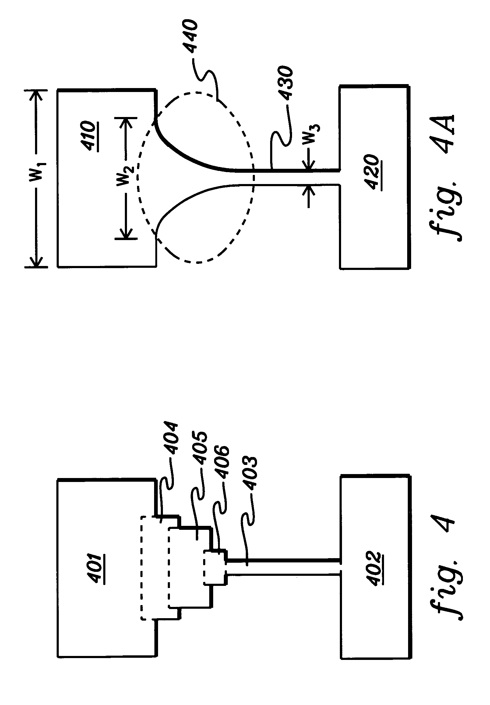

[Fig. 4 / 4A · PDF 4](https://patentimages.storage.googleapis.com/1e/7d/12/c3ce4fbb0c479a/US7417300B2.pdf#page=4)

- 410 / 420 · 兩個端點；寬度不是相同的細線
- 430 · 狹長熔絲本體，連接兩個端點
- 440 · 端點中的縮頸區；與熔絲本體分開辨認

權利項 1 同時限定端點縮頸、矽化物／多晶矽的不同平面形狀，以及未矽化邊界。圖 4A 用來理解縮頸，但權利項的材料與邊界條件仍須回讀全文。

對照 eFuse 寫入序列：電流路徑 → 材料遷移 → 高阻態。不要把所有 eFuse 都畫成同一種均勻熔斷。

### US8847350B2 · 利用導孔的局部接觸面控制程式化位置

由俯視圖的金屬連線，對照兩個剖面中的導孔落點。接觸面積縮小會集中電流與局部發熱。

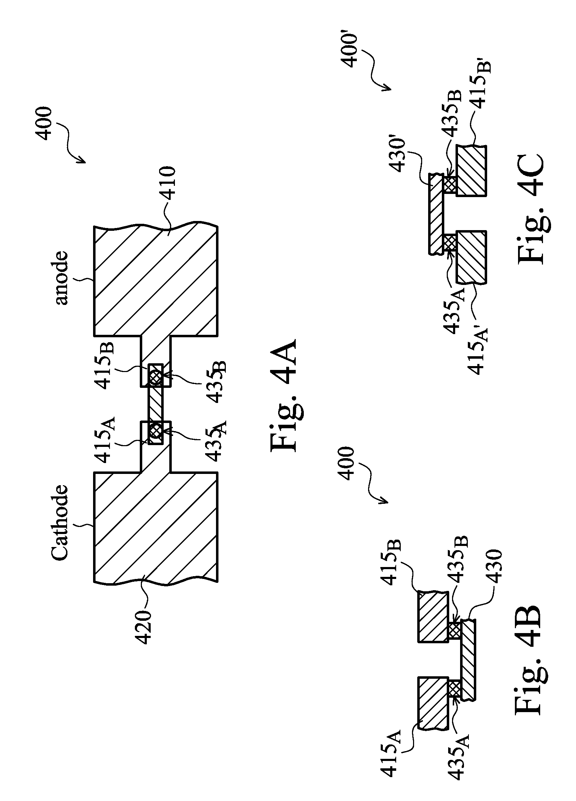

[Fig. 4A–4C · PDF 6](https://patentimages.storage.googleapis.com/f0/e6/d1/93874e8e69ad3a/US8847350.pdf#page=6)

- 410 / 420 · 陽極與陰極端點
- 430 · 金屬熔絲連線
- 435 / 435A / 435B · 導孔及其接觸部分；比較導孔與連線的重疊

權利項 1 的關鍵是導孔一端只有部分面積落在熔絲連線上，並限定兩層金屬間的連接。尺寸、電阻與其他條件分布在從屬項。

對照金屬導孔 eFuse 的局部加熱與分離。此例不能直接沿用矽化物電遷移的材料圖說。

### US6667902B2 · 把介電層擊穿與陣列選擇分開設計

先在圖 3 找到儲存元件與選擇電晶體，再用圖 8 對照選中與未選中的偏壓組合。表內電壓只屬於此實施例。

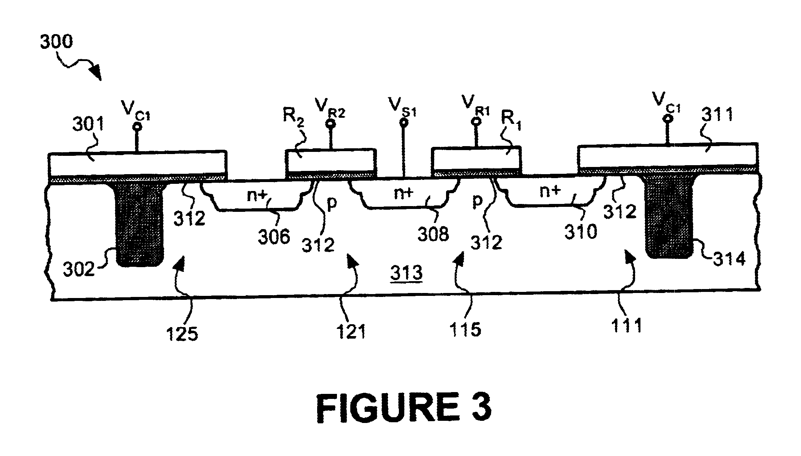

[Fig. 3 · PDF 5](https://patentimages.storage.googleapis.com/7a/76/35/6662110a53d9f3/US6667902.pdf#page=5)

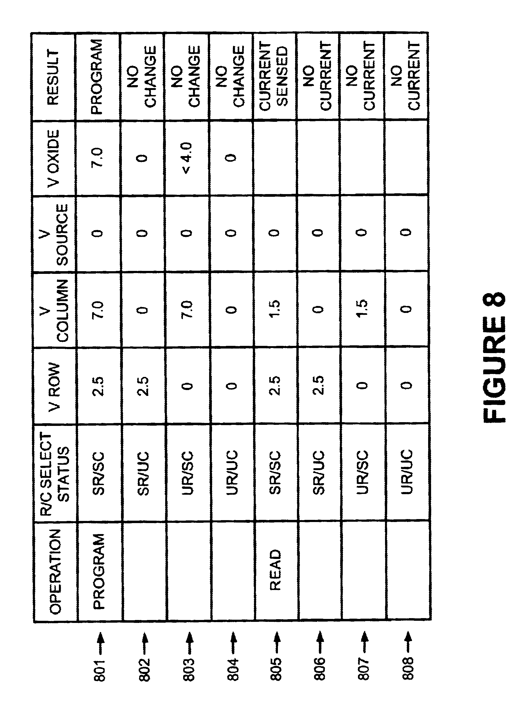

[Fig. 8 · PDF 10](https://patentimages.storage.googleapis.com/7a/76/35/6662110a53d9f3/US6667902.pdf#page=10)

- 311 / 312 · 儲存端導電閘極與其下方薄閘介電層
- 313 · 主動區；擊穿後形成儲存端的導電路徑
- 111 / 115 · 相鄰元件的配置；必須連同選擇線閱讀

權利項 1 結合 MOS 選擇電晶體、薄介電層儲存元件，以及列選擇、行選擇與列程式化線。只看到擊穿剖面，還不足以讀完其陣列連接限定。

對照反熔絲操作：完整介電層 → 選中後高電場 → 永久導電路徑；讀取採低刺激。

### US4115914A · 用局部薄介電層提供電荷進出路徑

由製程末段剖面辨認浮動閘、局部薄區與上方控制閘。薄區的位置及第二介電層的覆蓋，決定耦合與穿隧路徑。

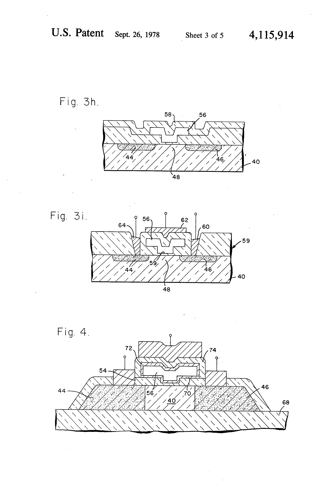

[Fig. 3h / 3i / 4 · PDF 4](https://patentimages.storage.googleapis.com/31/47/ab/e89f6659da690c/US4115914.pdf#page=4)

- 54 · 第一介電層；包含局部較薄區域
- 56 · 被絕緣包覆的浮動閘
- 58 / 62 · 第二介電層與上方第二閘極

權利項 1 是製作方法：形成主動區、局部薄介電層、浮動閘、隔離它的第二介電層，以及覆蓋通道的第二閘極。不可把方法項簡化成所有 EEPROM 的一般結構。

對照 EEPROM 的 FN 進入與 FN 移出：兩個方向都必須穿過實際存在的薄介電層。

### US5844271A · 單層多晶矽以埋入控制端耦合浮動閘

在剖面找出埋入式控制區與浮動閘重疊，再用等效電路區分耦合端、儲存閘與可導通的通道。

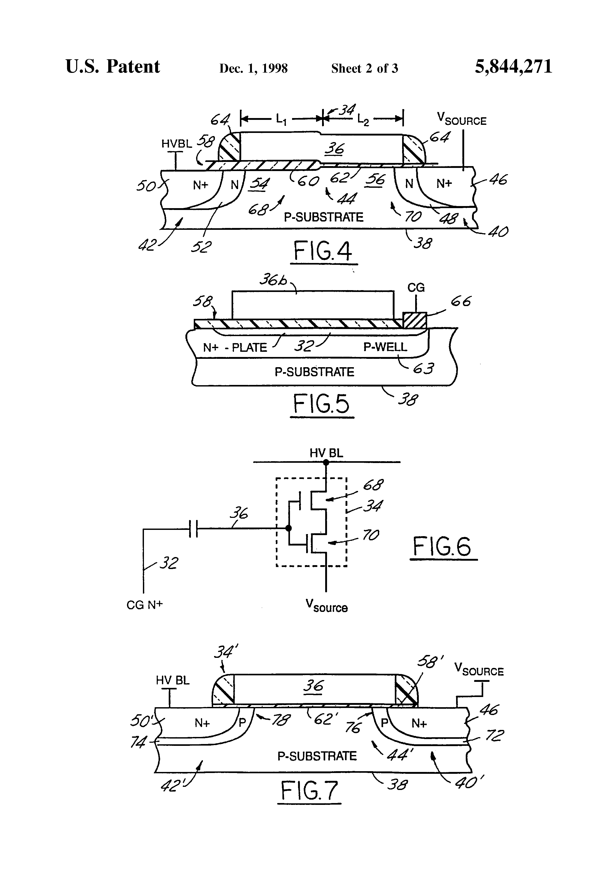

[Fig. 4–7 · PDF 3](https://patentimages.storage.googleapis.com/1e/60/1a/e2aacc35ea296c/US5844271.pdf#page=3)

- 32 · 埋入式控制閘的 n+ 區
- 36 · 單層多晶矽浮動閘
- 40 / 42 / 44 · 源極、汲極與通道

權利項 1 包含埋入控制閘、耦合的浮動閘，以及延伸跨過部分通道與接面的薄穿隧區，並限定過度抹除時未選中元件的抑制作用。權利項 4 另寫分離閘結構。

對照 MTP IP 專題的單層多晶矽教學變體：本案的 CHE 注入與 FN 移出對應埋入式控制端，浮動閘上方沒有第二層控制多晶矽。現行產品的操作機制另依其具名文件核對。

### US6232180B1 · 以源極耦合、分離閘與井區偏壓控制操作

從圖 5 的浮動閘成形讀到圖 6 的源／汲極，再追蹤選擇閘與薄穿隧氧化層的位置。深井使抹除偏壓具有獨立控制路徑。

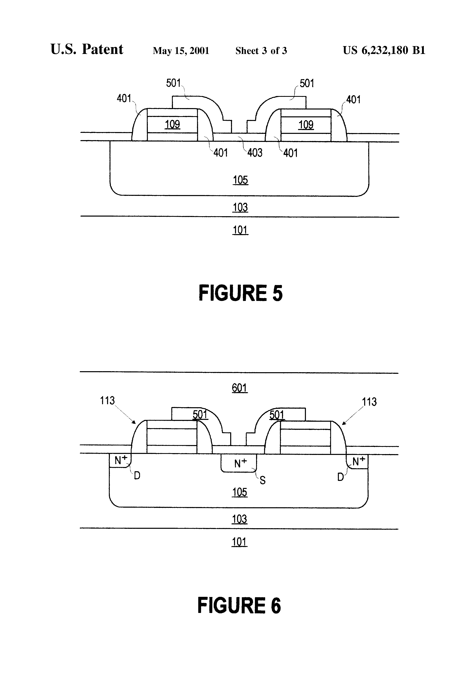

[Fig. 5 / 6 · PDF 4](https://patentimages.storage.googleapis.com/bf/a4/72/d2d74438bd3c5f/US6232180.pdf#page=4)

- 501 / 113 · 浮動閘與選擇閘
- 403 · 通道側的穿隧氧化層
- 103 / 105 · 深 n 井及其中的 p 井

權利項 1 指定深 n 井、p 井、選擇閘、浮動閘及作為控制耦合端的源極。權利項 4–6 再限定特定抹除與程式化偏壓；數字不可當成所有分離閘 NOR 的規格。

對照第三個 NOR 變體：源側注入與井區／通道側 FN 抹除，和向選擇閘穿隧的實作分開。

### WO1981000790A1 · 在電荷捕獲層與閘極間加入阻擋氧化層

沿閘堆疊由矽基板往上讀：薄記憶氧化層、氮化矽、介面氧化層，再到多晶矽閘。這是材料堆疊導讀。

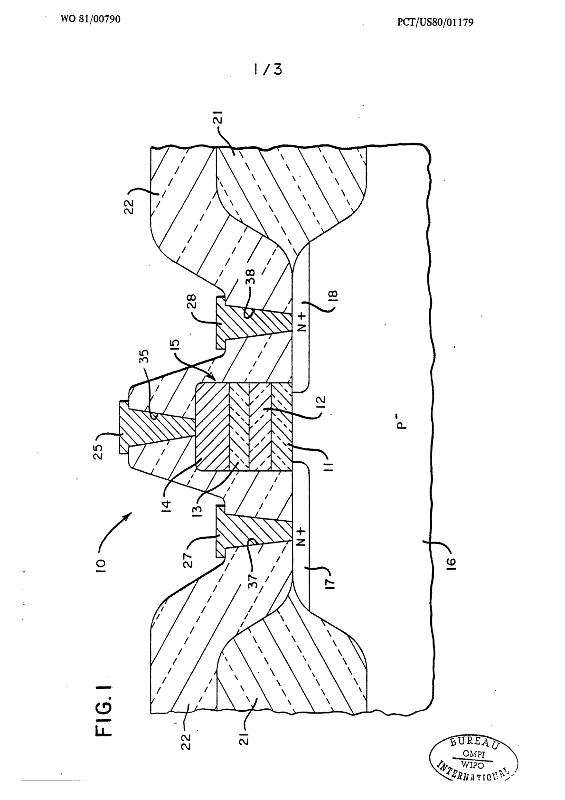

[Fig. 1 · PDF 14](https://patentimages.storage.googleapis.com/28/0b/c1/62d59b67395c82/WO1981000790A1.pdf#page=14)

- 11 / 12 · 薄記憶氧化層與氮化矽捕獲層
- 13 / 14 · 介面氧化層與多晶矽閘
- 16 / 17 / 18 · 基板及源／汲極區

權利項 1 限定 CVD 形成的第二氧化層及其厚度範圍，並限定第一氧化層上限；權利項 6 是製作方法。此早期 SONOS 堆疊不能直接代表後來所有穿隧工程配方。

對照 SONOS 操作時，分清底部穿隧氧化層與頂部阻擋氧化層；儲存位置在氮化層。

### US5768192A · 利用局部捕獲與反向讀取放大感測差異

比較標示先前技術的 A 圖與實施例 B 圖，再追蹤局部電荷區和 READ 箭頭。讀取方向改變了哪一端的能障最影響電流。

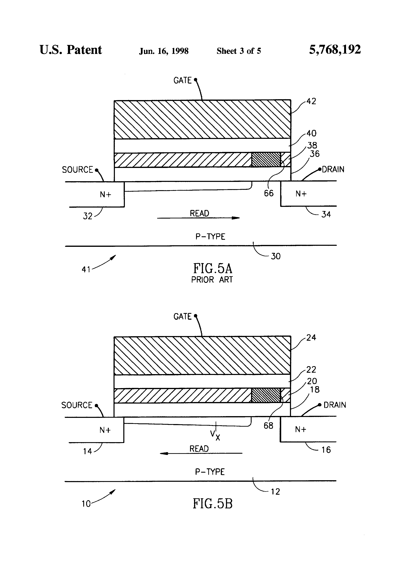

[Fig. 5A / 5B · PDF 4](https://patentimages.storage.googleapis.com/59/3c/28/7e679959ef55fa/US5768192.pdf#page=4)

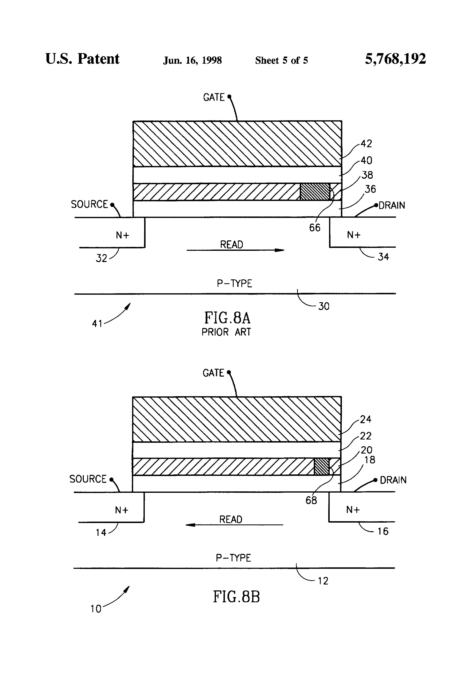

[Fig. 8A / 8B · PDF 6](https://patentimages.storage.googleapis.com/59/3c/28/7e679959ef55fa/US5768192.pdf#page=6)

- 14 / 16 · 源／汲極標號；操作時需同時看偏壓方向
- 20 · 非導電氮化矽捕獲層
- 24 / 68 · 控制閘與局部儲存電荷區

權利項 1 結合局部電子捕獲、靠近程式化汲極的儲存區，以及反向與同向讀取呈現不同臨界電壓。不能只留下 ONO 堆疊而省略方向性。

對照局部 NROM 序列：CHE 電子留在一端；反向讀取從相反方向感測；BBHH 抹除另以有來源的變體說明。

### US7696559B2 · 把平面 NAND 串列轉成垂直堆疊

圖 2 由底部共用源極沿矽柱往位元線讀；圖 6 再把同一結構展開為串列電路。選擇閘位於記憶閘堆疊的兩端。

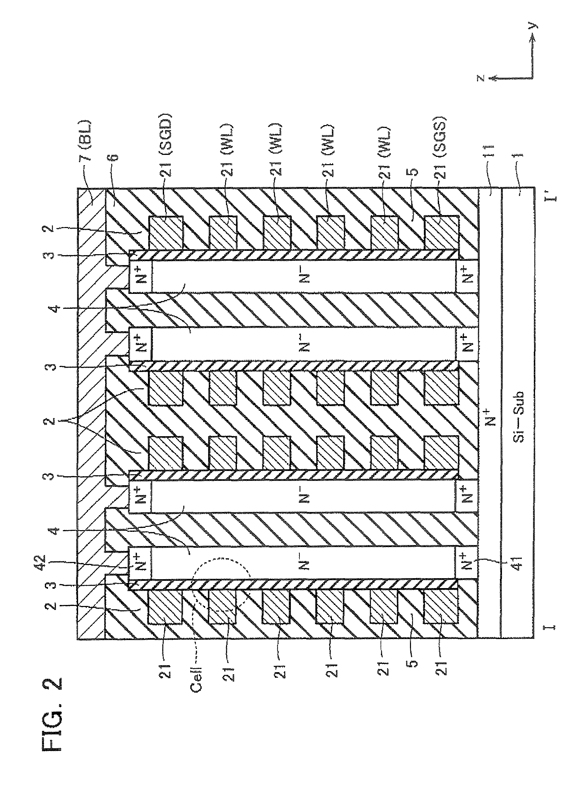

[Fig. 2 · PDF 4](https://patentimages.storage.googleapis.com/79/10/3c/cc469fa1eed4fc/US7696559.pdf#page=4)

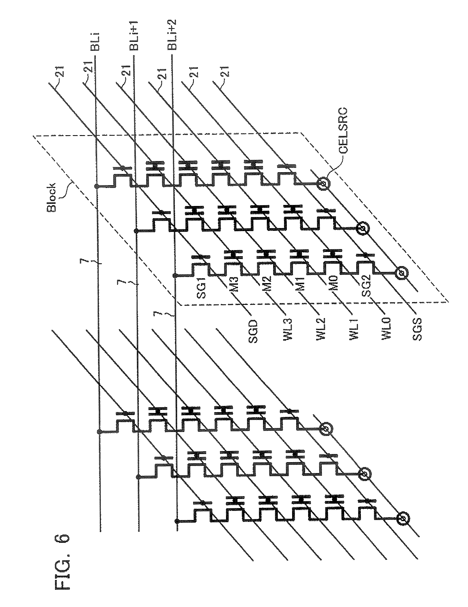

[Fig. 6 · PDF 7](https://patentimages.storage.googleapis.com/79/10/3c/cc469fa1eed4fc/US7696559.pdf#page=7)

- 21 · 堆疊閘配線，包含記憶閘與端點選擇閘
- 3 / 4 · 含電荷儲存層的閘介電層與矽柱
- 7 / 11 · 上方位元線與底部共用源極擴散區

權利項 1 詳列閘堆疊、含絕緣儲存層的側壁介電層、柱狀半導體、資料線與上下選擇閘。它是具體垂直 NAND 結構，不能把附圖當成所有現代圓柱孔陣列的版圖。

對照 NAND 操作：選中字線的注入、未選字線的通過偏壓與寫入抑制；此專利的源極電子移出和後來 GIDL 電洞抹除分開呈現。

### US6545906B1 · 用交錯脈衝讓耦合磁矩完成翻轉

先看圖 4 的兩條脈衝時序，再沿圖 5／6 逐格追蹤磁矩。兩條線同時作用的區間與結束順序是操作的一部分。

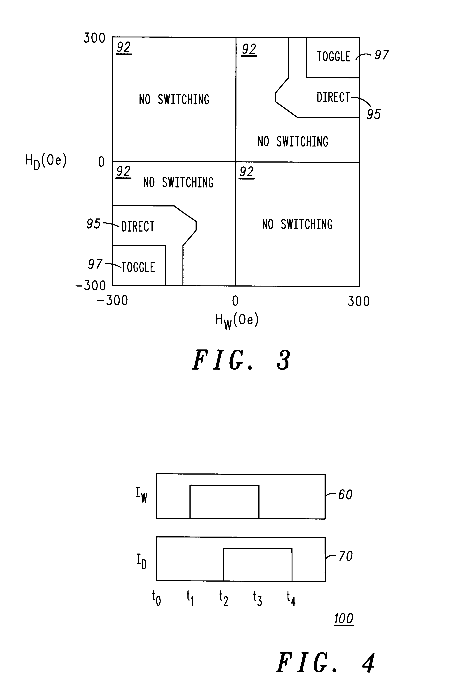

[Fig. 3 / 4 · PDF 3](https://patentimages.storage.googleapis.com/1e/95/11/99d21025b0f19c/US6545906.pdf#page=3)

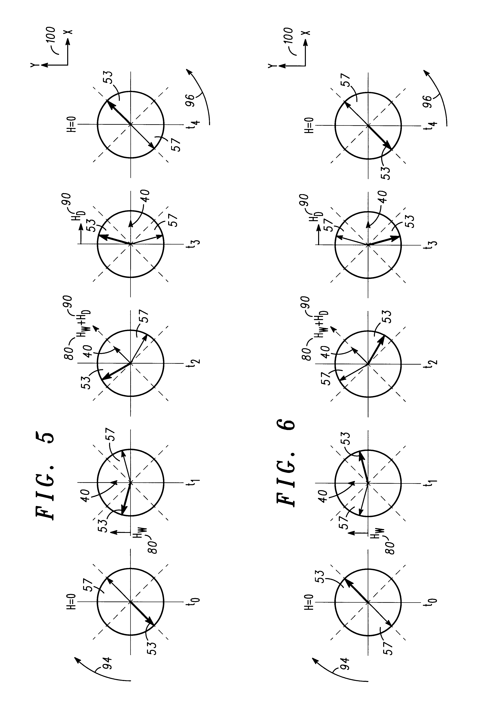

[Fig. 5 / 6 · PDF 4](https://patentimages.storage.googleapis.com/1e/95/11/99d21025b0f19c/US6545906.pdf#page=4)

- 60 / 70 · 字線與 digit line 脈衝
- 100 · 整組交錯寫入時序
- 40 / 53 / 57 · 合成磁矩及反鐵磁耦合子層磁矩

權利項 1 同時要求至少兩層反鐵磁耦合自由層、磁矩平衡條件，以及 t₀<t₁<t₂<t₃<t₄ 的脈衝順序。不是任意兩個正交磁場都具有相同結果。

對照 Toggle 的五格序列與初態檢查：需要改寫時才觸發翻轉。

### US5695864A · 以穿層電流把自旋角動量傳給可轉動磁層

圖 1 是五層金屬導體模型，沿 A→F1→B→F2→C 讀出固定與可變磁矩，再比較電流方向與 F2 的轉矩。

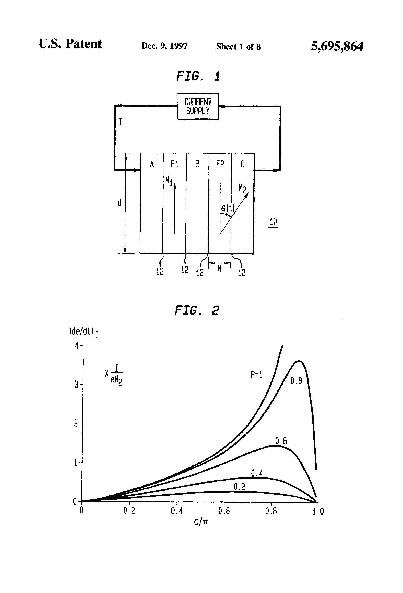

[Fig. 1 / 2 · PDF 2](https://patentimages.storage.googleapis.com/f2/de/53/7c37f0c1e307e4/US5695864.pdf#page=2)

- 10 · 五層自旋轉移元件
- F1 / F2 · 固定磁矩層與可改變磁矩層
- A / B / C · 兩端電極與中央非磁性導體；電流垂直穿過各層

權利項 1 限定固定／可變磁導體層、其間非磁導體與穿層電流源。這個早期自旋轉移實施例使用金屬間隔，不是現代 MgO 穿隧障壁剖面。

以這件專利理解自旋轉移原理，再用現代 STT-MRAM 圖區分 P／AP 電阻讀取與穿隧障壁。

### US10930843B2 · 把 SOT 寫入導線與磁性堆疊組成可整合陣列

追蹤水平第一配線，再經過其上磁性堆疊至另一方向配線。圖中控制電晶體和交叉配線比單一 MTJ 更能說明陣列整合成本。

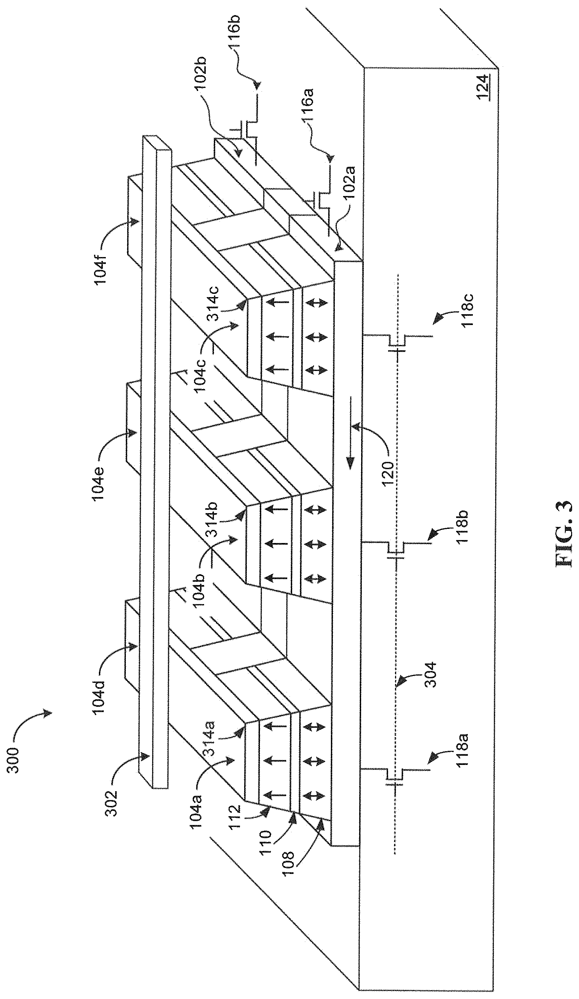

[Fig. 3 · PDF 5](https://patentimages.storage.googleapis.com/1b/15/5f/552c7b2be8d3cd/US10930843.pdf#page=5)

- 102a / 102b · 第一導電配線，提供橫向寫入路徑
- 108 / 110 / 112 · 磁性儲存層、間隔層與參考層
- 116 / 118 / 314 · 控制電晶體與另一組配線

權利項 1 是製造方法，限定第一導電層分離成配線、其上共同元件層的形成與分離，以及不同方向的第二配線。圖可解釋連接，權利項主軸仍是製程順序。

對照 SOT 三端讀寫分離；附圖中的多重控制端必須保留，不能簡化成 STT 的同一路徑。

### US8331131B2 · 利用中間態與第二脈衝控制阻態切換

沿圖 5 的循環箭頭逐格看可移動物種、障壁與導電區如何改變。中間態有明確物理位置，不能省略成一次 SET／RESET。

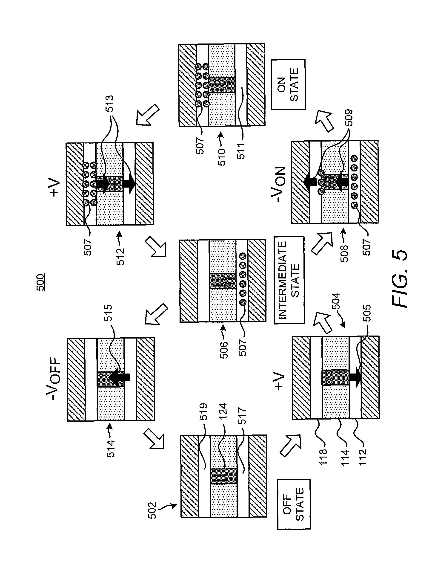

[Fig. 5 · PDF 5](https://patentimages.storage.googleapis.com/90/dd/5a/259ef8491b3d97/US8331131.pdf#page=5)

- 507 · 可移動物種
- 502 / 506 / 510 · 初始、中間與改變後的狀態
- 511 / 517 / 519 · 各階段的穿隧障壁

權利項 1 規定三個中間層與兩個脈衝：先累積到第一層，再移往第三層完成改變。這是特殊多層 memristor 操作，不能代替所有 VCM 的通用雙極序列。

對照 VCM 操作，保留氧空缺／物種重分布的物理意義；這件專利另展示脈衝路徑如何增加中間態。

### US5761115A · 在離子導體中可逆生成金屬橋

在圖 1 的平面與剖面中追蹤枝晶，再比較圖 4 的垂直配置。圖 5 另加入阻止直接接觸的隔離條件。

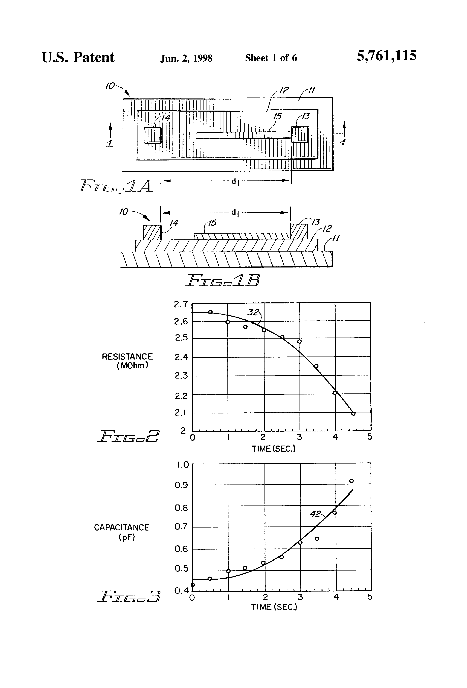

[Fig. 1A / 1B / 2 / 3 · PDF 3](https://patentimages.storage.googleapis.com/8e/2a/ba/50b37273a2724f/US5761115.pdf#page=3)

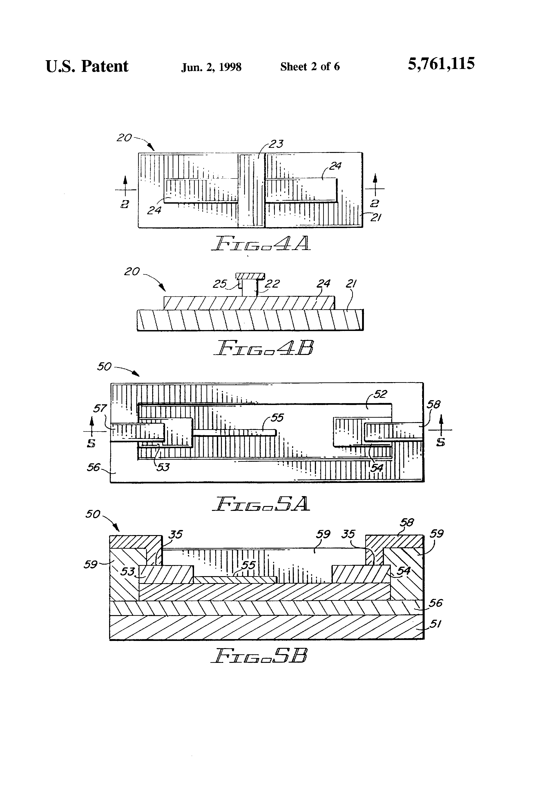

[Fig. 4A / 4B / 5A / 5B · PDF 4](https://patentimages.storage.googleapis.com/8e/2a/ba/50b37273a2724f/US5761115.pdf#page=4)

- 12 / 22 · 含金屬離子的快速離子導體
- 13 / 14 / 23 / 24 · 施加偏壓的電極；23 為陰極
- 15 / 25 · 由負電極方向成長的金屬枝晶

權利項 1 包含金屬離子導體、電極與由負端朝正端成長的枝晶；權利項 2 加入相反偏壓使成長反轉。權利項 3 的阻擋條件不能誤套到所有實施例。

對照 ECM 的金屬氧化、離子遷移、還原沉積與反向溶解；不要把金屬絲畫成氧空缺。

### US5912839A · 以累積脈衝設定相變材料的可辨識阻態

先看圖 1 電阻對脈衝電流的非單調關係，再看圖 2 的記憶材料與電極配置。曲線沒有完整量測條件，不能抽取為現行產品規格。

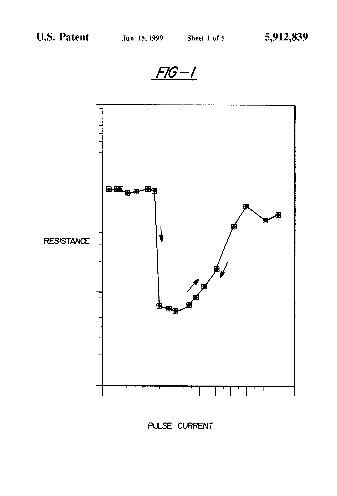

[Fig. 1 · PDF 2](https://patentimages.storage.googleapis.com/b9/d0/ac/dfd15bdaa20dc7/US5912839.pdf#page=2)

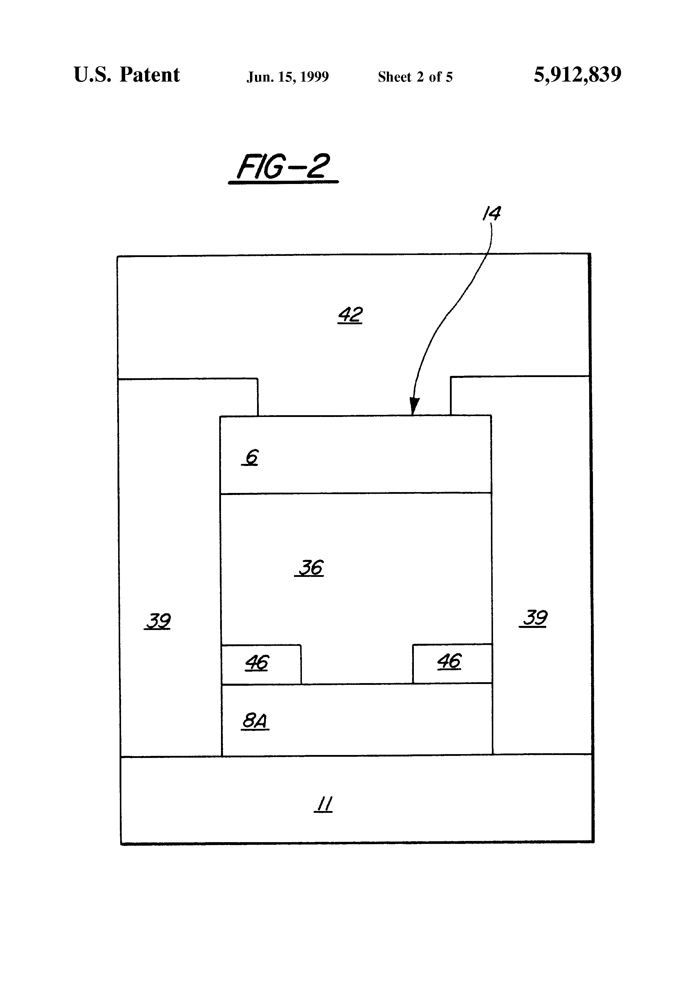

[Fig. 2 · PDF 3](https://patentimages.storage.googleapis.com/b9/d0/ac/dfd15bdaa20dc7/US5912839.pdf#page=3)

- 36 · 相變記憶材料
- 42 · 電極網格結構
- 46 · 隔離層

權利項 1 聚焦不足以單次 SET、但能與後續脈衝累積的程式化方法；權利項 2 加入 RESET，權利項 3 加入計數額外脈衝的讀法。不是所有 PCM 的一般加熱權利項。

對照 PCM 的溫度與晶相序列，再理解此件專利如何把多次刺激加入資料編碼。

### US4873664A · 在感測之後以電路自動還原鐵電資料

由 1T1C 單元沿位元線接到感測與還原電路，再比較 word line 和 plate line 時序。讀出電荷後，原始極化必須依鎖存結果恢復。

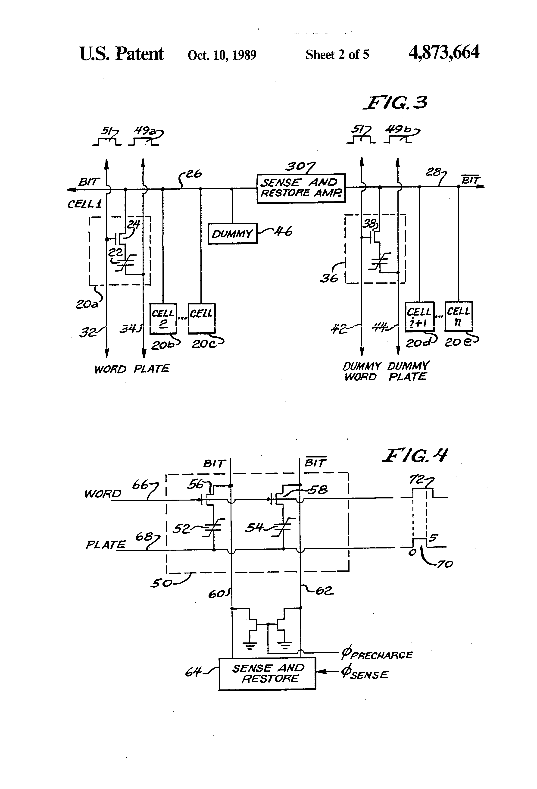

[Fig. 3 / 4 · PDF 3](https://patentimages.storage.googleapis.com/33/4c/dd/c26b6f9525498b/US4873664.pdf#page=3)

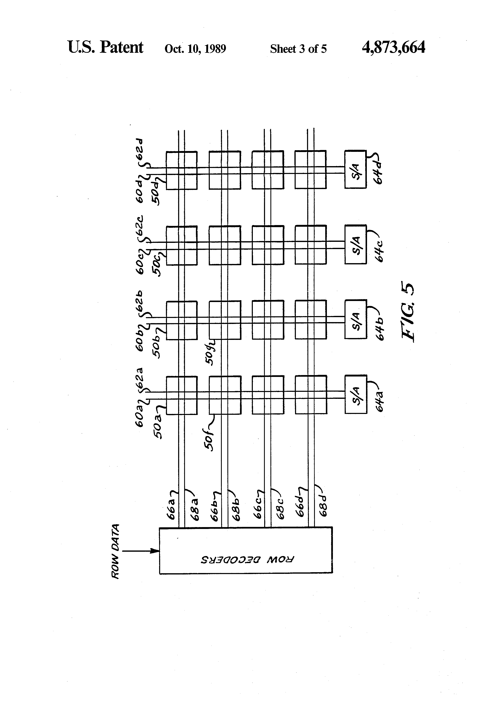

[Fig. 5 · PDF 4](https://patentimages.storage.googleapis.com/33/4c/dd/c26b6f9525498b/US4873664.pdf#page=4)

- 22 / 24 · 鐵電電容與存取電晶體
- 32 / 68 · 字線與獨立 plate line
- 64 · 感測放大器；參照單元提供比較基準

權利項 1 限定字線、位元線與獨立 plate line 的單元連接，電容一端經切換元件接到位元線。權利項 2 再加入感測放大器與虛擬鐵電參照單元。

對照 FeRAM 讀取的兩種初始極化、切換電荷差、鎖存與回寫；還原步驟必須在圖中出現。

### US10153155B2 · 以交替摻雜與熱處理形成鐵電薄膜

圖 1／2 比較三層與四層薄膜安排。先辨認材料層與上下導電層，再回讀製程中不同摻雜層和退火的要求。

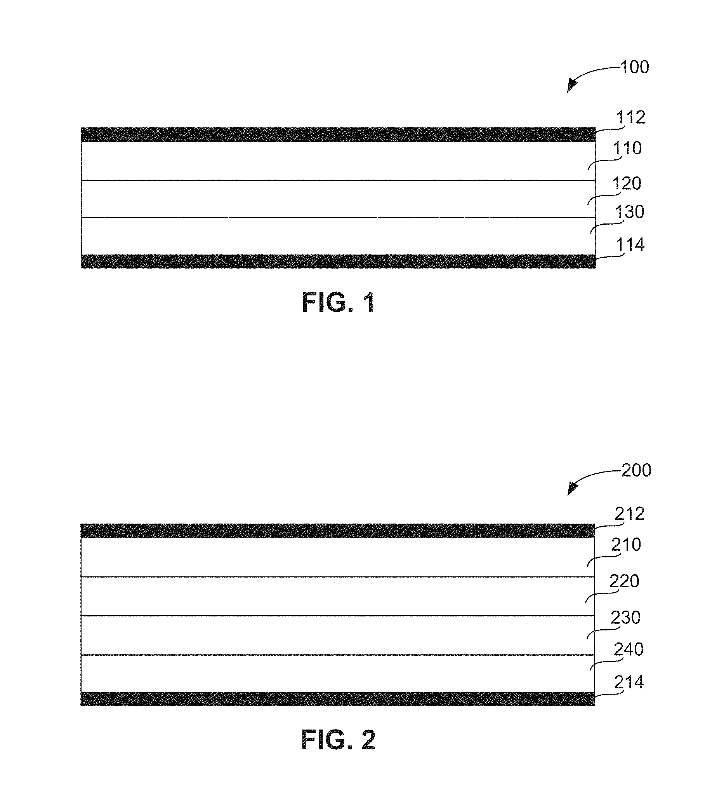

[Fig. 1 / 2 · PDF 3](https://patentimages.storage.googleapis.com/14/31/15/bbdde795e5e4a4/US10153155.pdf#page=3)

- 110 / 120 / 130 · 第一、第二、第三材料層
- 112 / 114 · 上下導電層
- 210 / 220 / 230 / 240 · 延伸的四層配置

權利項 1 是形成薄膜的方法：含鉿與氧的三層材料、兩種不同摻雜層、加熱與兩側導電層。此圖不是完整 FeFET 位元單元，也不能單靠它判定讀寫通道。

把此來源放在 FeFET 的材料／製程限制層；電晶體操作則由下一件具體閘堆疊專利與操作圖補足。

### US11502083B2 · 把鐵電薄膜整合進具體複合閘結構

沿基板往上逐層核對 31、32、33b、34、35，再沿左右接面回到通道。堆疊包含浮動閘，不能直接標成最簡單的金屬／鐵電／矽。

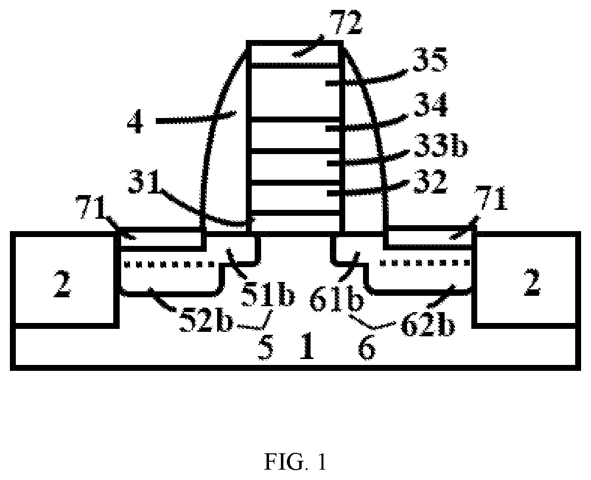

[Fig. 1 · PDF 3](https://patentimages.storage.googleapis.com/26/68/6f/921a8116ea99d7/US11502083.pdf#page=3)

- 31 / 32 · 緩衝層與浮動閘電極
- 33b / 34 / 35 · 鉿基鐵電層、控制閘與薄膜電極層
- 5 / 6 / 71 · 源極、汲極及金屬矽化物接觸

權利項 1 詳列複合閘、隔離、側壁、源汲極與矽化物的相對位置。讀此圖可了解一種實作，不能據此把全部 FeFET 都定義成同一個堆疊。

對照 FeFET 的極化控制臨界電壓；將材料層與電氣控制端分別標示，才能看清電場落在哪裡。

### US20240057343A1 · 以催化接面與薄鐵電層設計穿隧阻態

先看圖 3 的五層堆疊，再以圖 5 比較不同極化的能障；圖 15–18 將同一記憶堆疊接到電晶體。

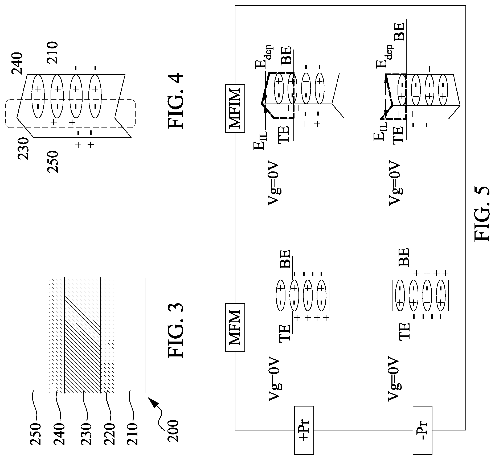

[Fig. 3–5 · PDF 4](https://patentimages.storage.googleapis.com/82/23/f6/5dcf02a41aa96f/US20240057343A1.pdf#page=4)

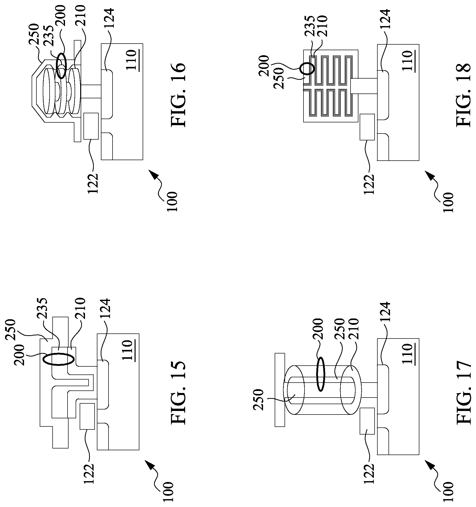

[Fig. 15–18 · PDF 9](https://patentimages.storage.googleapis.com/82/23/f6/5dcf02a41aa96f/US20240057343A1.pdf#page=9)

- 210 / 220 · 底電極與催化金屬層
- 230 / 240 / 250 · 鐵電層、穿隧介電層與頂電極
- 122 / 124 / 200 · 存取閘、源汲區與記憶單元

本文件是公開申請文本。權利項 1 結合第一電極、鐵電材料與接觸它的催化金屬；權利項 2–3 才加入特定電負度與厚度限制。完整五層圖含實施例細節，不能全部當成獨立項必要條件。

對照 FTJ 的極化翻轉與能障變化，並將此堆疊和其他電極／鐵電材料的研究器件分開。
